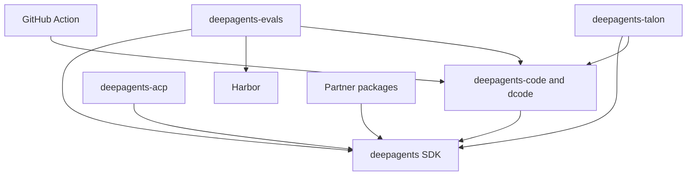

# Repository Quickstart

Deep Agents is an opinionated harness: `create_deep_agent()` assembles harness behavior and delegates agent construction to LangChain's `create_agent()` on the LangGraph runtime. Use this page to choose an owner and a focused guide; use the package-local README and `Makefile` for implementation and commands.

## Start from the public entry point

- **Try or change the terminal coding product:** `dcode` is the prebuilt coding agent in `libs/code`. Install and run it with:

  ```bash
  curl -LsSf https://langch.in/dcode | bash
  dcode
  ```

  For interactive, headless, resumed, approved, MCP-enabled, sandbox, or ACP work, use [Run a dcode Session](./workflows/run-dcode-session.md).
- **Build a custom agent:** install the SDK with `uv add deepagents`, construct it with `create_deep_agent(model=..., tools=..., system_prompt=...)`, then follow [Build and Customize a Deep Agent](./workflows/build-a-deep-agent.md).
- **Run dcode in CI:** the root [`action.yml`](../action.yml) is a composite GitHub Action. Treat its prompt, credentials, working directory, memory, skills, sandbox, MCP, and output inputs as a workflow contract; see [GitHub Action Integration](./integrations/github-action.md).
- **Change repository behavior:** choose the owning package below and work from that directory. Begin with [Development, CI, and Releases](./operations/development.md).

## Choose the owner

| Change area | Owner | Read first | Then validate or extend |
| --- | --- | --- | --- |
| SDK construction, middleware, backends, tools, profiles, skills, memory, subagents, or permissions | `libs/deepagents/` | [Build a Deep Agent](./workflows/build-a-deep-agent.md) | [SDK Construction and Execution](./architecture/sdk-construction-execution.md), [Testing Guide](./testing/testing-guide.md) |
| dcode CLI/TUI, headless behavior, workspace/session state, streaming, offload, or configuration | `libs/code/` | [Run a dcode Session](./workflows/run-dcode-session.md) | [dcode Architecture](./architecture/code-agent.md), [Configuration Layering](./concepts/config-layering.md), [State and Workspace Persistence](./concepts/state-persistence.md) |
| Editor protocol sessions or dcode ACP mode | `libs/acp/` (and sometimes `libs/code/`) | [ACP Integration](./integrations/acp.md) | [Testing Guide](./testing/testing-guide.md) |
| Evaluation suite, repeated model trials, or Harbor benchmarks | `libs/evals/` | [Run Evals and Harbor Benchmarks](./workflows/run-evals.md) | [Testing Guide](./testing/testing-guide.md) |
| Talon channels, host lifecycle, schedules, history, or MCP management | `libs/talon/` | [Talon Runtime Host](./integrations/talon.md) | [Security Boundaries](./operations/security.md), [State and Workspace Persistence](./concepts/state-persistence.md) |
| Daytona, Modal, Runloop, Vercel, or QuickJS integration | `libs/partners/<partner>/` | [Sandbox and Partner Integrations](./integrations/sandbox-partners.md) | [Source Map and Change Routing](./architecture/source-map.md) |
| Root GitHub Action inputs or workflow behavior | `action.yml` | [GitHub Action Integration](./integrations/github-action.md) | [Run a dcode Session](./workflows/run-dcode-session.md), [Security Boundaries](./operations/security.md) |
| Locks, package releases, shared CI, hooks, or a cross-package change | `libs/` and `.github/` | [Development, CI, and Releases](./operations/development.md) | [Testing Guide](./testing/testing-guide.md) |

For a broader ownership model, use [Architecture Overview](./architecture/overview.md); to trace an observable behavior to source and tests, use [Source Map and Change Routing](./architecture/source-map.md).

## Keep the layer and dependency direction straight

- **LangGraph** owns runtime state, checkpoints, streaming, and interrupts.
- **LangChain `create_agent`** owns the agent abstraction and model/tool/middleware loop.
- **Deep Agents** adds the opinionated harness rather than a new runtime. Its assembly point can configure middleware, backends, subagents, skills, memory, and profiles before calling `create_agent()`.

`libs/` is an independently versioned monorepo. There is no root `pyproject.toml`: every package owns its `pyproject.toml`, `Makefile`, and README. Local first-party dependencies are editable, so test a consumer against a changed sibling from the appropriate package environment.

Current manifest versions are `deepagents` 0.7.14, `deepagents-code` 0.1.69, `deepagents-acp` 0.0.11, `deepagents-evals` 0.0.1, and `deepagents-talon` 0.0.8. Consumer direction is intentional: dcode pins `deepagents==0.7.14`; ACP consumes Deep Agents; evals consumes Deep Agents, dcode, and Harbor; Talon consumes Deep Agents and dcode; partner packages consume Deep Agents.



The arrows show package or adapter consumers pointing to the capability they use, not a runtime call graph.

## Run the narrowest local loop

Use `uv` for interpreters, environments, and dependencies, and use each package's `Makefile` as the command authority. Do not use `pip`, Poetry, or Conda. `uv` provisions a suitable interpreter, so select by the package's `requires-python` rather than pinning one globally:

| Package | Python compatibility | Focused validation |
| --- | --- | --- |
| `deepagents` | `>=3.11,<4.0` | `cd libs/deepagents && uv sync --all-groups && make test` |
| `deepagents-code` | `>=3.12,<4.0` | `cd libs/code && uv sync --all-groups && make test` |
| `deepagents-acp` | `>=3.11` | Its package-local `Makefile` targets |
| `deepagents-evals` | `>=3.12,<3.14` | `cd libs/evals && make test`; use `make evals MODEL=<id>` for real-model evals |
| `deepagents-talon` | `>=3.12` | Its package-local `Makefile` targets |

Run `make help` before assuming a target exists. SDK and dcode `make test` run network-disabled unit tests, while their integration targets allow the boundary to be exercised separately. Evals unit tests also disable network sockets; its `evals` target requires `MODEL` and runs `tests/evals`, so use it to supplement—not replace—deterministic coverage. For intentional repository-wide checks, run the fan-out commands from `libs/`.

## Operational boundary: Talon

Talon is an experimental local host, not a production security boundary. It lacks complete HITL policy, channel administrator controls, sandbox-backed execution isolation, and multi-tenant boundaries. Treat channel access as direct access to the operator's agent, model credentials, MCP tools, and local resources. Read [Talon Runtime Host](./integrations/talon.md) and [Security Boundaries](./operations/security.md) before operating or extending it.

For domain navigation, start with [architecture](./architecture/overview.md), [workflows](./workflows/build-a-deep-agent.md), [integrations](./integrations/index.md), [operations](./operations/development.md), and [testing](./testing/testing-guide.md).
