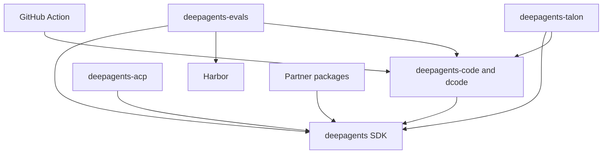

# Repository Quickstart

Use this page to choose the correct package and focused guide before editing. Deep Agents is an opinionated harness: `create_deep_agent()` configures its behavior and delegates agent construction to LangChain's `create_agent()` on the LangGraph runtime. This is a routing page; the package-local README and `Makefile` remain the authority for a package's setup and commands.

## Choose an entry path

- **Try or change the terminal coding product.** `deepagents-code` is the prebuilt terminal coding agent, invoked as `dcode`:

  ```bash
  curl -LsSf https://langch.in/dcode | bash
  dcode
  ```

  Use [Run a dcode Session](./workflows/run-dcode-session.md) for interactive, headless, resumed, approval, MCP, sandbox, and ACP sessions.
- **Build a custom agent.** Install with `uv add deepagents` and construct it with `create_deep_agent(model=..., tools=..., system_prompt=...)`. Continue with [Build and Customize a Deep Agent](./workflows/build-a-deep-agent.md).
- **Change repository behavior.** Locate the owning package below, work inside that package, and start its normal loop through `make help`. Use [Development, CI, and Releases](./operations/development.md) for setup, lockfiles, CI, and release concerns.

## Start at the right boundary

`libs/` is a monorepo of independently versioned packages. There is no root `pyproject.toml`: each package owns its `pyproject.toml`, `Makefile`, and README. Local first-party dependencies are editable, so a sibling consumer can observe an in-tree change without a publish. Begin in the package that owns the observable contract, then cross a package boundary only when that contract does.

| Boundary | Package or path | What it owns | Read first |
| --- | --- | --- | --- |
| SDK | `libs/deepagents/` | Reusable `deepagents` SDK: `create_deep_agent`, middleware, backends, profiles, skills, memory, and subagents. | [Build a Deep Agent](./workflows/build-a-deep-agent.md); [SDK Construction and Execution](./architecture/sdk-construction-execution.md) |
| Coding product | `libs/code/` | `deepagents-code` / `dcode`: terminal UI and CLI, headless operation, sessions, configuration, workspace runtime, and product tool behavior. | [Run a dcode Session](./workflows/run-dcode-session.md); [Deep Agents Code Architecture](./architecture/code-agent.md) |
| Editor bridge | `libs/acp/` | `deepagents-acp`, an Agent Client Protocol bridge for Deep Agents in supporting editors. dcode can also expose its prebuilt agent in ACP mode. | [ACP Integration](./integrations/acp.md) |
| Long-running host | `libs/talon/` | Experimental local host: process lifecycle, channel adapters, cron schedules, and agent runtime. | [Talon Runtime Host](./integrations/talon.md); [Security Boundaries and Runbook](./operations/security.md) |
| Evaluation | `libs/evals/` | Behavioral evaluation suite and Harbor integration. | [Run and Interpret Evaluations](./workflows/run-evals.md) |
| Provider adapters | `libs/partners/` | Separately released Daytona, Modal, Runloop, Vercel, and QuickJS integration boundaries. | [Sandbox and Partner Integrations](./integrations/sandbox-partners.md) |
| Workflow adapter | repository-root `action.yml` | Composite GitHub Action that installs and invokes dcode in a workflow. | [GitHub Action Integration](./integrations/github-action.md) |

The package dependencies are directional rather than a runtime call graph: dcode, ACP, evals, Talon, and the partner adapters consume the SDK; evals and Talon additionally consume dcode, while evals also consumes Harbor.



The diagram shows declared package and integration dependency direction; arrows point from a consumer or adapter to the capability it uses.

## Route the change

| If you are changing… | Start with | Then consult |
| --- | --- | --- |
| SDK graph assembly, middleware order, model profiles, tools, backends, memory, skills, subagents, or approvals | [Build a Deep Agent](./workflows/build-a-deep-agent.md) | [SDK Construction and Execution](./architecture/sdk-construction-execution.md), [Middleware Stack](./architecture/middleware-stack.md), [Source Map](./architecture/source-map.md) |
| dcode CLI/TUI, graph/client-server behavior, workspace runtime, configuration, sessions, streaming, or offload | [Run a dcode Session](./workflows/run-dcode-session.md) | [dcode Architecture](./architecture/code-agent.md), [dcode Runtime Behavior](./architecture/runtime-behavior.md), [Configuration Layering](./concepts/config-layering.md), [State, Checkpoints, and Persistence](./concepts/state-persistence.md) |
| Model selection, provider behavior, harness profiles, or retries | [Models and Profiles](./concepts/profiles-models.md) | The SDK or dcode architecture guide according to the owning behavior |
| ACP protocol sessions, editor behavior, streaming, cancellation, or dcode ACP mode | [ACP Integration](./integrations/acp.md) | [dcode Architecture](./architecture/code-agent.md); [Testing Guide](./testing/testing-guide.md) |
| Talon channels, scheduling, host lifecycle, history, background work, or MCP | [Talon Runtime Host](./integrations/talon.md) | [Security Boundaries and Runbook](./operations/security.md); [State, Checkpoints, and Persistence](./concepts/state-persistence.md) |
| Evaluation coverage, repeated trials, or Harbor benchmark jobs | [Run and Interpret Evaluations](./workflows/run-evals.md) | [Testing Guide](./testing/testing-guide.md), then the runtime package that owns the behavior |
| MCP discovery, trust, credentials, reload, tool filtering, or failures | [MCP Integration](./integrations/mcp.md) | [Security Boundaries and Runbook](./operations/security.md), plus dcode or Talon as applicable |
| Sandbox provisioning, remote execution, or a partner adapter | [Sandbox and Partner Integrations](./integrations/sandbox-partners.md) | [Source Map](./architecture/source-map.md); [Testing Guide](./testing/testing-guide.md) |
| Action inputs or outputs: prompt, credentials, workspace, cached memory, skills, sandbox, MCP, or headless output | [GitHub Action Integration](./integrations/github-action.md) | [Run a dcode Session](./workflows/run-dcode-session.md); [Security Boundaries and Runbook](./operations/security.md) |
| Dependencies, locks, CI, release metadata, or package validation | [Development, CI, and Releases](./operations/development.md) | [Testing Guide](./testing/testing-guide.md) |

The root Action requires `prompt`. Its optional inputs map workflow configuration—including model/provider credentials, working directory, persisted memory, skills, shell policy, sandbox, MCP, and headless-output options—into a dcode invocation. Treat them as a workflow API and trace an option into dcode before changing its meaning.

## Understand the SDK stack

The runtime layers deliberately have separate responsibilities:

- **LangGraph** owns runtime state, checkpoints, streaming, and interrupts.
- **LangChain `create_agent`** owns the agent abstraction: model, tools, middleware, and the model/tool loop.
- **Deep Agents** adds an opinionated harness above `create_agent`, rather than another runtime. `create_deep_agent()` is the assembly point for the default middleware stack and optional backends, subagents, skills, memory, and profiles.

Use [Monorepo Architecture Overview](./architecture/overview.md) for the system model and [Source Map and Change Routing](./architecture/source-map.md) to identify the owning implementation surface and focused tests.

## Run the package-local loop

Use `uv` for interpreters, environments, and dependencies; do not use `pip`, Poetry, or Conda. `uv` provisions a suitable interpreter, so there is no repository-wide Python version to pin. Run `uv sync --all-groups` (or the required group) from the package, use its `Makefile` for standard commands, and reserve `libs/` fan-out targets for intentional repository-wide validation.

Python compatibility is package-local: Deep Agents supports `>=3.11,<4.0`, dcode `>=3.12,<4.0`, ACP `>=3.11`, evals `>=3.12,<3.14`, and Talon `>=3.12`. The five listed partners each require `>=3.11,<4.0`; evals therefore excludes Python 3.14. Select the interpreter for the package being run.

For a focused change, identify the public boundary and state owner, edit the narrowest owning package, then update the closest observable test. The SDK and dcode `make test` targets run unit tests with network sockets disabled and each has a separate integration target. In evals, `make test` is likewise network-disabled; `make evals MODEL=<id>` requires `MODEL` and runs the real-model suite under `tests/evals`, so it complements deterministic coverage rather than replacing it.

## Operational caution: Talon

Talon is an experimental local runtime host, not a production security boundary. It lacks complete human-in-the-loop policy, channel-administrator controls, sandbox-backed execution isolation, and multi-tenant boundaries. Treat channel access as direct access to the operator's agent, credentials, MCP tools, and local resources. Read [Talon Runtime Host](./integrations/talon.md) and [Security Boundaries and Runbook](./operations/security.md) before operating or extending it.

For broader navigation, start from [architecture](./architecture/overview.md), [workflows](./workflows/build-a-deep-agent.md), [integrations](./integrations/index.md), [operations](./operations/development.md), and [testing](./testing/testing-guide.md).
