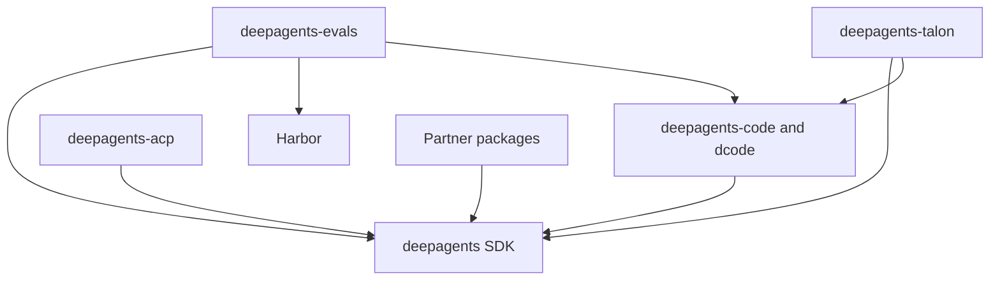

# Deep Agents Repository Quickstart

Start in the package that owns the behavior, rather than at the repository root. Deep Agents is the opinionated harness layer over LangChain's `create_agent()` and the LangGraph runtime. This page is a task router; follow the linked domain page for the behavioral contract.

## Route the task

| Change | Owner and first read | Focused validation |
| --- | --- | --- |
| SDK graph assembly, middleware, backends, skills, memory, filesystem, or permissions | `libs/deepagents/`; [architecture overview](./architecture/overview.md), [filesystem tools](./concepts/tools-filesystem.md), or [permissions and HITL](./concepts/permissions-hitl.md) | Closest unit test under `tests/unit_tests/`; filesystem end-to-end coverage starts at `tests/unit_tests/test_file_system_tools.py`. |
| Same-turn filesystem mutations | `libs/deepagents/deepagents/middleware/filesystem.py`; [filesystem tools](./concepts/tools-filesystem.md) | Add or run a focused filesystem test, then `make test TEST_FILE=tests/unit_tests/test_file_system_tools.py`. |
| dcode CLI/TUI, headless execution, client/server behavior, rendering, media, or logs | `libs/code/`; [source map](./architecture/source-map.md) | `make test TEST_FILE=...` in `libs/code`; use integration coverage for process, ACP, sandbox, or provider contracts. |
| ACP stdio sessions or editor integration | `libs/acp/` (bridge) and `libs/code/` (dcode launcher); [source map](./architecture/source-map.md) | Run the owning package's focused test; exercise ACP mode separately from normal dcode. |
| Talon channels, conversations, cron, runtime construction, archive, or host lifecycle | `libs/talon/`; [Talon integration](./integrations/talon.md) | Closest Talon test; use `tests/integration_tests/` when the host orchestration boundary changes. |
| Talon tool approval interrupts, operator decisions, or resume payloads | `libs/talon/deepagents_talon/runtime.py`; [permissions and HITL](./concepts/permissions-hitl.md) | `make test TEST_FILE=tests/unit_tests/test_tool_approval_batch.py`. |
| Evaluation scenarios or Harbor execution | `libs/evals/`; [testing guide](./testing/testing-guide.md) | Unit tests first; run real-model evaluation only when the scenario requires it. |
| Provider or sandbox adapter | Matching `libs/partners/<provider>/`; [sandbox partners](./integrations/sandbox-partners.md) | The owning adapter tests and the integration contract that changed. |
| Package metadata, locks, or release baselines | Changed package, then `libs/` for aggregate checks; [development and releases](./operations/development.md) | Package checks, then `make -C libs lock-check` when lockfiles are in scope. |

## Current change checkpoints

### SDK filesystem mutations

`FilesystemMiddleware` intercepts both synchronous and asynchronous filesystem tool calls before executing their handlers. Within one model response, a later `write_file`, `edit_file`, or `delete` call whose validated path equals an earlier mutation's validated path receives an error `ToolMessage`; the handler is not called. This prevents ambiguous concurrent same-file mutation, while mutations to distinct paths remain valid. Path comparison happens after `validate_path`, so route any change to the filesystem contract and its focused tests rather than treating this as backend-specific behavior.

### Talon approval batching

On an interrupted Talon invocation, the runtime validates that every interrupt has a unique, nonempty resumable ID before requesting operator input. It cancels MCP elicitation interrupts independently, combines all ordinary protected actions into one `ToolApprovalRequest`, and resumes each action interrupt with an appropriately sized approve or reject decision list. Malformed action payloads and invalid identities fail before prompting. Cron and background-delivery requests are unattended and are automatically denied rather than delegated to an approval handler.

Run the focused route before the full Talon target:

```bash
cd libs/talon
uv sync --group test
make test TEST_FILE=tests/unit_tests/test_tool_approval_batch.py
make test
make lint
```

The Talon target runs WhatsApp bridge Node tests first, then pytest with non-Unix sockets disabled, a 10-second timeout, and coverage for `deepagents_talon`; `TEST_FILE` is its focused-test selector. The batch suite covers one decision for parallel actions, MCP-elicitation cancellation, unattended denial, malformed payload rejection, and invalid interrupt IDs.

## Package, release, and dependency map

`libs/` is a monorepo of independently versioned packages. Each package owns its `pyproject.toml`, `Makefile`, and README, and there is no root `pyproject.toml`. Work in the affected package: first-party local dependencies are editable, so sibling consumers see local changes during development.

| Release unit | Baseline | Responsibility | Python requirement |
| --- | ---: | --- | --- |
| `deepagents` | `0.7.15` | SDK: `create_deep_agent`, middleware, and backends | `>=3.11,<4.0` |
| `deepagents-code` | `0.1.72` | Prebuilt dcode terminal coding agent | `>=3.12,<4.0` |
| `deepagents-acp` | `0.0.12` | Agent Client Protocol integration | `>=3.11` |
| `deepagents-talon` | `0.0.8` | Experimental local long-running host | `>=3.12` |
| `deepagents-evals` | source version `0.0.1` | Evaluation suite and Harbor integration | `>=3.12,<3.14` |
| Partners | Daytona `0.0.8`, Modal `0.0.6`, Runloop `0.0.7`, Vercel `0.0.2`, QuickJS `0.3.7` | Provider and sandbox integration boundaries | `>=3.11,<4.0` |


*Package dependencies flow from consumers and adapters to the SDK, dcode, or Harbor capability they use.*

Code pins `deepagents==0.7.15`; ACP depends on `deepagents`; evals depends on Deep Agents, dcode, and Harbor; and Talon depends on Deep Agents plus dcode. Select the interpreter from the changed package's manifest—there is no repository-wide Python pin, and `uv` provisions a compatible interpreter.

Talon is an experimental local host, not a production security boundary. It lacks complete HITL policy, channel administrator controls, sandbox-backed execution isolation, and multi-tenant boundaries. Treat channel access as direct access to the operator's agent and local resources.

## Normal edit–test loop

Use `uv` for interpreters, environments, and dependencies, and treat the package `Makefile` as the command authority:

```bash
cd libs/deepagents
uv sync --all-groups
make help
make test TEST_FILE=tests/unit_tests/test_file_system_tools.py
make lint
```

Use `uv run ...` for one-off commands. Use `libs/` fan-out targets such as `make lint`, `make lock`, and `make lock-check` only for deliberate aggregate validation. For detailed setup, command semantics, release work, and CI, see [Development, CI, and releases](./operations/development.md); for broader test selection, see the [Testing guide](./testing/testing-guide.md).
