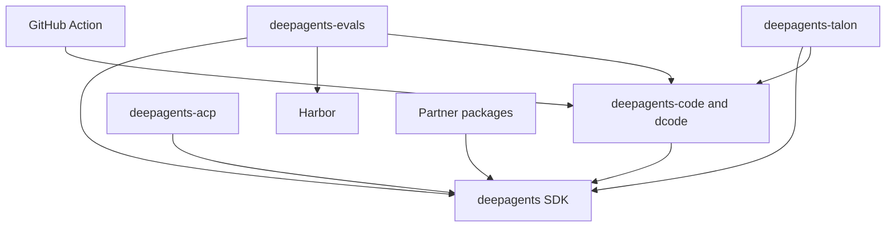

# Repository Quickstart

Deep Agents is an opinionated harness: `create_deep_agent()` configures the harness and delegates agent construction to LangChain's `create_agent()` on the LangGraph runtime. This page is a task-routing map. For implementation and operating detail, use the focused pages linked below and the README and `Makefile` in the package you change.

## Start with the right entry point

- **Try or change the terminal coding product:** Deep Agents Code (`dcode`) is the prebuilt coding agent in `libs/code/`.

  ```bash
  curl -LsSf https://langch.in/dcode | bash
  dcode
  ```

  For interactive, headless, resumed, approval, MCP, sandbox, or ACP work, start with [Run a dcode Session](./workflows/run-dcode-session.md).
- **Build a custom agent:** use the `deepagents` SDK in `libs/deepagents/` and its `create_deep_agent(model=..., tools=..., system_prompt=...)` entry point. Start with [Build a Deep Agent](./workflows/build-a-deep-agent.md).
- **Change repository behavior:** choose the owning package in the table, then set up and validate from that package directory. [Development, CI, and Releases](./operations/development.md) is the command and release guide.

## Package boundaries

The runtime stack has three separate owners: **LangGraph** provides state, checkpoints, streaming, and interrupts; LangChain's **`create_agent()`** provides the model/tool/middleware agent loop; **Deep Agents** adds the opinionated harness, default middleware, backends, profiles, skills, memory, and subagents. It is not another runtime. See [Architecture Overview](./architecture/overview.md) for graph assembly and [Middleware Stack](./architecture/middleware-stack.md) for ordering and customization boundaries.

`libs/` is a monorepo of independently versioned packages. There is no root `pyproject.toml`; each package carries its own manifest, `Makefile`, and README. First-party local dependencies are editable, so a sibling consumer can use source changes during development.

| Boundary | Owner | Start here |
| --- | --- | --- |
| SDK | `libs/deepagents/`: reusable `deepagents` SDK, graph assembly, middleware, backends, profiles, skills, memory, and subagents | [Build a Deep Agent](./workflows/build-a-deep-agent.md), [SDK construction and execution](./architecture/sdk-construction-execution.md) |
| Coding product | `libs/code/`: `deepagents-code` and `dcode`, including CLI/TUI, headless operation, sessions, workspace runtime, tools, and product configuration | [Run a dcode Session](./workflows/run-dcode-session.md), [dcode Architecture](./architecture/code-agent.md) |
| Editor bridge | `libs/acp/`: `deepagents-acp`, the Agent Client Protocol integration; dcode can also run in ACP mode | [ACP Integration](./integrations/acp.md) |
| Long-running host | `libs/talon/`: experimental `deepagents-talon` host, channel adapters, cron schedules, and runtime lifecycle | [Talon Runtime Host](./integrations/talon.md) |
| Evaluation | `libs/evals/`: behavioral eval suite and Harbor integration | [Run Evals](./workflows/run-evals.md) |
| Provider and sandbox integrations | `libs/partners/`: Daytona, Modal, Runloop, Vercel, and QuickJS packages | [Sandbox and Partner Integrations](./integrations/sandbox-partners.md) |
| Workflow adapter | repository-root `action.yml`: composite GitHub Action that installs and runs dcode | [GitHub Action Integration](./integrations/github-action.md) |

The declared dependency direction is from consumers to the SDK: dcode, ACP, Talon, evals, and the partner packages depend on Deep Agents; evals and Talon also consume dcode, and evals consumes Harbor. These are package relationships, not a runtime call graph.


The diagram shows declared package and integration dependency direction; arrows point from a consumer or adapter to the capability it uses.

## Route a change to its focused guide

| Change area | Read first | Follow-up boundary |
| --- | --- | --- |
| SDK graph assembly, middleware, tools, backends, profiles, skills, memory, subagents, or approvals | [Build a Deep Agent](./workflows/build-a-deep-agent.md) | [Middleware Stack](./architecture/middleware-stack.md), [Source Map](./architecture/source-map.md), [Permissions and Human Approval](./concepts/permissions-hitl.md) |
| dcode CLI/TUI, client/server behavior, workspace runtime, configuration, persistence, streaming, retries, or offload | [Run a dcode Session](./workflows/run-dcode-session.md) | [dcode Runtime Behavior](./architecture/runtime-behavior.md), [State, Sessions, and Workspace Persistence](./concepts/state-persistence.md), [Context Management and Offload](./concepts/context-management.md) |
| Model selection, provider behavior, profiles, or retries | [Models, Profiles, and Retries](./concepts/profiles-models.md) | [dcode Architecture](./architecture/code-agent.md) or the SDK guide, according to the owner |
| ACP editor protocol or session behavior | [ACP Integration](./integrations/acp.md) | [dcode Architecture](./architecture/code-agent.md), [Testing Guide](./testing/testing-guide.md) |
| Talon channels, schedules, host lifecycle, history, subagents, or MCP reload | [Talon Runtime Host](./integrations/talon.md) | [Subagents and Skills](./concepts/subagents-skills.md), [MCP Integration](./integrations/mcp.md), [Security Boundaries](./operations/security.md) |
| Eval coverage, repeated trials, or Harbor benchmarks | [Run Evals](./workflows/run-evals.md) | [Testing Guide](./testing/testing-guide.md), then the package owning the behavior |
| MCP discovery, credentials, loading, authorization, reload, or failures | [MCP Integration](./integrations/mcp.md) | dcode or Talon guide, plus [Security Boundaries](./operations/security.md) |
| Sandbox provider or partner package | [Sandbox and Partner Integrations](./integrations/sandbox-partners.md) | [Source Map](./architecture/source-map.md) and the package-local tests |
| GitHub Action inputs or workflow behavior | [GitHub Action Integration](./integrations/github-action.md) | [Run a dcode Session](./workflows/run-dcode-session.md) |
| Dependencies, locks, release metadata, or CI | [Development, CI, and Releases](./operations/development.md) | [Testing Guide](./testing/testing-guide.md) |

The Action contract requires a prompt and provides inputs for model and retry settings, provider credentials, workspace, persisted memory, skills, shell policy, sandbox, MCP, interpreter, turns, rubric, output mode, and timeout. Trace an input through its dcode flag before changing it; an older pinned `cli_version` can lack newer optional flags.

## Package-local development and validation

Use `uv` for interpreters, environments, and dependencies, and use neither `pip`, Poetry, nor Conda. `uv` provisions an appropriate interpreter; each package's `requires-python` is authoritative. The package `Makefile` is the command authority:

```bash
cd libs/deepagents
uv sync --all-groups
make test
make lint
```

Use `make help` in the package for supported targets. Use `libs/` fan-out targets such as `make lint` and `make lock-check` only for intentional cross-package checks. Core SDK and dcode unit targets disable network sockets and offer separate integration targets. Evals' `make evals MODEL=<id>` requires `MODEL` and executes real-model tests in `tests/evals`, so it supplements deterministic unit coverage.

Python ranges differ: `deepagents` is `>=3.11,<4.0`, dcode is `>=3.12,<4.0`, ACP is `>=3.11`, evals is `>=3.12,<3.14`, and Talon is `>=3.12`. The five partner packages are `>=3.11,<4.0`. In particular, evals excludes Python 3.14; choose an interpreter for the package being run.

For a focused change, identify the public boundary and state owner, modify the narrowest owning package, and add or update the nearest observable test before running wider checks. Release versions are independently tracked for the SDK, ACP, dcode, Talon, and partner packages.

## Operational caution: Talon

Talon is an experimental local runtime host, not a production security boundary. It does not provide complete HITL policy, channel-administrator controls, sandbox-backed execution isolation, or multi-tenant boundaries. Treat channel access as direct access to the operator's agent, credentials, MCP tools, and local resources. Read [Talon Runtime Host](./integrations/talon.md) and [Security Boundaries](./operations/security.md) before operating or extending it.

For broader navigation, use the [architecture index](./architecture/index.md), [concepts index](./concepts/index.md), [workflows index](./workflows/index.md), [integrations index](./integrations/index.md), [operations index](./operations/index.md), and [testing guide](./testing/testing-guide.md).
