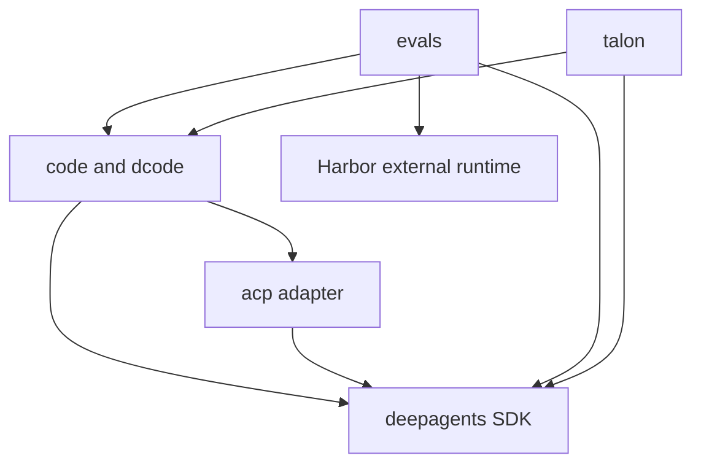

# Quickstart & Wiki Map

Deep Agents is an opinionated, batteries-included agent harness. `create_deep_agent()` assembles configurable backends, subagents, skills, memory, profiles, and middleware on LangChain's `create_agent`, which runs on LangGraph. This is the concise entry point: choose the owning package and task boundary here, then follow the linked guide for implementation detail.

## Start with the right entry path

- **Try a coding agent now:** install and run dcode:

  ```bash
  curl -LsSf https://langch.in/dcode | bash
  dcode
  ```

  dcode is the prebuilt terminal product. For interactive, headless, resume, approval, MCP, hook, or sandbox work, use [Run & Extend a dcode Session](/openwiki/workflows/run-dcode-session.md).
- **Build a custom agent:** install the SDK with `uv add deepagents`, then construct an agent with `create_deep_agent(model=..., tools=..., system_prompt=...)`. Continue with [Build a Deep Agent](/openwiki/workflows/build-a-deep-agent.md).
- **Contribute in this checkout:** choose the package you will change, `cd` into it, run `uv sync --all-groups`, then use its `make` targets. See [Development & Build Operations](/openwiki/operations/development.md) before changing dependencies, locks, or release metadata.

## Ownership model in one glance

The runtime stack has three layers with separate responsibilities:

- **LangGraph** owns graph state, checkpoints, streaming, and interrupts.
- **LangChain `create_agent`** owns the model, tool, and middleware agent loop.
- **Deep Agents** is the harness on top: it supplies opinionated middleware, backends, and profiles rather than a new runtime.

Use [Architecture Overview](/openwiki/architecture/overview.md) to determine which layer owns a behavior. For implementation entrypoints and focused test boundaries, use the [Source Map](/openwiki/architecture/source-map.md).

## Package topology and Python compatibility

The repository is a monorepo of **independently versioned packages under `libs/`**. There is no root `pyproject.toml`: each package owns its `pyproject.toml`, `Makefile`, and `README.md`. Work in the package being changed; local package dependencies are editable, so a sibling consumer sees source changes without publishing a new build.

| Package | Path | Declared Python range | Choose it when you need to… |
| --- | --- | --- | --- |
| `deepagents` | `libs/deepagents/` | `>=3.11,<4.0` | Build or change the SDK: `create_deep_agent`, middleware, backends, profiles, and harness behavior. |
| `code` / `deepagents-code` | `libs/code/` | `>=3.12,<4.0` | Change the prebuilt `dcode` terminal agent, including its client/server runtime, configuration, sessions, tools, and terminal experience. |
| `acp` / `deepagents-acp` | `libs/acp/` | `>=3.11` | Adapt a Deep Agents graph to the Agent Client Protocol used by editors. |
| `evals` / `deepagents-evals` | `libs/evals/` | `>=3.12,<3.14` | Run or add end-to-end, real-model behavioral evaluations and Harbor-backed benchmarks. |
| `talon` / `deepagents-talon` | `libs/talon/` | `>=3.12` | Work on the experimental long-running local host, channels, and schedules. Treat its channel access as access to the operator's agent and host resources; its README documents the current security limitations. |
| `partners` | `libs/partners/` | Package-specific | Maintain provider and sandbox integrations, including Daytona, Modal, Runloop, Vercel, and QuickJS. |

The ranges are package-local constraints, not a repository-wide runtime promise. In particular, select an interpreter compatible with the package you are running; `evals` currently excludes Python 3.14 while the other core manifests listed above permit it or do not cap it below 4.0.

### Declared package dependencies

The diagram covers first-party dependency edges declared by the core package manifests. It is not a runtime-call diagram: `evals` also depends on the external Harbor benchmark runtime, and partner packages are separate integration boundaries.



Caption: Core declared dependency direction; arrows point from the consuming package to its dependency.

## Route the task to its detailed guide

| If your task is… | Start here | Then use when needed |
| --- | --- | --- |
| Assemble a custom agent, add tools, or choose middleware/backends | [Build a Deep Agent](/openwiki/workflows/build-a-deep-agent.md) | [Architecture Overview](/openwiki/architecture/overview.md) and [Source Map](/openwiki/architecture/source-map.md) for ownership and code entrypoints. |
| Change dcode's graph, client/server boundary, configuration, persistence, or streaming behavior | [Run & Extend a dcode Session](/openwiki/workflows/run-dcode-session.md) | [Deep Agents Code Architecture](/openwiki/architecture/code-agent.md). |
| Connect an editor over ACP or decide between the reusable adapter and `dcode --acp` | [ACP Integration](/openwiki/integrations/acp.md) | [Deep Agents Code Architecture](/openwiki/architecture/code-agent.md) for the normal dcode runtime boundary. |
| Measure a behavior against real models or run Harbor benchmarks | [Workflow: Evaluate & Benchmark Agents](/openwiki/workflows/run-evals.md) | [Testing Guide](/openwiki/testing/testing-guide.md) to distinguish eval experiments from offline tests. |
| Set up an environment, run lint/build checks, change locks, or prepare a release | [Development & Build Operations](/openwiki/operations/development.md) | [Testing Guide](/openwiki/testing/testing-guide.md) for the focused package test boundary. |
| Add or debug a regression test | [Testing Guide](/openwiki/testing/testing-guide.md) | [Source Map](/openwiki/architecture/source-map.md) to find the owner and neighboring coverage. |
| Work on Talon or a provider/sandbox package | [Talon: Local Runtime Host](/openwiki/integrations/talon.md) or the package README | [Source Map](/openwiki/architecture/source-map.md) for the implementation and test owner. |
| Investigate observed behavior rather than static design | [Runtime Behavior & Findings](/openwiki/runtime-behavior.md) | Return to the architecture or workflow page that owns the affected component. |

## Browse the wiki hierarchy

- **Architecture** — [overview](/openwiki/architecture/overview.md), [dcode architecture](/openwiki/architecture/code-agent.md), and [source map](/openwiki/architecture/source-map.md).
- **Workflows** — [build a deep agent](/openwiki/workflows/build-a-deep-agent.md), [run a dcode session](/openwiki/workflows/run-dcode-session.md), and [run evals](/openwiki/workflows/run-evals.md).
- **Integrations** — [ACP](/openwiki/integrations/acp.md) and [Talon](/openwiki/integrations/talon.md).
- **Operations and quality** — [development and build operations](/openwiki/operations/development.md), [testing](/openwiki/testing/testing-guide.md), and [runtime behavior](/openwiki/runtime-behavior.md).

## Working invariants

Use `uv` for interpreters, environments, and dependencies and a package-local `Makefile` as the command authority. `uv` provisions the suitable interpreter automatically, while each package declares its own supported Python range. Run `make help` in the package before assuming a target exists; use the `libs/` fan-out targets only for intentional repository-wide checks.

For a safe change plan, identify the package that authors the state or behavior, make the focused package-local change, and add a test at the boundary that observes it. The [Testing Guide](/openwiki/testing/testing-guide.md) separates offline unit coverage from networked integration coverage and real-model evaluation runs.
