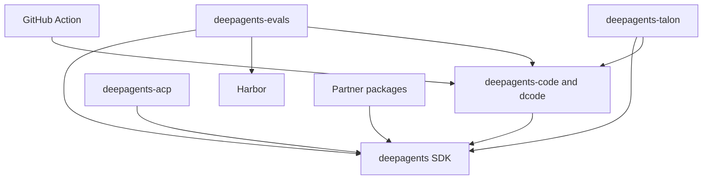

# Repository Quickstart

Deep Agents is an opinionated harness for agents: `create_deep_agent()` configures harness behavior, then delegates agent construction to LangChain's `create_agent()` on the LangGraph runtime. This is a maintainer routing page—not a substitute for the package-local README, Makefile, or focused design guide.

## Pick the entry point

- **Try or change the terminal coding product:** install and start dcode:

  ```bash
  curl -LsSf https://langch.in/dcode | bash
  dcode
  ```

  dcode is the prebuilt terminal coding agent in `libs/code`; use the SDK instead when building a custom agent. For an interactive, headless, resume, approval, MCP, sandbox, or ACP session, follow [Run a dcode Session](./workflows/run-dcode-session.md).
- **Build a custom agent:** install with `uv add deepagents` and start with `create_deep_agent(model=..., tools=..., system_prompt=...)`. Continue with [Build a Deep Agent](./workflows/build-a-deep-agent.md).
- **Change repository behavior:** identify the owning package below, then use its local environment and `Makefile`. Start with [Development, CI, and Releases](./operations/development.md) for setup, locks, CI, and release work.

## Know the runtime and package boundaries

The runtime layers are deliberately separate:

- **LangGraph** owns runtime state, checkpoints, streaming, and interrupts.
- **LangChain `create_agent`** owns the agent abstraction: model, tools, middleware, and the model/tool loop.
- **Deep Agents** is the opinionated harness above `create_agent`, not another runtime. `create_deep_agent()` is its assembly point: it configures the default middleware stack and can configure backends, subagents, skills, memory, and profiles before delegating construction.

Use [Architecture Overview](./architecture/overview.md) for the system model and [Source Map and Change Routing](./architecture/source-map.md) to trace a behavior to its owning surface and focused tests.

`libs/` is a monorepo of independently versioned packages. There is no root `pyproject.toml`; every package has its own `pyproject.toml`, `Makefile`, and README, so work from the package being changed. Local first-party dependencies are editable, allowing a sibling consumer to observe source changes without publishing them first.

| Boundary | Package or path | What it owns | Start here |
| --- | --- | --- | --- |
| SDK | `libs/deepagents/` | The reusable `deepagents` SDK: `create_deep_agent`, middleware, backends, profiles, skills, memory, and subagents. | [Build a Deep Agent](./workflows/build-a-deep-agent.md), [Architecture Overview](./architecture/overview.md) |
| Coding product | `libs/code/` | `deepagents-code`, run as `dcode`: terminal UI, CLI/headless behavior, sessions, configuration, tools, and workspace runtime. | [Run a dcode Session](./workflows/run-dcode-session.md), [dcode Architecture](./architecture/code-agent.md) |
| Editor bridge | `libs/acp/` | `deepagents-acp`, the Agent Client Protocol integration for running Deep Agents in editors; dcode also offers ACP mode. | [ACP Integration](./integrations/acp.md), [Testing Guide](./testing/testing-guide.md) |
| Long-running host | `libs/talon/` | Experimental `deepagents-talon`: local process lifecycle, channel adapters, cron schedules, and agent runtime. | [Talon Runtime Host](./integrations/talon.md), [Security Boundaries](./operations/security.md) |
| Evaluation | `libs/evals/` | `deepagents-evals`: behavioral evaluation suite and Harbor integration. | [Run Evals](./workflows/run-evals.md), [Testing Guide](./testing/testing-guide.md) |
| Provider integrations | `libs/partners/` | Separately released Daytona, Modal, Runloop, Vercel, and QuickJS integration boundaries. | [Sandbox and Partner Integrations](./integrations/sandbox-partners.md) |
| Workflow adapter | repository-root `action.yml` | Composite GitHub Action that runs dcode in a workflow. | [GitHub Action Integration](./integrations/github-action.md) |

The manifests declare consumer direction: `deepagents-code` depends on `deepagents==0.7.13`; ACP depends on `deepagents`; evals depends on Deep Agents, dcode, and Harbor; and Talon depends on Deep Agents and dcode. The five partner packages each depend on Deep Agents. These are package relationships, not a runtime call graph.



The diagram shows declared package and integration dependency direction; arrows point from a consumer or adapter to the capability it uses.

## Route the task to its guide

| If you are changing… | Read first | Then use |
| --- | --- | --- |
| SDK graph assembly, middleware, tools, backends, profiles, skills, memory, subagents, or approvals | [Build a Deep Agent](./workflows/build-a-deep-agent.md) | [Architecture Overview](./architecture/overview.md), [Source Map](./architecture/source-map.md), [Testing Guide](./testing/testing-guide.md) |
| dcode CLI/TUI, graph, client/server behavior, workspace runtime, configuration, persistence, streaming, or offload | [Run a dcode Session](./workflows/run-dcode-session.md) | [dcode Architecture](./architecture/code-agent.md), [dcode Configuration Layering](./concepts/config-layering.md), [State, Sessions, and Workspace Persistence](./concepts/state-persistence.md), [Context Management and Offload](./concepts/context-management.md) |
| models, provider selection, profiles, or retry behavior | [Models, Profiles, and Retries](./concepts/profiles-models.md) | [dcode Architecture](./architecture/code-agent.md) or the SDK architecture, according to the owner |
| an ACP editor integration, protocol session, or dcode ACP mode | [ACP Integration](./integrations/acp.md) | [dcode Architecture](./architecture/code-agent.md), [Testing Guide](./testing/testing-guide.md) |
| Talon channels, schedules, host lifecycle, history, or MCP management | [Talon Runtime Host](./integrations/talon.md) | [State, Sessions, and Workspace Persistence](./concepts/state-persistence.md), [Security Boundaries](./operations/security.md) |
| evaluation coverage, repeated trials, or Harbor benchmark work | [Run Evals](./workflows/run-evals.md) | [Testing Guide](./testing/testing-guide.md), then the runtime package that owns the behavior |
| MCP discovery, trust, credentials, loading, reload, or failures | [MCP Integration](./integrations/mcp.md) | [Security Boundaries](./operations/security.md), plus dcode or Talon as applicable |
| a sandbox provider, remote execution, or partner package | [Sandbox and Partner Integrations](./integrations/sandbox-partners.md) | [Source Map](./architecture/source-map.md), [Testing Guide](./testing/testing-guide.md) |
| the GitHub Action’s prompt, credentials, workspace, memory, skills, sandbox, MCP, or headless behavior | [GitHub Action Integration](./integrations/github-action.md) | [Run a dcode Session](./workflows/run-dcode-session.md), [Security Boundaries](./operations/security.md) |
| dependencies, locks, release metadata, CI, or package validation | [Development, CI, and Releases](./operations/development.md) | [Testing Guide](./testing/testing-guide.md) |

The root Action requires a prompt and accepts optional provider credentials and workspace, along with inputs for persisted memory, skills, sandbox, MCP, and headless output behavior. Treat those inputs as a workflow contract and trace an option to dcode before changing it.

## Run the package-local loop

Use `uv` for interpreters, environments, and dependencies; use neither `pip`, Poetry, nor Conda. `uv` provisions a suitable interpreter, so there is no repository-wide Python version to pin. The package `Makefile` is the command authority: run `make help` in the package, use `uv sync --all-groups` (or the needed group), and reserve `libs/` fan-out targets for intentional repository-wide checks.

Python compatibility is also package-local: Deep Agents is `>=3.11,<4.0`, dcode `>=3.12,<4.0`, ACP `>=3.11`, evals `>=3.12,<3.14`, and Talon `>=3.12`. The five listed partners each require `>=3.11,<4.0`. In particular, evals excludes Python 3.14; select the interpreter for the package you run.

For a focused change, identify the public boundary and state owner, edit the narrowest owning package, and update the nearest observable test. The SDK and dcode Makefiles provide network-disabled unit tests through `make test` and separate integration targets. Evals similarly has network-disabled unit tests; `make evals MODEL=<id>` requires `MODEL` and runs the real-model suite in `tests/evals`, so it complements rather than replaces deterministic coverage.

## Operational caution: Talon

Talon is an experimental local runtime host, not a production security boundary. It does not implement complete HITL policy, channel administrator controls, sandbox-backed execution isolation, or multi-tenant boundaries. Treat channel access as direct access to the operator’s agent, credentials, MCP tools, and local resources. Read [Talon Runtime Host](./integrations/talon.md) and [Security Boundaries](./operations/security.md) before operating or extending it.

For broader navigation, start from [architecture](./architecture/overview.md), [workflows](./workflows/build-a-deep-agent.md), [integrations](./integrations/index.md), [operations](./operations/development.md), and [testing](./testing/testing-guide.md).
