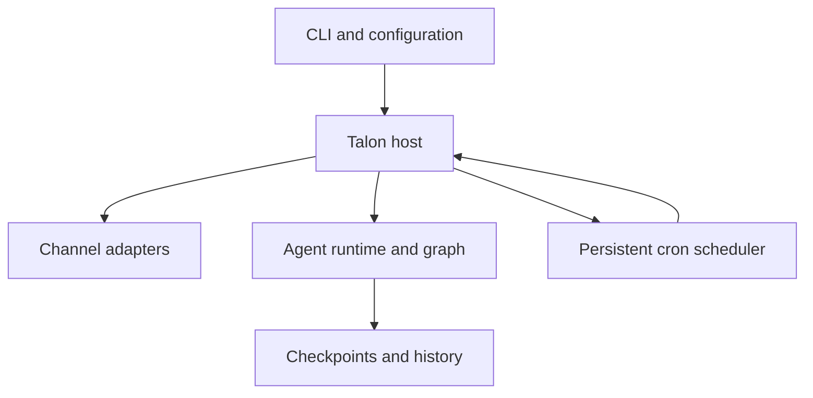

# Repository Quickstart

Start in the package that owns the behavior. `libs/` is a monorepo of independently versioned packages; each package owns its `pyproject.toml`, `Makefile`, and README, while local first-party dependencies are editable. Use `uv` and the changed package's Makefile rather than assuming a repository-wide Python environment or command set.

Talon (`libs/talon/`) owns the **local, long-running** agent boundary: its one event loop coordinates channel adapters, the optional persistent cron scheduler, and the agent runtime. It is experimental and alpha-status software—not a production security or multi-tenant boundary. Treat channel exposure, scheduled work, sandboxing, and approvals as direct operator-agent access and route those changes through the linked security guidance.

## Route the change

| Behavioral boundary | Start in Talon | Read next | First focused validation |
| --- | --- | --- | --- |
| CLI/bootstrap, environment configuration, assistant home, channel selection, `--once`, pairing, or MCP subcommands | `deepagents_talon/__main__.py`, `config.py` | [Talon integration](./integrations/talon.md), [source map](./architecture/source-map.md) | `make test TEST_FILE=tests/test_main.py` or `tests/test_config.py` |
| Channel admission, sender pairing, provider transport, media, replies, reactions, or platform command registration | `deepagents_talon/channels/`, `pairing.py`, `commands.py` | [channel admission, pairing, and delivery](./concepts/talon-channel-admission.md), [security runbook](./operations/security.md) | The affected `tests/channels/test_<provider>.py`; add `tests/unit_tests/test_pairing.py` or `test_commands.py` when applicable. |
| Host turn lifecycle: message dispatch, interrupt-and-continue, `/stop`, delivery, approvals, authorization, background results, or scheduled-run handoff | `deepagents_talon/host.py` | [long-running runtime behavior](./architecture/runtime-behavior.md) | `make test TEST_FILE=tests/test_host.py` |
| Graph/runtime assembly: model binding, tool/MCP refresh, middleware, subagents, backend, memory, checkpointer, or context diagnostics | `deepagents_talon/runtime.py` | [long-running runtime behavior](./architecture/runtime-behavior.md), [Talon integration](./integrations/talon.md) | `make test TEST_FILE=tests/test_runtime.py`; use the adjacent MCP, model-selection, approval, or background unit test for the narrower seam. |
| Checkpoints, archived conversation history, history URI/backends, vector indexing, model selections, or state layout | `__main__.py`, `config.py`, `archive_saver.py`, `history_backends.py` | [state and persistence](./concepts/state-persistence.md) | `tests/test_main.py`, then the relevant `tests/unit_tests/test_archive_saver.py`, `test_history_backends.py`, or history/vector test. |
| Cron expression, durable job store, timezone/DST or `until` behavior, claiming, execution, cancellation, and origin-channel delivery | `deepagents_talon/cron/`, `host.py` | [Talon scheduled work and cron semantics](./concepts/talon-scheduling.md), [runtime behavior](./architecture/runtime-behavior.md) | One of `tests/cron/test_expression.py`, `test_until.py`, `test_jobs.py`, or `test_scheduler.py`, selected by the changed boundary. |
| Sandbox provider setup, execution backend, workspace routes, startup/cleanup, or host-versus-sandbox paths | `sandbox.py`, `config.py`, `__main__.py` | [Talon integration](./integrations/talon.md), [security runbook](./operations/security.md) | `make test TEST_FILE=tests/unit_tests/test_sandbox.py` and `tests/test_main.py` when bootstrap wiring changes. |

For SDK graph construction, reusable middleware, backends, or tools, route to `libs/deepagents/` and [the architecture overview](./architecture/overview.md). For the terminal coding agent use `libs/code/`; ACP lives in `libs/acp/`; evaluation and Harbor work lives in `libs/evals/`; provider-specific SDK integrations live in `libs/partners/<provider>/`. The [source map](./architecture/source-map.md) is the cross-package entrypoint and ownership index.


```mermaid
flowchart TD
    Boot["CLI and configuration"] --> Host["Talon host"]
    Host --> Channels["Channel adapters"]
    Host --> Runtime["Agent runtime and graph"]
    Host --> Scheduler["Persistent cron scheduler"]
    Runtime --> State["Checkpoints and history"]
    Scheduler --> Host
```
*Talon bootstraps one host that owns interactive channels and, when channels are configured, the scheduler; the runtime supplies the graph and durable conversation state.*

## Talon operating model

The console script `deepagents-talon` enters `__main__.main()`, builds `TalonConfig` from the environment, creates the cron store and configured channel adapters, then runs the host. Without `AGENT_MODEL` or `DEEPAGENTS_TALON_MODEL`, it uses the echo runtime; with a model it opens any configured sandbox, loads MCP tools, builds `DeepAgentRuntime`, and supplies a SQLite-backed `ConversationSaver` plus history archive unless a checkpointer was injected. This division is intentional: change bootstrap/configuration without moving host lifecycle policy, and change graph construction without changing channel admission.

`TalonHost.start()` starts the agent before channels and then the scheduler; if startup fails, already-started components are unwound. Its shutdown cancels in-flight work and stops components, so lifecycle changes belong in the host and should be tested there rather than solely through an adapter test. The scheduler is only installed by the CLI when channels exist; it claims due persistent jobs, records an `ok` or `error` outcome, and delivers non-silent output through the job's origin channel.

Assistant state is namespaced by assistant ID below `~/.deepagents/<assistant_id>/` by default. The home and its state directories are created with restrictive permissions. LangGraph checkpoints use `checkpoints.sqlite`; the runtime wrapper archives committed message revisions after checkpoint persistence. Persistence, history, channel admission, and cron state are separate change boundaries—follow the focused concept pages rather than treating them as generic runtime work.

## Security and experimental posture

Do not represent Talon as a production security control. It lacks production-grade HITL policy, channel administrator controls, and multi-tenant isolation; channel access should be treated as access to the operator's agent, credentials, MCP tools, and local host resources. Sandboxing is opt-in: by default shell and file tools run on the host; a configured sandbox routes most agent paths remotely but keeps host-side skills and memory, and does not make MCP, web tools, or channel media a tenant boundary. A configured sandbox that fails to start is an error, not permission to fall back to host execution.

The shared command registry is the source for both host text-command parsing and advertised platform commands. Hidden commands remain typeable but are deliberately excluded from help and platform registration. Keep a command change synchronized across registry, host behavior, and the relevant adapter test.

## Run Talon and test narrowly

Talon requires Python `>=3.12`; its manifest provides editable local `deepagents` and `deepagents-code` sources. Run package commands from `libs/talon`:

```bash
cd libs/talon
uv sync --group test
AGENT_ASSISTANT_ID=local AGENT_MODEL=<provider>:<model-id> uv run deepagents-talon --once
make test TEST_FILE=tests/test_main.py
make lint
```

`make test` first runs WhatsApp bridge Node tests, then runs Python tests with network sockets disabled except Unix sockets, a 10-second timeout, and coverage output. Consequently, start with the single test file named in the routing table before widening to `make test`; use `make lint` after the focused behavior passes. `make lint` runs Ruff checks/format verification and the `ty` type checker for Talon.

## Continue in the relevant domain

- [System architecture overview](./architecture/overview.md) — repository ownership and Talon's place in the stack.
- [Long-running runtime behavior](./architecture/runtime-behavior.md) — startup, turns, graph/runtime assembly, cancellation, background work, and scheduler handoff.
- [Source map and ownership boundaries](./architecture/source-map.md) — concrete entrypoints, public surfaces, and test locations.
- [State and persistence](./concepts/state-persistence.md) — checkpoints, archive history, state files, backend lifecycle, and vector indexes.
- [Talon channel admission, pairing, and delivery](./concepts/talon-channel-admission.md) — exposure policy, pairing, transport, and delivery surfaces.
- [Talon scheduled work and cron semantics](./concepts/talon-scheduling.md) — durable jobs, calendar behavior, revocation, and delivery.
- [Talon runtime integration](./integrations/talon.md) — operator configuration, channel activation, MCP, media, models, history, and sandboxes.
- [Security boundaries and runbook](./operations/security.md) — experimental posture, channel access, sandbox limitations, and operational safeguards.
- [Testing guide](./testing/testing-guide.md) — focused Talon suites and wider confidence runs.
