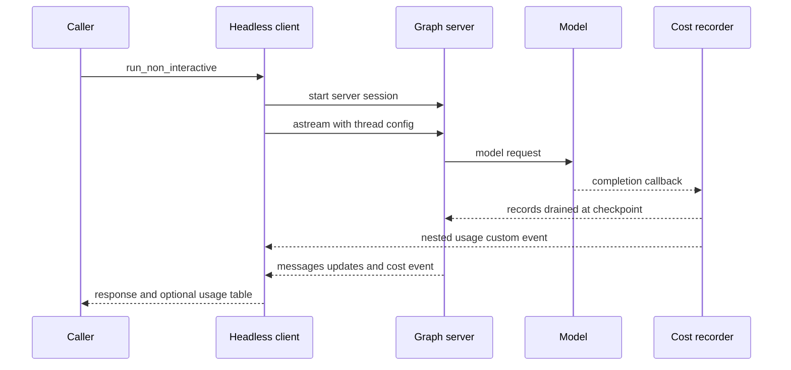

# Runtime Behavior & Findings

This page records **observed implementation behavior** from the current repository. It is not a production telemetry report and does not establish architecture guarantees. No production trace sample was supplied for this update; therefore no latency, token, cost, error-rate, retry-frequency, or compaction-frequency measurement is asserted here. For static composition, see [Code Agent](architecture/code-agent.md); for operational procedures, see [Cost & Sessions](operations/cost-and-sessions.md), [Context Management](concepts/context-management.md), and [Run a dcode Session](workflows/run-dcode-session.md).

## Observed execution and accounting path

*Observed implementation flow for a headless run: stream consumers maintain a display-oriented usage ledger while the graph checkpoint owns the durable thread cost total.*

A completed request is not equivalent to one user turn. The process-wide `_SessionCostRecorder` collects completed model requests by thread, including main-agent calls, subagent graphs, summarization/offload, and Auto-mode classification. `CostTrackingMiddleware` drains those records around model and agent completion, prices them away from the event loop, and checkpoints additive cost. Nested graphs checkpoint a local delta and transfer their completed total to the owning graph. Accordingly, observed source behavior does not support using “one model call per turn” for cost or latency accounting.

The client independently builds `SessionStats` for presentation. It tracks request, input/output, cache read/write, priceable-request, model/provider, and request-kind totals (`assistant`, `subagent`, `offload`, and `auto`). Stream chunks for one request revise a ledger entry rather than adding another request. At each stream-round boundary the ledger is finalized so replay during a human-in-the-loop (HITL) continuation cannot double-count. Attempt-scoped keys additionally distinguish retry attempts that reuse a provider message ID. Nested custom usage events are validated, ignored when malformed or for a different active thread, then use the same de-duplication path.

### Cost completeness and pricing limits

Cost accounting is observed as best effort, not a billing authority. Middleware charging exceptions are logged and do not fail the turn; a failed pricing pass restores drained records for a later drain when possible. However, a thread-less request cannot be attributed, an in-flight start context evicted after 4,096 newer starts loses its cost, and the recorder bounds retained residue to 64 threads and 1,024 undrained records per thread. Missing pricing means an omitted estimate, **not** zero spend.

`estimate_cost` uses `genai-prices` lazily and forwards inclusive input totals with supported cache, modality, and reasoning details. A primary catalog price wins. Only a primary `LookupError` tries `~/.deepagents/prices.json` and then the bundled catalog; other pricing failures return `None`. The first successful pricing import may start the catalog updater; `DEEPAGENTS_CODE_PRICES_AUTO_UPDATE=0`, `[update].prices_auto_update = false`, and offline operation control that behavior.

**Operational interpretation (observed implementation behavior):** use graph checkpoint totals as the durable session value and treat client-side streamed totals as provisional display assistance, particularly during long nested work. Investigate missing cost as a pricing or attribution gap, not as evidence of free execution.

## Observed session persistence and listing behavior

Sessions are backed by the profile state SQLite database at `sessions.db`; thread IDs are UUIDv7 strings. Thread listing reads LangGraph checkpoints and exposes the latest checkpoint identifier plus metadata such as agent name, timestamps, branch, and working directory. A `cwd` filter is an exact stored-string comparison: it neither normalizes paths nor follows symlinks, and older threads without that metadata do not match.

To avoid reading large checkpoint blobs during ordinary lists, the implementation attempts to create a covering index over checkpoint metadata. Failure to create the index is non-fatal but can make a large history slow. Optional message counts and initial prompts are derived from checkpoint state and/or `writes`; caches are keyed by the latest checkpoint ID, so a new checkpoint invalidates an earlier enrichment result. This is an optimization observation, not a promise of a fixed listing latency.

## Observed headless lifecycle and failure semantics

`run_non_interactive` creates a fresh thread, starts a server session, and invokes `astream` with `messages`, `updates`, and `custom` stream modes. It creates an `interactive=False` graph and a single headless user turn; HITL resumes remain within that run. An omitted `--max-turns` uses an internal safety cap. If the cap would be exceeded before another resume, the client raises a HITL iteration error and returns exit code 124; keyboard interruption returns 130, ordinary errors return 1, and a client hook stop returns 0.

For headless safety, repository hooks are not trusted merely because an interactive session previously trusted them: `--trust-project-hooks` is the explicit opt-in. Shell policy also determines approval behavior: no shell allow-list or `all` requests broad auto-approval, while a restrictive list gates shell execution; permission hooks override shortcuts that would otherwise skip HITL. A `--startup-cmd` timeout or non-zero exit is a warning and the task continues.

A completed headless run finalizes uncommitted attempt lifecycle state, dispatches completion/session-end handling, and drains background hook work before process exit. If a stream ends with tool calls lacking results, the client synthesizes `tool.error` and error `tool.result` hook events so emitted `tool.use` events are closed. Session-end hooks are fired at most once and are time-bounded; a timeout is logged while teardown continues.

## Observed runtime controls and recovery paths

### Execution budget

`create_deep_agent` configures a compiled graph with `recursion_limit: 9,999`, and dcode subsequently copies its resolved effective recursion limit into that graph configuration, allowing the dcode value to override the SDK value even when it equals LangGraph's inherited default.

Observed configuration resolution uses managed configuration, CLI, environment, and `config.toml` precedence, then inherits `LANGGRAPH_DEFAULT_RECURSION_LIMIT` when no Deep Agents value wins. Managed, environment, and TOML values are bounded to `[25, 100,000]`; the CLI accepts non-boolean integers at least 1. Diagnose a recursion limit from effective configuration, not a historical default.

### Recoverable search and context pressure

The backend protocol uses a 15-second synchronous grep phase budget and a 35-second async wrapper timeout. A timed-out async grep returns a model-readable `GrepResult` error that requests a narrower pattern or path; it is a tool result rather than a required run failure. The async wrapper bounds the caller’s wait and does not necessarily terminate its worker.

Summarization is threshold-gated, not per-turn. With `max_input_tokens`, the factory selects an 85%-of-context trigger and 10% retention; without it, the observed fallback is a 170,000-token trigger and six retained messages. It also has a lower-cost tool-argument truncation path. Before replacement, evicted history is offloaded to the configured backend; provider `ContextOverflowError` can trigger summarize-and-retry while raw messages remain in state and the event remains private state.

### Model retries

`CodeModelRetryMiddleware` wraps the model node rather than the whole turn, so a transient model failure retries without replaying completed tool calls. The interactive policy starts at 0.2 seconds, doubles, caps ordinary delays at 10 seconds, and caps aggregate retry sleep at 60 seconds. It does not imply that every provider failure retries: classification governs eligible failures. Partial output after exhausted retry handling is explicitly marked incomplete and should not be treated as a completed answer.

## Focused verification

Use focused tests to verify these observed behaviors after a change:

- `libs/code/tests/unit_tests/test_cost_tracking.py` covers recorder capture, fallback pricing, checkpoint charging, nested transfers, restoration, and bounded-loss paths.
- `libs/code/tests/unit_tests/test_session_stats.py` covers chunk revision, HITL replay protection, retry attempt scopes, nested usage events, and usage-table failure handling.
- `libs/code/tests/unit_tests/test_sessions.py` covers session listing, checkpoint enrichment, and cache invalidation.
- `libs/code/tests/unit_tests/test_non_interactive.py` covers shell approval branches, project-hook trust, HITL limits, lifecycle closure, and headless exit behavior.
- `libs/code/tests/unit_tests/test_model_retry.py`, `libs/deepagents/tests/unit_tests/middleware/test_summarization_middleware.py`, and `libs/deepagents/tests/unit_tests/backends/test_protocol.py` cover the linked recovery mechanisms.

When production traces are available, add a separately scoped **Observed trace findings** section naming the sample window and selection method. Report measured counts and durations without extrapolating anomaly-selected traces into fleet-wide rates or copying raw prompts and outputs.
