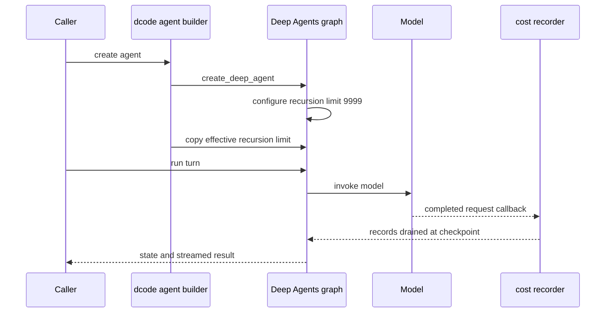

# Runtime Behavior & Findings

This page is an operational reading guide, not a dashboard. It connects the dcode product layer to the Deep Agents SDK mechanisms that bound or recover a run. For construction and middleware composition, see [Code Agent](architecture/code-agent.md) and [SDK Construction & Execution](architecture/sdk-construction-execution.md); for the corresponding context and filesystem concepts, see [Context Management](concepts/context-management.md) and [Tools & Filesystem](concepts/tools-filesystem.md).

## Evidence status

**Observed trace evidence: unavailable.** No usable LangSmith or other production trace sample was supplied for this refresh. Consequently, this page makes **no claim** about production latency, token totals, error rates, tool frequency, recursion depth, or the prevalence of retries and compaction.

The behavior below is **code-derived**: it describes configured limits, control flow, and failure handling visible in the repository. It is a set of checks for a future trace sample, not evidence that the paths occur in production. A future update should label measured findings **Observed**, scope them to the sample, and keep them separate from the code-derived statements here.

## Runtime control flow

This shows the code-derived construction and accounting path. A model request can be the main agent call, a subagent call, or a direct side invocation; the diagram does not imply one request per turn.

## Execution budget: SDK default versus dcode resolution

`create_deep_agent` compiles the SDK graph with `recursion_limit: 9_999`. dcode then calculates an effective limit and directly copies it into the graph configuration. Direct copying is intentional: it can replace the SDK value even when the value equals LangGraph's environment-derived default.

The effective dcode value is no longer a fixed product default such as 2,000. `resolve_recursion_limit` resolves `runtime.recursion_limit` by managed configuration, CLI, environment, and `config.toml` precedence, then inherits `LANGGRAPH_DEFAULT_RECURSION_LIMIT` when no Deep Agents setting wins; it can return `None` when neither supplies a value. Managed, environment, and TOML values must be integers in `[25, 100000]`; invalid values are warned about and resolution continues at lower precedence. The public `--recursion-limit` CLI path is deliberately looser and accepts any non-boolean integer at least 1.

**Operational check (code-derived):** diagnose a recursion failure from the resolved configuration and invocation environment, not by assuming either 9,999 or a historical dcode default. Trace step counts, if available, must be reported as observations rather than inferred from this setting.

## Filesystem search timeouts are recoverable results

The backend protocol establishes a 15-second synchronous grep phase budget, a 35-second asynchronous grep wrapper timeout (allowing a ripgrep attempt and Python fallback), and a 30-second asynchronous glob round-trip timeout. `agrep` runs synchronous `grep` in a worker thread under `asyncio.wait_for`; its timeout bounds the caller's wait but does not terminate that worker thread. A timeout becomes a `GrepResult.error` whose text asks the model to use a more specific pattern or narrower path, rather than an exception that necessarily aborts the turn.

**Operational check (code-derived):** distinguish a returned grep timeout from a run failure. When traces are available, inspect whether the next tool call narrows the query and whether repeated timeouts consume a meaningful part of a turn. The outer glob limit includes sandbox startup, round-trip, and result transfer, not merely directory walking.

## Cost accounting and its loss boundaries

The graph owns the durable cumulative cost; clients render a streamed/checkpointed total rather than maintaining an independent session total. A process-wide `_SessionCostRecorder` is installed through LangChain's configure hook for each model request. It records completed, attributable requests by thread, while `CostTrackingMiddleware` drains and prices records during the graph checkpoint path. This covers direct offload/summarization and Auto-mode classifier calls as well as main-agent and subagent graph calls. Nested agents checkpoint their own delta before transfer to their owning parent graph, preserving spend across an interruption boundary.

Accounting is best-effort by design: exceptions in the cost middleware are logged and do not fail the user turn; drained records are restored if a pricing pass fails. There are explicit incompleteness cases: a request with no thread cannot be attributed, an in-flight start record evicted before completion drops that request's cost, and bounded undrained per-thread records can be discarded. These are accounting warnings, not model execution failures.

`estimate_cost` imports and uses `genai-prices` lazily. A successful primary catalog price wins; only a `LookupError` falls through to the user override catalog at `~/.deepagents/prices.json` and then the bundled maintainer catalog. Missing or unusable pricing returns `None`, so an absent price should not be read as zero cost. The first successful pricing use starts an hourly catalog updater unless disabled by `DEEPAGENTS_CODE_PRICES_AUTO_UPDATE=0` or `[update].prices_auto_update = false`; `DEEPAGENTS_CODE_OFFLINE` suppresses that network fetch.

**Operational check (code-derived):** do not assume one model request per turn or equate missing pricing with free execution. Attribute observed cost by request kind—assistant, subagent, offload, and Auto mode—before optimizing a main loop. See [Cost & Sessions](operations/cost-and-sessions.md) for presentation and session details.

## Context compaction is threshold-gated and recoverable

The public `SummarizationMiddleware` wraps LangChain's summarization helper and retains Deep Agents-specific state for the most recent event and a per-graph-invocation history session ID. The factory selects thresholds from the resolved model profile: with `max_input_tokens`, it triggers at 85% of the context window and keeps 10%; without profile information, it uses a 170,000-token trigger and keeps six messages. It also configures a lighter pre-summarization tool-argument truncation path, which can reclaim context before full compaction.

Before replacing messages with a summary, Deep Agents offloads evicted history to the configured backend under `/conversation_history/{session_id}.md`; the summary can point the agent back to that file where filesystem tools are present. The middleware additionally handles a provider `ContextOverflowError` by summarizing and retrying rather than simply bubbling the overflow. The raw message state is retained while the summarization event is private state, supporting replay and evaluation.

**Operational check (code-derived):** compaction is not a per-turn expectation. If a future trace shows it, report the configured trigger, model profile, and run context separately from latency or cost measurements. An overflow-recovery retry should be distinguished from a transient transport retry.

## Model transport retry behavior

`CodeModelRetryMiddleware` wraps only the model node, so a transient model failure is retried without replaying tool calls that have already completed. The retry policy is attached to constructed models so runtime model selection can supply a provider-specific budget. The interactive curve begins at 0.2 seconds, doubles, caps an individual ordinary delay at 10 seconds, uses 10% jitter, honors bounded `Retry-After` values, and caps aggregate interactive retry sleep at 60 seconds. Retry status is emitted for interactive surfaces rather than leaving an unexplained pause.

This is not a guarantee that every provider error retries: the policy classifies specific transport and provider failures, including HTTP 408, 409, 429, and 5xx responses. When attempts are exhausted after partial streaming, the runtime uses an explicit marker that the partial response is incomplete; it must not be treated as a valid completed answer.

**Operational check (code-derived):** on a trace sample, correlate attempts and retry events within a model call, separate retry sleep from provider latency, and verify that a retry did not duplicate a completed tool action.

## Focused verification

Run the focused unit tests when changing these operational contracts:

- `libs/code/tests/unit_tests/test_cost_tracking.py` for recorder, durable totals, pricing fallback, and loss handling.
- `libs/code/tests/unit_tests/test_model_retry.py` for classification, backoff, retry event correlation, and partial-output behavior.
- `libs/deepagents/tests/unit_tests/middleware/test_summarization_middleware.py` and `test_summarization_factory.py` for trigger selection, history handling, and compaction behavior.
- `libs/deepagents/tests/unit_tests/backends/test_protocol.py` for protocol-level async timeout and result guarantees.

For a production investigation, record the trace selection method and sample window, then add a clearly marked **Observed** section with counts, durations, token/cost values, and failure signatures. Do not convert anomaly-selected samples into fleet rates, and never copy raw model inputs or outputs into this page.
