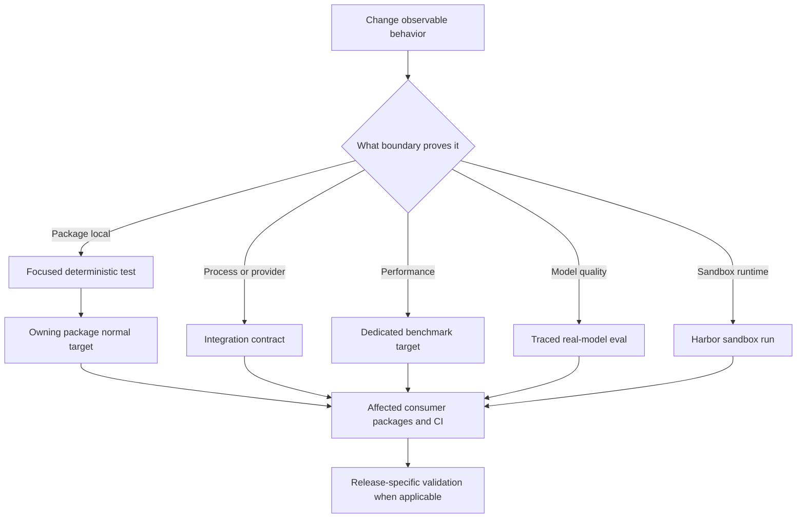

# Testing Strategy and Change Validation

Work in the package that owns the changed behavior. Packages under `libs/` have their own environment, `pyproject.toml`, and `Makefile`; run `uv sync --all-groups` when the package needs all groups, then use `make help` and its Makefile as the command source of truth. Start with the closest existing test and assert observable behavior—not incidental calls or ordering. Repository setup is covered in [development operations](../operations/development.md); package ownership and dependencies are in the [source map](../architecture/source-map.md).

## Select the smallest meaningful boundary

| Changed surface | First test and command | Escalate when |
| --- | --- | --- |
| Deep Agents SDK | `libs/deepagents/tests/unit_tests/`; `make test TEST_FILE=tests/unit_tests/middleware/test_foo.py` | The contract needs an optional dependency, provider, or network behavior: use `tests/integration_tests/`. |
| dcode CLI | `libs/code/tests/unit_tests/`; `make test TEST_FILE=tests/unit_tests/test_agent.py` | The executable, subprocess, ACP transport, sandbox, or provider is the behavior: use `make integration_test`. |
| ACP | Flat `libs/acp/tests/`; `make test TEST_FILE=tests/test_agent.py` | Keep protocol behavior deterministic with a client double unless interoperability needs an external peer. |
| Talon host | `libs/talon/tests/`; `make test TEST_FILE=tests/test_data_lifecycle.py` | `tests/integration_tests/` exercises local host orchestration; it is not automatically a live-service test. |
| Eval harness | `libs/evals/tests/unit_tests/`; `make test TEST_FILE=tests/unit_tests/` | Real model behavior or quality is the subject: use the eval CLI or Makefile target for `tests/evals`. |

For SDK source, mirror the source layout: a test for `deepagents/middleware/foo.py` belongs at `tests/unit_tests/middleware/test_foo.py`. ACP and Talon have their own package-local organization.



This selection flow separates deterministic correctness from integration contracts, performance measurement, stochastic model evaluation, and sandbox-host execution.

## Package commands and deterministic suites

Deep Agents and dcode default `make test` to their unit-test trees. Both use xdist, disable benchmarks, and block non-Unix sockets; `make integration_test` instead selects `tests/integration_tests/`, permits sockets, and applies a 30-second timeout. ACP's normal target runs its flat `tests/` tree under the socket block with a 10-second timeout. Talon's normal target runs WhatsApp bridge Node tests first, then its socket-blocked Python tree with the same timeout.

```bash
cd libs/deepagents
make test TEST_FILE=tests/unit_tests/middleware/test_foo.py
make integration_test

cd ../code
make test TEST_FILE=tests/unit_tests/test_agent.py
make integration_test

cd ../acp && make test TEST_FILE=tests/test_agent.py
cd ../talon && make test TEST_FILE=tests/test_data_lifecycle.py
cd ../evals && make test TEST_FILE=tests/unit_tests/
```

Pass `TEST_FILE` to make the first run narrow, then run the owning package's normal target before relying on the change. Socket blocking catches accidental service calls, but deterministic assertions still need controlled fakes, temporary filesystems, and fixed time where relevant.

### Async and warnings policy

All five package pytest configurations use `asyncio_mode = "auto"`, so async tests do not need `@pytest.mark.asyncio` merely to run. dcode also uses strict markers and configuration, a 30-second default timeout, and function-scoped async fixture loops. Do not weaken these constraints to accommodate a new test.

Every package puts `"error"` first in pytest `filterwarnings`; subsequent entries are the reviewed allowlist. An unaccepted warning fails a test, fails collection when emitted during import, or can abort pytest configuration. Fix actionable warnings first. If an expected warning is unavoidable, scope it with `@pytest.mark.filterwarnings`; use package configuration only for a justified category-wide or third-party exception.

CI has a maintainer escape hatch: a pull request labelled `ci:allow-warnings` can run pytest with `-W default`. The reusable workflow reads labels live and fails closed when lookup fails; push and merge-group runs always enforce warnings as errors. The bypass applies only to jobs using `_test.yml`; the QuickJS SDK smoke job invokes pytest directly, and release runs enforce warnings. Treat the label as temporary triage, not acceptance of a warning.

### Test seams that protect behavior

Deep Agents unit fixtures reset deprecation-warning deduplication and the cached video-dependency probe before each test, then bootstrap built-in profiles once per session. Preserve or extend these reset points when adding process-global caches, lazy registries, or tests that monkeypatch dependency probes: parallel execution must not make observations test-order dependent.

ACP's `FakeACPClient` records session updates and permission requests, allowing protocol assertions without a live client. Talon's `RecordingChannel` records output and lifecycle calls and rejects injected input until a message handler is registered. Talon's integration flows similarly use in-memory channels and scripted agents, exercising host lifecycle and routing without a live channel service.

Use dcode's integration tree when the separately launched executable is the contract. Its ACP smoke test starts `deepagents --acp --no-mcp` over stdin/stdout, initializes the protocol, creates a session, and terminates the subprocess during cleanup. An in-process unit test cannot establish that executable-to-protocol boundary.

## Benchmarks are a separate performance signal

Deep Agents keeps benchmarks in `tests/benchmarks/`; dcode selects benchmark-marked tests from `tests`. Both normal test targets exclude benchmarks and provide dedicated measurement targets:

```bash
make benchmark      # pytest benchmark marker
make bench          # benchmark marker under CodSpeed
make bench-memory   # memory_benchmark marker under CodSpeed
```

Do not move performance measurement into ordinary correctness tests just to make it run through `make test`. At repository level, `make -C libs bench-all` runs `bench` for Deep Agents and dcode. QuickJS also has package benchmark targets but is outside that fan-out.

## Real-model evaluations and Harbor

`libs/evals` keeps its ordinary socket-blocked command on `tests/unit_tests`. Real-model evals live in `tests/evals`: collection requires LangSmith tracing and an explicit `--model`. The `deepagents-evals` CLI exposes a single run, repeated trials, report aggregation, charts, catalog/model-group maintenance, and discovery; `run` and `trials` can obtain the model from `--model` or `DEEPAGENTS_EVALS_MODEL`.

```bash
cd libs/evals
export LANGSMITH_TRACING=true
export LANGSMITH_API_KEY=...
export DEEPAGENTS_EVALS_MODEL=<model-id>

deepagents-evals list categories
deepagents-evals run
deepagents-evals trials --trials 3

# Makefile alternatives
make evals MODEL=<model-id>
make evals-trials MODEL=<model-id> TRIALS=3
```

Category and tier filters reject values absent from collected tests, and category exclusions override inclusions. The reporter records totals, per-category results, failures, durations, experiment links, and efficiency data. Because it can rewrite an individual pytest session failure status after report recording, use the CLI aggregate result for repeated experiments: `trials` and `aggregate` fail when `counts.failed.mean` is nonzero.

Harbor targets are runtime-host experiments, not package pytest integration tests. `stage-harbor-local-deps` stages checked-out Deep Agents, dcode, ACP, and QuickJS sources before selected Docker, Modal, Daytona, Runloop, or LangSmith sandbox runs. The Harbor LangGraph agent removes provider and LangSmith credentials from its environment during shell operations; preserve that secret boundary when changing the agent-to-sandbox handoff. For the operating workflow, see [running evals](../workflows/run-evals.md).

## Cross-package, CI, and release validation

A sibling package may consume SDK changes through editable local dependencies, so validate direct consumers as well as the changed package. CI path filters encode the minimum fan-out: an SDK change triggers Deep Agents, dcode, ACP, Talon, evals, and partner-package jobs that editable-install it; a dcode change also triggers Talon. Workflow and action infrastructure are included in each package filter. Pull requests run matching package jobs, while pushes to `main` run the full package set.

The unit matrix defines compatibility coverage: Deep Agents and ACP run on Python 3.11 through 3.14, with an extra Deep Agents Windows 3.13 leg; dcode and Talon run on 3.12 through 3.14; evals run on 3.12 and 3.13. Run the local owning-package test first, then ensure affected consumers and platform-specific behavior are covered before merging.

For dependency or lockfile changes, run repository-wide checks from `libs/`:

```bash
make -C libs lock-check
make -C libs lint
```

For a release-sensitive SDK change, verify the exact `deepagents==` pin in `libs/code/pyproject.toml`: dcode must update it in the same change when it needs new SDK functionality. It should express the minimum SDK version dcode requires. A deliberate older pin on a release PR needs the `ci:dcode-skip-sdk-pin` label. Release PRs are package-specific and merging one triggers pre-release checks, publishing, and a GitHub release, so test the release consumer path—not only the producer package.

## Change-validation checklist

1. Identify the observable behavior, boundary, and failure mode; inspect the nearest test before writing one.
2. Run the narrowest neighboring test with `TEST_FILE`, then the owning package's normal target.
3. Keep normal coverage deterministic: reset global state, use temporary paths and fixed time, and have doubles record observable output and lifecycle events.
4. Escalate only when needed: integration tests prove process/provider contracts, evals assess real-model quality, Harbor exercises sandbox host behavior, and benchmarks measure performance. Do not use a benchmark as a correctness test.
5. For shared SDK, dcode, workflow, dependency, or release changes, run affected consumer packages and repository fan-out checks. Verify the dcode SDK pin when relevant.
6. Resolve warnings rather than broadening filters. Treat `ci:allow-warnings` as temporary triage and retain warnings-as-errors as the final gate.
