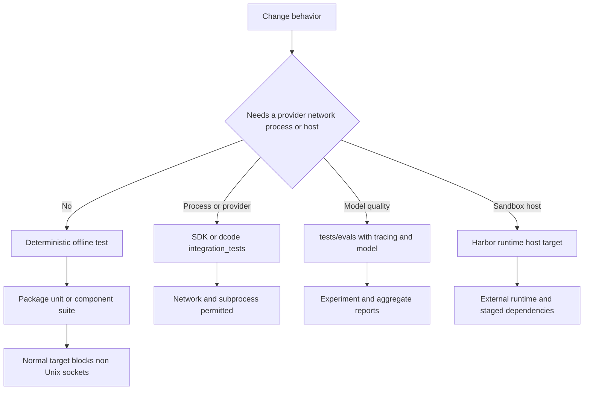

# Testing Guide & Boundaries

Test from the package you change. The repository is a monorepo of independently versioned packages, each with its own environment and Makefile; install dependencies with `uv sync` (often `uv sync --all-groups`) and use `make help` to discover its supported commands. Start with the closest existing test and assert observable behavior. Repository setup is covered in [development operations](../operations/development.md); ownership and package relationships are in [source map](../architecture/source-map.md).

## Choose the narrowest boundary that proves the change

| Package | Test topology | Normal focused entrypoint | Boundary to use |
| --- | --- | --- | --- |
| `libs/deepagents` | `tests/unit_tests/`, `tests/integration_tests/`, `tests/benchmarks/` | `make test TEST_FILE=tests/unit_tests/middleware/test_foo.py` | Unit tests for SDK behavior; integration tests only for a provider, optional integration dependency, or network-dependent behavior. |
| `libs/code` | `tests/unit_tests/`, `tests/integration_tests/` | `make test TEST_FILE=tests/unit_tests/test_agent.py` | Unit tests for CLI logic; integration tests for process, sandbox, and provider contracts. |
| `libs/acp` | Flat `tests/` tree | `make test TEST_FILE=tests/test_agent.py` | Protocol/server behavior using a model and client double. |
| `libs/talon` | Package-wide `tests/`, including `tests/integration_tests/` | `make test TEST_FILE=tests/test_data_lifecycle.py` | Host and channel component flows using in-memory channels, agents, temporary homes, and fixed clocks. The directory name does not make a test live-networked. |
| `libs/evals` | `tests/unit_tests/`, `tests/evals/` | `make test TEST_FILE=tests/unit_tests/` | Offline harness/CLI tests, or separately invoked traced model experiments. |

For SDK source, follow the repository convention: a test for `deepagents/middleware/foo.py` belongs at `tests/unit_tests/middleware/test_foo.py`. The flat ACP suite and Talon's package-wide suite have their own local organization, so do not force that layout on them.



Caption: Select an offline seam unless the behavior itself crosses a process, provider, real model, or sandbox-runtime boundary.

### Commands and what they imply

Deep Agents and dcode default `make test` to their unit trees. These targets use xdist, disable benchmarks, allow Unix sockets but block other sockets, and report package coverage. `make integration_test` switches to `tests/integration_tests/`, retains benchmark disabling, allows network access, and applies a 30-second timeout. ACP's normal target covers its flat tree with the socket block, coverage, and a 10-second timeout. Talon's normal target first runs the WhatsApp bridge's `node --test` suite, then runs the socket-blocked Python tree with coverage and the same timeout.

```bash
cd libs/deepagents
make test TEST_FILE=tests/unit_tests/middleware/test_foo.py
make integration_test

cd ../code
make test TEST_FILE=tests/unit_tests/test_agent.py
make integration_test

cd ../acp && make test TEST_FILE=tests/test_agent.py
cd ../talon && make test TEST_FILE=tests/test_data_lifecycle.py
cd ../evals && make test TEST_FILE=tests/unit_tests/
```

Pass `TEST_FILE` to narrow an ordinary package target. Run that focused command first, then the package target before relying on a change. A socket block makes an ordinary test a useful guard against accidental service calls, but it is not a substitute for a protocol double or controlled temporary state.

## Preserve deterministic-test invariants

### Warnings and async behavior

Every package puts `"error"` first in pytest `filterwarnings`; only the later reviewed allowlist is accepted. An unreviewed warning fails a test, fails collection if emitted during import, or may abort pytest configuration with `INTERNALERROR`. Prefer fixing the warning. A package-wide ignore is a reviewed exception, not a convenient test workaround.

All five package configurations use `asyncio_mode = "auto"`, so an `async def` test does not need `@pytest.mark.asyncio` simply to run. dcode additionally enables strict markers and configuration, a 30-second default timeout, and function-scoped async fixture loops. Preserve those constraints when adding markers, fixtures, or tests that manage background tasks.

### Reset process-global state and control time

The SDK unit fixtures reset deprecation-warning deduplication and the cached video-dependency probe before each test, then bootstrap built-in profiles once per session. These are ordering safeguards: without them, xdist workers, monkeypatched dependency probes, or registry snapshot-and-restore tests can observe stale process state.

Use temporary paths, injected clocks, and observability-preserving fakes at a boundary. Talon's data-lifecycle test, for example, supplies a temporary home and a fixed timestamp, creates expired and fresh media plus an old cron job, and verifies that cleanup removes only the expired state. This proves retention semantics without a channel or scheduler service.

### Protocol and host seams

ACP tests pair `AgentServerACP` with a fake client that records session updates and permission requests, allowing assertions over the protocol exchange rather than a live ACP client. Talon's `RecordingChannel` records sent messages and media, tracks start/stop, and refuses injected input until the host has registered a handler. Its named integration flows similarly use in-memory channels and scripted agents to exercise host orchestration deterministically. For Talon's runtime design, see [Talon](../integrations/talon.md).

Use dcode's integration tree when a separately launched CLI is the contract under test. The ACP smoke test starts `deepagents --acp --no-mcp` with piped stdin/stdout, performs ACP initialization and session creation, then terminates the subprocess in cleanup. That covers the executable/protocol boundary which an in-process unit test cannot establish. For dcode behavior and ownership, see [code agent](../architecture/code-agent.md).

## Benchmarks measure performance, not correctness

Deep Agents keeps benchmarks in `tests/benchmarks/`; dcode selects benchmark-marked tests from `tests`. Both exclude benchmarks from normal testing and expose these explicit measurement targets:

```bash
make benchmark      # pytest benchmark marker
make bench          # benchmark marker under CodSpeed
make bench-memory   # memory_benchmark marker under CodSpeed
```

Keep a performance measurement on this dedicated path rather than making it an ordinary correctness test merely to run it in `make test`. ACP, Talon, and evals do not define these benchmark targets.

## Provider integration versus real-model evaluation

Deep Agents and dcode integration tests that use Anthropic models require `ANTHROPIC_API_KEY`; `LANGSMITH_API_KEY` enables optional tracing. SDK tests mark cases that need optional dependencies with `pytest.mark.requires(...)`, allowing an unavailable integration extra to skip instead of fail at import. Use this tier for real provider or network behavior, not for routine logic. See [development operations](../operations/development.md) for repository conventions.

`libs/evals` deliberately keeps its normal socket-blocked target on `tests/unit_tests/`. Live work resides in `tests/evals` and must have tracing enabled and an explicit `--model`; the collection hook exits early when either prerequisite is absent. The `deepagents-evals` console program wraps single runs, trials, aggregation, radar, catalog/model-group maintenance, and discovery; `run` and `trials` take a model from `--model` or `DEEPAGENTS_EVALS_MODEL`.

```bash
cd libs/evals
export LANGSMITH_TRACING=true
export LANGSMITH_API_KEY=...
export DEEPAGENTS_EVALS_MODEL=claude-sonnet-4-6

deepagents-evals list categories
deepagents-evals run
deepagents-evals trials --trials 3

# Makefile alternatives
make evals MODEL=claude-opus-4-7
make evals-trials MODEL=openai:gpt-5.5 TRIALS=3
```

Category and tier filters validate requested values against collected marks; an exclusion wins over an inclusion. The reporter records total and per-category results, durations, failures, experiment links, and efficiency ratios. It intentionally changes a pytest exit status of `1` to `0` after at least one test call so reporting and aggregation complete. Therefore, trial automation must trust the CLI aggregate: `trials` and `aggregate` return failure when `counts.failed.mean` is nonzero, rather than trusting an individual pytest return code. Use [running evals](../workflows/run-evals.md) for the operational workflow.

### Runtime-host evaluation is another boundary

The evals Makefile also exposes Harbor targets such as `run-hello-world` and `run-terminal-bench-docker`, `run-terminal-bench-modal`, `run-terminal-bench-daytona`, `run-terminal-bench-runloop`, and `run-terminal-bench-langsmith`. Before a Harbor run, `stage-harbor-local-deps` copies checked-out Deep Agents, dcode, ACP, and QuickJS sources into the LangGraph project's local-dependency directory. The targets then run Harbor against a selected external runtime and pass model/tracing credentials as agent environment variables.

Treat these as runtime-host experiments, not package unit or pytest integration tests: they require the selected host and its credentials and evaluate an agent in a sandbox. The LangGraph Harbor agent scrubs provider and LangSmith environment variables while it performs shell operations, so task commands do not inherit those secrets. This is a security invariant to preserve when changing the agent/runtime handoff.

## Safe change checklist

1. State the behavior, ordering rule, or failure mode first; find the nearest existing test and neighboring implementation.
2. Keep deterministic coverage in the normal socket-blocked path. Escalate only to an SDK/dcode process or provider integration test, a traced model eval, or a Harbor runtime-host run when that boundary is the behavior under test.
3. Preserve fixture cleanup and state isolation: reset process globals, use temporary paths and fixed time, and make doubles record the outputs or lifecycle events the caller can observe.
4. Do not confuse benchmarks with correctness tests, nor live evaluations with deterministic integration tests.
5. Run the narrow `TEST_FILE` command, then the relevant package target. Treat a new warning as a defect or a narrowly justified reviewed exception.
6. Before a real-model eval, explicitly select the model, provide its provider credentials, enable tracing, and use trial aggregation for decisions about nondeterministic behavior.
