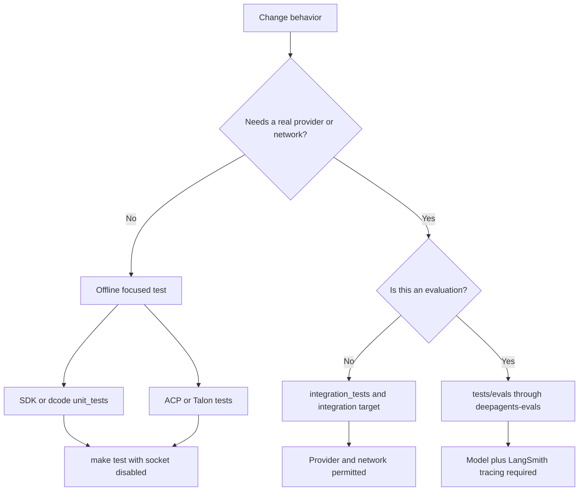

# Testing Guide

Tests are the executable specification for this monorepo. Work in the package you are changing: packages have independent environments and Makefiles, and `make help` is the authoritative list of supported targets. Read focused neighboring tests, test observable behavior rather than replicating implementation, keep cases deterministic, and add unit coverage for every feature or bug fix. Do not add `@pytest.mark.asyncio`; package configuration uses `asyncio_mode = "auto"`.

This guide complements [development operations](../operations/development.md), [the dcode architecture](../architecture/code-agent.md), [SDK construction and execution](../architecture/sdk-construction-execution.md), [ACP](../integrations/acp.md), [running a dcode session](../workflows/run-dcode-session.md), and [running evals](../workflows/run-evals.md).

## Choose the test boundary

The primary distinction is external behavior and cost, not merely package location:

| Area | Test topology | Normal entrypoint | Boundary to preserve |
| --- | --- | --- | --- |
| SDK — `libs/deepagents` | `tests/unit_tests/`, `tests/integration_tests/`, `tests/benchmarks/` | `make test`; `make integration_test`; benchmark targets | Unit tests are offline; integration tests may use providers. |
| dcode — `libs/code` | `tests/unit_tests/`, `tests/integration_tests/` | `make test`; `make integration_test` | Put separately running CLI/server processes and provider or sandbox seams in integration tests. |
| ACP — `libs/acp` | One `tests/` tree | `make test` | Use in-process fake clients and models to test protocol adaptation without sockets. |
| Talon — `libs/talon` | Main `tests/` tree plus `tests/integration_tests/` | `make test` | Keep host, channel, scheduling, and data lifecycle deterministic and socket-free in the normal suite. |
| Evals — `libs/evals` | `tests/unit_tests/` and live `tests/evals/` | `make test`; `deepagents-evals run` / `trials` | Unit-test the harness offline; treat model evaluations as traced, credentialed experiments. |

The SDK convention is source mirroring: a test for `deepagents/middleware/foo.py` belongs at `tests/unit_tests/middleware/test_foo.py`. It is useful for SDK and dcode work, but do not invent a three-directory layout for ACP, Talon, or evals. The SDK architecture guide identifies `../tests/` as a source of coverage and usage examples for construction, middleware, backends, and profiles.



Caption: Select a test location from its external boundary; only the integration and eval paths intentionally cross the network boundary.

## Run the package suite

Run commands from the owning package after installing dependencies with `uv sync` (use `--all-groups` when appropriate). `TEST_FILE` scopes package Make targets to a file or directory.

```bash
cd libs/deepagents
make test TEST_FILE=tests/unit_tests/test_middleware.py
make integration_test

cd ../code
make test TEST_FILE=tests/unit_tests/test_agent.py
make integration_test

cd ../acp && make test TEST_FILE=tests/test_agent.py
cd ../talon && make test TEST_FILE=tests/test_data_lifecycle.py
cd ../evals && make test TEST_FILE=tests/unit_tests/test_cli.py
```

For `deepagents` and dcode, `make test` runs pytest in parallel (`-n auto`), disables benchmarks, and passes `--disable-socket --allow-unix-socket`; a real network connection therefore fails from a unit test. The SDK target reports coverage for `deepagents`; dcode reports coverage for `deepagents_code`. ACP and Talon apply the socket block and a ten-second timeout to their normal target. SDK and dcode integration targets switch `TEST_FILE` to `tests/integration_tests/`, drop the socket block, and use a 30-second timeout.

The explicit `coverage` targets in SDK and dcode produce XML and terminal coverage reports. `update-snapshots` is available in both and remains socket-disabled, so snapshot regeneration does not weaken the unit boundary.

### Warnings are failures

Every package puts `"error"` first in its pytest `filterwarnings`. A warning outside the reviewed allowlist is a test failure: inside a test it fails that test, during import it breaks collection, and during pytest configuration it can abort the run with `INTERNALERROR`. Fix the underlying warning first. If an expected warning is genuinely local to a test, scope it with `@pytest.mark.filterwarnings`; package-level entries are for justified categorical or third-party exceptions.

## SDK and dcode: unit, integration, and benchmark work

### Integration prerequisites

The SDK and dcode test READMEs identify `ANTHROPIC_API_KEY` as required for Anthropic-backed integration tests and `LANGSMITH_API_KEY` as optional tracing support. Deepagents integration cases declare optional packages with `pytest.mark.requires(...)`, allowing pytest to skip a case whose extra is absent rather than fail at import time. Keep provider calls, real sandbox operations, and subprocess or network behavior in this tier.

### Benchmarks are separate measurements

`deepagents` has a dedicated `tests/benchmarks/` directory; dcode selects benchmark markers from `./tests`. Both Makefiles provide:

```bash
make benchmark      # pytest benchmark marker
make bench          # benchmark marker under CodSpeed
make bench-memory   # memory_benchmark marker under CodSpeed
```

Normal SDK and dcode test commands add `--benchmark-disable`, while their pytest configuration excludes `benchmark`-marked cases by default. Do not turn a performance measurement into an ordinary correctness test merely to make it run in `make test`.

### Use fakes that preserve the agent contract

`libs/deepagents/tests/utils.py` centralizes mock tools, reusable middleware fixtures, and `assert_all_deepagent_qualities`. The helper asserts a construction invariant: a deep agent exposes the `files` stream channel and `ls`, `read_file`, `write_file`, `edit_file`, and `task` tools. `GenericFakeChatModel` supports sync and async invocation, configurable streaming, and call tracking, making it the normal offline substitute for a provider.

The deepagents unit `conftest.py` discovers `@deprecated`-wrapped callables and resets their once-per-process flag before each test, keeping warning-emission assertions reorder-safe under xdist. It also clears the video-dependency cache and bootstraps profile registries, preventing cached or lazily initialized state from leaking between tests.

Dcode uses `_ToolBindingFakeModel` where graph compilation needs tool binding: its no-op `bind_tools` and minimal capability profile satisfy agent capability negotiation without a real model. `DeterministicIntegrationChatModel` is intentionally prompt-driven rather than iterator-driven; equal prompts yield equal output after a CLI integration suite restarts the server process. Use that model for local process integration tests, not as a substitute for provider-backed behavioral coverage.

### Dcode server and agent seams

`libs/code/tests/unit_tests/test_agent.py` drives `create_cli_agent` with fakes and asserts wiring that is observable across graph construction, persistence, and runtime context:

- Missing credentials while eagerly resolving a subagent model produce `None` rather than blocking CLI startup; the credential error is deferred until that subagent runs.
- The backend exposes server-side offload without adding `dcode_operation` to the graph input schema.
- In local mode, conversation history under the advertised artifacts path routes to persistent user storage, while large tool results fall through to a real filesystem location the agent can inspect.
- A stored live approval-mode value overrides an older run-context `auto_approve` snapshot.

`test_server_graph.py` protects server bootstrap boundaries. The graph factory caches one process-lifetime runtime and concurrent callers share that build. Blocking configuration, project-context, model-creation, and plugin discovery work is tested off the server event loop; startup construction failure must emit the startup marker and exit nonzero. It also tests that criteria agents receive only identity-approved built-in tools and unambiguously read-only MCP tools, so ambiguous or mutating MCP annotations fail closed. Keep extension code disabled in these unit tests unless the test specifically owns that extension boundary.

Use the dcode integration suite where the guarantee depends on a separately running process. For example, `test_acp_mode.py` launches `deepagents --acp --no-mcp`, connects an ACP client over its stdin/stdout pipes, initializes the protocol, creates a session, and terminates the subprocess in cleanup. This is the appropriate layer for CLI-to-protocol process behavior.

## ACP and Talon normal suites

ACP's normal `make test` runs its flat `tests/` tree offline with a timeout and coverage. Agent tests construct a `create_deep_agent` graph with `MemorySaver`, attach it to `AgentServerACP`, then drive it through `FakeACPClient`. The fake records session updates and permission requests, allowing tests to assert protocol-visible text and reasoning streaming as well as cancellation without a network connection. Preserve the client-recording seam when changing permission, session, or streaming contracts.

Talon's normal suite is similarly socket-disabled. `RecordingChannel` records messages and media, tracks start and stop, and delivers inbound messages only after the host registers handlers. For lifecycle work, use a clock and filesystem rooted at `tmp_path`: the data-lifecycle test verifies retention cleanup removes expired cron jobs and old inbound media while preserving fresh media. This is the right pattern for deterministic host, channel, and retention changes; reserve `integration_tests/` for external boundaries.

## Evals are experiments, not ordinary integration tests

`libs/evals` has two intentional tiers. `make test` targets only `tests/unit_tests` under the socket block; it covers the harness rather than live model behavior. The live suite is `tests/evals`, run through the `deepagents-evals` console program—the canonical interface—or CI-parity Make targets.

```bash
cd libs/evals
export LANGSMITH_TRACING=true
export LANGSMITH_API_KEY=...
export DEEPAGENTS_EVALS_MODEL=claude-sonnet-4-6

deepagents-evals list categories
deepagents-evals run
deepagents-evals trials --trials 3

# CI-parity alternatives
make evals MODEL=claude-opus-4-7
make evals-trials MODEL=openai:gpt-5.5 TRIALS=3
```

Use `deepagents-evals list` to discover categories, tiers, models, and evals. The CLI supports single runs, repeated trials, aggregation, radar generation, catalog and model-group maintenance, JSON output, and dry runs. Live collection exits before running tests unless LangSmith tracing is enabled and `--model` is supplied; the selected provider determines its required credential. Category and tier selection use `--eval-category` and `--eval-tier`.

The eval reporter records aggregate outcomes, durations, categories, failure details, LangSmith experiment links, and efficiency measures such as step and tool-call ratios. It deliberately changes an individual trial pytest status to zero so reports can be written. Automation must use the CLI's aggregate decision: `trials` and `aggregate` return `1` when `trials_summary.json` has a nonzero `counts.failed.mean`, not the per-trial pytest return code.

## Safe change checklist

1. Start from the closest existing test and state the observable invariant or failure mode first.
2. Put network-free coverage in the offline suite; move real provider, sandbox, subprocess, or network requirements to the applicable integration or eval path.
3. Use fake models, fake protocol clients, temporary directories, injected clocks, and shared helpers to make offline behavior deterministic.
4. Run the narrow `TEST_FILE` command, then the relevant package target. Run benchmarks only through their dedicated targets.
5. Treat a new warning as a defect to fix or narrowly justify, never as noise to globally suppress.
