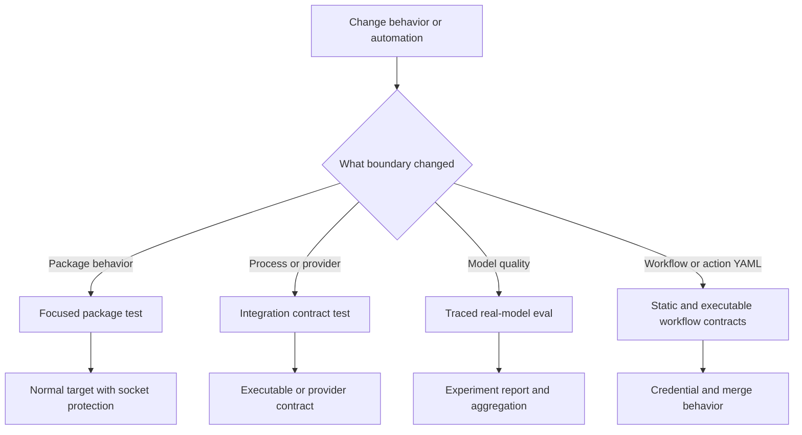

# Testing Strategy and Local Test Guide

Use the package that owns a runtime change for agent and library validation. Treat `.github` automation as a separate system boundary: its tests validate committed workflow/action contracts, credential placement, and shell behavior—not agent-runtime behavior. Packages under `libs/` are independently versioned; install dependencies in the package (normally `uv sync --all-groups`) and use `make help` as the current target reference. See [development operations](../operations/development.md) for setup and aggregate checks.

## Choose the smallest meaningful runtime boundary

| Changed surface | First focused check | Escalate when |
| --- | --- | --- |
| Deep Agents SDK | `cd libs/deepagents && make test TEST_FILE=tests/unit_tests/middleware/test_foo.py` | An optional dependency, provider, or network contract is itself the behavior; use `make integration_test`. |
| dcode CLI | `cd libs/code && make test TEST_FILE=tests/unit_tests/test_agent.py` | Startup, subprocess, ACP transport, sandbox, or provider behavior is the contract; use `make integration_test`. |
| ACP | `cd libs/acp && make test TEST_FILE=tests/test_agent.py` | An external ACP peer, rather than a client double, is required. |
| Talon host | `cd libs/talon && make test TEST_FILE=tests/test_data_lifecycle.py` | Local `tests/integration_tests/` covers orchestration; use a live service only when its adapter boundary changes. |
| Eval harness | `cd libs/evals && make test TEST_FILE=tests/unit_tests/` | The question is real-model quality or behavior; use an eval target. |
| GitHub workflow/action | `python -m pytest .github/scripts/tests/workflows -v` | A workflow YAML, composite action interface, credential scope, or embedded shell behavior changes. |

For SDK code, mirror the source layout: a test for `deepagents/middleware/foo.py` belongs at `tests/unit_tests/middleware/test_foo.py`. Read the nearest test first and assert observable behavior rather than incidental call order.



*The validation route separates package behavior from repository automation, then escalates only to the external boundary that changed.*

## Package suite topology and commands

Deep Agents and dcode default `make test` to `tests/unit_tests/`, run with xdist, disable benchmarks, and block non-Unix sockets. Their `make integration_test` targets select `tests/integration_tests/`, remove the socket block, disable benchmarks, and apply a 30-second timeout. ACP's normal target covers its flat `tests/` tree with a socket block and 10-second timeout. Talon's normal target runs its WhatsApp bridge Node tests before a socket-blocked Python `tests/` tree with the same timeout; that tree includes `tests/integration_tests/`.

```bash
cd libs/deepagents
make test TEST_FILE=tests/unit_tests/middleware/test_foo.py
make integration_test

cd ../code
make test TEST_FILE=tests/unit_tests/test_agent.py
make integration_test

cd ../acp && make test TEST_FILE=tests/test_agent.py
cd ../talon && make test TEST_FILE=tests/test_data_lifecycle.py
cd ../evals && make test TEST_FILE=tests/unit_tests/
```

Pass `TEST_FILE` for an initial narrow run, then run the owning package's normal target. Socket blocking exposes accidental service access; controlled fakes, temporary files, and fixed time still matter.

### Async, warnings, snapshots, and deterministic seams

All five package pytest configurations use `asyncio_mode = "auto"`. dcode additionally configures strict marker/configuration validation, a 30-second default timeout, and function-scoped async fixture loops. Every package puts `"error"` first in pytest `filterwarnings`, making unallowlisted warnings fail the run. Fix actionable warnings rather than broadening filters; use a narrow test-scoped filter only for an intentional exception. `ci:allow-warnings` is a pull-request-only recovery label: the reusable test workflow looks up labels live and fails closed on lookup failure, while push and merge-group runs remain strict.

Deep Agents and dcode provide `update-snapshots` only for their unit smoke-test directories. Use it only when intentionally changing the snapshot contract. Deep Agents fixtures also reset deprecation-warning deduplication and a cached video-dependency probe per test, while bootstrapping built-in profiles once per session. Preserve comparable reset and bootstrap seams when adding process-global state, so order and xdist scheduling cannot affect results.

### Doubles and executable integration contracts

ACP tests use a fake client that records session updates and permission requests. Talon uses a recording channel that captures output and defers injected input until a handler is registered; its integration flows use in-memory channels and scripted agents. These doubles make protocol and lifecycle observations possible without a live channel service.

Use dcode integration coverage when the launched executable is the promise: its ACP smoke test starts `deepagents --acp --no-mcp` as a subprocess, initializes ACP over stdin/stdout, creates a session, and cleans up the process. Talon's normal socket-blocked target also covers `tests/integration_tests/`, retaining its in-memory host-orchestration contract without live channel services.

## Performance and real-model coverage

Benchmarks are performance coverage, not ordinary correctness tests. Deep Agents keeps them in `tests/benchmarks/`, while dcode selects benchmark markers from `tests`; normal test targets disable them. Both provide:

```bash
make benchmark      # pytest benchmark marker
make bench          # benchmark marker under CodSpeed
make bench-memory   # memory_benchmark marker under CodSpeed
```

From `libs/`, `make bench-all` runs CodSpeed benchmarks for Deep Agents and dcode only.

`libs/evals` keeps its ordinary socket-blocked command on `tests/unit_tests`. Live `tests/evals` require tracing and an explicit model, and are exposed through `deepagents-evals` and Makefile eval targets.

```bash
cd libs/evals
export LANGSMITH_TRACING=true
export LANGSMITH_API_KEY=...
export DEEPAGENTS_EVALS_MODEL=<model-id>

deepagents-evals list categories
deepagents-evals run
deepagents-evals trials --trials 3
make evals MODEL=<model-id>
make evals-trials MODEL=<model-id> TRIALS=3
```

Category/tier filters validate requested values against collected marks, with exclusions taking precedence. The reporter records outcomes, category results, failures, experiment links, durations, and efficiency data. It can rewrite an individual session exit status to zero after reports are recorded, so repeated trials and aggregation must treat a nonzero `counts.failed.mean` in the CLI summary as failure.

Harbor targets are external sandbox-runtime experiments rather than pytest integration tests. They stage checked-out Deep Agents, dcode, ACP, and QuickJS sources before selected runtime runs; the Harbor LangGraph agent removes provider and LangSmith credentials during shell operations. See [running evals](../workflows/run-evals.md).

## Repository automation contracts

`.github/scripts/tests/` mirrors helper-script domains; `conftest.py` adds the domain directories and the scripts directory to `sys.path` so helpers can be imported without a `.github` package. `scripts/tests/workflows/` is deliberately the home for contracts over workflow/action YAML—job graphs, option matrices, secret scopes, and root `action.yml`—rather than a production workflow-script tree. CI runs the complete helper-script suite with Python 3.11 after installing `packaging`, `pyyaml`, and `pytest`:

```bash
python -m pytest .github/scripts/tests -v
```

For a small automation edit, run the affected file(s) first, then the full command above. The YAML/static tests are appropriate for declarative invariants: for example, the OpenWiki credential test checks read-only workflow permissions, the `openwiki` environment, checkout without persisted credentials, delayed App-token creation, its repository-limited write permissions, and token injection only into PR mutation steps. It also guards package-scoped integration credential expressions and GitHub App token inputs in other workflows.

The root-action tests combine static interface drift checks with controlled execution of the actual `Run dcode` shell body from `action.yml`. They compare declared input mappings with the dcode parser and run selected portions with `uvx` and `timeout` stubs, covering validation and command construction without launching dcode. That is action-wrapper coverage, not a substitute for dcode unit or integration testing.

### OpenWiki merge harness and observable failure boundaries

After changing `.github/workflows/openwiki-update.yml`, run:

```bash
python -m pytest .github/scripts/tests/workflows/test_workflow_secret_scoping.py -v
python -m pytest .github/scripts/tests/workflows/test_openwiki_workflow.py -v
```

The merge harness parses the workflow YAML, extracts the real **Merge OpenWiki update pull request** `run:` block, and executes it with POSIX Bash. It stubs `gh` and `sleep` on `PATH`, but symlinks the installed real `jq`; recorded calls and scenario responses let the test observe API and wait behavior without a GitHub request. It is skipped on Windows or when Bash or `jq` is unavailable. Install `jq` and run the command in a POSIX environment when validating this behavior locally.

The tests intentionally assert externally observable safety boundaries rather than restating shell structure:

- malformed merge inputs, changed PR identity or SHA, a closed PR, or an unmergeable PR stop before an unsafe merge; a head change after a retry also prevents the next merge;
- a SHA-pinned squash merge succeeds only when the API response confirms `merged == true`;
- only HTTP `405`—merge requirements not yet satisfied—causes a 15-second retry, with at most 60 merge attempts and no final unnecessary sleep;
- authentication, authorization, conflict, server, transport, malformed-response, and other HTTP failures are terminal rather than retried.

These tests validate repository automation contracts and fail-closed merge behavior. They do not test model behavior, package runtime behavior, or a live GitHub service. For lifecycle, operations, and recovery, see the [OpenWiki automation runbook](../operations/openwiki-automation.md); for the security boundary, see [security operations](../operations/security.md).

## CI, fan-out, and release checks

CI path filters include editable SDK consumers: an SDK change runs Deep Agents, dcode, Talon, evals, ACP, and partner package jobs; a dcode change also runs Talon. Matching jobs run on pull requests, and pushes to `main` run the full set. The reusable matrix runs Deep Agents and ACP on Python 3.11–3.14 (plus Deep Agents on Windows 3.13), dcode and Talon on 3.12–3.14, and evals on 3.12–3.13.

For dependency or lockfile work, run:

```bash
make -C libs lock-check
make -C libs lint
```

Release-sensitive Linux SDK runs require usable `rg`; `ci:skip-ripgrep` can tolerate an install failure only on a pull request, while push and merge-group runs are strict. For a dcode change needing new SDK behavior, update its exact `deepagents==` pin in `libs/code/pyproject.toml` in the same PR. An intentional dcode release with an older pin requires `ci:dcode-skip-sdk-pin`.

## Focused validation checklist

1. Classify the change as package behavior, external integration, evaluation/performance, or repository automation.
2. Run the closest focused test, then its owning package target or the full helper-script suite.
3. Keep deterministic tests offline with resettable state and recording doubles.
4. Escalate only for the boundary at issue: executable/provider integration, real-model evaluation, Harbor runtime, benchmark, or real workflow shell contract.
5. For workflow changes, review the YAML authority boundary and run static credential-scope and relevant executable shell contracts; ensure Bash and `jq` are available for the OpenWiki merge harness.
6. For SDK, dcode, dependency, or release work, validate affected consumer fan-out and the dcode SDK pin where applicable.
