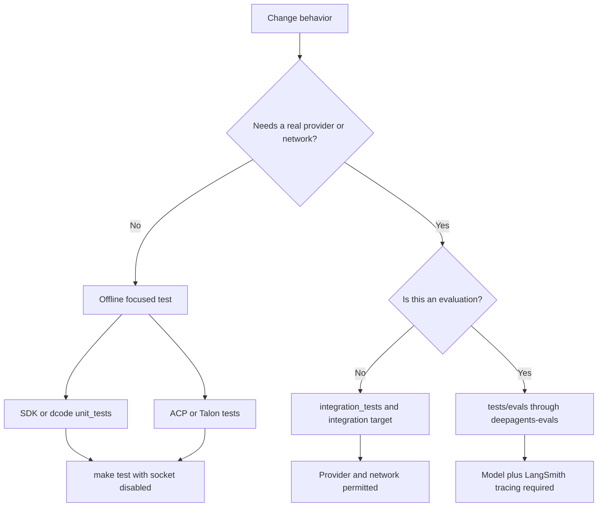

# Testing Guide

Tests are the executable specification for this monorepo. Work in the package you are changing: packages have independent environments and Makefiles, and `make help` is the authoritative list of supported targets. The repository asks contributors to read focused neighboring tests, test observable behavior rather than replicate implementation, keep cases deterministic, and put every feature or bug fix under unit coverage. Do not add `@pytest.mark.asyncio`; package configuration uses `asyncio_mode = "auto"`.

This guide complements [development operations](../operations/development.md), [the dcode architecture](../architecture/code-agent.md), [SDK construction and execution](../architecture/sdk-construction-execution.md), [building a deep agent](../workflows/build-a-deep-agent.md), and [running evals](../workflows/run-evals.md).

## Choose the test boundary

The primary distinction is behavior and cost, not merely package location:

| Area | Test topology | Normal entrypoint | Boundary to preserve |
| --- | --- | --- | --- |
| SDK — `libs/deepagents` | `tests/unit_tests/`, `tests/integration_tests/`, `tests/benchmarks/` | `make test`; `make integration_test`; benchmark targets | Unit tests are offline; integration tests may use providers. |
| dcode — `libs/code` | `tests/unit_tests/`, `tests/integration_tests/` (including integration benchmarks) | `make test`; `make integration_test` | Exercise CLI/server process and sandbox/provider seams in integration tests, not in the offline unit suite. |
| ACP — `libs/acp` | One `tests/` tree | `make test` | Use in-process fake clients/models to test protocol adaptation without sockets. |
| Talon — `libs/talon` | Main `tests/` tree plus `tests/integration_tests/` | `make test` | Keep host, channel, scheduling, and data-lifecycle behavior deterministic and socket-free in the normal suite. |
| Evals — `libs/evals` | `tests/unit_tests/` and live `tests/evals/` | `make test`; `deepagents-evals run` / `trials` | Unit-test the harness offline; treat model evaluations as traced, credentialed experiments. |

`deepagents` documents the conventional source mirroring rule: a test for `deepagents/middleware/foo.py` belongs at `tests/unit_tests/middleware/test_foo.py`. That convention is useful for the SDK and dcode trees, but do not impose a fictional three-directory layout on ACP, Talon, or evals. The SDK architecture guide explicitly identifies `../tests/` as the place to find coverage and usage examples for construction, middleware, backends, and profiles.



Caption: Select a test location from its external boundary; only the integration and eval paths intentionally cross the network boundary.

## Run the package suite

Run commands from the owning package after installing its dependencies with `uv sync` (use `--all-groups` when appropriate). `TEST_FILE` scopes package Make targets to a file or directory.

```bash
cd libs/deepagents
make test TEST_FILE=tests/unit_tests/test_middleware.py
make integration_test

cd ../code
make test TEST_FILE=tests/unit_tests/test_agent.py
make integration_test

cd ../acp && make test TEST_FILE=tests/test_agent.py
cd ../talon && make test TEST_FILE=tests/test_data_lifecycle.py
cd ../evals && make test TEST_FILE=tests/unit_tests/test_cli.py
```

For `deepagents` and dcode, `make test` runs pytest in parallel (`-n auto`), disables benchmarks, and passes `--disable-socket --allow-unix-socket`; a real network connection therefore fails from a unit test. The SDK target reports coverage for `deepagents`; dcode reports coverage for `deepagents_code`. ACP and Talon apply the same socket block and a ten-second timeout to their normal test target. An integration target exists specifically in the SDK and dcode Makefiles: it switches `TEST_FILE` to `tests/integration_tests/`, drops the socket block, and uses a 30-second timeout.

The explicit `coverage` targets in SDK and dcode run pytest with XML and terminal coverage reporting. `update-snapshots` is available in both and remains socket-disabled, so snapshot regeneration does not weaken the unit boundary.

### Warnings are failures

Every package's pytest configuration puts `"error"` first in `filterwarnings`. A warning outside the reviewed allowlist is a test failure: inside a test it fails that test, during import it breaks collection, and during pytest configuration it can abort the run with `INTERNALERROR`. Fix the underlying warning first. If an expected warning is truly local to a test, scope it with `@pytest.mark.filterwarnings`; package-level entries are reserved for justified categorical or third-party exceptions.

## SDK and dcode: unit, integration, and benchmark work

### Integration prerequisites

The dcode and SDK test READMEs identify `ANTHROPIC_API_KEY` as required for Anthropic-backed integration tests and `LANGSMITH_API_KEY` as optional tracing support. Deepagents integration cases declare optional packages with `pytest.mark.requires(...)`, allowing pytest to skip cases whose extra is not installed rather than fail at import time. Keep provider calls, real sandbox operations, and subprocess/network behavior in this tier.

### Benchmarks are separate measurements

`deepagents` has a dedicated `tests/benchmarks/` directory; dcode runs its benchmark markers from `./tests`. Both Makefiles provide:

```bash
make benchmark      # pytest benchmark marker
make bench          # benchmark marker under CodSpeed
make bench-memory   # memory_benchmark marker under CodSpeed
```

The normal SDK/dcode test commands add `--benchmark-disable`, while their pytest configuration excludes `benchmark`-marked cases by default. Do not turn a performance measurement into an ordinary correctness test merely to make it run in `make test`.

### Use fakes that preserve the agent contract

`libs/deepagents/tests/utils.py` centralizes mock tools, reusable middleware fixtures, and `assert_all_deepagent_qualities`. The latter is a compact construction invariant: a deep agent must expose the `files` stream channel and the `ls`, `read_file`, `write_file`, `edit_file`, and `task` tools. `GenericFakeChatModel` supports sync and async invocation, configurable streaming, and call tracking, making it the normal offline substitute for a provider.

The deepagents unit `conftest.py` resets the once-per-process flag installed by `@deprecated` wrappers before each test. It discovers wrapped callables rather than maintaining a manual list, so warning-emission assertions stay reorder-safe under xdist. It also clears the video-dependency cache and bootstraps profile registries, preventing prior tests from leaking cached or lazily initialized state into the next test.

Dcode uses `_ToolBindingFakeModel` when a graph needs tool binding: its no-op `bind_tools` and minimal `tool_calling` profile satisfy compile-time agent capability negotiation without a real model. `DeterministicIntegrationChatModel` is intentionally prompt-driven rather than iterator-driven; equal prompts yield equal output even after the CLI integration suite restarts the server process. That model is suitable for local process integration tests, not a replacement for provider-backed behavioral coverage.

### Dcode agent tests: examples of seams worth preserving

`libs/code/tests/unit_tests/test_agent.py` is a useful boundary reference because it drives `create_cli_agent` with fakes and asserts externally meaningful wiring rather than a generic mock call sequence:

- Missing credentials while eagerly resolving a subagent model produce `None` rather than preventing CLI startup; the credential error is deferred until that subagent is used.
- The agent exposes server-side offload through its backend without adding `dcode_operation` to the graph input schema.
- In local mode, conversation-history writes under the advertised artifacts path route to persistent user storage, whereas large tool results fall through to the real filesystem path the agent can inspect.
- Human-in-the-loop interruption honors a live, stored approval-mode value over an older run-context `auto_approve` snapshot. Test both dictionary and dataclass context shapes when changing that seam.

These are behavioral invariants across graph construction, persistence, and runtime context. Add a focused test near the owning behavior when changing one; use the dcode integration suite when the guarantee depends on a separately running server or remote/sandbox interaction.

## ACP and Talon normal suites

ACP's normal `make test` runs its whole flat `tests/` tree offline with a timeout and coverage. Its agent tests construct a `create_deep_agent` graph with `MemorySaver`, attach it to `AgentServerACP`, then drive the server through a fake ACP client. This makes protocol-visible behavior testable without a network: a prompt streams the expected text update, and cancelling a running prompt returns either `cancelled` or an already-completed `end_turn`. Keep fake clients capable of recording session updates and permission requests so permission, session, and streaming contracts remain directly assertable.

Talon's normal suite is similarly socket-disabled. Its tests use doubles such as `RecordingChannel`, which records sent messages/media, tracks start/stop, and delivers inbound messages only after the host registers handlers. For lifecycle work, inject a clock and filesystem rooted at `tmp_path`: the data-lifecycle test verifies that retention cleanup removes expired cron jobs and old inbound media while preserving fresh media. This is the appropriate pattern for state retention and host/channel lifecycle changes; only tests under Talon's `integration_tests/` should require an external boundary.

## Evals are experiments, not ordinary integration tests

`libs/evals` intentionally has two tiers. `make test` targets only `tests/unit_tests` under the socket block; it covers CLI, reporting, catalog, registry, adapters, and trial-summary logic. The live suite lives in `tests/evals` and is run through the `deepagents-evals` console program (the canonical interface) or the CI-parity Make targets.

```bash
cd libs/evals
export LANGSMITH_TRACING=true
export LANGSMITH_API_KEY=...
export DEEPAGENTS_EVALS_MODEL=claude-sonnet-4-6

deepagents-evals list categories
deepagents-evals run
deepagents-evals trials --trials 3

# CI-parity alternatives
make evals MODEL=claude-opus-4-7
make evals-trials MODEL=openai:gpt-5.5 TRIALS=3
```

Live eval collection fails fast unless tracing is enabled and a `--model` is supplied; the chosen provider determines the provider credential required. Category and tier markers support selection (`--eval-category`, `--eval-tier`), and the console CLI also supports discovery, aggregation, radar generation, JSON output, and dry runs. Use it rather than source-grepping to discover valid models and evals.

The eval pytest reporter collects pass/fail/skip totals, durations, category results, failure details, LangSmith experiment links, and efficiency data including step and tool-call ratios. A deliberate complication matters for automation: it rewrites an individual pytest trial's exit status to zero so a CI shell step can complete and write reports. The eval CLI determines failure from the aggregated `trials_summary.json` `counts.failed.mean`, returning `1` when it is nonzero. Consume the CLI exit code or that aggregate, not the per-trial pytest return code.

## Safe change checklist

1. Start from the closest existing test and state the observable invariant or failure mode first.
2. Put network-free coverage in the offline suite; move real provider, sandbox, subprocess, or network requirements to the applicable integration/eval path.
3. Use fake models, fake protocol clients, temporary directories, injected clocks, and shared helpers to make offline behavior deterministic.
4. Run the narrow `TEST_FILE` command, then the relevant package target. Run benchmarks only through their dedicated targets.
5. Treat a new warning as a defect to fix or narrowly justify, never as noise to globally suppress.
