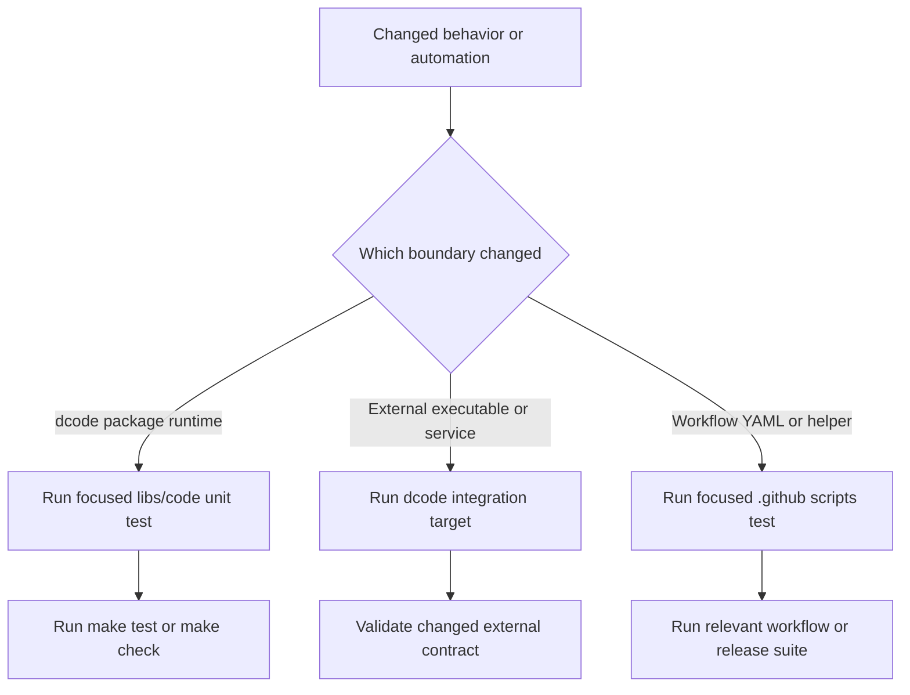
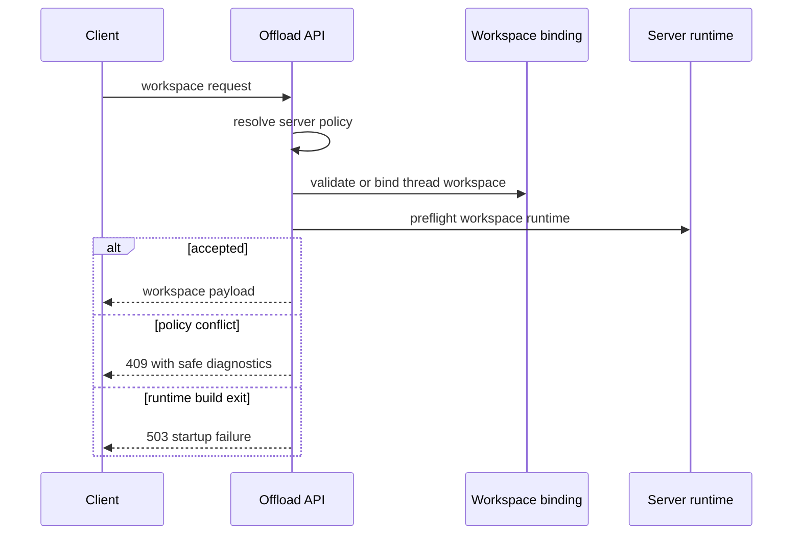

# Testing Guide

Start at the boundary that owns the change. dcode runtime behavior belongs to `libs/code`; GitHub labeling, release-note, and workflow behavior belongs to `.github/scripts/tests`. A workflow test can prove YAML permissions and a helper's request contract, but it cannot validate a dcode graph; conversely, a dcode unit test does not prove the credentials available to a GitHub job.

Use `TEST_FILE` for the first run and the package target for the confidence run. `libs/code` defaults `make test` to `tests/unit_tests/`, with xdist, benchmarks disabled, and non-Unix sockets blocked. Its integration target instead selects `tests/integration_tests/` and applies a 30-second timeout. `make check` adds linting, type/import checks, generated-command verification, lock freshness, and the advisory SDK-pin check.

```bash
cd libs/code
make test TEST_FILE=tests/unit_tests/test_agent.py
make test
make check

# Automation is a separate route from the repository root.
python -m pytest .github/scripts/tests/workflows/test_workflow_secret_scoping.py -v
python -m pytest .github/scripts/tests/release/test_release_notes.py -v
node --test .github/scripts/tests/labeling/topic-classifier.test.js \
  .github/scripts/tests/labeling/semif-topic-classifier.test.js
```



*Package-runtime validation and repository-automation validation remain separate, and each escalates only to its changed boundary.*

## Focused dcode runtime routes

| Change | First focused command | What the route protects |
| --- | --- | --- |
| Agent assembly, approval, local persistence, sandbox prompt/tool policy | `make test TEST_FILE=tests/unit_tests/test_agent.py` | Middleware composition, fail-closed approval decisions, local artifact routing, and sandbox restrictions. |
| Durable server workspace or conflict diagnostics | `make test TEST_FILE=tests/unit_tests/test_workspace.py` | Canonical thread-to-workspace binding, SQLite migration, policy drift, and secret-safe diagnostics. |
| Server graph construction or MCP/read-only criteria selection | `make test TEST_FILE=tests/unit_tests/test_server_graph.py` | Shared runtime bootstrap, event-loop safety, startup failures, and least-privilege context tools. |
| Offload HTTP workspace boundary | `make test TEST_FILE=tests/unit_tests/test_offload_api.py` | Server-owned policy, preflight failure containment, validation-only behavior, and 409 diagnostics. |
| Cost accounting and streamed totals | `make test TEST_FILE=tests/unit_tests/test_cost_tracking.py` | Durable cumulative cost, nested work, pricing completeness, and no double charging. |
| TUI lifecycle, resume, queue, or rendered interaction | `make test TEST_FILE=tests/unit_tests/test_app.py` | Textual-driven startup, resume ordering, input routing, and cancellation/recovery behavior. |
| Installer behavior | `make test TEST_FILE=tests/unit_tests/test_install_script.py` | The shipped Bash installer under isolated tools, environment, terminal, and network seams. |
| Editable dependency floors | `make test TEST_FILE=tests/unit_tests/test_dep_floor_check.py` | Best-effort stale-editable warning/prompt behavior and safe refresh argv construction. |

### Runtime assembly, persistence, sandbox, and TUI

`test_agent.py` is the narrow route for constructing the CLI graph. It uses fake models and patched filesystem/storage seams to assert the runtime contract rather than calling a provider. In particular, it exercises the persistent local conversation-history route, the real filesystem route for offloaded large results, and fallback artifact routing that lets a resumed archive remain addressable after storage changes. It also covers approval interruption: a missing, malformed, or mismatched live approval state fails closed; only an authentic async routing marker bypasses normal approval.

Use the same route when changing sandbox-aware prompt construction, mutation tool availability, shell allowlists, interpreter configuration, or subagent middleware. Those are assembly-time capability boundaries, so test the created graph/tool behavior rather than an implementation helper.

For interactive behavior, prefer `test_app.py` when the contract depends on Textual scheduling, widgets, keyboard input, pending work, server startup, or resume. It verifies that restored history and model adoption occur before initial submission, that failures clear the resuming state, and that cancellation, queueing, and restart paths release the UI to accept later work. Do not replace that with a pure unit test if a framework event loop or rendered state is what can regress.

### Durable workspace and offload boundaries

A workspace binding is server-authoritative state for one thread. The workspace module canonicalizes an existing absolute directory, derives identity and policy fingerprints, and stores the binding in SQLite. Current bindings reject a different workspace or durable-policy drift, but a model-only runtime change does not rebind the workspace. Versioned legacy rows are migrated only when their safety can be established; ambiguous legacy policy is rejected rather than treated as equivalent.

Workspace diagnostics are intentionally a reporting boundary: persisted snapshots are allowlisted and bounded. They can identify safe policy changes, but never retain or report model parameters, prompts, credentials, environment values, or paths. Test persistence/migration in `test_workspace.py`; test client-visible route behavior in `test_offload_api.py`.

The offload workspace endpoint resolves policy on the server, not from a client claim. It can preflight with `validate_only` without changing durable thread state; conflicts return 409 before thread creation, and a graph-build `SystemExit` is contained as a 503 instead of terminating the server. Its ASGI client tests intentionally patch runtime construction and thread clients, so they cover the HTTP/control-flow boundary without a live server.



*The server owns the workspace policy and runtime preflight; the client receives an identity payload or a bounded refusal.*

### Server graph and sandbox capability boundaries

`test_server_graph.py` tests server-mode assembly above individual tools. Repeated or concurrent factory access must share a constructed runtime; configuration bootstrap must not block the server event loop; and a construction failure emits the startup marker before a nonzero exit. It also tests context-tool selection as a security boundary: built-ins are selected by identity and MCP tools require unambiguous read-only annotations, so name lookalikes, unannotated, mutating, and contradictory tools cannot gain criteria access.

Use `test_agent.py` alongside it when a change affects sandbox/interpreter configuration or the CLI-created graph. The package declares sandbox provider integrations as extras, while the normal unit route stays socket-blocked and uses fakes. Move to `make integration_test` only when the changed promise requires an actual executable, sandbox provider, or remote service.

### Cost persistence

Cost is graph-owned rather than client-owned. The cost middleware checkpoints deltas and emits absolute thread totals, while a process-wide recorder collects completed model calls made outside the ordinary agent hook, including offload, summarization, auto classification, and subagents. The middleware drains and prices those records once; subagents checkpoint private spend and transfer their completed delta to the parent. Pricing failure or an unknown model is non-fatal and records incomplete pricing rather than interrupting a turn.

Use `test_cost_tracking.py` for callback-to-checkpoint flow, retry/deduplication, nested transfer, usage-category completeness, local/bundled price overrides, and stream events. The suite isolates the context-local recorder per test. Do not make pricing tests depend on an upstream catalog: the package supports offline bundled data and user overrides, and automatic catalog refresh can be disabled or is suppressed by `DEEPAGENTS_CODE_OFFLINE`.

### Installation and editable dependency floors

`test_install_script.py` executes the actual `scripts/install.sh` through fake `uv`, `curl`, `dcode`, `rg`, and terminal arrangements. It covers interactive and non-interactive prompting, version discovery failure, retries, optional extras, managed ripgrep, receipts, logs, locks, and safe cleanup. This is the correct route for shell quoting or installer-control-flow changes; do not merely parse the script.

`test_dep_floor_check.py` covers a distinct startup safeguard for editable dcode installations. Released installs skip it. For an editable checkout, the check reads the checkout's current dependency declarations, compares installed versions to `>=`, `~=`, and concrete `==` floors, and warns without aborting when a runtime dependency is behind. Its refresh argv anchors `uv` to the checkout and includes only workspace siblings actually installed from matching editable paths, avoiding replacement of optional wheel installs. Headless or unpromptable launches warn and continue; a dismissed mismatch is fingerprinted so it reappears if the violation changes.

## Workflow, labeling, and release-note routes

Run these tests from the repository root. They test committed automation contracts and use mocks, static YAML inspection, or local Node processes rather than a live GitHub mutation.

### Topic labeling

The issue workflow runs in the `labeling` environment and gives issue-write permission to its single job. It applies `priority:backlog` only to newly opened issues that have no existing priority. Topic classification also runs only on open, uses repository label descriptions, and catches model failures as warnings; it does not remove topic labels on later edits.

The default topic classifier sends a bounded, untrusted issue text and the allowed taxonomy to Groq with a JSON response requirement, rejects invalid/length-limited responses, filters output to the allowlist, and retains at most three labels. `TOPIC_CLASSIFIER_PROVIDER` can instead select `semif`; that route batches at most 32 questions, requires validated probabilities, applies a 0.8 threshold, ranks across batches, and adds the LangSmith tenant header only when configured. Both implementations keep their abort timeout active while reading the response body.

Run both Node test files when changing request payloads, provider selection, labels, thresholds, diagnostics, or timeout semantics. Run `test_workflow_secret_scoping.py` when changing environment or secret placement: it asserts that classifier credentials occur only on the topic-label step and that the workflow uses the dedicated environment.

### Release-note workflow boundary

`test_release_notes.py` is a pytest shim and workflow-contract suite. It runs the curated Node tests, verifies that the required check is attached to the validated release PR head, and checks that all release-please components resolve to their changelog and release branch. It also constrains privileged draft/apply jobs: only validated target events reach mutation behavior, untrusted release content is not checked out into the privileged job, short-lived App tokens are used for mutations, and the drafting helper is constrained to a single model-helper invocation rather than arbitrary shell work.

Run it for changes to `release_notes.yml`, `release_notes_check.yml`, `release-please.yml`, the release-note helpers, target/component mapping, or the draft/apply authority boundary. It is not a substitute for package release behavior or a live GitHub test.

## Completion checklist

1. Run the closest dcode test file first; use `make test` after a runtime change.
2. Keep unit tests deterministic: fake models, temporary SQLite/filesystems, ASGI transports, patched clients, and controlled events instead of provider or sandbox calls.
3. Use `test_workspace.py` for durable binding/migration semantics, `test_offload_api.py` for the HTTP boundary, and `test_server_graph.py` for runtime assembly/security selection.
4. Use `test_app.py` when the failure depends on Textual lifecycle or resume ordering, and `test_install_script.py` when the shipped Bash script is the contract.
5. Route workflow, labeling, and release-note changes to `.github/scripts/tests` separately; include secret-scoping checks whenever credential placement changes.
6. Escalate to `make integration_test` only when the external executable, provider, or sandbox integration itself changed.
