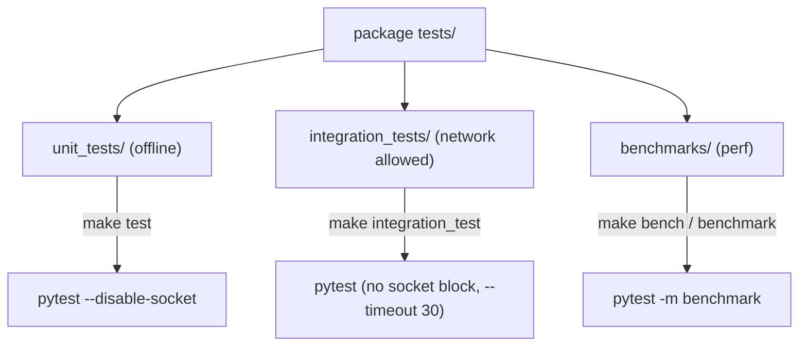

# Testing Guide

This page explains the test layout in the Deep Agents monorepo, how to run tests
per package, and how to add tests without a live model provider. It focuses on
the two core SDK packages that share the same conventions — `libs/deepagents`
(the SDK) and `libs/code` (the prebuilt coding agent) — and complements the
broader [development operations](../operations/development.md) guide and the
[run-evals workflow](../workflows/run-evals.md). For where the code under test
lives, see the [source map](../architecture/source-map.md).

## Where to start reading

Tests are the best executable reference for how the SDK is meant to be used.
`libs/ARCHITECTURE.md` explicitly points readers at `../tests/` for "existing
coverage and usage examples" of agent construction, middleware, backends, and
profiles. When a convention for a new case is unclear, the repository guidance
is to read the nearby existing tests first, and to write tests against real
behavior rather than mocks where practical. Tests also encode the boundary and
invariant checks — for example, `assert_all_deepagent_qualities` asserts that a
constructed agent exposes the `files` state channel and the `ls`, `read_file`,
`write_file`, `edit_file`, and `task` tools, capturing the invariant of what a
"deep agent" always is.

## Test layout

Each package keeps its tests under `tests/`, split into three sibling
directories by cost and network needs:

- `tests/unit_tests/` — fast, offline tests. This is the default target.
- `tests/integration_tests/` — tests that may reach real providers/network.
- `tests/benchmarks/` (deepagents) — performance benchmarks, collected
  separately.

Test files mirror the source layout: tests for `deepagents/middleware/foo.py`
live in `tests/unit_tests/middleware/test_foo.py`.



Caption: The three test directories in a package and the make target that runs
each.

## Running tests

Run these from inside the package directory (for example `libs/deepagents` or
`libs/code`). The package `Makefile` is the source of truth for the exact
invocation.

| Command | What it does |
| --- | --- |
| `make test` | Run unit tests offline (socket disabled) |
| `make test TEST_FILE=tests/unit_tests/test_foo.py` | Run a single test file |
| `make integration_test` | Run integration tests (network allowed) |
| `make coverage` | Run with coverage and emit XML |
| `make benchmark` / `make bench` | Run benchmarks (deepagents/code) |

### Unit tests are offline by design

`make test` runs pytest with `--disable-socket --allow-unix-socket`, so any
attempt to open a real network connection during a unit test fails. This
enforces that unit tests never depend on a live provider. It also passes
`-n auto` for parallelism across workers and `--benchmark-disable` so
benchmark-marked tests do not run in the normal loop. The `deepagents` package
adds coverage output (`--cov=deepagents`) to its default `test` target.

### Integration tests allow network

`make integration_test` overrides `TEST_FILE` to `tests/integration_tests/` and
runs pytest *without* the socket block, adding `--timeout 30`. These tests can
call real providers, so they require credentials — `ANTHROPIC_API_KEY` is
required for the Anthropic-backed tests in both packages, and `LANGSMITH_API_KEY`
optionally enables tracing. Integration tests use `pytest.mark.requires(...)` to
declare the optional integration dependencies a test needs (for example
`@pytest.mark.requires("langchain_anthropic")`), so they are skipped when those
packages are not installed.

### Running one file

Both packages accept `TEST_FILE` to scope a run to a single file or directory:

```bash
make test TEST_FILE=tests/unit_tests/test_middleware.py
```

You can also invoke pytest directly for a one-off:

```bash
uv run --group test pytest tests/unit_tests/test_specific.py
```

## Warnings are errors

Every package puts `"error"` first in its pytest `filterwarnings`, so any warning
the repository has not explicitly accepted fails the run. The entries after
`"error"` form a reviewed allowlist (for example known upstream deprecations from
`langchain_core` and `langsmith.sandbox`). A stray warning fails the specific
test if raised inside it, fails collection if raised at import, or aborts the run
with `INTERNALERROR` if raised while pytest is still configuring. Prefer fixing
the warning over adding an allowlist entry.

## Benchmarks

Three packages carry benchmarks: `libs/deepagents`, `libs/code`, and
`libs/partners/quickjs`. Each defines `bench` (walltime, under CodSpeed
instrumentation) and `bench-memory` (heap) targets, plus a plain `benchmark`
target that runs `pytest -m benchmark` without CodSpeed for faster local tuning.
Benchmarks are collected from the benchmark directory and gated by the
`benchmark`/`memory_benchmark` pytest markers; the default `addopts` excludes
them from ordinary runs (`-m 'not benchmark'`). CI invokes the same Make targets,
so changing how benchmarks run means editing the Makefile.

## Writing tests without a live provider

Because unit tests run offline, they must not call a real model. The repository
ships fake and deterministic chat models and shared helpers for exactly this.

### Shared utilities

`libs/deepagents/tests/utils.py` provides mock tools (`get_weather`,
`get_soccer_scores`, `research_basketball`, and standings tools that emit
oversized output for eviction tests), middleware classes (`ResearchMiddleware`,
`WeatherToolMiddleware`, and variants), and the `assert_all_deepagent_qualities`
assertion helper. Tests import these from `tests.utils`.

The `deepagents` unit-test `conftest.py` supplies shared fixtures, including an
autouse fixture that walks the `deepagents` package for `@deprecated`-wrapped
callables and resets their once-per-process dedupe flag before each test, so
per-call warning assertions stay correct under `pytest -n auto`.

### Fake and deterministic chat models

- `libs/deepagents/tests/unit_tests/chat_model.py` defines a `GenericFakeChatModel`
  usable in sync and async tests, with configurable streaming chunking and
  invocation tracking.
- `libs/code/deepagents_code/_fake_models.py` defines `_ToolBindingFakeModel`, a
  `GenericFakeChatModel` subclass that supplies a no-op `bind_tools` passthrough
  and a minimal capability `profile` (`tool_calling: True`) so it can be compiled
  into an agent graph. It lives in a use-neutral module (not a `_testing_`-prefixed
  name) so a production path — `dcode tools list` tool enumeration — can reuse the
  same base without importing a test-only module.
- `libs/code/deepagents_code/_testing_models.py` builds on that base with
  `DeterministicIntegrationChatModel` and prompt-marker-driven models whose output
  derives solely from the prompt text, so responses stay identical across the CLI
  server process restarts that app integration tests perform.

## Related pages

- [Development operations](../operations/development.md) — full edit-test-lint
  loop, linting, pre-commit, and repo-wide commands.
- [Run evals workflow](../workflows/run-evals.md) — the separate evaluation
  suite, distinct from unit/integration tests.
- [Source map](../architecture/source-map.md) — where the code under test lives.
