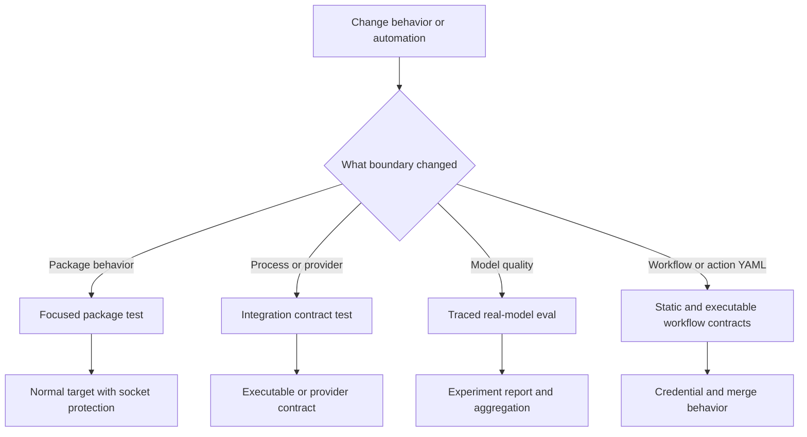
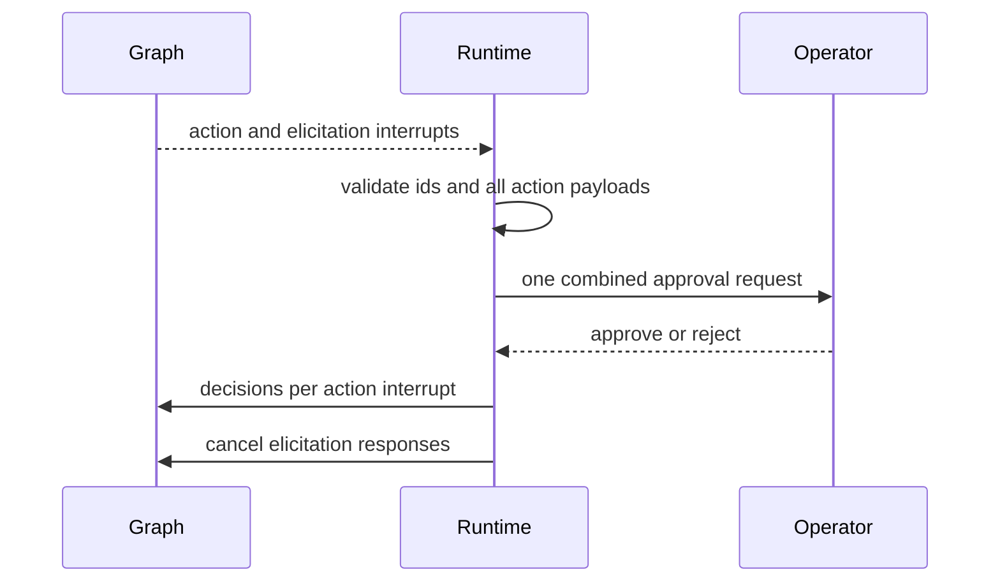
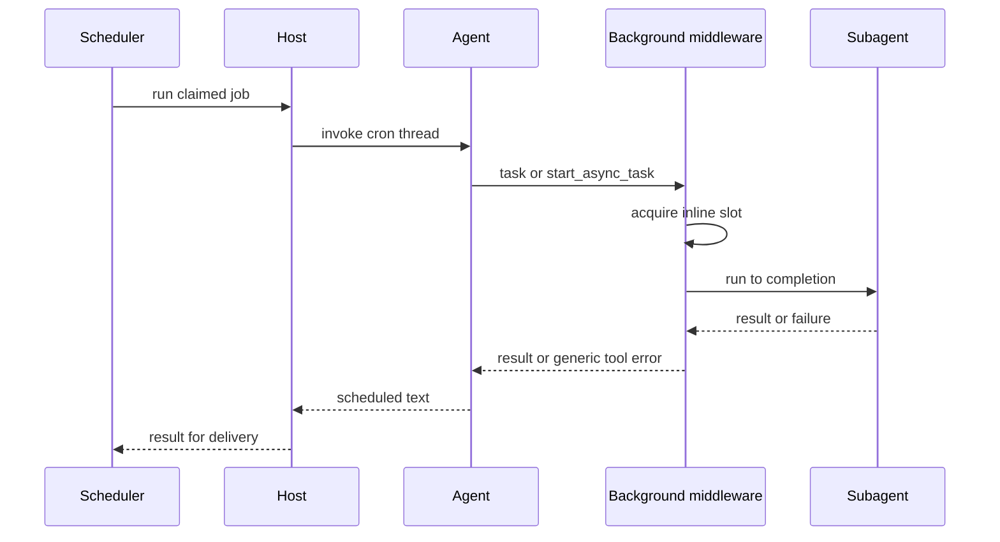
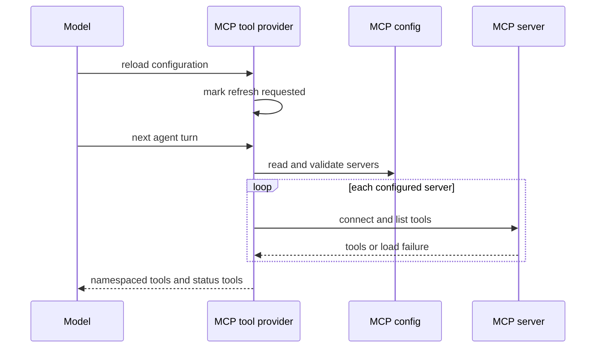
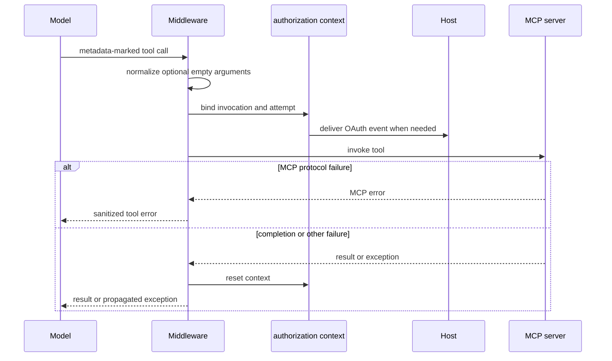

# Testing Guide

Use the package that owns a runtime change for agent and library validation. Treat `.github` automation as a separate system boundary: its tests validate committed workflow/action contracts, credential placement, and shell behavior—not agent-runtime behavior. Packages under `libs/` are independently versioned; install dependencies in the package (normally `uv sync --all-groups`) and use `make help` as the current target reference. See [development operations](../operations/development.md) for setup and aggregate checks.

## Choose the smallest meaningful runtime boundary

| Changed surface | First focused check | Escalate when |
| --- | --- | --- |
| Deep Agents SDK | `cd libs/deepagents && make test TEST_FILE=tests/unit_tests/middleware/test_foo.py` | An optional dependency, provider, or network contract is itself the behavior; use `make integration_test`. |
| dcode CLI | `cd libs/code && make test TEST_FILE=tests/unit_tests/test_agent.py` | Startup, subprocess, ACP transport, sandbox, or provider behavior is the contract; use `make integration_test`. |
| ACP | `cd libs/acp && make test TEST_FILE=tests/test_agent.py` | An external ACP peer, rather than a client double, is required. |
| Talon host | `cd libs/talon && make test TEST_FILE=tests/test_data_lifecycle.py` | Local `tests/integration_tests/` covers orchestration; use a live service only when its adapter boundary changes. |
| Eval harness | `cd libs/evals && make test TEST_FILE=tests/unit_tests/` | The question is real-model quality or behavior; use an eval target. |
| GitHub workflow/action | `python -m pytest .github/scripts/tests/workflows -v` | A workflow YAML, composite action interface, credential scope, or embedded shell behavior changes. |

For SDK code, mirror the source layout: a test for `deepagents/middleware/foo.py` belongs at `tests/unit_tests/middleware/test_foo.py`. Read the nearest test first and assert observable behavior rather than incidental call order.



*The validation route separates package behavior from repository automation, then escalates only to the external boundary that changed.*

## Package suite topology and commands

Deep Agents and dcode default `make test` to `tests/unit_tests/`, run with xdist, disable benchmarks, and block non-Unix sockets. Their `make integration_test` targets select `tests/integration_tests/`, remove the socket block, disable benchmarks, and apply a 30-second timeout. ACP's normal target covers its flat `tests/` tree with a socket block and 10-second timeout. Talon's normal target runs its WhatsApp bridge Node tests before a socket-blocked Python `tests/` tree with the same timeout; that tree includes `tests/integration_tests/`.

```bash
cd libs/deepagents
make test TEST_FILE=tests/unit_tests/middleware/test_foo.py
make integration_test

cd ../code
make test TEST_FILE=tests/unit_tests/test_agent.py
make integration_test

cd ../acp && make test TEST_FILE=tests/test_agent.py
cd ../talon && make test TEST_FILE=tests/test_data_lifecycle.py
cd ../evals && make test TEST_FILE=tests/unit_tests/
```

Pass `TEST_FILE` for an initial narrow run, then run the owning package's normal target. Socket blocking exposes accidental service access; controlled fakes, temporary files, and fixed time still matter.

### Async, warnings, snapshots, and deterministic seams

All five package pytest configurations use `asyncio_mode = "auto"`. dcode additionally configures strict marker/configuration validation, a 30-second default timeout, and function-scoped async fixture loops. Every package puts `"error"` first in pytest `filterwarnings`, making unallowlisted warnings fail the run. Fix actionable warnings rather than broadening filters; use a narrow test-scoped filter only for an intentional exception. `ci:allow-warnings` is a pull-request-only recovery label: the reusable test workflow looks up labels live and fails closed on lookup failure, while push and merge-group runs remain strict.

Deep Agents and dcode provide `update-snapshots` only for their unit smoke-test directories. Use it only when intentionally changing the snapshot contract. Deep Agents fixtures also reset deprecation-warning deduplication and a cached video-dependency probe per test, while bootstrapping built-in profiles once per session. Preserve comparable reset and bootstrap seams when adding process-global state, so order and xdist scheduling cannot affect results.

### Doubles and executable integration contracts

ACP tests use a fake client that records session updates and permission requests. Talon uses a recording channel that captures output and defers injected input until a handler is registered; its integration flows use in-memory channels and scripted agents. These doubles make protocol and lifecycle observations possible without a live channel service.

Use dcode integration coverage when the launched executable is the promise: its ACP smoke test starts `deepagents --acp --no-mcp` as a subprocess, initializes ACP over stdin/stdout, creates a session, and cleans up the process. Talon's normal socket-blocked target also covers `tests/integration_tests/`, retaining its in-memory host-orchestration contract without live channel services.

## Focused SDK filesystem and Talon approval routes

These routes cover behavior that is easy to regress through concurrency, graph replacement, or a channel adapter. Start with the exact owning file, use the package's Makefile rather than a hand-assembled pytest command, then broaden to the normal target. The Deep Agents and Talon targets are offline and socket-blocked; leave these tests deterministic by using fake models, in-memory graph checkpoints, recording channels, and explicit events instead of services or timing sleeps.

```bash
cd libs/deepagents
make test TEST_FILE=tests/unit_tests/test_file_system_tools.py
make test

cd ../talon
make test TEST_FILE=tests/unit_tests/test_tool_approval_batch.py
make test TEST_FILE=tests/unit_tests/test_tool_approval_runtime.py
make test TEST_FILE=tests/test_host.py
make test
```

### Same-path filesystem mutations

`FilesystemMiddleware` checks every synchronous and asynchronous tool call before executing it. In one assistant tool-call batch, `write_file`, `edit_file`, and `delete` are mutations; after path validation and normalization, a mutation whose path matches an earlier mutation is returned as an error `ToolMessage` rather than passed to the backend. Different paths still run, and malformed paths are left for ordinary tool validation. This makes the invariant observable: the first call may change the file, but the later same-path call must not race or overwrite it.

Use `tests/unit_tests/test_file_system_tools.py` for this guard. Its real-agent regression issues two edits for `/multi.txt` and `/./multi.txt`, then asserts the success/error sequence and final file text. Extend it with an end-to-end fake-model turn for a new mutating tool or canonicalization edge case; do not unit-test the helper's loop or call order in isolation. The package target runs unit tests with socket blocking, xdist, and benchmarks disabled.

### Approval batches reject unsafe input before prompting

A Talon invocation runs its graph until it yields interrupts. The runtime partitions resumable interrupts: MCP elicitation interrupts receive cancellation responses, while tool-approval interrupts must have unique nonempty IDs and nonempty sequences of mapping action requests. It validates the complete batch before calling an approval handler. Thus malformed action payloads raise instead of prompting an operator, and duplicate or missing IDs fail as non-resumable state rather than risking an ambiguous resume.

For valid tool interrupts, Talon sends one `ToolApprovalRequest` containing actions from all action interrupts, anchored to the first interrupt ID. One approve or reject decision is then expanded to the decision count required by each interrupt and resumed alongside any elicitation cancellations. Cron and background-delivery requests are unattended and therefore auto-rejected without a prompt.



*The runtime validates the whole interrupt set before one operator decision, then resumes every interrupt with the response shape it requires.*

Use `tests/unit_tests/test_tool_approval_batch.py` for aggregation across parallel graph nodes, mixed elicitation/action batches, unattended auto-denial, malformed action payloads, and invalid IDs. It is the narrow test for the resume protocol. Add `tests/unit_tests/test_tool_approval_runtime.py` when the change depends on a real network-free runtime graph, persisted policy, policy tools, or effects occurring only after approval.

### Invocation snapshots and host-visible approval behavior

At invocation entry, `DeepAgentRuntime` reads the approval snapshot and, if it changed, creates a replacement graph under its tool lock. It binds that selected graph and snapshot in context variables before releasing the lock, then resets all invocation context in `finally`. Consequently, a graph or approval-policy reload can serve later invocations without changing the graph/policy closure of a request already waiting for approval; saved policy edits are visible as inactive to that older turn.

The host is the channel boundary for the approval handler. It renders an approval prompt, accepts textual approve/deny and approval emoji replies, and can match a reaction only when it refers to the recorded prompt message and the original sender. Test the user-visible outcomes—not internal pending-map shape—and cover both approval and rejection plus mismatch cases. The host tests also verify that default reaction logs use stable references rather than prompt IDs, sender IDs, arguments, or raw channel metadata; raw IDs appear only when `DEEPAGENTS_TALON_APPROVAL_LOG_RAW_IDS=true`.

`test_tool_approval_runtime.py` includes the concurrency regression: hold an old invocation at approval, persist a new policy, let a later invocation use it, then release the old one and assert each sees its own snapshot. `tests/test_host.py` is the focused host contract for prompt text/replies, emoji and reaction routing, original-sender and prompt-message scoping, ignored reactions, and redacted observability. Keep the runtime and host suites separate: the former owns graph/approval lifecycle; the latter owns channel interaction and operator-facing safety.

## Focused Talon cron, delegation, and host routes

Run these routes for changes to scheduled work, background delegation, delivery, conversation concurrency, or approval authority. They use fake tools, in-memory cron storage, recording channels, and controlled events; they are deliberately offline and remain in Talon's normal `make test` target.

```bash
cd libs/talon
make test TEST_FILE=tests/unit_tests/test_background.py
make test TEST_FILE=tests/cron/test_scheduler.py
make test TEST_FILE=tests/test_host.py
make test TEST_FILE=tests/unit_tests/test_tool_approval_authorization.py
make test
```

### Cron delegation is inline, bounded, and safe to report

A cron invocation has no interactive turn in which a detached result can later be delivered. `BackgroundSubagents` therefore changes `task` and `start_async_task` calls made during a scheduled turn into inline work: it waits for the result, sets the subagent guard so a child cannot delegate again, does not create a background job, and hides list/cancel tools whose job table is necessarily empty. The scheduled prompt tells the model to use the result in the same turn.

Inline calls share a semaphore created before configured middleware copies, so the four-slot ceiling applies across graphs. Calls beyond the ceiling wait rather than fail; importantly, the timeout begins *after* a slot is acquired. This permits concurrent fan-out while bounding active work. A timeout or other exception becomes a generic error `ToolMessage`, rather than escaping to retry the graph and relaunch sibling calls. The model-visible result never contains invocation arguments; oversized text is truncated before it can grow the reused cron thread without bound.



*For a scheduled run, delegation resolves inside the cron turn rather than creating a later background-delivery obligation.*

`tests/unit_tests/test_background.py` is the focused regression suite. Its scheduled cases prove inline/no-job behavior, concurrent fan-out, semaphore queuing, separate timeout and failure messages, argument redaction, result truncation, remote-stream behavior, the scheduled-only tool prompt, and cleanup of the scheduled context flag. Keep a chat delegation detached: normal chat uses the job table, task ownership/capacity controls, and a worker timeout instead. Background workers inherit scoped context needed by history and cron tools but clear the authorization handler, since an OAuth prompt cannot safely outlive its originating turn.

### Scheduler lifecycle and host serialization

`PersistentCronScheduler.tick_once()` claims each due job by advancing its next run before invoking it, records an `ok` or `error` status, suppresses output with `[SILENT]` at either end, and treats delivery failure as an error after a successful run. It emits structured lifecycle events in the success route—`cron.tick`, `cron.dispatch`, `cron.success`, and `cron.delivery`—and a long-lived ticker logs `cron.tick_failure` then continues scanning after an unexpected tick failure. Since due jobs are run sequentially and claiming happens first, an unbounded run can lose later fires; the host consequently bounds each scheduled agent run and repairs its interrupted graph thread before re-raising a timeout.

The host holds a conversation-root lock for every message turn and for the complete scheduled job run. A new interactive message cancels and recovers the old turn before replacing it; a cancellation that does not finish within its deadline blocks further work on that conversation until restart. Scheduled runs use a job-specific `:talon-cron` thread, so two fires of one job cannot overlap. `start()` starts the agent, channels, then scheduler, and unwinds already-started components in reverse if startup fails; `stop()` cancels work and attempts every component stop even if one fails.

Use `tests/cron/test_scheduler.py` for claim/status/delivery behavior, silence, lifecycle-event sequence, ticker survival, and the fleet-level stalled-job regression. Use `tests/test_host.py` for component lifecycle/unwind, replacement/cancellation/recovery, cron thread serialization and timeout repair. Assert the visible event sequence, stored status, delivered messages, and ability of the next run to proceed—not only that an internal task was created.

### Background delivery is acknowledged only when it reaches the conversation

Interactive delegation creates an owner-scoped in-memory job. The host's background loop polls routes, skips a conversation whose lock or foreground task is busy, and starts a synthetic follow-up turn when results are ready. Delivery retry scheduling backs off exponentially from two seconds up to sixty. A runtime acknowledges the result IDs it injected into a completed model turn, but the host owns the final delivery decision: if a newer generation supersedes the reply, or cancellation wins while it waits to deliver, it requeues exactly those acknowledged IDs. Already delivered results, deliberate suppression, cancelled jobs, and unknown/pruned IDs are not resurrected. Repeated failures to process a result ultimately drop it after three attempts with an explicit diagnostic retained in the job.

`tests/unit_tests/test_background.py` covers owner isolation, cancellation, acknowledgement/requeue scope, cancellation of remote streams, worker error/timeout redaction, retry exhaustion, and inherited-versus-cleared context. `tests/test_host.py` covers dispatcher routing, requeue after supersession or cancellation, and the no-requeue cases. These are coupled contracts: test middleware-only state transitions in the unit suite, then add host coverage whenever changing generations, locks, delivery, or channel dispatch.

### Unattended turns never retain interactive authority

Authority comes from trusted channel exposure and the original sender, not inbound metadata. A normal channel turn receives a tool-approval handler only when the channel configuration identifies its sender as an operator. Cron runs and synthetic background-delivery turns are unattended: the host supplies neither approval nor authorization handler and forces `tool_approval_operator` false, even if route or message metadata attempts to claim authority. This also prevents a completed background result from acquiring the original user's approval or OAuth capability on its later delivery turn.

Use `tests/unit_tests/test_tool_approval_authorization.py` for the exposure-mode matrix, missing trusted configuration, metadata-forgery denial, direct invocation default-deny, and both cron and background-delivery removal of authority. Keep this route focused on the host-to-runtime request boundary; detailed interactive prompt/reaction matching belongs in `tests/test_host.py`.

## Focused Talon MCP, authorization, and research-subagent routes

Talon's ordinary target is the first integration boundary for its MCP behavior: it still runs offline, blocks non-Unix sockets, and executes the WhatsApp bridge tests first. Run the exact file first, then broaden to `make test`; do not turn these tests into calls to an MCP server or OAuth provider. Their fakes deliberately expose the boundary while retaining deterministic control of configuration, transports, callbacks, time, and cancellation.

```bash
cd libs/talon
make test TEST_FILE=tests/test_mcp.py
make test TEST_FILE=tests/test_mcp_auth.py
make test TEST_FILE=tests/test_mcp_middleware.py
make test TEST_FILE=tests/unit_tests/test_research_subagents.py
make test
```

### MCP loading and managed refresh

`MCPToolProvider` owns the load/refresh lifecycle. It resolves the normal `~/.deepagents/.mcp.json` path or `DEEPAGENTS_TALON_MCP_CONFIG`, loads each configured server independently, namespaces loaded tool names with the server name, marks them as Talon MCP tools, and preserves a per-server status rather than failing the complete inventory because one server cannot load. Its status model disallows incoherent combinations: only an `ok` server can carry tools, every non-`ok` server needs an error, and a pending reconnect is only valid for a disabled server. OAuth-capable configurations add status and narrowly scoped authentication management tools; the provider rejects a name collision with those management tools.

A reload tool only schedules a refresh; the next refresh serializes through a lock and applies the revision it observed. A concurrent caller therefore sees no duplicate reload, a request raised during a load remains pending for a subsequent pass, cancellation remains retryable, and a failed load records the attempted revision rather than retrying indefinitely. Test the observable result (new tool list or error/state), not private revision counters.



*The provider defers an operator-requested configuration change until a serialized load before the next agent turn, while retaining per-server failure status.*

`tests/test_mcp.py` is the focused contract suite for this lifecycle. Its fake adapter records the selected client transport so configuration can be tested without a server; it checks path override behavior, transport selection, metadata/status invariants, tool naming/arguments, scheduled reloads, concurrent refresh serialization, refresh requests arriving during load, cancellation, and failure semantics. Extend this suite for config, loading, filtering, reload, or status changes. Escalate to a live endpoint only when compatibility with that external implementation—not Talon's loading contract—is the change under test.

### OAuth and invocation containment

MCP credentials are persisted per server name and endpoint digest below `.deepagents/mcp-tokens`; the token directory is owner-only, writes are lock-protected and atomically replaced, and a refresh response that omits a refresh token preserves the existing one. Authentication events carry a binding for the server and tool invocation, while sensitive URLs and device codes are excluded from their representations. The authorization context is task-local and must be reset after every invocation.

The normal MCP middleware acts only on tools carrying Talon's MCP metadata. It removes empty optional string arguments while retaining required empty strings and explicitly non-string values, binds the tool-call identifier around the handler, and converts an `MCPError` into a model-visible error message without error data. Other exceptions propagate, so they remain diagnosable by the runtime rather than being incorrectly represented as protocol errors.



*Only marked remote tools acquire authorization context; protocol error data never crosses into the model message.*

Use `tests/test_mcp_auth.py` for storage permissions, expiry/restart refresh behavior, callback validation, device flow, and safe mocked HTTP discovery. Its `oauth_network` fixture replaces DNS and both HTTP client transports, allowing the tests to inspect requests without contacting a provider. Keep tests that depend on a real issuer or account out of this unit route. Use `tests/test_mcp_middleware.py` when changing argument normalization, context binding/cleanup, or the sanitized-protocol-error boundary.

### Research subagent capability boundaries

Talon local subagents are fresh task-only graphs, not forks of the parent context. Their configured tools are explicit attachments; they do not inherit parent history, memory, skills, shell access, delegation tools, or an implicit general-purpose role. A parent can add unique catalog tools to a *named* local agent for one task, but cannot select delegation tools or unknown/duplicate names. The fresh graph retains Talon's MCP middleware and any applicable approval policy, so an attached remote MCP tool receives the same argument normalization, authorization binding, and protocol-error redaction as a main-agent invocation.

`tests/unit_tests/test_research_subagents.py` validates this at a real graph boundary with fake chat models, temporary agent frontmatter, and recording tools. It exercises foreground and background dispatch, proves that private parent memory is absent, checks that only attached tools run, and verifies explicit shell access. It also covers invalid tool selections, protected added tools, reload behavior that retains the effective graph after invalid edits, and both direct and dynamically selected MCP attachments. When changing agent frontmatter, capability selection, fresh-context construction, approval behavior, or subagent reload, start there; use a host/channel flow only if channel orchestration itself changed.

## Focused dcode debug, media, and Textual rendering routes

These dcode tests are unit routes, even where they mount a real Textual test application: the boundary is dcode's formatting, state, and widget lifecycle, not a terminal emulator, model provider, or live media service.

```bash
cd libs/code
make test TEST_FILE=tests/unit_tests/test_debug.py
make test TEST_FILE=tests/unit_tests/test_media_utils.py
make test TEST_FILE=tests/unit_tests/tui/widgets/test_messages.py
make test
```

### Debug logging is a secure per-thread observable

With `DEEPAGENTS_CODE_DEBUG` enabled, configured loggers route to a thread-named file under `DEEPAGENTS_CODE_DEBUG_DIRECTORY` (with legacy file configuration resolving to its parent directory). The implementation removes stale tagged handlers when the active thread changes but does not treat unrelated file handlers as its own. It uses traversal-safe names, owner-only directories and files, refuses symlinks on POSIX, and disables file logging with a visible warning if hardening fails; this matters because captured MCP stderr can contain credentials. `installed_debug_log_path()` reports an actually attached tagged handler rather than merely trusting an environment value.

`test_debug.py` checks matching file/buffer formatting, secure modes or Windows ACL behavior, symlink refusal, unsafe thread identifiers, idempotent reconfiguration, handler rotation/removal on failure, and the distinction between a foreign handler and an installed debug handler. Add a focused test there for any logging configuration or confidentiality regression; do not assert a default path merely because an environment variable is set.

### Media placeholders retain user-authored text

Media attachment placeholders are display tokens, not model text. The media tests track the exact span of each attached image or video placeholder across edits and submit-time transformations, then construct multimodal blocks after removing only that bound occurrence. This preserves literal look-alike placeholders typed by the user, including duplicates before or after the display token, while keeping image/video attachment blocks and surrounding prompt text intact. The focused suite also covers extension classification and image/video encoding paths. Extend `test_media_utils.py` for draft synchronization, attachment serialization, or placeholder-removal changes; provider-specific acceptance of multimodal payloads is an integration concern.

### Textual tests use runtime rendering for visual contracts

Message-widget tests first cover markup-safe construction, but use `App.run_test()` and a `Pilot` for contracts dependent on Textual rendering: selectable markdown resolves to `Content`; hover gives a hand cursor over a rendered link, a text cursor only over rendered cells, and the default cursor over blank layout cells. Streamed assistant text writes its first fragment immediately, batches later fragments on a timer, drains/cancels on stop or replacement, and retains buffered text when a timed write fails so the timer cannot crash the application. The same suite protects credential display by hiding `.env` diff bodies.

Use direct widget construction for pure formatting or escaping. Use the Textual harness when a behavior depends on layout, input routing, timers, selection, or Rich/Textual metadata; it is the narrowest test that can catch a framework upgrade changing the rendered contract.

## Performance and real-model coverage

Benchmarks are performance coverage, not ordinary correctness tests. Deep Agents keeps them in `tests/benchmarks/`, while dcode selects benchmark markers from `tests`; normal test targets disable them. Both provide:

```bash
make benchmark      # pytest benchmark marker
make bench          # benchmark marker under CodSpeed
make bench-memory   # memory_benchmark marker under CodSpeed
```

From `libs/`, `make bench-all` runs CodSpeed benchmarks for Deep Agents and dcode only.

`libs/evals` keeps its ordinary socket-blocked command on `tests/unit_tests`. Live `tests/evals` require tracing and an explicit model, and are exposed through `deepagents-evals` and Makefile eval targets.

```bash
cd libs/evals
export LANGSMITH_TRACING=true
export LANGSMITH_API_KEY=...
export DEEPAGENTS_EVALS_MODEL=<model-id>

deepagents-evals list categories
deepagents-evals run
deepagents-evals trials --trials 3
make evals MODEL=<model-id>
make evals-trials MODEL=<model-id> TRIALS=3
```

Category/tier filters validate requested values against collected marks, with exclusions taking precedence. The reporter records outcomes, category results, failures, experiment links, durations, and efficiency data. It can rewrite an individual session exit status to zero after reports are recorded, so repeated trials and aggregation must treat a nonzero `counts.failed.mean` in the CLI summary as failure.

Harbor targets are external sandbox-runtime experiments rather than pytest integration tests. They stage checked-out Deep Agents, dcode, ACP, and QuickJS sources before selected runtime runs; the Harbor LangGraph agent removes provider and LangSmith credentials during shell operations. See [running evals](../workflows/run-evals.md).

## Repository automation contracts

`.github/scripts/tests/` mirrors helper-script domains; `conftest.py` adds the domain directories and the scripts directory to `sys.path` so helpers can be imported without a `.github` package. `scripts/tests/workflows/` is deliberately the home for contracts over workflow/action YAML—job graphs, option matrices, secret scopes, and root `action.yml`—rather than a production workflow-script tree. CI runs the complete helper-script suite with Python 3.11 after installing `packaging`, `pyyaml`, and `pytest`:

```bash
python -m pytest .github/scripts/tests -v
```

For a small automation edit, run the affected file(s) first, then the full command above. The YAML/static tests are appropriate for declarative invariants: for example, the OpenWiki credential test checks read-only workflow permissions, the `openwiki` environment, checkout without persisted credentials, delayed App-token creation, its repository-limited write permissions, and token injection only into PR mutation steps. It also guards package-scoped integration credential expressions and GitHub App token inputs in other workflows.

The root-action tests combine static interface drift checks with controlled execution of the actual `Run dcode` shell body from `action.yml`. They compare declared input mappings with the dcode parser and run selected portions with `uvx` and `timeout` stubs, covering validation and command construction without launching dcode. That is action-wrapper coverage, not a substitute for dcode unit or integration testing.

### OpenWiki merge harness and observable failure boundaries

After changing `.github/workflows/openwiki-update.yml`, run:

```bash
python -m pytest .github/scripts/tests/workflows/test_workflow_secret_scoping.py -v
python -m pytest .github/scripts/tests/workflows/test_openwiki_workflow.py -v
```

The merge harness parses the workflow YAML, extracts the real **Merge OpenWiki update pull request** `run:` block, and executes it with POSIX Bash. It stubs `gh` and `sleep` on `PATH`, but symlinks the installed real `jq`; recorded calls and scenario responses let the test observe API and wait behavior without a GitHub request. It is skipped on Windows or when Bash or `jq` is unavailable. Install `jq` and run the command in a POSIX environment when validating this behavior locally.

The tests intentionally assert externally observable safety boundaries rather than restating shell structure:

- malformed merge inputs, changed PR identity or SHA, a closed PR, or an unmergeable PR stop before an unsafe merge; a head change after a retry also prevents the next merge;
- a SHA-pinned squash merge succeeds only when the API response confirms `merged == true`;
- only HTTP `405`—merge requirements not yet satisfied—causes a 15-second retry, with at most 60 merge attempts and no final unnecessary sleep;
- authentication, authorization, conflict, server, transport, malformed-response, and other HTTP failures are terminal rather than retried.

These tests validate repository automation contracts and fail-closed merge behavior. They do not test model behavior, package runtime behavior, or a live GitHub service. For lifecycle, operations, and recovery, see the [OpenWiki automation runbook](../operations/openwiki-automation.md); for the security boundary, see [security operations](../operations/security.md).

## CI, fan-out, and release checks

CI path filters include editable SDK consumers: an SDK change runs Deep Agents, dcode, Talon, evals, ACP, and partner package jobs; a dcode change also runs Talon. Matching jobs run on pull requests, and pushes to `main` run the full set. The reusable matrix runs Deep Agents and ACP on Python 3.11–3.14 (plus Deep Agents on Windows 3.13), dcode and Talon on 3.12–3.14, and evals on 3.12–3.13.

For dependency or lockfile work, run:

```bash
make -C libs lock-check
make -C libs lint
```

Release-sensitive Linux SDK runs require usable `rg`; `ci:skip-ripgrep` can tolerate an install failure only on a pull request, while push and merge-group runs are strict. For a dcode change needing new SDK behavior, update its exact `deepagents==` pin in `libs/code/pyproject.toml` in the same PR. An intentional dcode release with an older pin requires `ci:dcode-skip-sdk-pin`.

## Focused validation checklist

1. Classify the change as package behavior, external integration, evaluation/performance, or repository automation.
2. Run the closest focused test, then its owning package target or the full helper-script suite.
3. Keep deterministic tests offline with resettable state and recording doubles.
4. Escalate only for the boundary at issue: executable/provider integration, real-model evaluation, Harbor runtime, benchmark, or real workflow shell contract.
5. For workflow changes, review the YAML authority boundary and run static credential-scope and relevant executable shell contracts; ensure Bash and `jq` are available for the OpenWiki merge harness.
6. For SDK, dcode, dependency, or release work, validate affected consumer fan-out and the dcode SDK pin where applicable.
