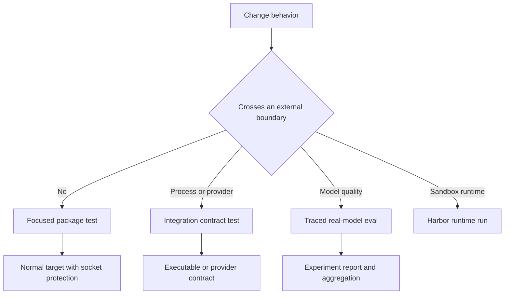

# Testing Strategy and Local Test Guide

Work in the package that owns the changed behavior. Packages under `libs/` are independently versioned, each with its own environment, `pyproject.toml`, and `Makefile`; install dependencies explicitly (normally `uv sync --all-groups`) and use `make help` as the command source of truth. Editable local dependencies mean a producer change is visible to its consumers during development. Repository setup is covered in [development operations](../operations/development.md).

## Choose the smallest meaningful boundary

| Changed surface | First focused check | Escalate when |
| --- | --- | --- |
| Deep Agents SDK | `cd libs/deepagents && make test TEST_FILE=tests/unit_tests/middleware/test_foo.py` | The behavior needs an optional dependency, provider, or network contract; use `make integration_test`. |
| dcode CLI | `cd libs/code && make test TEST_FILE=tests/unit_tests/test_agent.py` | Executable startup, a subprocess, ACP transport, sandbox, or provider behavior is the contract; use `make integration_test`. |
| ACP | `cd libs/acp && make test TEST_FILE=tests/test_agent.py` | An external ACP peer, rather than protocol behavior exercised with a client double, is required. |
| Talon host | `cd libs/talon && make test TEST_FILE=tests/test_data_lifecycle.py` | Local `tests/integration_tests/` flows cover host orchestration; use a live service only when the adapter/service boundary itself is changing. |
| Eval harness | `cd libs/evals && make test TEST_FILE=tests/unit_tests/` | The question is real-model quality or behavior; run `tests/evals` through an eval target. |

For SDK code, mirror the source layout: a test for `deepagents/middleware/foo.py` belongs at `tests/unit_tests/middleware/test_foo.py`. Start by reading the closest test and assert observable behavior, rather than incidental call order.



This decision path separates deterministic correctness coverage from process/provider contracts, stochastic evaluation, and sandbox-runtime experiments.

## Local suite topology and commands

Deep Agents and dcode default `make test` to `tests/unit_tests/`, run with xdist, disable benchmarks, and block non-Unix sockets. Their `make integration_test` targets select `tests/integration_tests/`, remove the socket block, disable benchmarks, and apply a 30-second timeout. ACP's normal target covers its flat `tests/` tree with a socket block and 10-second timeout. Talon's normal target first runs Node tests for its WhatsApp bridge, then its socket-blocked Python `tests/` tree with the same timeout; that tree includes `tests/integration_tests/`.

```bash
cd libs/deepagents
make test TEST_FILE=tests/unit_tests/middleware/test_foo.py
make integration_test

cd ../code
make test TEST_FILE=tests/unit_tests/test_agent.py
make integration_test

cd ../acp && make test TEST_FILE=tests/test_agent.py
cd ../talon && make test TEST_FILE=tests/test_data_lifecycle.py
cd ../evals && make test TEST_FILE=tests/unit_tests/
```

Pass `TEST_FILE` for the initial narrow run, then run the owning package's normal target. Socket blocking exposes accidental service access, but tests still need controlled fakes, temporary files, and fixed time where relevant.

### Async, warnings, and snapshot discipline

All five package pytest configurations use `asyncio_mode = "auto"`, so an async test does not need `@pytest.mark.asyncio` merely to execute. dcode additionally has strict marker/configuration validation, a 30-second default timeout, and function-scoped async fixture loops. Deep Agents and dcode have `update-snapshots` targets restricted to their unit smoke-test directories; use those deliberately when the intended snapshot contract changes.

Every package puts `"error"` first in pytest `filterwarnings`; later entries are reviewed exceptions. An unexpected warning therefore fails a test, can fail collection when raised on import, or can abort pytest configuration. Fix actionable warnings before adding an exception, and use a narrowly scoped `@pytest.mark.filterwarnings` where appropriate.

In CI, `ci:allow-warnings` is a pull-request-only escape hatch that passes `-W default`. The reusable test workflow reads labels live, fails closed if it cannot obtain them, and always enforces warnings-as-errors on push and merge-group runs. It is temporary triage, not evidence that a warning is acceptable.

### Deterministic seams and contract smoke tests

Deep Agents unit fixtures reset deprecation-warning deduplication and the cached video-dependency probe before each test, and load built-in profiles once per session. Preserve equivalent reset/bootstrap seams whenever adding process-global caches or lazy registries, so xdist scheduling and test order cannot alter observations.

ACP's `FakeACPClient` records session updates and permission requests. Talon's `RecordingChannel` records output and lifecycle activity and refuses injected input until a handler is registered. Together with Talon's in-memory channel and scripted-agent integration doubles, these seams test protocol, routing, and lifecycle behavior without a live channel service.

Use dcode's integration tree when the separately launched executable is part of the promise. Its ACP smoke test launches `deepagents --acp --no-mcp` over stdin/stdout, initializes ACP, creates a session, and terminates the child during cleanup. That checks a boundary an in-process unit test cannot establish.

## Benchmarks are separate performance coverage

Deep Agents stores benchmarks in `tests/benchmarks/`; dcode selects benchmark-marked tests from `tests`. Both disable them in ordinary test targets and expose dedicated targets:

```bash
make benchmark      # pytest benchmark marker
make bench          # benchmark marker under CodSpeed
make bench-memory   # memory_benchmark marker under CodSpeed
```

Do not make a performance measurement an ordinary correctness test. From `libs/`, `make bench-all` runs `bench` for Deep Agents and dcode. QuickJS also has benchmark targets but is intentionally outside that fan-out.

## Real-model evals and Harbor

`libs/evals` keeps its normal socket-blocked test command on `tests/unit_tests`. Real-model evals reside in `tests/evals`: they require LangSmith tracing enabled and an explicit `--model`. The Makefile checks that `MODEL` is supplied; it sets `LANGSMITH_TEST_SUITE=deepagents-evals` for a single run. The `deepagents-evals` CLI is the discoverable interface for a one-off run, trials, aggregation, charts, catalog/model-group maintenance, and discovery. `run` and `trials` may take their model from `--model` or `DEEPAGENTS_EVALS_MODEL`.

```bash
cd libs/evals
export LANGSMITH_TRACING=true
export LANGSMITH_API_KEY=...
export DEEPAGENTS_EVALS_MODEL=<model-id>

deepagents-evals list categories
deepagents-evals run
deepagents-evals trials --trials 3

make evals MODEL=<model-id>
make evals-trials MODEL=<model-id> TRIALS=3
```

Category and tier selectors validate requested values against marks on the collected tests; category exclusions override inclusions. The reporter records totals, category results, failures, duration and efficiency metrics, plus LangSmith experiment links. It intentionally rewrites an otherwise ordinary test-failure session exit status to zero after at least one test call so reporting/aggregation can proceed. Consequently, use the CLI summary for trials or aggregation: a nonzero `counts.failed.mean` is failure.

Harbor targets are runtime-host experiments, not pytest integration tests. `stage-harbor-local-deps` stages the checked-out SDK, dcode, ACP, and QuickJS sources before selected Docker, Modal, Daytona, Runloop, or LangSmith sandbox runs. The Harbor LangGraph agent temporarily removes provider and LangSmith credentials while executing shell operations; retain that boundary when modifying the agent-to-sandbox handoff. For operations, see [running evals](../workflows/run-evals.md).

## CI matrix, strict ripgrep coverage, and release validation

CI uses package path filters plus editable-dependency fan-out. An SDK change runs Deep Agents, dcode, Talon, evals, ACP, and partner package jobs; a dcode change runs Talon. Package filters also include test/lint workflow and action paths. Pull requests run matching jobs, while pushes to `main` run every package job. The reusable unit matrix is: Deep Agents and ACP on Python 3.11–3.14, plus Deep Agents on Windows 3.13; dcode and Talon on 3.12–3.14; evals on 3.12–3.13.

Release-sensitive Linux SDK runs install ripgrep strictly and set `DEEPAGENTS_RIPGREP_EXPECTED=1` only if `rg` is usable, so ripgrep-gated filesystem tests fail rather than silently skip on a runner that promised ripgrep. A release PR may use `ci:skip-ripgrep` only to tolerate an install failure; push and merge-group runs remain strict. Ordinary non-release PR installs are bounded at two minutes: a timeout can continue without ripgrep after recovery and records an artifact, but other apt failures fail the job.

For dependency or lockfile changes, use repository fan-out checks:

```bash
make -C libs lock-check
make -C libs lint
```

Before a release-sensitive dcode change that needs SDK functionality, update the exact `deepagents==` pin in `libs/code/pyproject.toml` in the same PR. The pin expresses dcode's minimum required SDK version; an intentional release with an older pin requires the `ci:dcode-skip-sdk-pin` label. See [development operations](../operations/development.md) for the broader contribution loop.

## Focused validation checklist

1. Identify the observable behavior and nearest test; run it with `TEST_FILE`.
2. Run the owning package's normal target, retaining socket protection for deterministic coverage.
3. Reset global state and use recording doubles for protocol/lifecycle assertions.
4. Escalate only for a genuine boundary: integration for executable/provider contracts, evals for real-model quality, Harbor for sandbox-host behavior, and benchmarks for performance.
5. For SDK, dcode, workflow, dependency, or release work, validate affected consumers and CI fan-out; check the dcode SDK pin when applicable.
6. Fix warnings rather than broadening filters, and treat CI bypass labels as temporary recovery mechanisms.
