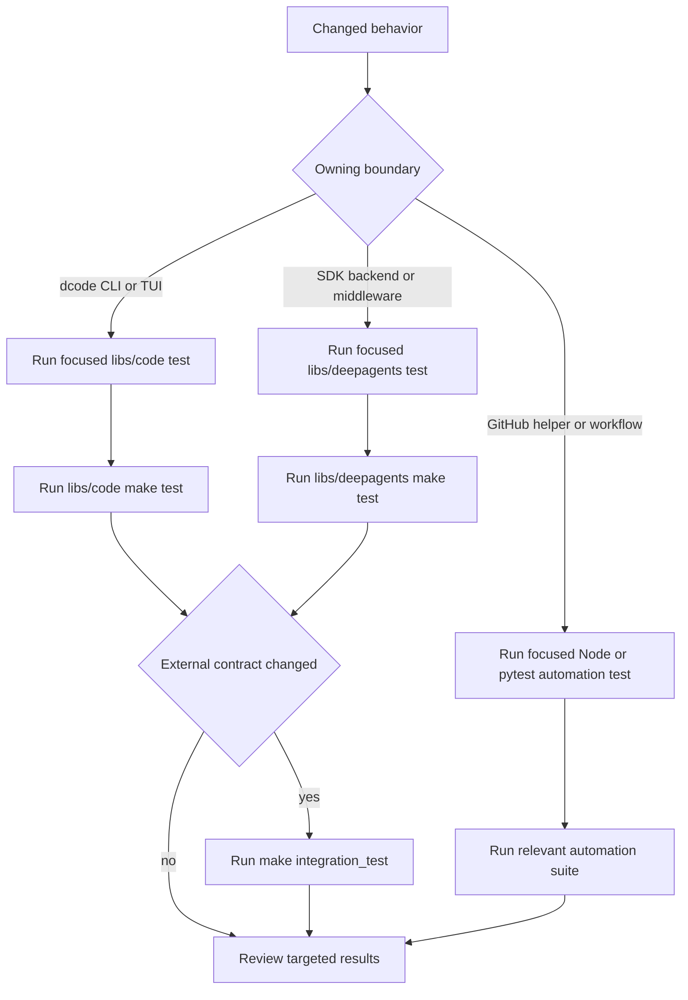
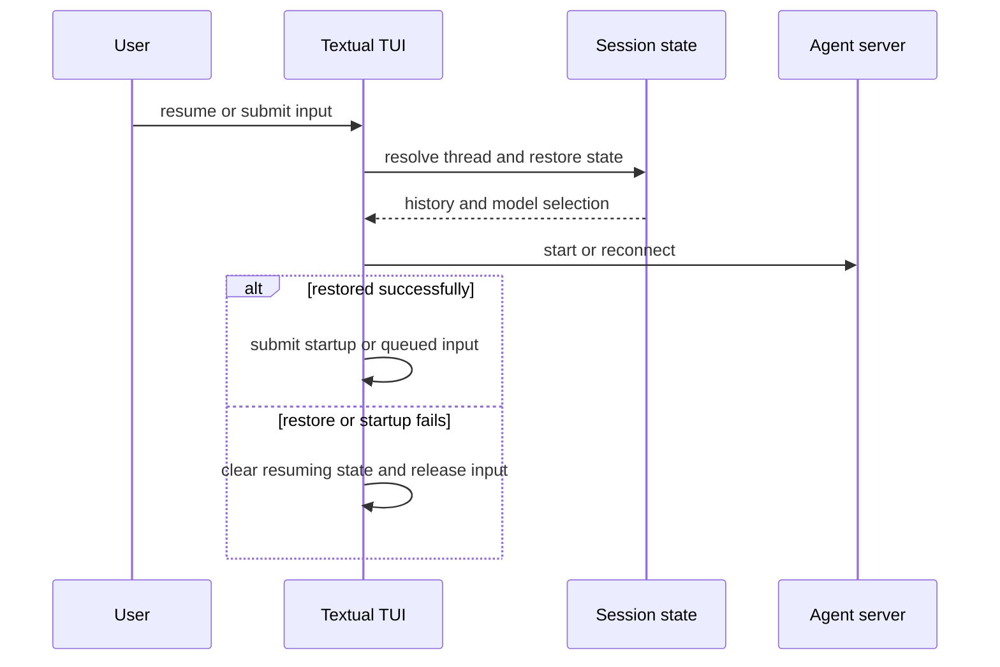

# Testing Guide

Test at the owning boundary first, then run the corresponding package suite. `libs/code` owns the dcode CLI, session state, retry policy, and Textual UI. `libs/deepagents` owns SDK backends and middleware. `.github/scripts/tests` owns committed automation contracts. These are deliberately separate: a mocked backend test does not prove dcode UI lifecycle, and a workflow/YAML test does not validate package runtime behavior.



*Focused tests establish the changed contract; package and integration runs provide progressively broader confidence.*

## Commands and escalation

From `libs/code`, `make test` runs `tests/unit_tests/` with xdist, benchmarks disabled, and network sockets disabled except Unix sockets. `make integration_test` switches to `tests/integration_tests/`, permits the external interaction implied by that route, and applies a 30-second timeout. `make check` layers lint, type and import checks, command-catalog verification, extras/version/lock checks, and an advisory SDK-pin check over unit tests.

```bash
cd libs/code
make test TEST_FILE=tests/unit_tests/test_model_retry.py
make test
make check
make integration_test
```

The SDK package uses the same focused-test pattern from `libs/deepagents`; its unit target also uses xdist, disables sockets other than Unix sockets, and disables benchmarks. Use the integration target only when the changed promise needs a real provider, executable, or service—not merely because a unit test uses async code.

```bash
cd libs/deepagents
make test TEST_FILE=tests/unit_tests/backends/test_sandbox_backend.py
make test TEST_FILE=tests/unit_tests/test_middleware.py
make test
make integration_test
```

## dcode: choose the behavioral seam

| Changed contract | First command | Deterministic seam to preserve |
| --- | --- | --- |
| Approval, graph composition, local artifacts, or shell/tool policy | `make test TEST_FILE=tests/unit_tests/test_agent.py` | Constructed graph and capability behavior with fakes and local seams. |
| Autonomous classifier decisions and approval routing | `make test TEST_FILE=tests/unit_tests/test_auto_mode.py` | Fake structured models, stores, events, and temporary paths. |
| Model error classification, backoff, retry events, or streaming | `make test TEST_FILE=tests/unit_tests/test_model_retry.py` | Controlled errors, clocks, and no-op sleeps. |
| Thread listing, metadata, deletion, or conversation archive cleanup | `make test TEST_FILE=tests/unit_tests/test_sessions.py` | Temporary SQLite checkpoints and filesystem archives. |
| Textual startup, resume, queue, cancellation, restart, or teardown | `make test TEST_FILE=tests/unit_tests/test_app.py` | Textual async lifecycle and rendered-state behavior. |

### Auto mode and retries

`test_auto_mode.py` is the security-sensitive route for classifier-backed approval. It checks deterministic allowances separately from classifier decisions, verifies that writes outside the permitted workspace or through symlink escape cannot obtain an accidental bypass, and exercises unavailable, timed-out, malformed, and context-overflow classifier paths. Keep these tests provider-free: inject structured fake models and in-memory or temporary stores, then assert the resulting approval plan, event, and fallback behavior.

`test_model_retry.py` is the narrow route for model-node retry changes. It distinguishes transient transport/service failures from authentication, permission, invalid-request, and context-overflow failures; graph interrupts must propagate as graph control flow, not be reported as retryable or non-transient model errors. It also protects retry/attempt status events and streaming behavior, including avoiding orphaned output from a failed streaming attempt. Patch sleep and use controlled exception/model doubles so retry timing never makes the unit suite flaky.

### Sessions and Textual lifecycle

`test_sessions.py` tests the durable checkpoint boundary directly with temporary SQLite. It keeps legacy short IDs and newer generated IDs discoverable together, takes current `cwd` and update metadata from the newest checkpoint, and treats checkpoint deletion as authoritative even when offloaded-history cleanup fails. Run it whenever checkpoint queries, metadata ordering, thread deletion, or archive location changes.

`test_app.py` is not interchangeable with a helper-only test: it drives the application’s async state and widgets. For resume changes, protect the ordering invariant that restored history—and any adopted model—settles before startup submission; failures must clear the resuming state rather than strand the UI. For queue, cancellation, restart, and shutdown changes, test the user-visible release of a turn/queue and the correct teardown ordering under Textual scheduling.



*The TUI tests protect lifecycle ordering and recovery, rather than only the data returned by a session helper.*

## Deep Agents SDK: backend and middleware contracts

Use `test_sandbox_backend.py` for `BaseSandbox` file and command behavior. Its `MockSandbox` is a concrete in-process transport seam: reads and small edits execute server-side commands; writes upload files; oversized edits upload temporary old/new payloads and perform a server-side replacement. The suite checks parsing and propagation of backend/child failures, pagination and binary reads, preflight errors, cleanup, traversal-safe command construction, and sync/async parity. Prefer this test to a live sandbox whenever a change is in the shared backend protocol or command template.

Use `test_middleware.py` when changing filesystem tools, tool descriptions, result shaping, message eviction, or subagent composition. It builds agents with `StateBackend`, `StoreBackend`, `CompositeBackend`, and a small sandbox-capable backend, then invokes tools against in-memory state. The suite establishes that filesystem middleware installs its file tools and stream channel, subagent middleware installs `task`, and composition preserves both sets. It also exercises read/list/search/edit behavior and result limits without requiring a filesystem service.

## Automation: labeling and release notes

Run automation tests from the repository root. They use local Node processes, mocked `fetch`, temporary workspaces, and static workflow inspection; they do not perform GitHub mutations.

```bash
node --test .github/scripts/tests/labeling/semif-topic-classifier.test.js
node --test .github/scripts/tests/release/release-notes.test.js \
  .github/scripts/tests/release/draft-release-notes.test.js
python -m pytest .github/scripts/tests/release/test_release_notes.py -v
python -m pytest .github/scripts/tests/workflows/test_workflow_secret_scoping.py -v
```

### Topic labeling

Run `semif-topic-classifier.test.js` for a change to the Semif request, response validation, ranking, labels, threshold, headers, batching, or timeout. It verifies that only allowed labels are submitted and returned, each label receives only its own description, scores must be valid probabilities, the 0.8 threshold is inclusive, and at most three distinct labels are returned in score order. It also protects the 32-question batch cap and the abort signal through response-body parsing. The default classifier follows a separate Groq contract; provider selection and its JSON allowlist belong to `topic-classifier.js`, so run its Node suite alongside Semif when shared routing or taxonomy behavior changes.

The issue labeling workflow confines topic-classifier credentials to the opened-issue topic-label step in the dedicated labeling environment; the classifier routes to Groq by default or Semif when configured, bounds untrusted input, filters labels to the allowlist, and fails as a warning at the workflow boundary.

### Release notes

`release-notes.test.js` is the behavioral suite for release PR recognition, exact version-section extraction/replacement, command parsing, instruction sanitization, bot identity checks, fingerprints, override comments, and apply/draft flows. Its mocked GitHub client and temporary changelog distinguish stale or forged state from a valid release branch without writing a repository. Use it for helper changes; use `test_release_notes.py` as the pytest entrypoint and workflow-contract suite when workflow YAML, permissions, required checks, component mapping, or privileged job structure changes.

Release-note tests run the curated Node suites and assert that required checks target the validated PR head, every release-please component has a target, and privileged draft/apply workflow paths remain gated, token-scoped, and free of untrusted checkout or arbitrary shell operations.

## Completion checklist

1. Run the smallest owned test file first, using fakes, temporary SQLite/filesystems, controlled events, and mock transports rather than live infrastructure.
2. Run `make test` in the changed package after a focused test passes; run `make check` for a dcode change intended for review.
3. Test dcode lifecycle through `test_app.py`, persistent thread behavior through `test_sessions.py`, and retry policy through `test_model_retry.py`; do not collapse them into generic graph tests.
4. Test SDK protocol and command-template changes through `test_sandbox_backend.py`, and tool/middleware composition through `test_middleware.py`.
5. Run Node automation tests separately from package tests. Include workflow-secret scoping when changing classifier credentials or their environment.
6. Escalate to `make integration_test` only for a changed external contract, then investigate any failure at the narrowest responsible boundary.
