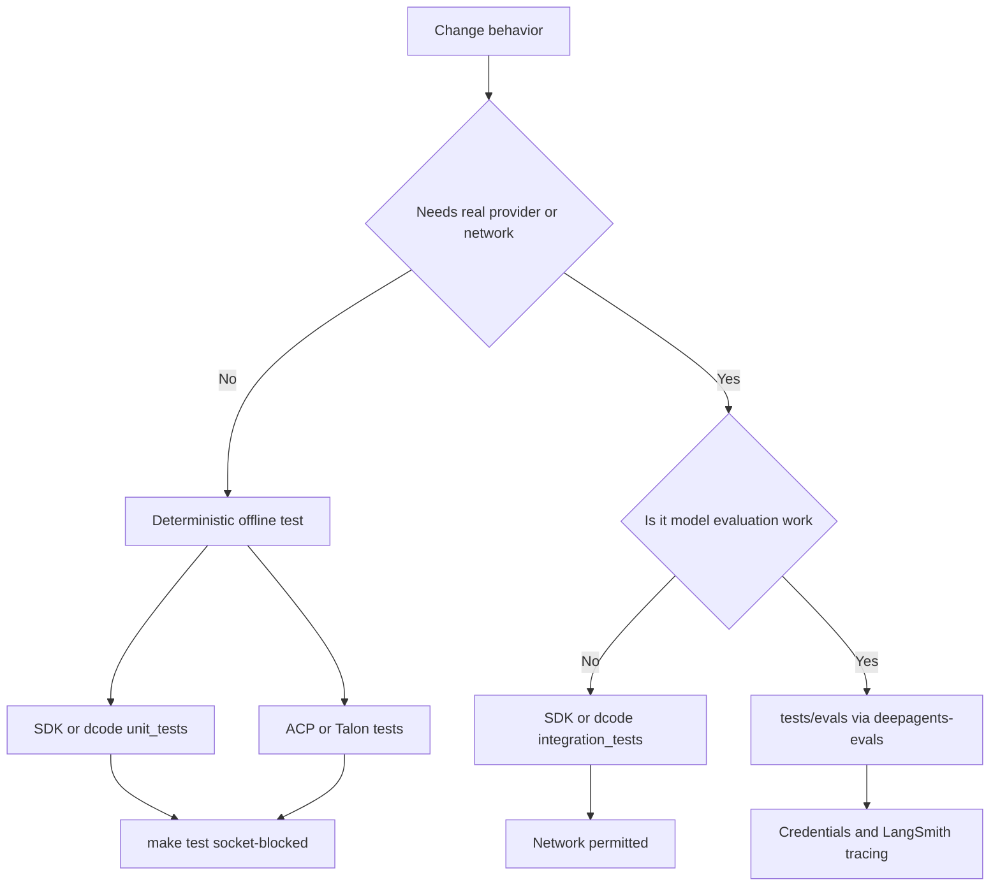

# Testing Guide

Test from the package you change. The repository is a monorepo of independently versioned packages, each with its own environment and Makefile; install dependencies with `uv sync` (often `uv sync --all-groups`) and use `make help` to discover that package's supported commands. Start with the closest test, assert observable behavior, and make ordinary tests deterministic. The broader development setup and repository conventions are documented in [development operations](../operations/development.md); package relationships are mapped in [source map](../architecture/source-map.md).

## Test topology and boundary

| Package | Topology | Normal command | Intended boundary |
| --- | --- | --- | --- |
| `libs/deepagents` | `tests/unit_tests/`, `tests/integration_tests/`, `tests/benchmarks/` | `make test` | Unit tests are socket-blocked; use the integration tree for real provider or network behavior. |
| `libs/code` | `tests/unit_tests/`, `tests/integration_tests/` | `make test` | Unit tests are socket-blocked; process and provider contracts belong in the integration tree. |
| `libs/acp` | Flat `tests/` tree | `make test` | The normal suite is socket-blocked and uses protocol/model doubles. |
| `libs/talon` | `tests/`, including `tests/integration_tests/` | `make test` | There is no separate Make integration target; the normal command still blocks sockets, so its named integration tests are deterministic component flows rather than live-network tests. |
| `libs/evals` | `tests/unit_tests/` and `tests/evals/` | `make test` for unit tests; `deepagents-evals` for live work | Keep harness coverage offline; run model evaluations as credentialed, traced experiments. |

For SDK source, the repository convention mirrors the source hierarchy: coverage for `deepagents/middleware/foo.py` belongs at `tests/unit_tests/middleware/test_foo.py`. Do not impose that layout on the flat ACP suite or on Talon's package-wide suite.



Caption: Deterministic unit coverage remains distinct from networked SDK/dcode integration work and from credentialed live evaluations.

### Focused commands

`TEST_FILE` narrows the normal targets. These commands are representative entrypoints:

```bash
cd libs/deepagents
make test TEST_FILE=tests/unit_tests/middleware/test_foo.py
make integration_test

cd ../code
make test TEST_FILE=tests/unit_tests/test_agent.py
make integration_test

cd ../acp && make test TEST_FILE=tests/test_agent.py
cd ../talon && make test TEST_FILE=tests/test_data_lifecycle.py
cd ../evals && make test TEST_FILE=tests/unit_tests/
```

Deep Agents and dcode run their unit targets with xdist (`-n auto`), disable benchmarks, block non-Unix sockets, and report coverage for their own package. Their integration targets select `tests/integration_tests/`, allow network access, retain benchmark disabling, and apply a 30-second timeout. ACP applies the socket block, a 10-second timeout, and coverage to its full test tree. Talon's `make test` first runs its WhatsApp bridge JavaScript tests with `node --test`, then its socket-blocked Python suite with a 10-second timeout and coverage.

## Pytest policy

### Warnings are failures

Every package puts `"error"` first in its pytest `filterwarnings`. A warning outside the reviewed allowlist therefore fails a test, breaks collection if emitted during import, or can abort pytest configuration with `INTERNALERROR`. Fix the source warning where possible; use a narrowly scoped test filter only for an intentional local expectation, and treat package-level ignores as reviewed exceptions.

### Async tests need no marker

All five package configurations set `asyncio_mode = "auto"`. Write an `async def` test directly; do not add `@pytest.mark.asyncio` merely to make pytest await it. In dcode, the default pytest configuration also uses strict markers and strict configuration, a 30-second default timeout, and function-scoped async fixture loops.

### Preserve isolation under parallelism and cached state

The SDK unit `conftest.py` resets the deprecation decorator's per-process dedupe state before each test, clears the cached video-extra probe, and bootstraps profile registries once per session. This prevents warning assertions, dependency probes, and registry snapshots from becoming order-dependent under parallel execution. Shared SDK utilities provide fake tools/middleware and `assert_all_deepagent_qualities`, which checks the agent's `files` stream channel and built-in filesystem/delegation tools. Use these kinds of fakes, `tmp_path`, injected clocks, and state restoration rather than live services in unit tests.

ACP tests demonstrate the protocol seam: they attach a deep-agent graph to `AgentServerACP` and drive it using `FakeACPClient`, which records session updates and permission requests. Talon's `RecordingChannel` similarly records outbound messages/media and only accepts injected inbound messages after handler registration. The Talon data-lifecycle test combines a temporary home, configured retention windows, and a fixed clock to verify stale cron jobs and old inbound media are removed while fresh media remains. These doubles preserve observable protocol and lifecycle behavior without sockets.

Use dcode's integration tree when the assertion needs a separately running CLI process. Its ACP smoke test starts `deepagents --acp --no-mcp`, connects an ACP client through stdin/stdout, initializes the protocol, creates a session, and terminates the subprocess during cleanup.

## Benchmarks are measurements, not unit tests

Deep Agents keeps benchmarks in `tests/benchmarks/`; dcode selects benchmark-marked tests from `tests`. In both packages `make test` disables benchmarks, while these targets intentionally select them:

```bash
make benchmark      # pytest benchmark marker
make bench          # benchmark marker under CodSpeed
make bench-memory   # memory_benchmark marker under CodSpeed
```

Keep a performance measurement in this dedicated path rather than making it an ordinary correctness test just so it runs in `make test`. ACP, Talon, and evals do not define these benchmark targets.

## Integration credentials

The Deep Agents and dcode test READMEs require `ANTHROPIC_API_KEY` for integration tests that use Anthropic models; `LANGSMITH_API_KEY` is optional tracing support. SDK integration tests can mark optional dependencies with `pytest.mark.requires(...)`, which allows an unavailable extra to skip a case instead of failing at import time. Keep real providers and real network behavior in this tier. For package/runtime context, see [SDK construction and execution](../architecture/sdk-construction-execution.md), [running a dcode session](../workflows/run-dcode-session.md), and [Talon](../integrations/talon.md).

## Evals: traced, credentialed experiments

`libs/evals` deliberately separates its socket-blocked `tests/unit_tests` harness suite from live tests in `tests/evals`. The `deepagents-evals` console program is the discoverable interface over single runs, repeated trials, aggregation, radar generation, catalog/model-group maintenance, and list/discovery commands. It accepts `--json` and `--dry-run` on most subcommands; `run` and `trials` obtain a model from `--model` or `DEEPAGENTS_EVALS_MODEL`.

```bash
cd libs/evals
export LANGSMITH_TRACING=true
export LANGSMITH_API_KEY=...
export DEEPAGENTS_EVALS_MODEL=claude-sonnet-4-6

deepagents-evals list categories
deepagents-evals run
deepagents-evals trials --trials 3

# Makefile alternatives
make evals MODEL=claude-opus-4-7
make evals-trials MODEL=openai:gpt-5.5 TRIALS=3
```

Live eval collection exits early unless tracing is enabled and a model is supplied. It supports repeatable category and tier selection (`--eval-category`, `--eval-tier`), validates supplied values against collected marks, and treats an exclusion as stronger than an inclusion. Provider credentials are required by the model actually selected; LangSmith tracing requires a valid `LANGSMITH_API_KEY`.

The evaluator reporter records total and per-category outcomes, call durations, failure details, experiment links, and efficiency measures based on expected versus actual steps and tool calls. It may reset pytest's session exit status after an individual trial so reports can be written. Consequently, automation running repeated trials or aggregation must use the CLI's aggregate result: it returns exit code `1` when `trials_summary.json` reports a nonzero `counts.failed.mean`, rather than trusting a trial pytest return code. See [running evals](../workflows/run-evals.md) for the operational workflow.

## Safe change checklist

1. State the behavior, ordering rule, or failure mode first and begin with the nearest existing test.
2. Keep deterministic coverage in the normal socket-blocked path; use SDK/dcode integration tests only when real network or process behavior is essential.
3. Do not confuse benchmarks with correctness tests or live evals with deterministic integration tests.
4. For async tests, rely on `asyncio_mode = "auto"`; reset process-global state and use fakes, temporary paths, and fixed time where appropriate.
5. Run the narrow `TEST_FILE` command, then the package target. Treat newly emitted warnings as defects or narrowly justified exceptions.
6. Before an eval, explicitly select a model, provide its credentials, enable tracing, and use trial aggregation for decisions about nondeterministic model behavior.
