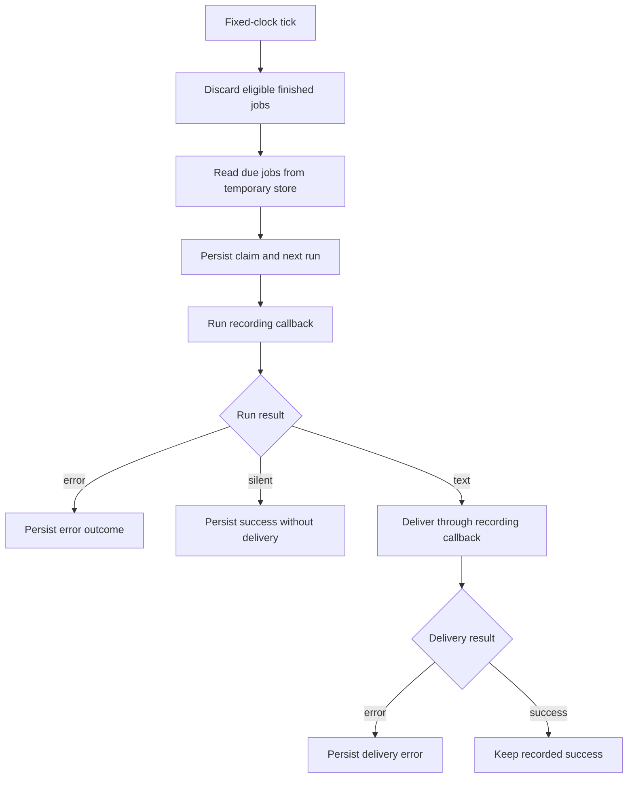

# Testing Guide

Talon changes should be proven at the boundary where persistence, time, channel delivery, or graph state becomes observable. The unit suite is designed for this: inject a UTC clock, create a `CronJobStore` below `tmp_path`, replace graph creation or model resolution with a fake, and use recording callbacks or `RecordingChannel`. Do not require a real channel, an MCP server, or a model provider for these routes.

```bash
cd libs/talon
make test TEST_FILE=tests/cron/test_expression.py
make test TEST_FILE=tests/cron/test_jobs.py
make test TEST_FILE=tests/cron/test_scheduler.py
make test TEST_FILE=tests/cron/test_until.py
make test TEST_FILE=tests/unit_tests/test_commands.py
make test TEST_FILE=tests/unit_tests/test_context_doctor.py
make test TEST_FILE=tests/test_host.py
make test TEST_FILE=tests/test_runtime.py
make lint
```

`make test` runs the WhatsApp bridge Node tests first, then invokes pytest for `TEST_FILE` (default `tests/`) with non-Unix sockets disabled, Unix sockets allowed, a 10-second timeout, and coverage. Use `PYTEST_EXTRA` only when a focused pytest option is genuinely needed; keeping the socket block means an accidental provider or channel call fails as a unit-test defect rather than becoming flaky integration coverage.

## Select the smallest Talon route

| Changed contract | Focused route | Test seam and assertion |
| --- | --- | --- |
| Cron grammar, calendar matching, time zones, or DST | `tests/cron/test_expression.py` and `tests/cron/test_jobs.py` | Explicit UTC/local datetimes and `ZoneInfo`; assert exact instants or local wall-clock results. |
| Job claiming, JSON store state, completion, retention, or `until` | `tests/cron/test_jobs.py` and `tests/cron/test_until.py` | A fresh store at `tmp_path / "cron"`; pass `now` explicitly and reload the store when disk state matters. |
| Dispatch, delivery, silent output, failure handling, or ticker survival | `tests/cron/test_scheduler.py` | `PersistentCronScheduler` with a fixed `now`, recording runner/delivery callback, and `tick_once()`. |
| Scheduled agent invocation, timeout recovery, or no-interactive-approval behavior | `tests/test_host.py` and `tests/test_runtime.py` | A blocking or recording agent and fake graph; assert metadata, recovery, and resume decision rather than calling a provider. |
| Adding, renaming, hiding, advertising, or dispatching a slash command | `tests/unit_tests/test_commands.py` | The shared registry plus host constants; validate platform-safe names, help text, and exact dispatch coverage. |
| Context audit content, token accounting, reload behavior, or host command behavior | `tests/unit_tests/test_context_doctor.py` | A fake tool-binding model, temporary assistant files, graph checkpoint state, and recording channel. |

## Persistent scheduling: test the temporal contract

Scheduling has two distinct boundaries. `CronSchedule` turns user text into a next UTC instant while preserving wall-clock semantics for IANA zones. `CronJobStore` owns the durable job record and advances a due job before the scheduler invokes it. `PersistentCronScheduler` scans, claims, runs, records an outcome, and optionally delivers output. Tests should preserve that division: expression tests do not need a scheduler, and scheduler tests should use simple callbacks rather than a runtime graph.


```mermaid
flowchart TD
    Tick["Fixed-clock tick"] --> Sweep["Discard eligible finished jobs"]
    Sweep --> Due["Read due jobs from temporary store"]
    Due --> Claim["Persist claim and next run"]
    Claim --> Run["Run recording callback"]
    Run --> Outcome{"Run result"}
    Outcome -->|"error"| Error["Persist error outcome"]
    Outcome -->|"silent"| Quiet["Persist success without delivery"]
    Outcome -->|"text"| Deliver["Deliver through recording callback"]
    Deliver --> Delivered{"Delivery result"}
    Delivered -->|"error"| DeliveryError["Persist delivery error"]
    Delivered -->|"success"| Done["Keep recorded success"]
```

*The scheduler claims persistence before execution, then records the run and delivery outcome through explicit seams.*

### Calendar and DST regressions

Use `test_expression.py` for parser acceptance/rejection, canonical display, macros, ranges, lists, step values, and calendar extensions such as `L`, `LW`, `W`, last weekday, and nth weekday. Pin the semantic distinction between restricted day-of-month/day-of-week fields that match either and starred fields that require both.

The high-value regression cases are intentionally distant from today: leap day must skip 2100, and a fifth Friday in February can require searching beyond a decade. A future optimization must still find a valid rare match and reject an impossible expression at job creation rather than looping or silently creating a job that never fires.

Test zone behavior with named zones and exact expected local times. Daily and cron schedules retain their requested local hour through spring and fall transitions; nonexistent times snap forward once, including a sub-hour gap; and an ambiguous fall-back local time fires once rather than once per offset. In particular, a spring-forward cron whose several nominal times all resolve to 03:00 must dispatch only one 03:00 run.

### Claim before run, bounded expiration, and retention

A due job is atomically claimed by advancing or disabling its next occurrence and writing the record before execution. This is why scheduler callback tests inspect the stored record from inside `run_job`: a one-shot already has `next_run_at is None`, so a second tick cannot run the same occurrence after a crash or slow execution. Recurring intervals remain phase-locked to the previous occurrence, catch up after downtime, and respect a repeat cap.

`until` only applies to recurring schedules and is interpreted as a local wall-clock timestamp. The occurrence exactly at `until` is included. A short five-minute grace admits a tick that arrives slightly late, but a job missed well beyond the window is disabled without a late delivery. Test both boundaries with explicit timestamps; do not depend on wall-clock sleeps. Also verify parsing rejects incomplete or out-of-range text, a limit before the first run, and `until` on a one-shot job.

Completion is not synonymous with immediate deletion. On the next tick, successful one-shots and cleanly expired jobs can be removed. A failed final run, or a job claimed before a process interruption but never given an outcome, remains inspectable; retention pruning removes it only after the configured period. An edit that gives a just-finished job a new enabled schedule must prevent the sweep from deleting it. These cases protect operational diagnosis after a failure.

## Scheduler outcomes and host integration

`test_scheduler.py` is the narrow route for lifecycle behavior. Its injected clock and recording delivery callback prove that a due job is claimed, produces an `ok` outcome, and delivers to the origin conversation. Assert that `[SILENT]` at either end suppresses delivery while still recording success; empty output is also not delivered. A runner exception records `error` and leaves a recurring job on its advanced schedule, while a delivery exception replaces the success outcome with a `delivery failed:` error.

The ticker must survive an unexpected scan failure: it logs the failure, waits for the normal interval, and later scans again. Test start/stop separately with a short `tick_seconds`; cancellation must still clear the ticker task. Because jobs run serially within one tick, host-level scheduled execution has a timeout boundary so a stalled job becomes an error and later jobs can proceed.

For host/runtime changes, retain the same isolation at the integration seam. `test_host.py` supplies a `BlockingAgent`, `RecordingScheduler`, and `RecordingChannel` to test lifecycle and scheduled-run behavior without a real channel. `test_runtime.py` uses recording and interrupting graphs, fake tools, temporary stores, and fake model seams. Scheduled invocations carry cron metadata and cannot ask an operator: a gated tool interrupt is resumed as a rejection and never executes. This is a safety invariant, not an optional UX path.

## Command registry: advertise exactly what can run

`deepagents_talon.commands` is the shared source for chat help and platform registration; the host dispatches the corresponding slash-command constants. Keep registry tests whenever a command changes:

- Names are unique, lowercase/platform-valid, and their summaries are nonempty one-line strings within Discord's limit.
- `/help` lists every visible registry entry with its exact summary and omits hidden entries. Hidden commands may still be typed, but must not appear in help or platform advertisements.
- Every registry command has a host dispatch branch, and every host dispatch constant resolves to the registry. Otherwise a command can be advertised yet fall through to the agent as ordinary text.

This route intentionally catches cross-module drift rather than merely checking that a registry entry exists.

## Context doctor: read-only, scoped, and redacted

`/context-doctor` reports estimated injected-context cost, not the source contents. The runtime reads the active graph checkpoint for the resolved conversation and its configured system prompt, memory, skills, and tool schemas; it renders aggregate labels and token counts. It does not invoke the agent or write graph state. The report uses the effective post-compaction conversation—summary plus messages after the cutoff—and can use the latest provider input-token metadata when available.

The fixture in `test_context_doctor.py` builds a real `DeepAgentRuntime` over temporary `AGENTS.md`, memory, and skill files while monkeypatching model resolution to `_ToolBindingFakeModel`. Assertions must demonstrate both utility and privacy: configured-source categories, memory/skill counts, tool-schema totals, checkpoint-scoped token usage, and changed output after tool reload; never private instruction/memory text, schema description text, or filesystem paths. Snapshot values and configuration must be identical before and after the audit, and another conversation must not inherit the current thread's usage.

At the host boundary, `/context-doctor` is dispatched without interrupting a currently running agent turn and follows the new thread created by `/new`. If the runtime lacks diagnostics or the audit fails, the user gets a safe generic message and the underlying private exception is not sent to the channel. Use a recording channel to assert that behavior.

## Review checklist

1. Start with the focused test file and a fixed clock or fake boundary; use `tmp_path` rather than a user cron directory.
2. For time changes, add exact DST gap/fold and rare-calendar assertions, not just nearby ordinary dates.
3. For persistence changes, prove the claim is written before `run_job`, prove `until` remains inclusive only within its grace, and cover failed/unfinished-job retention.
4. For scheduler work, exercise success, silent output, runner failure, delivery failure, and a recoverable failed tick.
5. For command work, update registry, help/advertisement, and host-dispatch alignment together.
6. For diagnostics, assert both non-mutation and redaction with private fixture data and a checkpoint from the target conversation.
7. Run `make test` and `make lint` before widening coverage; do not add a real provider or channel merely to test a deterministic Talon contract.
