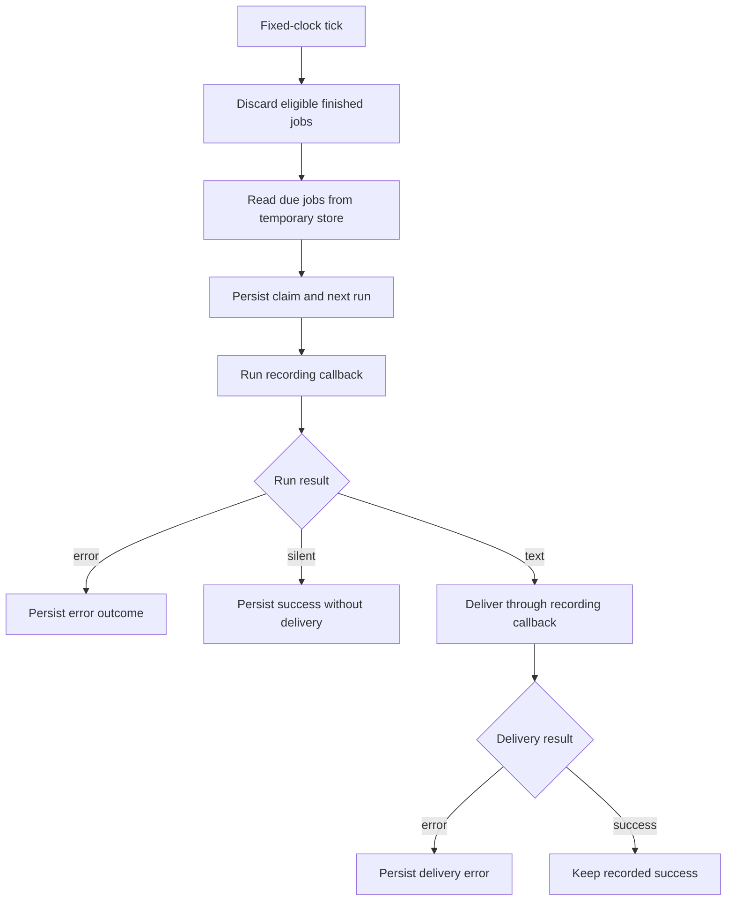

# Testing Guide

Test Talon at an observable boundary: persisted state, a delivered channel message, an agent request, a graph resume decision, or a cleaned-up resource. Most of these routes are **socket-blocked unit tests**. They use `tmp_path`, injected clocks, fake graphs/models, `RecordingChannel`, and fake Discord/Slack gateways or transports; they must not open a provider, gateway, or model socket. The Slack host file is an **integration test with an explicitly scoped external boundary**: it combines the real `SlackChannel` and `TalonHost`, but substitutes a Socket Mode gateway and an echo runtime, so it still makes no network connection.

```bash
cd libs/talon
make test TEST_FILE=tests/test_main.py
make test TEST_FILE=tests/test_host.py
make test TEST_FILE=tests/test_runtime.py
make test TEST_FILE=tests/channels/test_discord.py
make test TEST_FILE=tests/channels/test_slack.py
make test TEST_FILE=tests/integration_tests/test_slack_host.py
make test TEST_FILE=tests/unit_tests/test_commands.py
make test TEST_FILE=tests/unit_tests/test_model_selection.py
make test TEST_FILE=tests/unit_tests/test_pairing.py
make test TEST_FILE=tests/unit_tests/test_history_backends.py
make test TEST_FILE=tests/unit_tests/test_sandbox.py
make test TEST_FILE=tests/unit_tests/test_scheduled_history.py
make test TEST_FILE=tests/cron/test_expression.py
make test TEST_FILE=tests/cron/test_jobs.py
make test TEST_FILE=tests/cron/test_scheduler.py
make test TEST_FILE=tests/cron/test_until.py
make lint
```

`make test` runs `node --test tests/channels/whatsapp_bridge/*.test.js` first, then runs `uv run --group test pytest --disable-socket --allow-unix-socket $(PYTEST_EXTRA) $(TEST_FILE) --timeout 10 $(COV_ARGS)`. Thus Internet/TCP sockets are blocked, Unix sockets are permitted, the timeout is 10 seconds, and coverage defaults to `--cov=deepagents_talon --cov-report=term-missing`. `make lint` runs Ruff checks and a formatting diff on `deepagents_talon/ tests/`, then `make type`; that target runs `uv run --group test ty check deepagents_talon`. Use `PYTEST_EXTRA` only for a truly focused pytest option, not to bypass the socket guard.

## Focused-test routing

| Changed seam | Start here | Boundary and observable invariant |
| --- | --- | --- |
| CLI bootstrap, sandbox handoff, SQLite checkpointer, or logging | `tests/test_main.py` | Monkeypatch the runtime/host and sandbox context. Assert the supplied sandbox reaches the runtime and closes afterward; a supplied saver is reused, while the default saver persists a checkpoint. Assert invalid log-level values are not echoed. |
| Host startup/shutdown, command handling, cancellation, authorization, or scheduled invocation | `tests/test_host.py` | **Socket-blocked unit test** using `RecordingChannel`, blocking/recording agents, and recording scheduler. Assert component lifecycle, user-visible results, graph recovery, and authority boundaries—not private task-map call order. |
| Graph construction, tools, retries, interruption recovery, or cron approvals | `tests/test_runtime.py` | **Socket-blocked unit test** with fake graph/model/tool factories. Assert graph input/output, persisted thread recovery, tool execution or rejection, and resource safety. |
| Discord adapter, gateway lifecycle, interactions, media, or admission | `tests/channels/test_discord.py` | **Socket-blocked unit test** with `RecordingGateway` or fake `discord.Client`. Assert dispatched messages/reactions, status, bounded output, and safe attachment behavior. |
| Slack adapter, Socket Mode conversion, slash commands, Markdown, or file transfer | `tests/channels/test_slack.py` | **Socket-blocked unit test** with a fake gateway/opener/Web client. Assert normalized conversations and posts, admission, private command responses, and URL/size/file safety. |
| Slack channel-to-host composition | `tests/integration_tests/test_slack_host.py` | **Integration test with a fake Socket Mode gateway and echo agent.** Assert channel mentions and follow-ups stay in their Slack thread and `/talon help` responds through the command responder. |
| Shared command registry, help, platform registration, or host dispatch | `tests/unit_tests/test_commands.py` | Assert valid unique names, summaries and help visibility, and exact registry-to-host dispatch coverage. |
| Per-chat model selection or selected-model context budget | `tests/unit_tests/test_model_selection.py` | Fake catalog, credentials, and chat models. Assert selection scope/persistence and actual selected-model output/budget behavior. |
| Sender pairing, host pairing commands, revocation, or pairing CLI | `tests/unit_tests/test_pairing.py` | Fake clock, gateway/transport, host, and cron store. Assert admission and revocation outcomes rather than store mutation sequence. |
| History URI/startup, optional driver, backend cleanup, or secret redaction | `tests/unit_tests/test_history_backends.py` | Fake backend drivers/plugins and temporary SQLite files. Assert persistence/isolation, failed startup cleanup, and that credentials never escape configuration errors. |
| Sandbox startup, host-path routing, or cancellation cleanup | `tests/unit_tests/test_sandbox.py` | Patch the sandbox factory with a synchronous fake. Assert yielded session/backend behavior and deletion after normal or cancelled startup. |
| Scheduled history scope, recall, archive write, or deletion authority | `tests/unit_tests/test_scheduled_history.py` | Real temporary saver plus fake compiled graph. Assert the job sees only its origin scope, does not archive its prompt, and cannot delete history. |
| Cron grammar, calendar matching, time zones, or DST | `tests/cron/test_expression.py`, `tests/cron/test_jobs.py` | Explicit UTC/local datetimes and `ZoneInfo`; assert exact next instants and local wall-clock results. |
| Claiming, JSON records, `until`, retention, dispatch, or delivery | `tests/cron/test_jobs.py`, `tests/cron/test_until.py`, `tests/cron/test_scheduler.py` | Temporary store, fixed `now`, and recording runner/delivery callback; assert durable state and externally visible delivery/outcome. |

## Bootstrap, host, and runtime lifecycle

`tests/conftest.py` isolates both `DEEPAGENTS_TALON_HOME` and `HOME` for every test. Its `RecordingChannel` is the common host seam: it records text/media/typing, exposes start/stop state, and injects inbound messages or reactions only after the host has registered handlers.

For bootstrap changes, test `_run_host` with fake runtime and host entrypoints. The important result is ownership: a configured sandbox session is supplied to runtime construction and its context closes after the host returns; a caller-provided checkpointer is forwarded without creating the configured SQLite checkpoint, while the default path persists checkpoints that a new `AsyncSqliteSaver` can read. Logging tests should assert channel-only debug configuration and redact an invalid environment value.

For host changes, use a blocking agent to make lifecycle visible. Assert that a replacement turn recovers the interrupted conversation and produces only the newer response; `/stop` acknowledges cancellation even if recovery itself fails; `/new` selects a fresh persisted conversation thread; and shutdown stops scheduler, channels, and agent. Runtime fake graphs should verify semantic effects: interrupted graph state gets dangling tool calls repaired before the interruption marker, an approval handler's decision determines whether the tool runs, and a cron-triggered gated tool is rejected without execution. If background workers cannot stop, runtime shutdown must leave graph/checkpointer resources open rather than close resources a worker might still write.

## Channels: adapters, admission, and Slack host integration

Channel tests are adapter tests, not live provider tests. Discord replaces either the adapter gateway or `discord.Client` and command tree; Slack replaces its gateway, URL opener, and SDK web client. This permits deterministic lifecycle and terminal-failure status tests without opening a socket.

For **channel admission**, assert the observable security invariant: authorized input reaches the registered handler exactly once, and unauthorized/self-originated input reaches it zero times. Cover self and allowlist exposure, including Slack channel threads and user DMs. Interactions/slash commands must produce the same host-recognized text and authorization metadata as their typed counterpart. Do not assert the order of private adapter helpers.

Adapter-specific boundary assertions include:

- Discord splits text to the provider limit, confines outbound media to its configured root, marks transient reconnecting versus terminal-disconnected status, and skips oversize or failed inbound attachments while still delivering the message with media-error metadata.
- Slack maps a channel mention and its replies to one thread conversation, posts replies back to that thread, and prevents ordinary channel `message` events from duplicating an `app_mention` turn. It escapes Slack control syntax so output cannot create `<!channel>` notifications.
- Slack file tests must assert that download authorization is sent only to HTTPS `files.slack.com`, redirects and foreign upload URLs are refused, byte limits apply before and during transfer, partial downloads disappear, and destination files are private. These are security outcomes, not transport-call-order assertions.
- Slash-command rejection remains private through its responder. The integration route then proves the composed result: mention replies and successive messages are threaded, while `/talon help` uses the command responder rather than a channel post.

## Commands and model selection

The shared registry is the contract used by help and platform adapters. Keep its tests when a command changes: each name must be unique and Discord-valid; each summary must be one line and fit the platform description limit; visible commands appear in help with their exact summary; hidden commands do not. Every registry text must have a host dispatch branch, and each host command constant must resolve to that registry. This prevents an advertised command from silently becoming agent text.

For **model selection**, use a fake credentialed catalog and deterministic `FakeMessagesListChatModel` instances. Assert that only an operator may change a chat's model, an unknown request neither prepares a model nor echoes the untrusted spec, and listing does not invoke the agent. A valid choice applies on the next turn of that chat only, survives `/new` and restart, and `/model default` removes its persisted override. At runtime, assert selected model responses are actually used, are built once per model, unavailable selections fall back to default, and selected models enforce their own context budget—including summarization when switching from a large to a smaller model.

## Pairing and revocation

Pairing tests use a fixed clock and fake Discord/Telegram transports. Assert the admission invariants: an unknown DM sender does not reach the agent and receives at most one pending code; a successful, case/format-tolerant approval is single-use and admits only the sender and provider it was issued for; expiry, corrupt state, and a symlinked store fail closed. The pairing file is private, pending requests are bounded per provider, pairing is opt-in, and it is invalid with open exposure. Guild messages must never create pairing requests, and a paired sender is admitted only in their DM.

At the host boundary, only an operator in a DM may administer `/pair`; approval makes the sender's later DM reach the agent. Revocation is an end-to-end authority test: it blocks future messages, cancels the sender's active work, disables only jobs whose origin is that sender's channel DM, and interrupts an in-progress scheduled run with `ScheduledRunRevokedError`. Environment-configured senders cannot be revoked through pairing. The CLI route separately checks provider-scoped list/approve/revoke results and the explicit `pause-jobs` follow-up required to disable the revoked sender's schedules.

## History and sandbox startup

History tests own startup and cleanup rather than real databases. Use temporary SQLite archives for URI persistence and fake MongoDB/PostgreSQL/plugin drivers for external schemes. Assert URI validation fails without echoing configuration, assistant namespaces stay isolated, configured URI options are retained, and plugins close their stores. On backend setup/write/cancellation failure, assert workers/dispatchers and clients are cleaned up only after in-flight startup finishes; startup errors and tracebacks must not disclose the URI password. Missing optional drivers should provide the matching extra-install guidance, while installed-but-broken drivers report their real import failure instead of being misdiagnosed as absent.

Sandbox tests patch `sandbox_factory.create_sandbox`. Assert no configuration yields `None`; a configured session has the provider working directory and its backend executes remotely; exiting the context deletes the sandbox; and cancellation while creation is blocked still waits for deletion. The sandbox backend keeps allowed assistant memory paths on the host but routes approval/state files to the sandbox and rejects traversal. In sandbox mode, runtime must discard configured memory paths outside the permitted memory root rather than creating or reading them on the host.

## Scheduled work and scheduled history

Scheduling has three boundaries: `CronSchedule` resolves a user expression to an instant while preserving zone semantics; `CronJobStore` durably claims occurrences; and `PersistentCronScheduler` runs and delivers them. Keep expression tests separate from scheduler tests.


```mermaid
flowchart TD
    Tick["Fixed-clock tick"] --> Sweep["Discard eligible finished jobs"]
    Sweep --> Due["Read due jobs from temporary store"]
    Due --> Claim["Persist claim and next run"]
    Claim --> Run["Run recording callback"]
    Run --> Outcome{"Run result"}
    Outcome -->|"error"| Failure["Persist error outcome"]
    Outcome -->|"silent"| Quiet["Persist success without delivery"]
    Outcome -->|"text"| Deliver["Deliver through recording callback"]
    Deliver --> Delivery{"Delivery result"}
    Delivery -->|"error"| DeliveryFailure["Persist delivery error"]
    Delivery -->|"success"| Done["Keep recorded success"]
```

*Scheduler-only flow: a durable claim precedes execution, then the run and delivery outcome become observable.*

Cron grammar tests protect day-of-month/day-of-week behavior; `L`, `LW`, `W`, last-weekday, and nth-weekday extensions; leap years and rare future matches; and rejection of expressions that can never fire. DST tests must assert local semantics: spring gaps snap forward once without duplicates, fall-back ambiguous times fire once, and daily schedules retain their requested local hour, including sub-hour gaps.

A due job is advanced or disabled and persisted before `run_job` begins, so a one-shot cannot remain due while its callback is in progress. `until` applies only to recurring jobs, includes the due occurrence at the limit, and allows five minutes of scheduler latency; later missed runs are disabled. A subsequent sweep removes successful one-shots and clean expiry, but retains failed final runs and claimed jobs lacking an outcome for diagnosis until retention pruning; enabling a replacement schedule prevents deletion. Scheduler tests should observe success, runner failure, delivery failure, `[SILENT]`/empty suppression, and survival after an unexpected tick error.

Scheduled host execution serializes a job's conversation with a per-job lock and repairs an interrupted graph thread after timeout. A scheduled request carries cron metadata and has no interactive approval authority. Scheduled-history tests extend that contract: a job reads and searches only its origin channel/chat archive; its own cron prompt is not archived; it cannot delete conversation history; clearing the origin removes the associated cron thread; and a WhatsApp `@lid` origin is preserved for recall, archive writes, and delivery.

## Review checklist

1. Start at the changed seam's focused route; retain socket blocking unless the test explicitly scopes a fake transport/gateway integration boundary.
2. Assert admissions, model choices, pairings, history, and sandbox behavior through delivered/withheld input, persisted result, resource cleanup, or redacted error—not internal call ordering.
3. Use a fixed clock and temporary store for cron work; cover exact DST and rare-calendar cases plus claim-before-run and failure retention.
4. Use fake graph/model/provider seams for host/runtime behavior; do not add a real model, MCP server, channel gateway, or database to prove deterministic behavior.
5. Run `make test TEST_FILE=...` for the narrow route, then `make lint`; run broader tests only after the focused contract passes.
