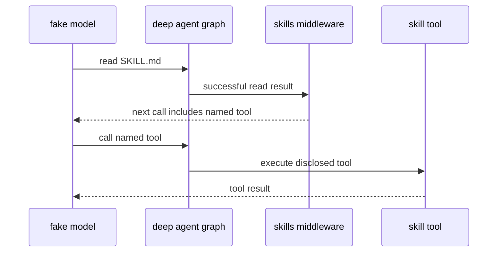
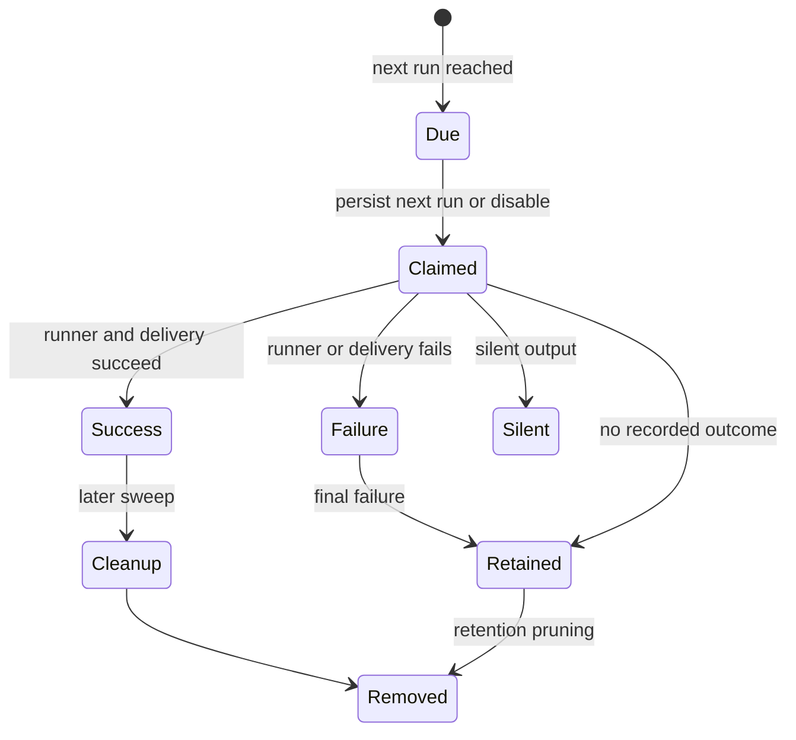

# Testing Guide

Put a regression at the narrowest public or model-visible boundary that proves its contract. Unit tests are deterministic and network-free: use temporary directories, fixed or injected clocks, fake models and gateways, recording callbacks, and the Textual pilot rather than live providers, sleeps, or incidental call-order assertions. Tests mirror the owning package's source layout. Warnings are errors; fix an actionable warning rather than adding a broad filter. See [Development](../operations/development.md), [Subagents and Skills](../concepts/subagents-skills.md), [Talon channel admission](../concepts/talon-channel-admission.md), and [Talon scheduling](../concepts/talon-scheduling.md) for the adjacent operational and conceptual contracts.

## Run the owning target

Install dependencies in the changed package with `uv sync --all-groups`, then use its `Makefile`. The core SDK and dcode unit targets use parallel pytest workers, block non-Unix sockets, allow Unix sockets, and collect coverage; their integration targets are distinct and may use the network. Talon's `make test` first runs WhatsApp bridge Node tests, then runs the selected `TEST_FILE` with non-Unix sockets disabled, Unix sockets allowed, a 10-second pytest timeout, and coverage; `make lint` runs Ruff checks/format diff and `ty` for Talon source. The dcode Makefile provides network-restricted parallel unit tests and an explicit `update-snapshots` target that runs smoke snapshots with the `--update-snapshots` option.

```bash
cd libs/deepagents
make test TEST_FILE=tests/unit_tests/test_graph.py
make test TEST_FILE=tests/unit_tests/middleware/test_skill_tools.py
make lint

cd ../talon
make test TEST_FILE=tests/unit_tests/test_checkpoint_backends.py
make test TEST_FILE=tests/unit_tests/test_cron_concurrency.py
make test TEST_FILE=tests/unit_tests/test_slack_oauth_context.py
make lint

cd ../code
make test TEST_FILE=tests/unit_tests/smoke_tests/test_system_prompt.py
make test TEST_FILE=tests/unit_tests/tui/widgets/test_subagent_panel.py
make update-snapshots
make lint
```

Do not use `make update-snapshots` to accept an unexplained prompt change. Inspect the complete golden-file diff and decide whether it is an intended model-visible contract change.

## SDK graph assembly and skills: assert what the model can do

Use `create_deep_agent` with a fake model when validating graph assembly. A graph-level test should assert the compiled graph's externally meaningful outcome—such as the available tool set, configured metadata, or a harness-profile override—rather than the constructor sequence of its middleware. Run behavior through both `invoke` and `ainvoke` where the contract is meant to hold on both paths; the skills suite parametrizes this explicitly.

Skill tools have a particularly important disclosure gate. A tool named by a skill is bound only after a successful `read_file` of that skill's normalized `SKILL.md`; a call before the read, or in the same model turn as the read, is returned as an invalid-tool error and does not execute. Compaction can withdraw disclosure when it removes the corresponding read from effective history. Checkpointed disclosure state must likewise not authorize a call after an agent is rebuilt without the skill tool, or when an old persisted record has an incompatible shape.


```mermaid
sequenceDiagram
    participant Model as fake model
    participant Agent as deep agent graph
    participant Skills as skills middleware
    participant Tool as skill tool
    Model->>Agent: read SKILL.md
    Agent->>Skills: successful read result
    Skills-->>Model: next call includes named tool
    Model->>Agent: call named tool
    Agent->>Tool: execute disclosed tool
    Tool-->>Model: tool result
```

*The capability becomes model-visible only on a subsequent call after a successful skill-file read.*

Test collision and lifecycle edges at the same seam: a regular registered tool or another middleware's dynamic tool takes precedence over a same-named skill tool; malformed `include_tools` metadata emits the reviewed warning; an interrupt still applies once a skill tool is disclosed; and a general-purpose subagent inherits applicable skill tools while a declarative subagent uses only its own configuration. These assertions protect capability boundaries without turning a test into an implementation trace.

## Talon checkpoint selection: URI validation, plugin ownership, and safe errors

`open_checkpointer` is the lifetime boundary for LangGraph checkpoint persistence. With no configured URI it opens Talon's local SQLite path. Otherwise it selects a built-in scheme (`sqlite`/`file`, PostgreSQL, or MongoDB) or exactly one installed `deepagents_talon.checkpoint_backends` entry point whose name matches the URI scheme. The returned factory is an async context manager, so a custom backend must be closed even when work in the caller's context raises. `open_checkpointer` defaults to Talon's local SQLite URI, selects either a built-in URI scheme or exactly one checkpoint-backend entry point, owns the selected async context lifecycle, and turns unexpected initialization failures into a credential-safe `TalonConfigError`.

Test the public seam, not the lookup sequence: retain a checkpoint across separate openings; verify a custom entry-point factory receives its URI and cleans up after an exception; reject unsupported or incomplete URIs; and assert a startup error neither includes credentials nor exposes a driver exception.

## Cron: durable claim, calendar semantics, and concurrent storage

`CronJobStore` is a JSON store with a process-local reentrant lock shared by stores addressing the same resolved `jobs.json` path. Cron stores that address the same resolved jobs file share a reentrant in-process lock for complete storage mutations and reads, while job execution and delivery remain outside the lock and external processes are not coordinated. Concurrent cron mutation tests cover same-instance and separate-store callers and show that a contested claim is exclusive, concurrent creation is retained through every mutation type, and readers observe completed persisted writes.

Before invoking a due job, `CronJobStore.advance_next_run` advances or disables the occurrence and persists the claimed record; this claim-before-run ordering prevents a due one-shot from remaining due while its callback runs. The scheduler records success, runner failures, and delivery failures after claiming a job, suppresses delivery for `[SILENT]` output, and continues scanning after an unexpected tick failure.


```mermaid
stateDiagram-v2
    [*] --> Due: next run reached
    Due --> Claimed: persist next run or disable
    Claimed --> Success: runner and delivery succeed
    Claimed --> Failure: runner or delivery fails
    Claimed --> Silent: silent output
    Success --> Cleanup: later sweep
    Failure --> Retained: final failure
    Claimed --> Retained: no recorded outcome
    Cleanup --> Removed
    Retained --> Removed: retention pruning
```

*The durable claim happens before execution; cleanup and retention are later store operations.*

The race suite uses observed lock contention rather than elapsed time. Exercise every storage mutation against both one store object and separate stores with primed caches, then compare them with a fresh store. Assert persisted records and exclusive claiming, not private helper order.

Keep calendar coverage fixed with UTC/local datetimes and `ZoneInfo`. Talon cron-expression tests protect calendar semantics including day-of-month/day-of-week matching, `L`/`LW`/`W`/last-weekday/nth-weekday extensions, leap-year and rare future matches, and rejection of expressions that can never fire. Talon schedules preserve requested local wall-clock behavior across daylight-saving transitions: spring gaps snap forward without duplicate firing, fall-back ambiguous times fire once, and daily schedules retain their local hour including sub-hour gaps. `until` is valid only for recurring jobs and is inclusive for a due occurrence, with a five-minute grace for scheduler latency; a run missed beyond that grace is disabled rather than delivered after the requested window.

Finished or expired jobs are normally discarded on a later scheduler sweep, but failed final runs and jobs claimed without a recorded outcome are retained for inspection until retention pruning; a newly enabled replacement schedule prevents removal. Test the stored status, error, and removal decision—not merely whether a callback was called.

## Sender admission and Slack OAuth context

Talon pairing persists provider-scoped pending and approved senders with locked atomic replacement, rejects unsafe or invalid store state for admission, and uses expiring single-use codes that only an operator-facing approval surface can consume. Use an injected clock and temporary store to prove provider isolation, normalization, expiry, single use, and corruption failure without a real channel.

Slack pairing tests verify that unknown senders receive at most one code in their DM, unknown channel mentions only create a request after a DM can be opened, known senders do not trigger DM opening, and authorized `/talon pair` approval admits the sender without granting command access to an unauthorized coworker. Keep authorization and code delivery outside model input.

Slack OAuth-context tests exclude loopback OAuth callbacks from retrieved thread history before truncation and ensure unsolicited or historical callback text does not become model input or expose callback secrets in an agent request representation. The fake Slack SDK gateway and host drain helper cover link formatting, loopback host variants, error callbacks, and oversized input without Slack credentials or Socket Mode.

## dcode: prompt snapshots and Textual behavior

dcode's system-prompt smoke test composes a real CLI agent with real middleware and a fake chat model, fixes machine-dependent settings and paths, captures the first system message, and snapshots both interactive and headless prompt variants. The dcode prompt tests separately verify that memory and secret-handling instructions remain present while interactive and headless modes expose different reachable interaction guidance.

Patch model identity, current directory, local-context detection, backend roots, and settings paths; seed user skill and memory content; redact temporary and profile paths; then compare the complete prompt. This is intentionally broader than a helper unit test because the output is the system message seen by the model.

SubagentPanel tests mount the real Textual widget with `run_test()` and assert observable selection, persistent collapse preference, reset/cancellation/replay behavior, hostile-label sanitization, responsive header rendering, and wall-clock phase duration. Feed realistic lifecycle event dictionaries and assert rendered content or durable panel state: selection follows the active phase until navigation locks it, interrupted in-flight rows become cancelled without changing completed rows, replay preserves final status and duration, and staggered subagents report wall-clock span rather than the longest child duration.

## Focused-regression checklist

1. Start at the owner boundary: `create_deep_agent`, `open_checkpointer`, `CronJobStore`, channel admission/context retrieval, CLI-agent composition, or a mounted widget.
2. Replace nondeterminism with a temporary path, injected clock, fake model/gateway, recording callback, or Textual pilot.
3. Assert a persisted record, tool availability/error, sanitized error, model-visible prompt/context, sent response, or rendered state—not private sequencing.
4. Include one failure or lifecycle edge: compaction, rebuild, malformed URI, contested claim, corrupt store, unavailable DM, historical callback, headless mode, cancellation, or replay.
5. Run the focused package target and `make lint`; use a live integration only where no deterministic boundary can prove the contract.
