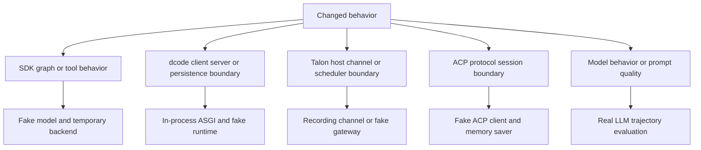
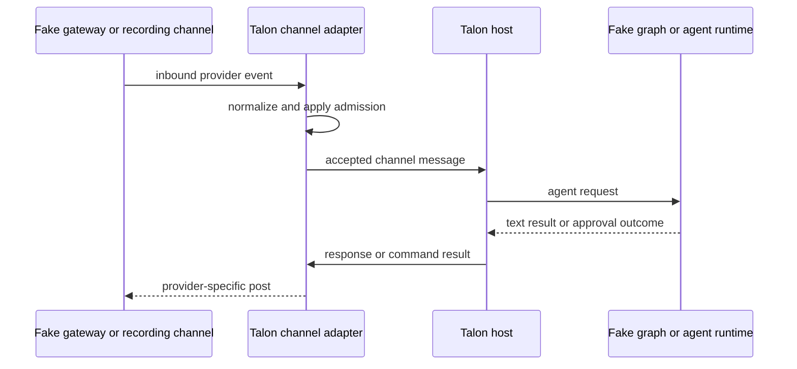

# Testing by Runtime Boundary

Test the contract at the boundary that changes—not an implementation detail below it and not a real external service above it. Packages are independently developed from their own directories with `uv` and package `Makefile` targets; normal unit targets block Internet sockets (while permitting Unix sockets). Use a real dependency only when the behavior being changed is specifically its integration contract.


```mermaid
flowchart TD
    Change["Changed behavior"] --> SDK["SDK graph or tool behavior"]
    Change --> Dcode["dcode client server or persistence boundary"]
    Change --> Talon["Talon host channel or scheduler boundary"]
    Change --> ACP["ACP protocol session boundary"]
    Change --> Eval["Model behavior or prompt quality"]
    SDK --> Fake["Fake model and temporary backend"]
    Dcode --> ASGI["In-process ASGI and fake runtime"]
    Talon --> Adapter["Recording channel or fake gateway"]
    ACP --> Client["Fake ACP client and memory saver"]
    Eval --> LLM["Real LLM trajectory evaluation"]
```

*Route a change to the narrowest runtime boundary that can observe its promised result.*

## First choose the tier

| Change owns | Test tier and starting point | Assert at the boundary |
| --- | --- | --- |
| `deepagents` graph, middleware, filesystem tools, permissions, streaming, or backend behavior | SDK unit tests, especially `libs/deepagents/tests/unit_tests/test_end_to_end.py`, `test_middleware.py`, `test_graph.py`, and the focused tool/backend test | A fake model's tool calls and final messages, returned state, tool output, or temporary backend state. Include denial, malformed input, truncation, and async variants where the public behavior supports them. |
| `deepagents-code` UI-independent server graph, workspace policy, offload API, or cost accumulation | dcode unit tests such as `tests/unit_tests/test_server_graph.py`, `test_offload_api.py`, and `test_cost_tracking.py` | HTTP response and persisted/bound workspace state through an in-process ASGI client; graph construction, event output, or per-thread cost state through fakes. |
| dcode TUI interaction | dcode unit tests with Textual's test support and isolated profile | Visible widget/state outcome, not implementation call order. Do not let a developer profile, dotenv, provider key, local daemon, or tracing thread influence it. |
| Talon host lifecycle, agent invocation, interruption, persistence, or scheduled delivery | `libs/talon/tests/test_host.py`, `test_runtime.py`, `test_main.py`, and `tests/cron/` | Delivered/withheld message, graph resume decision, durable checkpoint/job record, cleanup, and user-safe failure result using recording agents, channels, clocks, and stores. |
| Talon provider adaptation | `tests/channels/test_discord.py` or `test_slack.py`; use `tests/integration_tests/test_slack_host.py` only for channel-to-host composition | Gateway inputs become normalized messages exactly once; responses, status, threads, command replies, and media safety are observable without a live provider. |
| Agent Client Protocol behavior | `libs/acp/tests/test_agent.py`, `test_model_switching.py`, or command-security tests | ACP session updates, cancellation scope, permission request, replay, and protocol errors through a fake client and memory checkpointer. |
| Behavior that intrinsically depends on a model's judgement or trajectory | `libs/evals/tests/evals/` | Real-LLM trajectory and resulting text/files with hard correctness assertions; use soft efficiency expectations only as diagnostic signal. |

## Commands and hermetic defaults

Run commands from the package that owns the changed boundary:

```bash
cd libs/deepagents
make test TEST_FILE=tests/unit_tests/test_end_to_end.py
make lint

cd ../code
make test TEST_FILE=tests/unit_tests/test_offload_api.py
make lint

cd ../acp
make test TEST_FILE=tests/test_agent.py
make lint

cd ../talon
make test TEST_FILE=tests/test_runtime.py
make test TEST_FILE=tests/channels/test_slack.py
make lint
```

The core SDK and dcode `make test` targets run pytest with `--disable-socket --allow-unix-socket`; their separate `make integration_test` targets are the deliberate network-permitted route. ACP and Talon also disable sockets on their ordinary test target. Talon's target additionally runs the WhatsApp bridge Node tests first, applies a 10-second pytest timeout, and enables coverage. Do not work around socket blocking to make a unit test pass: inject the transport, SDK client, model, clock, or gateway instead.

For dcode, `make check` is the local CI aggregate: lint/type checks, import checks, unit tests, and repository consistency checks. Use it before a broad change, but iterate with the focused file first. For all packages, warnings are errors unless explicitly allowlisted, so fix a new warning rather than treating a passing assertion as sufficient.

## SDK: deterministic agent and tool contracts

Use fake chat models with a predetermined sequence of `AIMessage` tool calls and responses to test the actual compiled agent graph. This is the right tier for the core agent loop: verify that a requested tool call produces a tool message and that the subsequent model response becomes the final output. Use temporary or in-memory backends when the contract includes filesystem state, offload artifacts, pagination, or permissions.

Test both the successful graph transition and the failure semantics that make it safe to evolve:

- Tool and filesystem changes need invalid paths, missing inputs, denied operations, truncation/large-result behavior, and sync/async parity where both APIs exist.
- Middleware/profile changes need the assembled graph contract: which tools and middleware remain visible, ordering only when it is externally significant, and propagation of caller tags and metadata into streaming/tool runtime configuration.
- Permission changes need denied recursive and ancestor/descendant cases, not just a happy-path allow rule. Verify that filtering prevents execution rather than merely hiding a tool description.
- Stateful or concurrent behavior needs a real temporary saver/store if persistence is the contract; otherwise use an in-memory fake and assert the public state/result.

A fake model is intentional here: it makes the expected tool trajectory reproducible and keeps an SDK unit failure attributable to graph behavior rather than provider variance.

## dcode: client/server and persistence seams

dcode spans a Textual client and a server-hosted graph. Test an API or workspace change at the server boundary with `httpx.AsyncClient` plus `ASGITransport`, patching runtime construction and the thread client. This tests request validation, response status, workspace binding, and persistence without listening on a port or contacting a service.

Workspace tests should protect ownership and policy, not merely HTTP shape. An explicitly launched workspace must retain its resolved policy/runtime; validation-only preflight must not bind a workspace, build a runtime, or create/update a thread; and a conflict must return before a streamed run starts. Security-sensitive policy supplied by the server must not be silently accepted from a client claim.

Server-graph tests should use a fresh module state and fake factories to cover process-lifetime behavior: concurrent requests resolve one cached runtime, startup construction failures emit the startup marker and exit nonzero, and only unambiguously read-only MCP tools enter criteria context. Test disabled MCP as a no-load path. These cases catch cache, startup, and trust-boundary regressions that a client-only test cannot observe.

dcode's shared fixtures establish the other half of determinism: a synthetic `DEEPAGENTS_HOME` is selected before imports; environment and dotenv module state are restored around tests; tracing variables and auto-batching are removed; and price auto-update is disabled to prevent a background network thread. Follow that pattern for a newly discovered process-global cache, environment setting, worker, or client pool—reset it before and after each test.

For cost tracking, give each test its own recorder through the context variable, then supply synthetic usage and model metadata. Assert visible accumulated cost/event or persisted graph state, including incomplete usage categories and subagent transfer, rather than relying on a provider response.

## Talon: host, runtime, channels, and durable schedules

Talon tests are layered around a long-running host. `tests/conftest.py` isolates `DEEPAGENTS_TALON_HOME` and `HOME`; its `RecordingChannel` records messages/media/typing and injects inbound events only after handler registration. Use it with a blocking or recording agent to test startup, cancellation, replacement turns, shutdown, and safe user-facing errors. Test CLI bootstrap with fakes around sandbox and runtime construction, then assert sandbox handoff/cleanup or a checkpoint readable from the resulting SQLite file.


```mermaid
sequenceDiagram
    participant Gateway as Fake gateway or recording channel
    participant Channel as Talon channel adapter
    participant Host as Talon host
    participant Runtime as Fake graph or agent runtime
    Gateway->>Channel: inbound provider event
    Channel->>Channel: normalize and apply admission
    Channel->>Host: accepted channel message
    Host->>Runtime: agent request
    Runtime-->>Host: text result or approval outcome
    Host->>Channel: response or command result
    Channel-->>Gateway: provider-specific post
```

*Channel and host tests replace the provider and agent seams while retaining the adapter/host contract under test.*

For runtime changes, install a fake graph/model/tool factory and assert graph input, streamed result, interruption recovery, and approval decision. A cron-triggered request has no interactive approval authority: a gated tool interrupt must be resumed as rejected and must not execute. Treat timeout, cancellation, partial startup, and cleanup as first-class cases; long-running hosts most often regress there.

Channel tests use fake Discord/Slack gateways, SDK clients, or URL openers. Assert admission (authorized input exactly once; self or unauthorized input never), conversation mapping, status transitions, bounded outbound text, and cleanup. Slack-specific tests should cover thread identity, non-duplication of mention events, private slash-command failures, escaped control syntax, and file-download controls: token only to HTTPS `files.slack.com`, no redirects or foreign host, size limits before/during transfer, no partial destination, and private file mode. The Slack host integration test is deliberately narrow: it composes real `SlackChannel` and `TalonHost` with a fake Socket Mode gateway and echo agent to prove threading and command-responder delivery without a provider connection.

For cron work, separate calendar parsing from durable dispatch. Use fixed UTC/local datetimes and `ZoneInfo` for expressions/DST; use a temporary job store, fixed `now`, recording runner, and recording delivery callback for scheduling. A due record must be claimed—advanced or disabled and persisted—before callback execution. Test successful, silent, runner-failure, delivery-failure, missed-`until`, and retention outcomes. This preserves exactly-once-like operational behavior across a callback crash rather than only proving a callback was invoked.

## ACP: protocol-facing session behavior

ACP tests sit above the SDK graph and below a real ACP client. Build a graph with a fake model and `MemorySaver`, connect `AgentServerACP` to a `FakeACPClient`, and assert emitted session updates in order. This tier owns content block conversion, streamed text/thought/tool updates, cancellation, human-in-the-loop permission requests, model/mode options, and session replay.

Use persisted-memory restart tests when changing session lifecycle. A restart must replay saved user/agent history, visible reasoning in block order, and tool-call completion; it must restore saved mode/model options. Session loading must reject an unknown/unowned session and a request whose working directory differs from the session's. Cancellation coverage must include concurrent sessions so cancelling one prompt cannot cancel another.

## LLM-backed evaluations are a separate signal

Evals are not replacements for deterministic unit tests. They run the real agent against a real LLM and score the observed trajectory—tool calls, final response, and file mutations. From `libs/evals`, configure the model provider key plus `LANGSMITH_API_KEY` and `LANGSMITH_TRACING=true`, then run a focused eval or `make evals MODEL=...`. Results are logged to the `deepagents-evals` LangSmith suite; `--evals-report-file` or `DEEPAGENTS_EVALS_REPORT_FILE` also writes a JSON summary.

Author a focused eval with `@pytest.mark.langsmith`, the `model` fixture, `create_deep_agent`, and `run_agent`. Put correctness that must block a regression in `TrajectoryScorer.success(...)`; `.expect(...)` records trajectory-shape targets such as step/tool-call counts but does not fail the test. Use an LLM judge only where semantic criteria cannot be expressed deterministically. Tag the eval with an `eval_category` and filter locally with `--eval-category` when validating a capability slice.

## Change checklist

1. Identify the owner of the changed promise: SDK graph/tool, dcode server/client state, Talon host/provider adaptation, ACP protocol, or model capability.
2. Start with one focused, socket-blocked test file and a deterministic fake at the external seam. Use a temporary persistence implementation only if durability itself is under test.
3. Assert an observable result: protocol update/HTTP status, delivered or withheld message, persisted state, tool execution/denial, cleanup, or redacted failure. Avoid asserting private helper order.
4. Add at least one failure-path test for the altered boundary: invalid input, denied authority, cancellation/timeout, transport/runtime failure, restart/replay, or partial cleanup as applicable.
5. Run the package lint target after the focused test. Use an integration target or a real-LLM eval only when the behavior cannot be established at the deterministic lower boundary.
