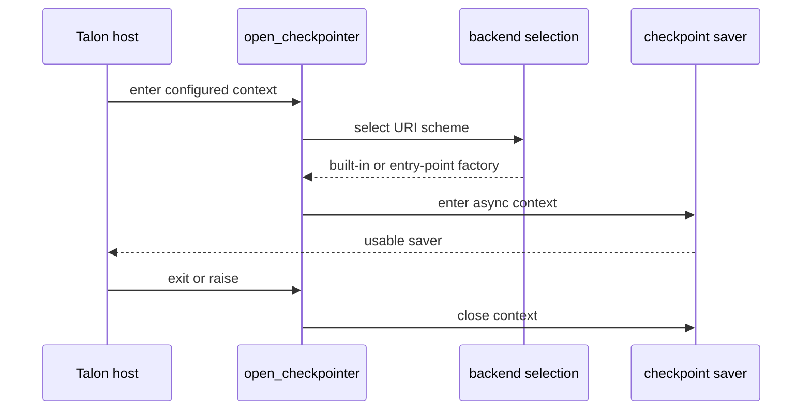
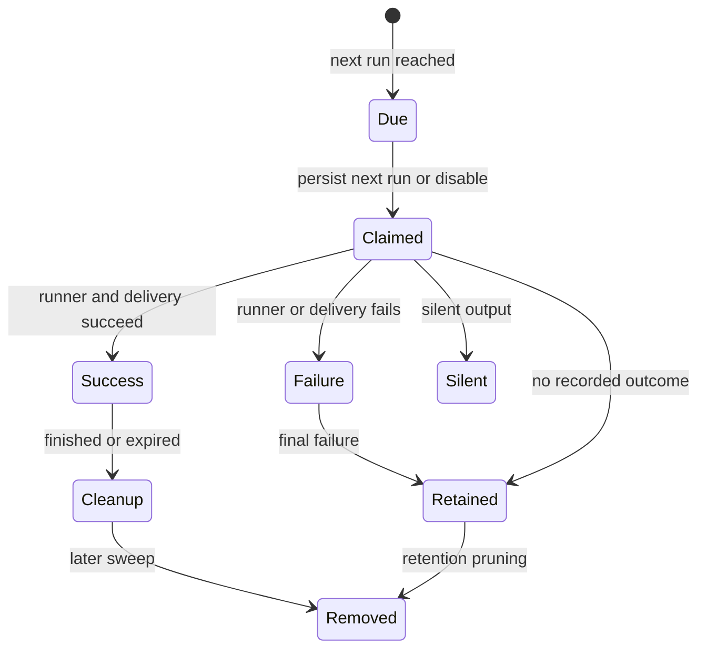
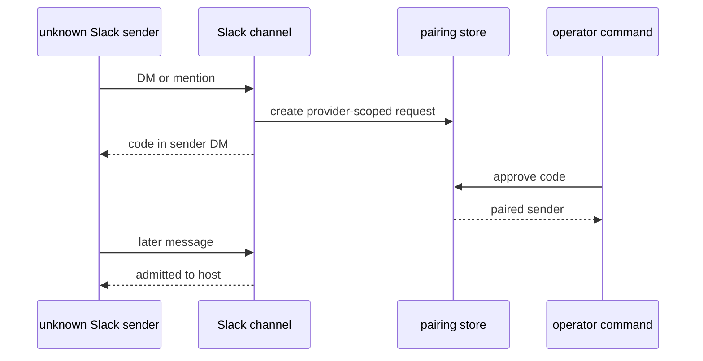

# Testing Guide

Put a regression at the narrowest boundary that proves its user-visible contract. Unit tests must be deterministic and network-free: use temporary directories, injected clocks, fake gateways, fake models, and recording callbacks rather than live providers, sleeps, or private call-order assertions. Tests live with their owning package and normally mirror its source layout. Warnings are errors, so fix a new warning rather than adding a broad filter. See [Development](../operations/development.md) for setup and the [source map](../architecture/source-map.md) for package ownership.

## Run the owning target

Install dependencies in the package being changed with `uv sync --all-groups`, then use its `Makefile`. Talon's `make test` first runs WhatsApp bridge Node tests, then runs the selected `TEST_FILE` with non-Unix sockets disabled, Unix sockets allowed, a 10-second pytest timeout, and coverage; `make lint` runs Ruff checks/format diff and `ty` for Talon source. dcode unit tests similarly block non-Unix sockets, while its integration target does not; `update-snapshots` is the explicit network-free smoke-snapshot update target.

```bash
cd libs/talon
make test TEST_FILE=tests/unit_tests/test_checkpoint_backends.py
make test TEST_FILE=tests/unit_tests/test_cron_concurrency.py
make test TEST_FILE=tests/unit_tests/test_pairing.py
make test TEST_FILE=tests/unit_tests/test_pairing_slack.py
make test TEST_FILE=tests/unit_tests/test_slack_oauth_context.py
make lint

cd ../code
make test TEST_FILE=tests/unit_tests/smoke_tests/test_system_prompt.py
make test TEST_FILE=tests/unit_tests/tui/widgets/test_subagent_panel.py
make update-snapshots
make lint
```

Do not use `make update-snapshots` as a way to accept an unexplained prompt change: first inspect the complete diff and decide whether it represents the intended model-visible contract.

## Talon checkpoint selection: URI validation, plugin ownership, and safe errors

`open_checkpointer` is the lifetime boundary for LangGraph checkpoint persistence. With no configured URI it opens Talon's local SQLite path. Otherwise it selects a built-in scheme (`sqlite`/`file`, PostgreSQL, or MongoDB) or exactly one installed `deepagents_talon.checkpoint_backends` entry point whose name matches the URI scheme. The returned factory is an async context manager, so a custom backend must be closed even when work in the caller's context raises.

Test behavior at this public seam, not the lookup sequence. The focused suite establishes that the default and configured SQLite path retain a checkpoint across separate openings; that a custom entry-point factory receives the URI and cleans up on exception; and that unsupported, malformed, or incomplete URIs fail as `TalonConfigError`. For a driver initialization failure, assert the stable operator-facing message and assert that credentials from the URI are absent. This is a security contract: exceptions from a driver may contain the full connection URI.


```mermaid
sequenceDiagram
    participant Host as Talon host
    participant Open as open_checkpointer
    participant Select as backend selection
    participant Saver as checkpoint saver
    Host->>Open: enter configured context
    Open->>Select: select URI scheme
    Select-->>Open: built-in or entry-point factory
    Open->>Saver: enter async context
    Saver-->>Host: usable saver
    Host->>Open: exit or raise
    Open->>Saver: close context
```

*Checkpoint backend selection owns both configuration-safe startup errors and the saver lifecycle.*

## Cron store: concurrent mutations and durable claims

`CronJobStore` is a JSON store with a process-local reentrant lock shared by stores addressing the same resolved `jobs.json` path. A complete read-modify-write mutation, including cache refresh, occurs under that lock; it coordinates stores in one process but intentionally does not coordinate another process or an external writer. Job execution and delivery are outside the lock.

The concurrency regression uses two threads and an observed lock—not timing—to pause one writer until the contender demonstrably encounters the held lock. Run every mutation (`create`, edit, remove, claim, result marking, discard, and prune) against both the same store instance and a second instance with a primed cache. The observable assertions are that a concurrently created record is never lost, removal semantics remain correct, and both cached stores converge with a fresh store after completion. A reader contending with a write must observe the completed persisted record, not a partial result.

The independent claim invariant deserves its own race test: two stores claiming the same due job yield one claim and one `None`; the stored result has a single completed repeat and the next scheduled time. This protects at-most-once claiming without asserting internal helper order.


```mermaid
stateDiagram-v2
    [*] --> Due: next run reached
    Due --> Claimed: persist next run or disable
    Claimed --> Success: runner and delivery succeed
    Claimed --> Failure: runner or delivery fails
    Claimed --> Silent: silent output
    Success --> Cleanup: finished or expired
    Failure --> Retained: final failure
    Claimed --> Retained: no recorded outcome
    Cleanup --> Removed: later sweep
    Retained --> Removed: retention pruning
```

*The scheduler claims durably before callbacks; completed-history cleanup is a later store concern.*

Before invoking a due job, `CronJobStore.advance_next_run` advances or disables the occurrence and persists the claimed record; this claim-before-run ordering prevents a due one-shot from remaining due while its callback runs. The scheduler records success, runner failures, and delivery failures after claiming a job, suppresses delivery for `[SILENT]` output, and continues scanning after an unexpected tick failure.

Keep calendar coverage deterministic with fixed UTC/local datetimes and `ZoneInfo`. Talon cron-expression tests protect calendar semantics including day-of-month/day-of-week matching, `L`/`LW`/`W`/last-weekday/nth-weekday extensions, leap-year and rare future matches, and rejection of expressions that can never fire. Talon schedules preserve requested local wall-clock behavior across daylight-saving transitions: spring gaps snap forward without duplicate firing, fall-back ambiguous times fire once, and daily schedules retain their local hour including sub-hour gaps. `until` is valid only for recurring jobs and is inclusive for a due occurrence, with a five-minute grace for scheduler latency; a run missed beyond that grace is disabled rather than delivered after the requested window.

Finished or expired jobs are normally discarded on a later scheduler sweep, but failed final runs and jobs claimed without a recorded outcome are retained for inspection until retention pruning; a newly enabled replacement schedule prevents removal. Test persisted records and removal decisions, not merely whether a callback ran.

## Sender pairing and Slack boundaries

Pairing is a channel admission policy, not an agent prompt. An unknown sender creates a provider-scoped, expiring request; an operator alone consumes its code through the channel control surface or CLI. A paired sender may be admitted in later DMs and visible chats, but never becomes an operator. Environment-configured senders remain authoritative and cannot be revoked through pairing. The JSON store is private (`0600`), refuses symlinks, performs locked atomic replacement for mutations, and fails closed for unreadable or corrupt admission state.

Test the pairing store with an injected epoch clock. Cover the unambiguous eight-character alphabet, case/separator normalization, single-use and expiry, provider isolation, capacity per provider, repeat requests, and corrupt-state failure. At the adapter boundary, prove an unpaired DM reaches neither the host nor agent and receives at most one code; a guild message must not issue one. After operator approval, prove admission in both direct and shared chats and that reactions use the appropriate conversation identifiers. Revocation must block future input, cancel the sender's active work, and pause only scheduled jobs attributed to that sender.

Slack adds one important transport boundary: an unknown channel mention sends the code only through the requester's opened DM, and no pending request is created when that DM cannot be opened. A known sender must not trigger DM opening. `/talon pair` passes its argument through, returns command responses through its responder rather than normal channel posts, and requires an authorized operator; pairing cannot be enabled with open exposure.


```mermaid
sequenceDiagram
    participant Sender as unknown Slack sender
    participant Channel as Slack channel
    participant Store as pairing store
    participant Operator as operator command
    Sender->>Channel: DM or mention
    Channel->>Store: create provider-scoped request
    Channel-->>Sender: code in sender DM
    Operator->>Store: approve code
    Store-->>Operator: paired sender
    Sender->>Channel: later message
    Channel-->>Sender: admitted to host
```

*The code is delivered and approved outside model input; approval changes the sender admission state.*

OAuth callback text is another strict model-input boundary. The Slack gateway filters historical loopback OAuth callbacks before thread-context truncation, including Slack link formatting, mentions, surrounding text, alternate loopback hosts, error callbacks, and overlong strings. At the host boundary, an unsolicited callback does not create an agent request or pending authorization; retrieved context preserves trusted ordinary history but excludes untrusted content and callback secrets from both request text and representation. Keep the fake gateway and host drain helper: no Slack credentials or live Socket Mode connection are needed.

## dcode: composed-prompt snapshots and Textual behavior

The CLI prompt snapshot is a model-visible integration contract, not a unit test of prompt-building helpers. It creates the real CLI agent and middleware with an `InMemorySaver` and a fake chat model that captures the first `SystemMessage`. Patch model identity, current directory, local-context detection, backend roots, and settings paths; seed a user skill and memory file; then redact temporary, built-in-skill, and profile paths before comparing the complete prompt golden file. Snapshot both interactive and headless local modes.

The companion mode matrix should remain narrower than a full snapshot while protecting semantic differences: memory content and secret-handling guidance are present; disabled automatic memory saving is stated; interactive prompts may ask the user; headless prompts omit unreachable question instructions, report blockers and completed work, and do not invent missing identifiers or permissions. Update snapshots only for intentional user/model-visible changes.

Textual widget tests should mount the real `SubagentPanel` in a minimal `App` and drive it with `run_test()` and realistic lifecycle event dictionaries. Assert rendering and durable user-facing state: active selection follows the newest phase until navigation locks it, user collapse survives a turn reset, a narrow header keeps its full toggle hint while its summary clips, and the next turn clears stale rows. Interrupted in-flight rows become cancelled without changing completed rows; duplicate/replayed events must preserve final status and duration. Also exercise hostile labels so terminal escapes are removed and newlines are flattened, and verify phase duration is wall-clock span across staggered subagents rather than the longest child duration.

## Focused-regression checklist

1. Start at the owning public boundary: `open_checkpointer`, `CronJobStore`, pairing/channel admission, Slack context retrieval, CLI-agent composition, or the mounted widget.
2. Replace nondeterminism with a temporary path, fixed clock, fake gateway/model, recording sink, or Textual pilot.
3. Assert a persisted record, admission result, sanitized error, model-visible prompt/context, sent response, or rendered state—not private implementation sequencing.
4. Add the failure or lifecycle edge: malformed URI, driver exception, contested claim, corrupt pairing store, unavailable DM, revocation, historical callback, headless mode, cancellation, or replay.
5. Run the focused target and `make lint`; use a live integration only when the deterministic boundary cannot establish the contract.
