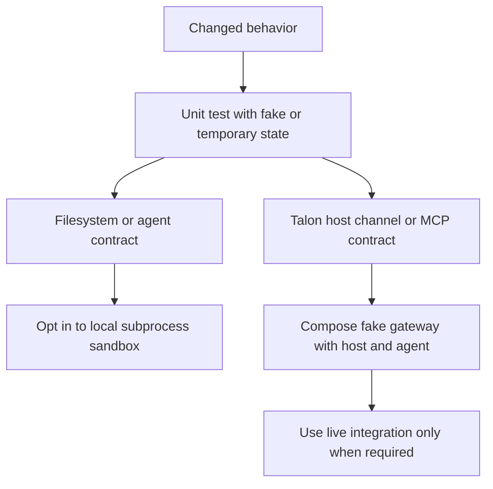
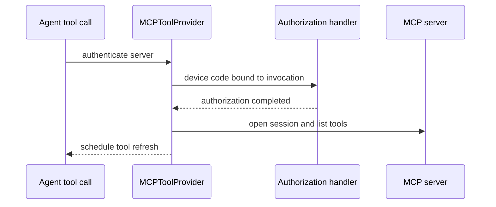
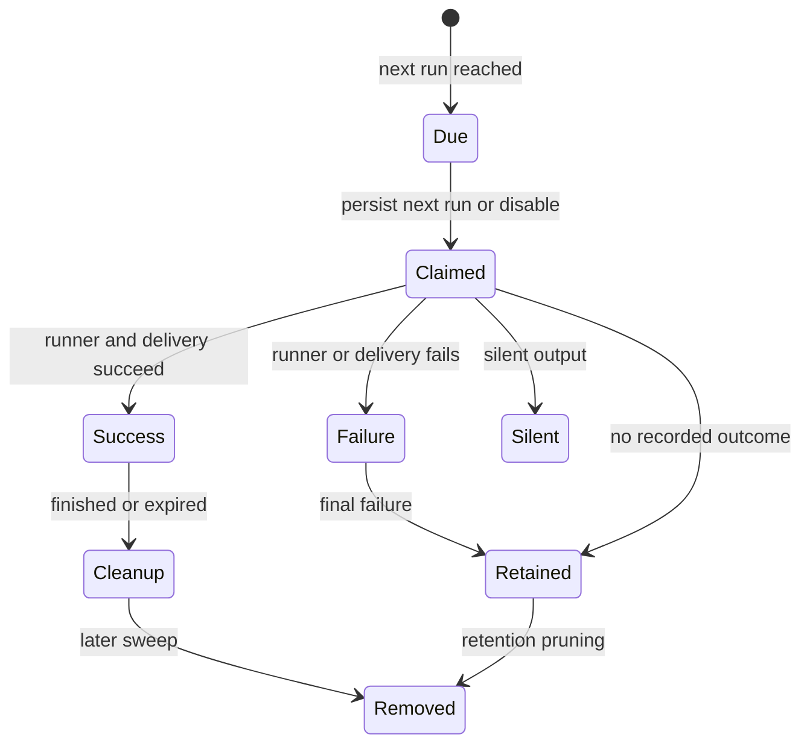

# Testing Guide

Test the behavior owned by the changed boundary, not an incidental implementation detail. In this monorepo, work in the package that owns the change, install dependencies with `uv sync --all-groups`, and use that package's `Makefile`; packages are independently versioned and have separate environments. Test paths mirror source paths: a change to `deepagents/middleware/foo.py` normally belongs in `tests/unit_tests/middleware/test_foo.py`. Warnings are errors unless they are a reviewed exception, so fix a new warning rather than hiding it. [Development](../operations/development.md) describes the shared development workflow, while the [source map](../architecture/source-map.md) locates the packages.


```mermaid
flowchart TD
    Change["Changed behavior"] --> Unit["Unit test with fake or temporary state"]
    Unit --> Files["Filesystem or agent contract"]
    Unit --> Talon["Talon host channel or MCP contract"]
    Files --> Sandbox["Opt in to local subprocess sandbox"]
    Talon --> Host["Compose fake gateway with host and agent"]
    Host --> Network["Use live integration only when required"]
```

*Choose the lowest boundary that exposes the observable contract without a provider connection.*

## Run the owning target

From `libs/deepagents`, `make test` defaults to `tests/unit_tests/`, runs pytest in parallel with coverage, and blocks Internet sockets while allowing Unix sockets. `make integration_test` instead selects `tests/integration_tests/` and is the network-permitted route. Talon's `make test` first runs the WhatsApp bridge Node tests, then runs the selected pytest path with non-Unix sockets blocked, Unix sockets allowed, a 10-second timeout, and coverage. `make lint` in Talon performs Ruff checks, a format diff, and `ty`; Deep Agents similarly runs Ruff plus `ty`.

```bash
cd libs/deepagents
make test TEST_FILE=tests/unit_tests/middleware/test_blob_offload.py
make test TEST_FILE=tests/unit_tests/middleware/test_filesystem_middleware_init.py
make test TEST_FILE=tests/unit_tests/test_end_to_end.py
RUN_SANDBOX_TESTS=true make test TEST_FILE=tests/unit_tests/test_local_sandbox_operations.py
make lint

cd ../talon
make test TEST_FILE=tests/integration_tests/test_slack_host.py
make test TEST_FILE=tests/test_mcp.py
make test TEST_FILE=tests/unit_tests/test_messaging.py
make test TEST_FILE=tests/cron/test_scheduler.py
make lint
```

`test_local_sandbox_operations.py` is deliberately skipped unless `RUN_SANDBOX_TESTS=true`: it uses a `LocalSubprocessSandbox` and runs commands on a temporary local directory. Keep this opt-in test for behavior that depends on `BaseSandbox` command and file semantics; ordinary filesystem/middleware tests should stay deterministic without a shell.

## Deep Agents filesystem regressions

### Binary blob offload: test both optimization and distrust

`FilesystemMiddleware` can replace binary `read_file` blocks with content-addressed references. It stores bytes at `{artifacts_root}/blobs/<sha256>`, leaving a digest reference in persisted messages, then hydrates a model request from a per-run cache or backend download. This protects checkpoints from carrying base64 payloads but makes the blob boundary untrusted: downloaded bytes must hash to the recorded digest before they are restored.

Test this at the middleware seam with a `FilesystemBackend(root_dir=tmp_path)` and crafted `ToolMessage`/`Command` values:

- Offload only the `read_file` media path; unrelated tool results stay inline. A `Command` containing multiple messages must process each applicable message while retaining metadata needed for media ordering.
- Assert the stub contains the image MIME type and SHA-256 reference rather than base64. For a tampered on-disk blob, a malformed reference (including path traversal), missing data, or a failed download, assert the model receives the explicit unavailable-content notice—not attacker-controlled data.
- Make upload fail and assert the original binary payload remains inline. Offload is best-effort and must not turn a successful file read into data loss.

This is a security and resilience contract, not merely a storage-size test. See [filesystem tools](../concepts/tools-filesystem.md) for the user-facing tool boundary.

### Middleware construction and end-to-end state

Filesystem middleware must be constructed with a backend *instance*; backend classes and factory callables are rejected. Its state schema includes `files` whenever the backend is `StateBackend`, including a nested `CompositeBackend` route, and omits it for pure store-backed routing. Custom tool descriptions replace only the named tool descriptions; the default descriptions for the remaining tools stay intact. Keep these as construction tests, without an LLM call where possible.

Use the fake-chat-model end-to-end suite when the regression crosses the compiled agent boundary. It parameterizes filesystem, graph-state, and store backends and verifies observable tool messages. In particular, preserve line-window behavior for an oversized source line and the two-turn case where no initial `files` value is supplied: a subsequent `glob` must see valid file state rather than a list-shaped corruption. The fake model makes tool calls and final agent output reproducible without provider credentials.

### Local sandbox operations

The opt-in local sandbox suite validates the real `BaseSandbox` file-operation contract through a local subprocess implementation while translating an isolated real directory back to a stable virtual path. Add cases here for platform-like behavior that a pure fake cannot establish: parent-directory creation, raw bytes upload/download, normalized virtual paths, read windows, standard `not_found`/`not_a_file`/`permission_denied` errors, literal replacement rules, and preservation of LF/CRLF style across a read-edit round trip. Test both inline and upload-backed edits when payload size changes the execution path.

## Talon host and channel behavior

### Slack composition is separate from adapter parsing

Keep adapter-level event conversion and host composition distinct. The Slack host integration suite injects a fake Socket Mode gateway into a real `SlackChannel` and `TalonHost`, with an echo agent, so it can prove a channel mention is posted in its source thread and a follow-up resolves to the same conversation ID. A different root message must get a different conversation. Thread context is supplied as history without replacing the current message; commands and approval replies must remain control flows rather than become model prompts.

Slash-command help uses the command responder and must not emit a normal channel post. This focused composition test does not need Slack credentials or a live Socket Mode connection. Broader adapter security and media handling belong with the channel tests described in the [Talon integration guide](../integrations/talon.md).

### Progress messaging and host lifecycle

`ProgressMessages` may deliver nonblank narration before a tool executes, but suppresses reasoning blocks and subagent narration; a delivery failure does not stop the tool run or reveal private transport detail. After an approval rejection, delivery occurs before the remaining allowed tool work when the graph resumes. Test this with a fake model, context-scoped `MESSAGE_HANDLER`, and a recording delivery function.

For runtime behavior, invoke two requests concurrently with different recording channels. Each `send_message` must use its own request's handler, and the context variable must be reset afterwards. At the host boundary, progress is routed only to the source conversation and handler delivery expires after completion or `/stop`; a stale handler cannot send a late message.

## Talon MCP and OAuth boundaries

Use `tests/test_mcp.py` with a fake MCP adapter and temporary configuration rather than a server. Validate configuration before connecting: malformed root documents, missing `mcpServers`, or invalid server names must fail before an adapter transport is created. A bad server becomes an error-status server without preventing tools from another working server; an `allowedTools` list filters both exposed tools and the server inventory.

MCP status objects have consistency invariants: an `ok` server cannot carry an error, error and unauthenticated states require an error, unauthenticated servers cannot carry tools, and reconnect is meaningful only for a disabled server. Keep status tools user-safe—availability can be reported, while low-level connection details must not leak in the status description or result.

OAuth tests should treat authorization as an interaction boundary, not a model-visible secret. Device-code events are bound to the initiating tool invocation and completion is reported after credentials persist; device code and verification URL must not appear in event representations. Stored credentials avoid a login prompt, while explicit reauthentication forces a new authorization attempt. Refresh tests must serialize overlapping loads, preserve a request that arrives during a load, retry after cancellation, and avoid repeatedly retrying a failed configuration refresh.


```mermaid
sequenceDiagram
    participant Agent as Agent tool call
    participant Provider as MCPToolProvider
    participant Auth as Authorization handler
    participant Server as MCP server
    Agent->>Provider: authenticate server
    Provider->>Auth: device code bound to invocation
    Auth-->>Provider: authorization completed
    Provider->>Server: open session and list tools
    Provider-->>Agent: schedule tool refresh
```

*OAuth interaction is invocation-bound; refreshed tools are exposed only after a successful reload.*

## Scheduling and history: test time, claims, and cleanup

Use fixed UTC/local datetimes, `ZoneInfo`, a temporary `CronJobStore`, recording runner/delivery callbacks, and `tick_once()` rather than wall-clock sleeps. Calendar tests should cover day-of-month/day-of-week matching, `L`/`LW`/`W`/last-weekday/nth-weekday extensions, leap years, rare future matches, impossible schedules, and daylight-saving wall-clock behavior. A schedule should retain requested local-wall-clock behavior through spring gaps and fall-back ambiguity, including sub-hour gaps.

The scheduler must claim a due job durably before invoking its callback: `advance_next_run` advances or disables the occurrence and persists that record first. Test success, runner failure, delivery failure, `[SILENT]` output, and an unexpected tick failure that must not halt later scanning. An `until` value is only valid for recurring jobs; it includes an occurrence at the deadline and permits a five-minute lateness grace, while a more-late final occurrence is disabled.


```mermaid
stateDiagram-v2
    [*] --> Due: next run reached
    Due --> Claimed: persist next run or disable
    Claimed --> Success: runner and delivery succeed
    Claimed --> Failure: runner or delivery fails
    Claimed --> Silent: silent output
    Success --> Cleanup: finished or expired
    Failure --> Retained: final failure
    Claimed --> Retained: no recorded outcome
    Cleanup --> Removed: later sweep
    Retained --> Removed: retention pruning
```

*The claim precedes callbacks, and terminal failures or incomplete claims remain inspectable before pruning.*

Finished or expired jobs are generally removed by a later sweep. Failed final runs and claimed jobs lacking an outcome remain for inspection until retention pruning, and an enabled replacement schedule prevents cleanup. Those retention cases are history behavior: assert persisted records and their cleanup decisions, not only whether the callback ran. The [build a Deep Agent workflow](../workflows/build-a-deep-agent.md) gives the surrounding agent construction context.

## Focused-regression checklist

1. Identify the owner: filesystem middleware/backend, sandbox, Talon host/channel, MCP/OAuth, messaging, or scheduler history.
2. Start with the narrow existing test file and its fake, temporary directory, fake clock, or recording callback.
3. Assert an observable result: persisted message representation, model-visible fallback, tool output, conversation ID, responder output, authorization/status result, delivery routing, or stored job history.
4. Add the changed failure path: integrity mismatch, upload fallback, malformed configuration, cancellation, stale handler, failed delivery, DST boundary, or retention sweep.
5. Run the focused target and `make lint`; escalate to a live integration only when the deterministic boundary cannot prove the contract.
