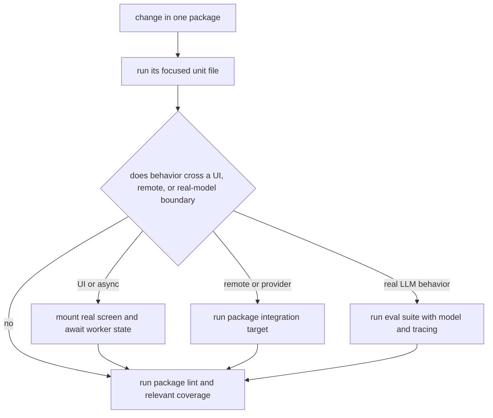
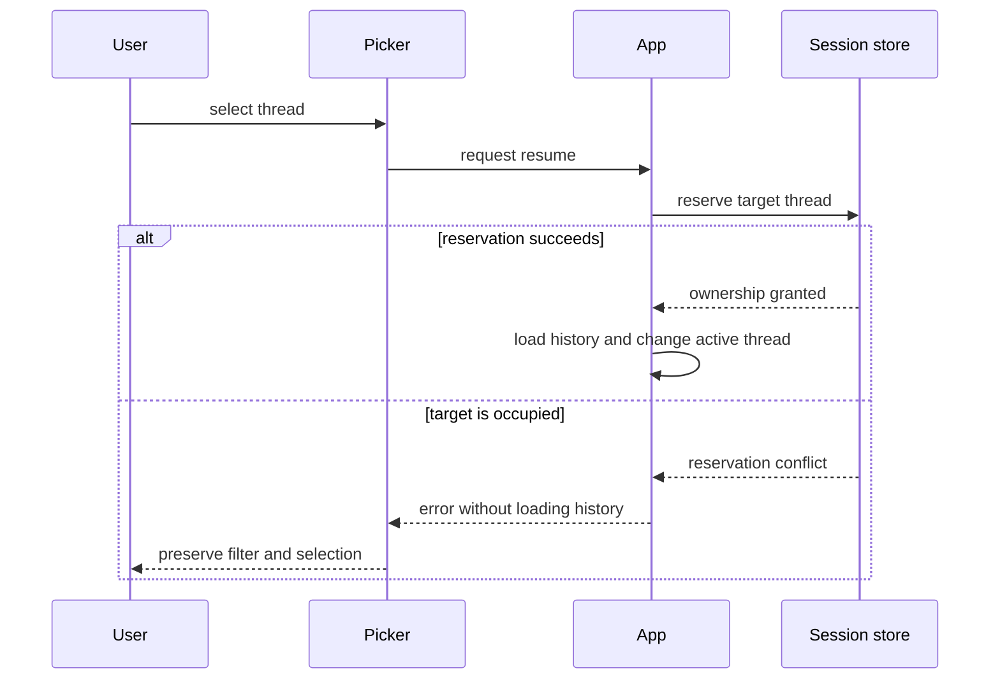

# Testing Guide

Work from the package that owns the change. The monorepo has independently managed package environments, so install dependencies with `uv sync` in that package and use its `Makefile` as the command contract. Start with the smallest test that can observe the behavior you changed; expand from a unit file to a mounted UI test, integration seam, or real-model evaluation only when the boundary requires it. See [Development](../operations/development.md), [Code Agent](../architecture/code-agent.md), [SDK construction and execution](../architecture/sdk-construction-execution.md), and [Run evals](../workflows/run-evals.md).

## Choose the appropriate test layer

| Change boundary | First choice | Escalate when |
| --- | --- | --- |
| Pure SDK behavior, middleware composition, backend semantics | `libs/deepagents/tests/unit_tests/` with fake models and direct agent construction | A provider, sandbox, or externally hosted component is the behavior under test |
| dcode state, commands, or controller behavior | `libs/code/tests/unit_tests/` with temporary state and mocked I/O | Behavior crosses a real server, remote client, sandbox, or process boundary |
| Textual rendering, focus, bindings, workers, and refresh | Mount the real app/screen with `run_test()` and drive the pilot | A direct helper test cannot observe the UI contract |
| Prompt text assembled from many components | Smoke snapshot test with fixed environment inputs | The prompt change is intended and the reviewed golden file must change |
| SDK behavior against an actual model | `libs/evals/tests/evals/` | A deterministic unit test can express the contract more precisely |

Do not make a unit test depend on a developer profile, `.env`, LangSmith credentials, a local daemon, network availability, or scheduler timing. The dcode suite sets a synthetic `DEEPAGENTS_HOME` before imports, restores environment state after every test, clears tracing and other credential-sensitive variables, and disables LangSmith batching. This is the model for tests that otherwise inherit host state: isolate it centrally, then opt in explicitly in the test that needs it. SDK tests similarly reset process-wide deprecation deduplication and cached optional-video dependency detection between tests so xdist ordering does not change assertions.

## Run the owning package target

The normal setup and narrow-first loop is:

```bash
cd libs/deepagents
uv sync --all-groups
make test TEST_FILE=tests/unit_tests/test_graph.py
make lint

cd ../code
uv sync --group test
make test TEST_FILE=tests/unit_tests/test_sessions.py
make lint
```

Both SDK and dcode unit targets use pytest xdist, disable network sockets while permitting Unix sockets, disable benchmarks, and collect coverage. Their integration targets are separate, parallel runs with a 30-second timeout; use them for the actual integration suites rather than silently weakening a hermetic unit test. `TEST_FILE` can narrow a target further, and `PYTEST_EXTRA` passes focused pytest options without changing the Makefile.

`make coverage` is the explicit coverage-report target. `make benchmark` selects benchmark-marked tests, while `make bench` and `make bench-memory` run the benchmark or memory-benchmark subsets under CodSpeed instrumentation. The SDK benchmark directory is `tests/benchmarks`; dcode selects marked tests from `tests`.

`make lint` is a gate, not merely a style check: it runs Ruff checks and formatting verification plus `ty`. In dcode it also verifies the generated slash-command catalog and the process working-directory policy. Run the package target after focused tests; use `make -C libs lint` only for a deliberate repository-wide validation. Pytest warnings are errors by default in the packages, with a reviewed allowlist, so fix a newly exposed warning rather than masking it.


```mermaid
flowchart TD
    Change["change in one package"] --> Narrow["run its focused unit file"]
    Narrow --> Boundary{"does behavior cross a UI, remote, or real-model boundary"}
    Boundary -->|no| Quality["run package lint and relevant coverage"]
    Boundary -->|UI or async| Mounted["mount real screen and await worker state"]
    Boundary -->|remote or provider| Integration["run package integration target"]
    Boundary -->|real LLM behavior| Eval["run eval suite with model and tracing"]
    Mounted --> Quality
    Integration --> Quality
    Eval --> Quality
```

*Testing expands only when the changed observable contract crosses a boundary that a focused unit test cannot represent.*

## Snapshots and generated references

The dcode Makefile provides network-restricted parallel unit tests and an explicit `update-snapshots` target that runs smoke snapshots with the `--update-snapshots` option. The SDK has the equivalent smoke-snapshot target. Snapshot tests capture the full first system message using a fake model, but fix CWD, model identity, context data, backend roots, and optional-feature gates so the golden file is machine-independent. Review the semantic prompt diff before running `make update-snapshots`; never use it to accept an unexplained failure.

`COMMANDS.md` is an auto-generated reference derived from the slash-command registry; the Makefile has separate regeneration and verification targets, and the catalog distinguishes public commands from hidden commands intentionally omitted from autocomplete and help. After changing command names, aliases, descriptions, or visibility, run:

```bash
cd libs/code
make commands-catalog
make commands-catalog-check
```

## SDK middleware and subagent regressions

Test assembly through `create_deep_agent()` and inspect the compiled middleware passed to agent construction. This is the appropriate seam for replacement and ordering contracts, which isolated middleware behavior cannot establish.

- Deep Agents merges caller middleware by middleware name: a matching name replaces the default in place, while novel middleware is appended in caller order.
- Middleware-stack regressions require custom prompt-mutating middleware to precede Anthropic prompt caching, and place `SkillsMiddleware` immediately before prompt caching after user and profile middleware in main and subagent stacks.
- The general-purpose subagent inherits main-agent overrides only for its default slots, whereas declarative subagents construct independent stacks; Todo middleware is opt-in through the appropriate agent specification or profile rather than inherited from a main-agent opt-in.

Use fake chat models and patched construction dependencies to make these tests deterministic. Assert names, types, and relative order at the compilation boundary—not incidental private calls inside a middleware implementation.

## dcode persistence and inspection contracts

Use a temporary SQLite database for sessions and an application-level test for ownership. A name is durable metadata, not a checkpoint field; storage, app resume, and inspection each have distinct responsibilities.

- Session-name regressions require a trimmed manual name to survive later checkpoints, atomic `only_if_unnamed` generation to select one concurrent winner, durable names to take precedence over checkpoint metadata without blocking readers, and invalid blank, overlong, newline, or control-containing names to be rejected.
- At the app boundary, a most-recent resume skips occupied threads and reserves an eligible candidate; explicit reservation conflicts preserve the current thread and do not load history, and a mounted thread picker retains its filter and selection when a selected thread is owned elsewhere.
- The thread inspector opens only a supported sessions database in SQLite read-only mode, resolves only root-thread IDs with literal escaped prefix matching, and rejects missing, ambiguous, or subagent-only targets.
- The inspector summarizes root checkpoints and writes, prefers a durable `dcode_thread_names` value over legacy checkpoint metadata, reconstructs state from inline checkpoint messages and pending writes, and warns while preserving usable state for corrupt metadata or malformed overwrite data.


```mermaid
sequenceDiagram
    participant User
    participant Picker
    participant App
    participant Store as Session store
    User->>Picker: select thread
    Picker->>App: request resume
    App->>Store: reserve target thread
    alt reservation succeeds
        Store-->>App: ownership granted
        App->>App: load history and change active thread
    else target is occupied
        Store-->>App: reservation conflict
        App-->>Picker: error without loading history
        Picker-->>User: preserve filter and selection
    end
```

*Ownership is acquired before the app loads a transcript or changes the active thread.*

## Mounted Textual, terminal, and completion tests

For visible behavior, mount the real screen or app with `run_test()`, send pilot input, and wait for the relevant worker or `pilot.pause()`. Assert rendered content, focus, modal stack, persisted state, and inserted text. A direct helper test is useful for pure formatting but cannot prove binding precedence, detach safety, or asynchronous lifecycle behavior.

- Debug-console mounted tests protect snapshot wrapping, once-per-outage warning behavior, per-level bounded chronological log retention, bottom-following initial log display, modal Escape behavior, persistent clear boundaries, and focus traversal despite an app-level competing binding.
- Textual patch tests exercise selection extension across widgets and scrolling, guard against detached Markdown selection and detached compositor hits, and verify terminal parser behavior for kitty sequences, double Escape, and lock-key reports without swallowing genuine key input.
- Thread completion tests keep `@@` references separate from file completion, search thread metadata including saved names, insert a full durable thread token, and sanitize or bound display labels.
- File-completion regressions use Git-aware discovery that orders tracked before untracked files, treats successful empty output as authoritative, deduplicates conflicts, preserves tracked results after an untracked scan failure, sanitizes genuine failure diagnostics, and falls back quietly outside a Git repository.
- File completion scopes repository-relative paths to the resolved working-directory subtree, including symlinked CWDs, excludes shared-prefix siblings, and fails closed when CWD is outside the project root.
- Thread-selector tests distinguish unloaded checkpoint details from loaded empties; protect modal dismissal, narrow-screen name visibility and literal rendering, persisted scope and sort behavior, keyboard ownership of an open scope select, and completion of failed background loads.
- Thread-selector lifecycle tests permit header-link resolution ahead of a blocked thread load, leave the title unchanged on link-resolution timeout, populate visible checkpoint detail columns before an uncached initial render, preserve cached prompts during refresh, and fetch prompt data when the prompt column is enabled.

For asynchronous tests, use an event gate or controlled future to prove ordering: for example, release a header-link request while a list load remains blocked, then assert the independently available UI state. Always exercise failure completion as well as success so a worker exception cannot leave a modal permanently loading or undismissible.

## Real-model evals

Evals are a separate, end-to-end behavioral suite. They run an agent against a real LLM, capture tool calls, file mutations, and final response, and report to LangSmith. They are not substitutes for deterministic unit regressions: use them when validating capability, quality, or trajectory behavior that depends on model output.

From `libs/evals`, `make evals MODEL=<id>` requires a model identifier and runs `tests/evals` with `LANGSMITH_TEST_SUITE=deepagents-evals`. The eval configuration aborts early unless tracing is enabled and a model was supplied. Set `LANGSMITH_API_KEY` and one of the supported tracing variables such as `LANGSMITH_TRACING=true`; use `--eval-category` (repeatable) or `--eval-tier` to narrow a run, and validate category names against collected tests.

```bash
cd libs/evals
uv sync
export LANGSMITH_API_KEY="..."
export LANGSMITH_TRACING=true
make evals MODEL=claude-opus-5
# Repeat a noisy experiment and aggregate its metrics
make evals-trials MODEL=claude-opus-5 TRIALS=5
```

An eval creates a `TrajectoryScorer`: `.success(...)` checks correctness and fails the test, while `.expect(...)` records non-failing efficiency expectations such as steps or tool calls. The reporter aggregates correctness, duration, and efficiency metrics, supports a JSON report through `--evals-report-file` or `DEEPAGENTS_EVALS_REPORT_FILE`, and records category results. Tag a new eval with `@pytest.mark.langsmith`, an `eval_category`, and the appropriate `eval_tier`; then regenerate the catalog with `make eval-catalog`. The eval package's `make lint` also checks catalog drift and type-checks eval, Harbor, and unit-test sources.

Harbor is a separate sandbox benchmark path. Its targets stage checked-out local SDK, code, ACP, and QuickJS packages into `.local_deps` before invoking Harbor, so use a Harbor target when the intended question is sandboxed benchmark behavior rather than ordinary model-eval correctness.

## Safe-change checklist

1. Locate the owning package and closest existing test; mirror its fixture and assertion style.
2. Make host state deterministic with temporary files, SQLite, Git repositories, fake models, patched clocks or I/O, and explicitly controlled async events.
3. Assert an externally meaningful outcome: compiled middleware order, durable database state, reservation result, rendered UI/focus, snapshot text, or trajectory correctness.
4. Test the meaningful failure path: reservation conflict, malformed persisted state, detached widget, background-load failure, Git scan failure, or provider boundary.
5. Run the focused file, then the package lint target. Add integration, snapshots, or evals only for their corresponding boundary, and regenerate checked-in catalogs only through their Make targets.
