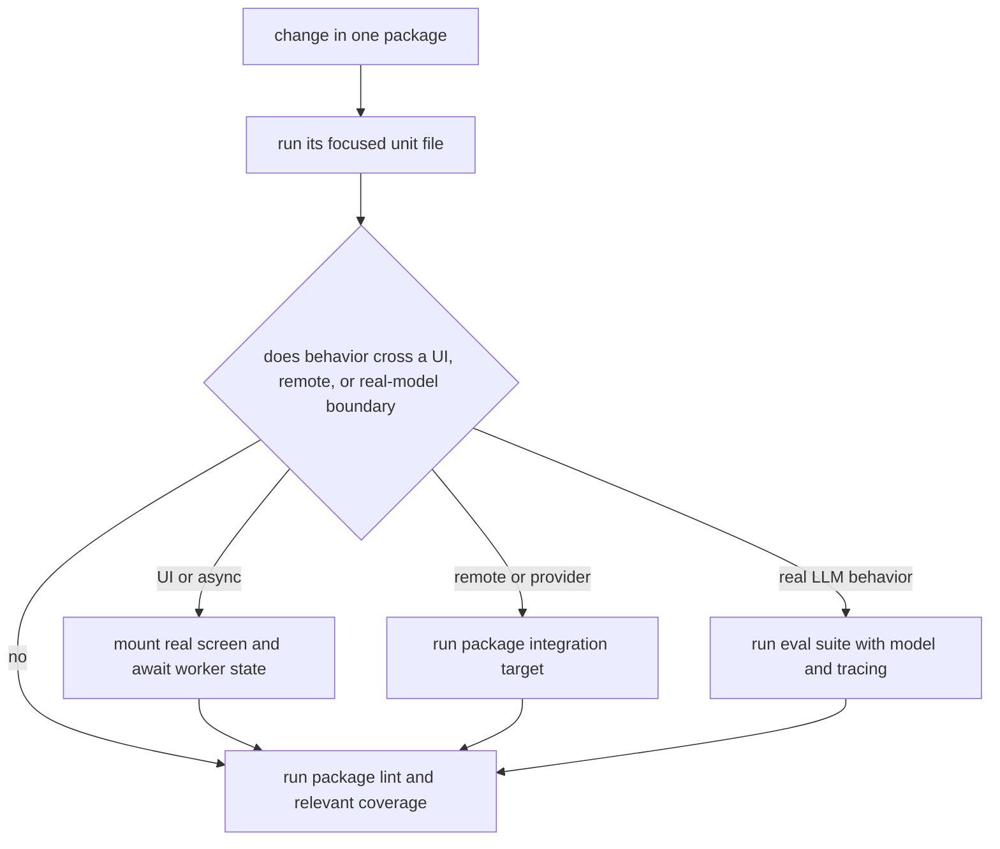

# Testing Guide

Work in the package that owns the behavior. Packages under `libs/` are independently versioned and each has its own environment and `Makefile`; install with `uv sync` and treat that Makefile as the supported command contract. Tests mirror source layout, so begin with the closest existing test and assert an externally meaningful result rather than private implementation calls. See [Development](../operations/development.md), [Code Agent](../architecture/code-agent.md), [Subagents and skills](../concepts/subagents-skills.md), and [Talon channel admission](../concepts/talon-channel-admission.md).

## Select the smallest boundary

| Change boundary | First test location and technique | Escalate only when |
| --- | --- | --- |
| SDK skill parsing, loading, pinning, or subagent isolation | `libs/deepagents/tests/unit_tests/middleware/`; temporary skill trees, `FilesystemBackend`, `InMemorySaver`, and fake chat models | The behavior depends on a real provider or hosted runtime |
| dcode configuration, sessions, costs, titles, or remote protocol adaptation | `libs/code/tests/unit_tests/`; temporary files/SQLite, controlled fakes, and `httpx.MockTransport` | The actual remote service or external contract is the subject |
| Textual rendering, input, focus, or lifecycle | Mount a minimal app or `DeepAgentsApp` with `run_test()` and drive a pilot | A pure helper is sufficient and does not need Textual dispatch/lifecycle coverage |
| Talon Slack conversion, admission, output policy, or context sanitation | `libs/talon/tests/channels/` with a recording gateway and inert tokens | Slack SDK/host integration is the contract under test |
| Generated prompt or command reference | Focused smoke snapshot or generation/check target | A reviewed change intentionally updates the artifact |

Keep unit tests network-free and deterministic. Do not inherit a developer profile, credentials, local daemon, live Slack workspace, or timing race. The repository policy places network-free tests in `tests/unit_tests/` and networked tests in `tests/integration_tests/`; warnings are errors, and package configuration uses automatic asyncio handling rather than `@pytest.mark.asyncio`.


```mermaid
flowchart TD
    Change["change in one package"] --> Narrow["run its focused unit file"]
    Narrow --> Boundary{"does behavior cross a UI, remote, or real-model boundary"}
    Boundary -->|no| Quality["run package lint and relevant coverage"]
    Boundary -->|UI or async| Mounted["mount real screen and await worker state"]
    Boundary -->|remote or provider| Integration["run package integration target"]
    Boundary -->|real LLM behavior| Eval["run eval suite with model and tracing"]
    Mounted --> Quality
    Integration --> Quality
    Eval --> Quality
```

*Expand the test layer only when the observable contract crosses a boundary that a focused unit test cannot represent.*

## Run package-scoped validation

```bash
cd libs/deepagents
uv sync --all-groups
make test TEST_FILE=tests/unit_tests/middleware/test_skills_middleware.py
make lint

cd ../code
uv sync --group test
make test TEST_FILE=tests/unit_tests/test_sessions.py
make lint
```

Both `deepagents` and `code` run their normal unit target with pytest xdist, socket access disabled except for Unix sockets, benchmarks disabled, and coverage. Their separate `integration_test` target is parallel and applies a 30-second timeout; use it for real external contracts rather than weakening a unit test. `TEST_FILE` narrows the suite and `PYTEST_EXTRA` carries focused pytest options. `make coverage` is the explicit coverage-report target.

The dcode `lint` target also verifies the generated command catalog and the process working-directory policy. Use package `make lint` after focused tests; use `make -C libs lint` only when deliberately validating repository-wide impact.

## SDK skills and subagent boundaries

Skills tests should create a disposable skill directory and exercise the compiled agent through `create_deep_agent()`. Validate the user-visible model context and persisted graph state, not YAML-parser internals alone.

A valid skill has frontmatter whose lowercase, hyphenated name matches its directory and includes a nonblank description. Metadata parsing accepts optional license, compatibility, metadata, and `allowed-tools`; malformed frontmatter, invalid metadata, unreadable files, and oversized files are excluded rather than admitted. Test both a usable skill and a rejected neighboring skill so a bad file cannot poison discovery.

Pinned skills are conversation snapshots: requested names are de-duplicated in caller order, unknown or unreadable names are skipped, and each loaded body is stored as a `pinned_skill` human message after the user message. A later turn uses that stored snapshot even if the file changes; pinning again appends the then-current body. The request-only `pinned_skills` field must not leak in the result, and a subagent result must not pin a skill into its parent conversation.

For extension safety, cover synchronous and asynchronous invocation when a middleware hook supports both. When a pinned skill exposes tools, verify tool availability lasts only while its pinned message survives summarization.

## dcode configuration and persistent session behavior

Use a temporary `sessions.db` and patch `sessions.get_db_path` rather than a developer database. A seed is resumable without overwriting later work, and an interrupted seed write releases its ownership reservation. Activity refresh changes recency but preserves the original creation ordering.

Thread names are durable session metadata: manual names are trimmed and survive later checkpoints; atomic `only_if_unnamed` naming permits only one concurrent generated-name winner; durable names are preferred while listing can continue during another connection's write. Reject blank, overlong, newline-containing, and control-containing names.

Configuration tests need to distinguish process mutation from workspace preview. Project-specific dotenv snapshots resolve independently without replacing `os.environ`; their bindings are immutable and reset after an exception. Preserve shell-over-project-over-global precedence, record provenance without printing the raw dotenv value, and ensure a project dotenv cannot promote denied settings through interpolation or alter privileged subagent/MCP behavior.

### Cost and remote-client seams

Cost tests should isolate the context-local recorder and use synthetic usage metadata. For unpriced models, token counts remain useful but category cost completeness is false. A prepared operation-cost drain is transactional: `commit()` prevents double counting and `rollback()` restores records for retry; legacy checkpoints without a valid breakdown remain historically incomplete after new usage is added.

Remote client tests should use `httpx.MockTransport` or a mocked `RemoteGraph`, never a server. Preserve top-level config such as tracing tags. When workspace context is sent, the remote request must not carry incompatible configurable values; attach an ownership header only for locally owned threads while retaining caller headers. Convert streamed messages and interrupts at the client boundary, and make side-accounting failures non-fatal: retain main stream/state results and cached or checkpoint cost. On a state-write conflict, cancel active running and pending runs with an interrupt, then retry once; a persistent conflict still surfaces.

## Thread-title and mounted Textual regressions

Thread-title generation is a constrained side operation. Feed the naming model only visible human/AI conversation—not system instructions, local context, shell output, or tool output—bound the submitted conversation, disable callbacks, normalize the returned title, and reject an empty result. Use a controlled timeout and confirm that a stalled model is cancelled; title-only requests must remove inherited OpenAI tools/functions and Anthropic MCP/tool options without mutating the main model's configuration.

Mount Textual tests when the contract depends on event routing or attachment state. The patch suite verifies word/block selection, Shift extension across widgets and after scrolling, and safe rejection of a detached Markdown anchor or compositor hit. Terminal-parser tests retain native kitty sequences, interpret double Escape as `alt+escape`, normalize lock-key reports without inserting text, and preserve genuine text/key input. Use `run_test()`, pilot events, and explicit pauses rather than wall-clock sleeps.

`DeepAgentsApp` startup tests should use controlled events and mocked agent work. Important orderings include: hydrate resumed history only once even after later `ServerReady` events; keep the resuming status until history restoration completes; run restored history before startup output; and do not submit an initial prompt after a required resumed-model adoption fails. For modal command flows, submit through the real message pump and prove Escape remains responsive; an unanswered modal must block queued work until its continuation begins.

## Talon Slack security boundaries

Slack channel tests use a recording gateway and inert token strings. Configuration requires both Slack tokens; self exposure requires an operator, allowlists constrain conversation/user admission, and inclusion of other thread participants is an explicit `0`/`1` opt-in. Converted inbound events must drop bot, edited, malformed, and duplicate channel-message paths; channel interaction begins only from an `app_mention`, while DMs use their channel as the conversation and channel threads use `channel:root-ts`.

Test admission separately from output. Replies and media retain the inbound thread destination, long text is split to Slack limits, and malformed conversation IDs are rejected before sending. Outbound markdown is converted to Slack mrkdwn while escaping control sequences; user mentions are allowed only by the mention allowlist and that policy applies consistently to posts, edits, command replies, and media captions. Reaction and slash-command tests must also enforce operator/exposure policy and keep rejected command responses private.

OAuth callback URLs are sensitive context, not agent input. Thread-context retrieval must remove callback-bearing messages before truncation, and the host must reject a received callback when no authorization is pending. Assert that ordinary context remains available while callback secrets and unrelated participant content do not appear in the agent request or its representation.

## Generated artifacts and completion checklist

The dcode smoke target is intentionally separate: `make update-snapshots` runs network-restricted smoke snapshots with `--update-snapshots`. Review a semantic diff before accepting it. `COMMANDS.md` is generated from the slash-command registry; after changing command names, aliases, descriptions, or visibility, run:

```bash
cd libs/code
make commands-catalog
make commands-catalog-check
```

1. Start from the closest package test and make fixtures hermetic.
2. Assert the material result: stored graph/session state, emitted stream event, rendered UI behavior, admission decision, or generated artifact.
3. Exercise the failure or cleanup path—unreadable skill, invalid dotenv, rollback, conflict, detached widget, denied sender, or callback leak.
4. Run the focused file and owning package `make lint`.
5. Add integration coverage only for a real external contract; regenerate artifacts only through their Make targets.
