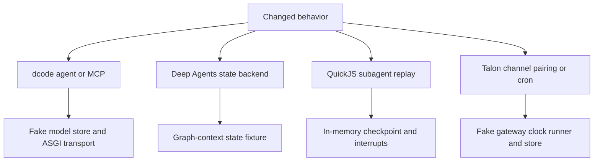
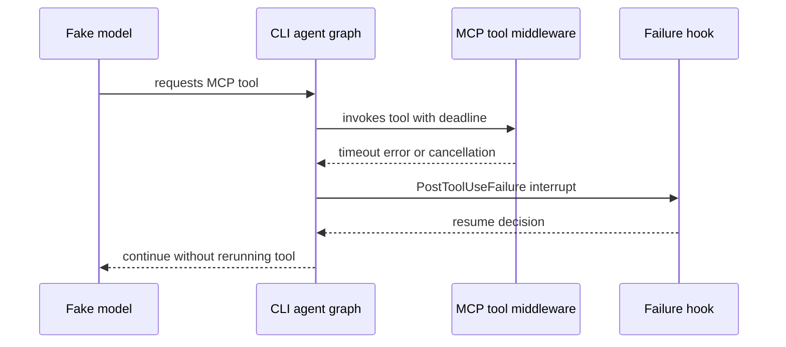
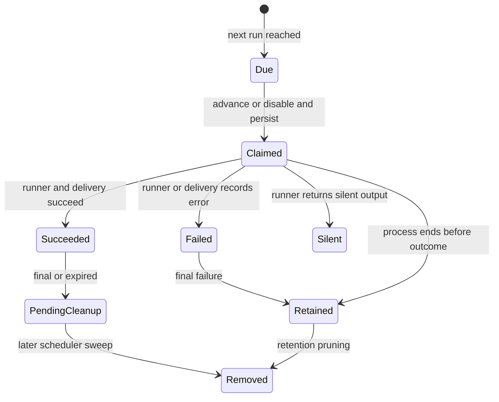

# Testing by Runtime Boundary

Test the observable promise at the boundary that owns it. Prefer a fake model, gateway, transport, clock, or temporary store over a live provider; normal core SDK and dcode unit targets block Internet sockets while allowing Unix sockets. Tests belong in `tests/unit_tests/` when network-free and deterministic, and in `tests/integration_tests/` only when a real integration is the contract. Unaccepted pytest warnings fail the suite, so a new warning is a failure to fix or narrowly, deliberately allowlist—not a passing test.


```mermaid
flowchart TD
    Change["Changed behavior"] --> Agent["dcode agent or MCP"]
    Change --> State["Deep Agents state backend"]
    Change --> Replay["QuickJS subagent replay"]
    Change --> Talon["Talon channel pairing or cron"]
    Agent --> Fakes["Fake model store and ASGI transport"]
    State --> Graph["Graph-context state fixture"]
    Replay --> Checkpoint["In-memory checkpoint and interrupts"]
    Talon --> Doubles["Fake gateway clock runner and store"]
```

*Choose the lowest boundary that can expose the changed result without a network dependency.*

## Run the owning package target

Work from the package that owns the change. `uv` and each package `Makefile` are the source of truth; use `make help` when a package has a specialized target.

```bash
cd libs/code
make test TEST_FILE=tests/unit_tests/test_agent_mcp_timeout.py
make test TEST_FILE=tests/unit_tests/test_mcp_middleware.py
make lint

cd ../deepagents
make test TEST_FILE=tests/unit_tests/backends/test_state_backend.py
make lint

cd ../partners/quickjs
make test TEST_FILE=tests/unit_tests/test_subagent_replay.py

cd ../../talon
make test TEST_FILE=tests/channels/test_slack.py
make test TEST_FILE=tests/cron/test_until.py
make test TEST_FILE=tests/unit_tests/test_pairing.py
make lint
```

The core SDK and dcode `make test` targets use `--disable-socket --allow-unix-socket`; their `integration_test` target is the intentional network-permitted route. Talon's `make test` runs the WhatsApp bridge Node tests first, then its selected pytest target with socket blocking, a 10-second timeout, and coverage; its lint target runs Ruff checking/format diff and `ty`. All packages place `error` first in pytest warning filtering, with only reviewed exceptions following it.

## dcode: exercise the graph, configuration, and UI seams

### Agent and approval state

For graph construction or tool-routing changes, invoke `create_cli_agent` with a predetermined fake chat model, a temporary working directory, and only the tools needed by the scenario. Assert the agent-visible output and backend result rather than private middleware calls. The agent tests demonstrate useful contracts: persistent conversation-history routing survives a new local backend, whereas large offloaded results remain on the real filesystem path advertised to tools.

Approval is a live per-thread safety boundary. Tests should cover both dict and typed contexts, the store writer-to-reader round trip, and malformed/missing store state. A live stored mode overrides the context snapshot; absent or invalid live state must fail closed to interruption rather than accidentally auto-approve. Preserve async behavior too: a store attached to the running loop must be accessed with its async API.

### MCP failure behavior

Test the middleware alone when changing error translation: a slow handler should return an error naming the MCP server and tool, warn that server-side work may continue and a retry may duplicate it, while `ToolException` and cancellation retain their semantic behavior. Then use the compiled CLI agent when changing propagation across delegated subagents. The delegated timeout regression uses a stalled MCP tool and fake model to prove cancellation occurs, child and parent recover, timeout reaches `PostToolUseFailure`, and resuming the hook does not rerun the tool.


```mermaid
sequenceDiagram
    participant Model as Fake model
    participant Graph as CLI agent graph
    participant MCP as MCP tool middleware
    participant Hook as Failure hook
    Model->>Graph: requests MCP tool
    Graph->>MCP: invokes tool with deadline
    MCP-->>Graph: timeout error or cancellation
    Graph->>Hook: PostToolUseFailure interrupt
    Hook-->>Graph: resume decision
    Graph-->>Model: continue without rerunning tool
```

*The focused regression covers timeout conversion and recovery at the production graph boundary.*

### Configuration, reasoning, cost, and Textual UI

Configuration reload tests must isolate global dotenv maps, process environment, model-config caches, and the state directory. Verify precedence and provenance rather than only parsed values: moving between project directories replaces values loaded from the old `.env`, shell values still win, denied dotenv keys are neither injected nor attributed, and malformed state is not silently normalized into a trusted carrier. The shared dcode fixtures establish an isolated profile before imports, restore environment and dotenv maps per test, clear tracing inputs, prevent LangSmith batching threads, and disable automatic price updates.

For `/effort`, mock model profiles when testing provider-agnostic compatibility and use Textual's `run_test()` for visible widget behavior. Preserve these user-facing rules: conflicting provider parameter forms fail closed, an explicit startup effort outranks a saved override, an unsaved selection still applies to the current session but renders an error, and unsupported effort levels do not overwrite an incompatible thinking mode. Test the status value, selector options, escape/cancel result, and error widget—not widget implementation order.

Cost regressions should use synthetic usage, a controlled recorder, and temporary persistence. Assert checkpointed totals/breakdowns, category completeness, idempotent retries, and subagent transfer/restart behavior; include zero or unpriceable usage so the UI cannot claim precision it lacks. The dcode fixture disables the price catalog updater specifically because its background fetch would violate socket-blocked unit testing.

## Deep Agents: state backend contracts

`StateBackend` is graph-state storage, not a general filesystem object. Its public operations require a LangGraph execution context; test that misuse outside one raises rather than inventing ambient state. At the backend seam, patch only the state read/update hooks and assert externally visible file semantics:

- Upload/download must round-trip arbitrary bytes and select UTF-8 or base64 encoding correctly; overwrite retains the original `created_at`.
- Read clamps negative offsets to the first line and non-positive limits to an empty successful read.
- Legacy list-based content remains readable by `read`, `ls`, `grep`, `glob`, and download without mutation; an edit migrates the written value to string content with an encoding.
- Report byte sizes in UTF-8, not Python character counts, and reject an empty `old_string` without issuing an update.

These tests protect compatibility of graph-owned state while avoiding a real graph or filesystem when the behavior is storage normalization.

## QuickJS: replay logical subagents, not JavaScript internals

The QuickJS replay test is an end-to-end checkpoint contract: use `create_deep_agent`, `CodeInterpreterMiddleware`, an in-memory saver, fake-model tool calls, and compiled child graphs that interrupt after work. Resume every checkpoint interrupt and assert stable subagent IDs, one execution per child, preserved completed results, one final JavaScript tool result, and the final parent answer. This catches a restart that replays parent orchestration but incorrectly repeats completed child work.

## Talon: channel security, pairing, and durable cron history

### Slack adapter and host boundary

Use `RecordingGateway` and a fake opener/Web client. This keeps conversion, exposure, reply, command, reaction, media, and upload contracts observable without Socket Mode or Slack credentials. Important focused assertions include:

- Ignore bot, edited, and ordinary channel-message events so a mention is not delivered twice; map channel mentions and thread replies to the same thread conversation, while a DM stays scoped to its DM channel.
- Enforce self/allowlist admission, send channel responses in the source thread, validate conversation IDs, split long text, and escape Slack control syntax or unapproved mentions in messages, edits, command replies, and media captions.
- Treat slash commands as a private responder flow: reject foreign/non-HTTPS response URLs during conversion and send authorization, unknown-command, and non-DM failures privately.
- Download inbound files only from HTTPS `files.slack.com`, never follow redirects, enforce declared and streamed size limits, reject symlink destinations, remove partial/truncated downloads, and create private destination files.

The separate Slack host integration test is the composition tier: a fake Socket Mode gateway plus echo agent verifies real `SlackChannel` and `TalonHost` threaded reply and command-responder help delivery without contacting Slack.

### Pairing is a durable admission control

Test pairing through `PairingStore`, adapters, and `TalonHost`, with a fixed clock. A request generates an unambiguous code in a mode-`0600` store; the approval is provider-scoped, single-use, TTL-bound, and applies only to the sender to whom it was issued. Repeated requests suppress duplicate code delivery, pending requests are capped per provider, corrupt state fails closed, and a symlinked store is refused.

At the adapter boundary, an unknown DM is withheld and may receive a code; non-DM messages never create a pairing request. Once an operator approves from their DM, the paired sender is admitted according to the pairing policy, including reactions; pairing is opt-in and cannot be enabled with open exposure. Include revocation/lifecycle tests when pairing changes can affect a scheduled run or an in-flight conversation.

### Cron `until` and history

Use fixed UTC/local datetimes, `ZoneInfo`, a temporary `CronJobStore`, recording runner/delivery callbacks, and `tick_once()`—not wall-clock sleeps. `until` belongs only to recurring schedules, parses an explicit local wall clock and zone, includes an occurrence due at the deadline, and allows a five-minute scheduler-latency grace. A substantially missed final occurrence is disabled rather than delivered late. Exercise creation, edit/clear, serialization, user-facing upcoming results, and the maximum supported date.


```mermaid
stateDiagram-v2
    [*] --> Due: next run reached
    Due --> Claimed: advance or disable and persist
    Claimed --> Succeeded: runner and delivery succeed
    Claimed --> Failed: runner or delivery records error
    Claimed --> Silent: runner returns silent output
    Succeeded --> PendingCleanup: final or expired
    Failed --> Retained: final failure
    Claimed --> Retained: process ends before outcome
    PendingCleanup --> Removed: later scheduler sweep
    Retained --> Removed: retention pruning
```

*The scheduler persists its claim before invoking callbacks, then records an outcome or preserves an inspectable incomplete/failed final run.*

Calendar-expression tests additionally protect day-of-month/day-of-week rules, extended weekday forms, leap years, impossible schedules, and daylight-saving wall-clock behavior. Scheduler tests must cover successful, `[SILENT]`, runner-failure, delivery-failure, and unexpected-tick paths. A finished/expired job is generally removed on a later sweep, but failed final work and claimed work with no recorded outcome remain until retention pruning; an enabled replacement schedule prevents cleanup.

## Checklist for a focused regression

1. Identify the owner: dcode graph/config/UI/cost, Deep Agents state backend, QuickJS checkpoint replay, or Talon adapter/pairing/scheduler.
2. Run the narrowest package test file with the existing fake seam. Use temporary durable state only if lifecycle or persistence is the promise.
3. Assert an observable result—tool/message output, interrupt/resume state, user-visible widget, persisted record, authorization decision, or cleanup—not a private call sequence.
4. Include the changed failure path: timeout/cancellation, malformed configuration, unavailable store, duplicate/replayed work, invalid input, or expired schedule.
5. Run the package lint target and resolve every warning. Escalate to an integration target or real LLM evaluation only when the deterministic owning boundary cannot establish the contract.

## Adjacent boundaries: server APIs, ACP, and evaluations

For dcode workspace-route changes, use an in-process `httpx.AsyncClient`/`ASGITransport` plus fake runtime and thread clients. Assert policy-preserving workspace binding, validation preflight that performs no mutation, and conflicts returned before a thread is created. For server-graph process-lifetime behavior, reset module state and use fake factories to prove concurrent requests share one construction, startup failures signal/exit, disabled MCP does not load, and only unambiguously read-only MCP tools reach criteria context.

ACP protocol behavior belongs in `libs/acp/tests/test_agent.py`: pair fake models and a fake ACP client with memory checkpointing, then assert ordered text/reasoning/tool updates, session-scoped cancellation, permission handling, and replay/rejection rules. This is distinct from dcode UI tests because its public result is an ACP session stream.

Use `libs/evals/` only for behavior that intrinsically requires a real LLM trajectory. Real-model evals log to LangSmith and can write JSON reports; `.success(...)` is a blocking correctness assertion while `.expect(...)` is a non-failing efficiency expectation. They complement rather than replace the deterministic lower-boundary tests above.
