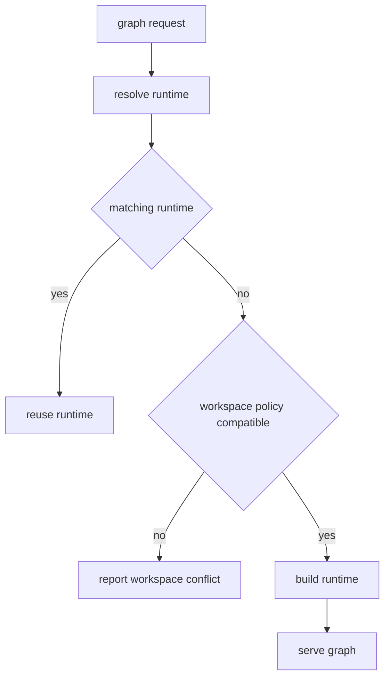
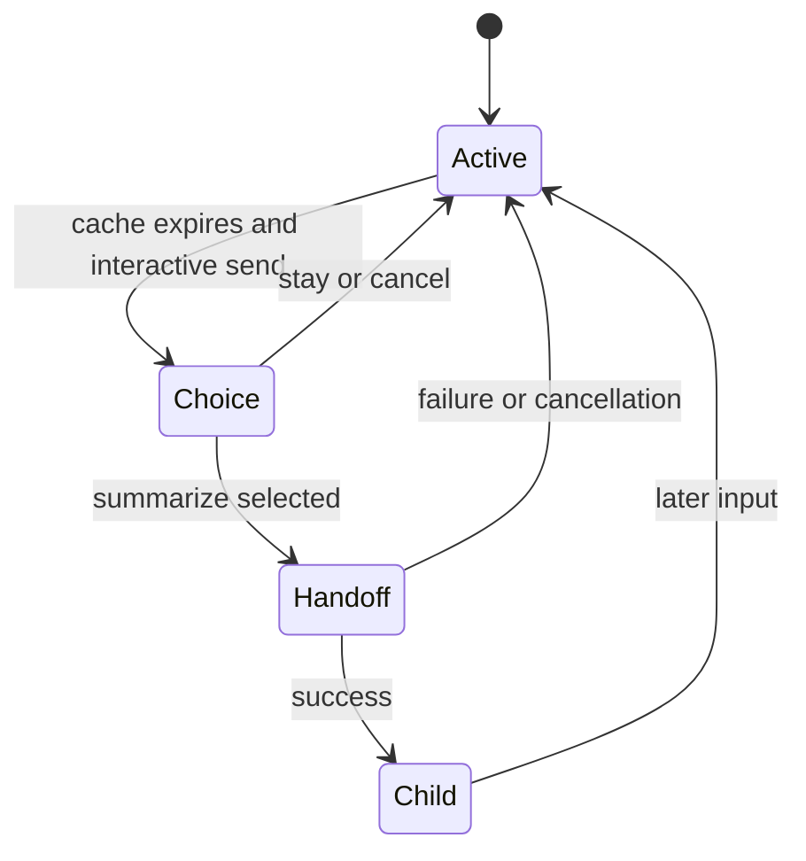

# Testing Guide

Test dcode at the boundary where a user, a persisted thread, or the server observes behavior. Prefer a fake model, `AsyncMock`, temporary paths, a fixed clock, and Textual's `run_test()` pilot over a provider, real sleep, or a private call-order assertion. The goal is to keep regressions deterministic while exercising the actual ownership and lifecycle boundary. Related context: [Code agent architecture](../architecture/code-agent.md), [Source map](../architecture/source-map.md), [Profiles and models](../concepts/profiles-models.md), [State persistence](../concepts/state-persistence.md), and [Development](../operations/development.md).

## Run the smallest owning target

From `libs/code`, install the test group with `uv sync --group test`. `make test` uses parallel pytest, disables non-Unix sockets while permitting Unix sockets, disables benchmarks, and collects coverage. `make integration_test` is intentionally separate, runs with a 30-second timeout, and does not add the unit suite's socket restriction. `make lint` runs Ruff checks and formatting diff, `ty`, the generated-command catalog check, and the process-CWD check.

```bash
cd libs/code
make test TEST_FILE=tests/unit_tests/test_model_retry.py
make test TEST_FILE=tests/unit_tests/test_cache_expiry.py
make test TEST_FILE=tests/unit_tests/test_thread_ownership_transitions.py
make integration_test TEST_FILE=tests/integration_tests/test_pending_work_recovery.py
make lint
```

The dcode Makefile provides network-restricted parallel unit tests and an explicit `update-snapshots` target that runs smoke snapshots with the `--update-snapshots` option. Use `make update-snapshots` only after reviewing the complete prompt diff: a snapshot is a model-visible compatibility contract, not generated output to accept blindly.

## Server graph and startup recovery

The server graph is a process-lifetime resource: repeated and concurrent `make_graph()` resolution must share one constructed runtime. A graph-construction failure must emit the startup marker to stderr and exit nonzero, so the parent can surface a meaningful startup failure rather than an opaque process exit. Exercise this with a fresh import, mocked graph factory, and captured stderr—never a real server.

For workspace requests, test the decision boundary rather than an implementation helper. A configured process-wide sandbox reserves the first workspace, including after a failed build; a second workspace is rejected. Without a sandbox, separate workspaces can build separate runtimes. Configuration policy drift must fail closed, while a model-only change can rebuild a runtime when the durable access policy remains compatible.


```mermaid
flowchart TD
    Request["graph request"] --> Runtime["resolve runtime"]
    Runtime --> Cached{"matching runtime"}
    Cached -->|yes| Reuse["reuse runtime"]
    Cached -->|no| Policy{"workspace policy compatible"}
    Policy -->|no| Refuse["report workspace conflict"]
    Policy -->|yes| Build["build runtime"]
    Build --> Ready["serve graph"]
```

*Runtime selection reuses compatible work, rebuilds for an allowed model change, and refuses incompatible workspace policy.*

At the client boundary, `ServerReady` settles connection state, installs the agent and MCP snapshot, removes transient startup-failure UI, refreshes MCP state, and synchronizes the existing status bar model. A status bar or model identity missing at this point is a warning-worthy defect; empty fields are still sent to clear stale model text. Keep initial-prompt tests separate: a deferred launch retains `-m` input until readiness, the first session sequence hydrates resumed history only once, and later readiness events drain queued work without duplicating history.

## Model catalog and retry contracts

Treat a remote model catalog as authoritative when the picker is operating against a remote inference host. Mounted picker tests should prove highlighting, search, selection, profiles, provider labels, and allowlist decisions using a supplied catalog while making local provider/config probes fail if called. A custom provider typed by the user may lead to install or authentication setup only after catalog policy allows it; ambiguous provider-less identifiers are deferred to the host rather than guessed locally. Long-running default validation and persistence belong off the message pump, so Escape and selection navigation remain responsive and late results cannot save after dismissal.

Retry tests should encode error taxonomy and stream-visible semantics. Authentication, permission, invalid-request, context-overflow, and graph-interrupt control flow are not retry candidates. Transport and qualifying provider failures are retried within their budget; an unusable past `Retry-After` falls back to normal backoff, while a delay beyond a caller deadline gives up immediately. Test both synchronous and asynchronous middleware paths with sleep patched out.

A retried streaming call keeps one call ID across attempts and emits ordered lifecycle events: attempt start, retry, next attempt start, and attempt complete. The retry event records the failed attempt and whether output may already have reached the user; malformed lifecycle fields are rejected. Assert those user-facing correlation facts rather than a backoff implementation detail.

## Cache-expiry handoff and thread ownership

Cache expiry is an interactive safeguard, not a background interruption. It defers while work, another modal, disabled prompting, or user typing is active; typing stays editable and an Enter submission triggers a fresh explicit choice. Non-interactive queued work—commands, shell input, and external input—must pass through without this prompt. A resumed thread whose cache window had already lapsed does not get a retrospective warning, but a window that expires during the session does.

When the user chooses a handoff, submission is paused but the draft remains editable. The source thread remains current until a successful handoff; cancellation or failure restores normal submission and preserves the original conversation. Guard the asynchronous completion against a changed current thread so it cannot send into, or restore a draft into, an unrelated thread.


```mermaid
stateDiagram-v2
    [*] --> Active
    Active --> Choice: cache expires and interactive send
    Choice --> Active: stay or cancel
    Choice --> Handoff: summarize selected
    Handoff --> Child: success
    Handoff --> Active: failure or cancellation
    Child --> Active: later input
```

*The warning requires an explicit user decision; only a completed handoff changes the active thread.*

Thread leases fence persistence as well as UI transitions. Test a prestarted client's lease through clear, switch, and failed switch; a failed transition retains the original lease. During a CWD server replacement, stale client mutations must fail after the ownership token changes, while the active client can persist. Deletion must reject a reserved thread and retain its reservation through cancellation-sensitive cleanup. Overlapping resume calls must not release a destination lease acquired by the other operation.

The integration test is intentionally narrower than a full provider test: seed an in-memory graph so its next node is a tool call, attach a local `RemoteAgent`, abandon pending work, then assert no tool side effect occurred, no pending task remains, and an error `ToolMessage` cancels the original call ID.

## Skills and system-prompt snapshots

`create_cli_agent` supplies skill sources from low to high precedence because the middleware uses last-source-wins collision handling: built-in, user Deepagents, user Agents, project Deepagents, project Agents, user Claude, then project Claude. Test the exact labeled source list and the reduced list when home-scoped aliases are unavailable. This protects both precedence and the prompt's ability to identify each location.

The system-prompt smoke test composes a real CLI agent and middleware with a fake chat model, freezes model identity, filesystem locations, and local-context output, captures the first system message, and snapshots interactive and headless variants. It additionally verifies that memory and secret-handling instructions remain available, while interactive-only questions and recovery guidance do not leak into headless mode. Seed memory and a skill in a temporary tree, redact temporary/profile/built-in paths, and compare the complete message.

## Mounted Textual regressions

Textual behavior is observable behavior. Mount the real widget under `run_test()`, feed realistic events, await `pilot.pause()`, and assert rendered content, focus, screen stack, or persisted widget state. Do not assert a private handler sequence.

SubagentPanel tests mount the real Textual widget with `run_test()` and assert observable selection, persistent collapse preference, reset/cancellation/replay behavior, hostile-label sanitization, responsive header rendering, and wall-clock phase duration. In particular, selection follows active work until user navigation locks it; finalization cancels only in-flight rows; duplicate replay does not overwrite a terminal result; and a phase spanning staggered agents reports elapsed wall-clock time rather than the longest child duration.

For modal model and cache flows, drive keyboard paths through the pilot. Prove that cancellation preserves editable drafts, deferred workers cannot mutate a dismissed screen, and an explicit later Enter is required after a handoff completes. These are the failures direct method calls tend to miss.

## CI workflow script contracts

Workflow tests may execute embedded shell or JavaScript in a controlled subprocess, but they must not contact GitHub. Stub `gh`, `git`, and `python3`; provide `GITHUB_OUTPUT`; parse the workflow YAML to obtain the actual step script. The inherited-CI diagnostics tests verify that a changelog-only curated apply preserves a conclusive parent success or failure at the final gate, while malformed or unavailable parent lookup falls back to normal package jobs.

The diagnostic report is best-effort and read-only: it may link the trusted repository commit and parent/job details, but it must escape check names and avoid untrusted URLs or API response bodies. It cannot replace the failure gate or require write permissions. Assert both the rendered summary and the gate exit status.

## Focused-regression checklist

1. Start from a boundary: graph factory, `ServerReady`, picker screen, retry middleware event stream, cache handoff, lease-protected mutation, real skill assembly, or mounted widget.
2. Replace nondeterminism with an in-memory saver, temporary filesystem, event gate, fixed clock, fake model/catalog, or patched sleeper.
3. Assert the durable or visible result: marker and exit code, model selection, lifecycle event payload, current thread and lease, tool side effect, prompt text, rendered widget state, or workflow output.
4. Include a failure edge: startup exception, policy drift, dismissed screen, permanent error, expired cache, cancellation, competing transition, replay, malformed workflow response, or hostile label.
5. Run the narrow owning target first, then `make lint`; run the integration target only when its graph/client boundary is the contract under change.
