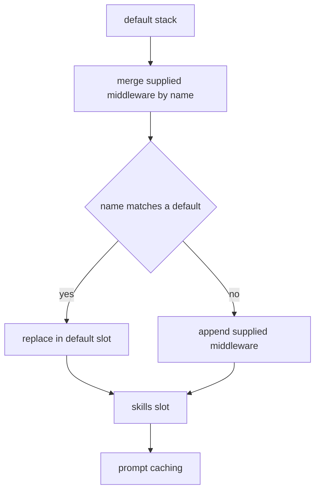
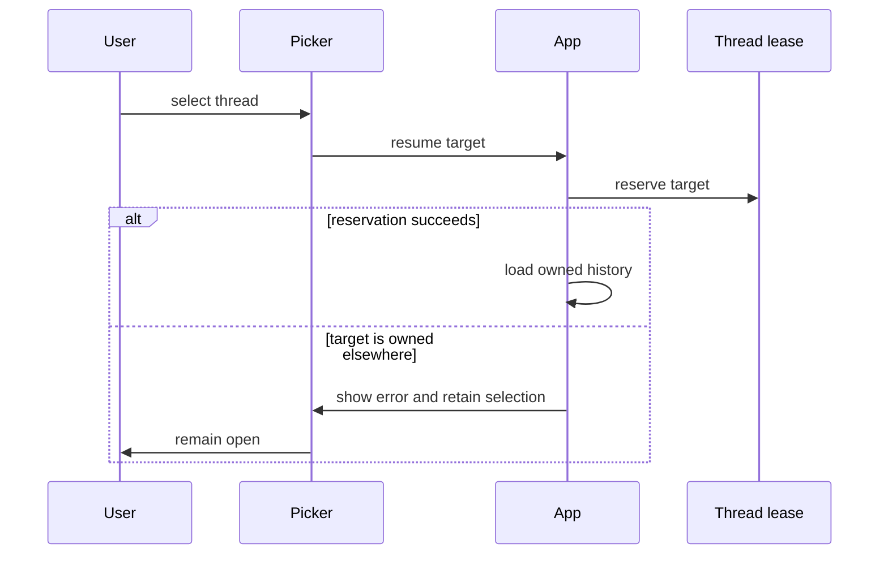

# Testing Guide

Choose the narrowest test that exercises the observable contract: a compiled agent's middleware list, a SQLite-backed session lifecycle, or a mounted Textual interaction. Prefer fake chat models, temporary databases and repositories, `AsyncMock`, controlled events, and `run_test()` over network calls, a user's home directory, wall-clock races, or assertions on private call order. This guide complements the [middleware stack](../architecture/middleware-stack.md), [code agent architecture](../architecture/code-agent.md), [state persistence](../concepts/state-persistence.md), [deep-agent workflow](../workflows/build-a-deep-agent.md), and [dcode session workflow](../workflows/run-dcode-session.md).

## Run the owning target

From `libs/code`, use `uv sync --group test` once, then run the smallest file first. `make test` runs parallel pytest with non-Unix sockets disabled, Unix sockets allowed, benchmarks disabled, and coverage; `make integration_test` is a separate parallel target with a 30-second timeout. `make lint` runs Ruff, `ty`, the generated command-catalog check, and the process-CWD check.

```bash
cd libs/code
make test TEST_FILE=tests/unit_tests/test_sessions.py
make test TEST_FILE=tests/unit_tests/skills/test_thread_inspector.py
make test TEST_FILE=tests/unit_tests/tui/widgets/test_thread_selector.py
make lint
```

The dcode Makefile provides network-restricted parallel unit tests and an explicit `update-snapshots` target that runs smoke snapshots with the `--update-snapshots` option. Use `make update-snapshots` only when a reviewed prompt-contract change is intended.

`COMMANDS.md` is generated from `deepagents_code/command_registry.py`; do not hand-edit it. After changing slash-command names, aliases, descriptions, visibility, or hidden-command metadata, run `make commands-catalog`, then let `make commands-catalog-check` or `make lint` catch drift. The catalog is also the user-facing boundary: public commands are documented while hidden commands are deliberately omitted from autocomplete and help.

## Middleware-stack regressions

Test middleware assembly through `create_deep_agent()` while patching model resolution and `create_agent`, then inspect the middleware passed to compilation. This protects an ordering contract that isolated middleware tests cannot establish:

- A user middleware whose `name` matches a default replaces that entry **in its existing slot**; a new name is appended in the supplied order. Test multiple replacements and a mixed replacement/new list.
- A request- or prompt-mutating custom middleware must precede `AnthropicPromptCachingMiddleware`; otherwise it can invalidate the cached prompt prefix.
- `SkillsMiddleware` occupies the inner skills slot directly before Anthropic prompt caching. User and profile middleware run before that slot, and same-named skills middleware replaces it rather than producing a duplicate.
- General-purpose subagents inherit overrides for their default middleware slots, but not arbitrary main-agent middleware. Declarative subagents build their own stacks and only receive their own matching overrides. `TodoListMiddleware` is opt-in: a main-agent opt-in does not leak to subagents, whereas a subagent specification or a profile's `extra_middleware` can add it deliberately.


```mermaid
flowchart TD
    Base["default stack"] --> Merge["merge supplied middleware by name"]
    Merge --> Replace{"name matches a default"}
    Replace -->|yes| Slot["replace in default slot"]
    Replace -->|no| Append["append supplied middleware"]
    Slot --> Skills["skills slot"]
    Append --> Skills
    Skills --> Cache["prompt caching"]
```

*The compiled stack preserves default slots for matching overrides and keeps skills immediately inside user and profile middleware.*

## Sessions, names, and ownership

Treat a thread name as durable metadata distinct from checkpoint state. Test with an isolated `sessions.db`: an automatic `only_if_unnamed` name can win only once under concurrency, a manual rename is trimmed and survives later graph checkpoints, and deletion removes the name. Listing must remain usable while another connection owns a write transaction, must prefer the durable saved name over checkpoint metadata, and must fall back to legacy checkpoint metadata when no saved name exists. Reject blank, overlong, newline, escape, and control-character names.

Thread ownership belongs at the app boundary, not merely in a selector. With a real `DeepAgentsApp` and temporary database, reserve the current thread first; a bare most-recent resume must skip an occupied candidate and reserve the next eligible thread. An explicit ownership conflict must neither load history nor replace the current thread. In the mounted `/threads` picker, a failed reserve must leave the screen open with its filter and selection intact, surface the error, preserve the current session, and restore input focus when dismissed.


```mermaid
sequenceDiagram
    participant User
    participant Picker
    participant App
    participant Lease as Thread lease
    User->>Picker: select thread
    Picker->>App: resume target
    App->>Lease: reserve target
    alt reservation succeeds
        App->>App: load owned history
    else target is owned elsewhere
        App->>Picker: show error and retain selection
        Picker->>User: remain open
    end
```

*Resume must acquire ownership before it changes the active session or transcript.*

## Safe session inspection

The built-in `deepagents-thread-inspector` is an inspection boundary, so test the standalone script against fixture SQLite files rather than an installed profile. It must open an existing database with SQLite read-only mode and reject schemas without both `checkpoints` and `writes`. Resolve an exact root-thread ID first; prefix matching must escape `%`, `_`, and backslashes, reject ambiguity, and never select subagent namespaces.

For output correctness, seed root and subagent checkpoints and assert that summaries, counts, and listings use only `checkpoint_ns = ''`. Reconstruct conversation state from checkpoint writes, use a latest inline checkpoint when present, include pending writes, apply a valid message-channel `Overwrite`, and retain the previous messages while reporting malformed metadata, inline state, or overwrite data as warnings. Name coverage should prove the inspector prefers `dcode_thread_names` and falls back to the latest root checkpoint's `thread_name` for legacy stores.

## Textual and terminal-patch regressions

Mount the real screen or app with `run_test()`, drive input through the pilot, wait for the relevant worker or `pilot.pause()`, and assert visible text, focus, screen-stack state, persistence callback, or copied value. A direct call is appropriate only for a pure formatting or retention helper; it cannot prove binding precedence, mounting, focus, or asynchronous refresh behavior.

For the debug console, cover the operational boundaries: long snapshot values wrap under their value column except when the column is too narrow; a failing polling provider warns once until it recovers; retained logs cap each standard level and the shared custom-level bucket without reordering survivors; and the first populated log frame starts at the newest records. Exercise Escape twice when a level selector is open, clear through both shortcuts and reopen, and mount the console over another modal. Verify a real app's `shift+tab` moves console focus despite the application's competing binding.

Textual compatibility patches need behavioral tests against real parser and selection events. Keep the ASCII-border subprocess test isolated by environment. For selection, test double/triple click and drag across diff rows, blocks, scroll positions, and widgets; test shift-click extension from both forward and backward anchors; and verify a detached Markdown anchor clears selection rather than crashing. The detached-hit guard must ignore a compositor hit whose widget was pruned while continuing to report attached hits. Keyboard regressions should preserve native extended kitty keys, decode double Escape immediately as `alt+escape`, normalize kitty subfields, and ensure lock-key reports never insert associated text while genuine modified/text keys still work.

## Autocomplete and thread-selector UI

`@@` is the durable thread-reference completion syntax, separate from `@` file completion. Test acceptance only at a token boundary, rejection of email-like and already-tokenized forms, search across saved name, initial prompt, branch, and metadata, and replacement of the typed range with `@@(thread:<full-id>)`. Labels should prefer saved name, fall back to the initial prompt or short ID, sanitize controls, and bound length.

File completion should use a temporary Git repository. Assert tracked files rank ahead of untracked non-ignored files, Git's successful empty result is authoritative, repeated conflict paths are deduplicated, and a failed untracked scan does not discard a successful tracked scan. A non-repository fallback is quiet; genuine Git failures log sanitized diagnostics under a stable `LC_ALL=C` environment. With a nested or symlinked CWD, show only paths below that resolved subtree, exclude same-prefix siblings, and fail closed when CWD lies outside the project root.

For `ThreadSelectorScreen`, preserve the distinction between a loading checkpoint cell and a loaded empty value. Mounted tests should verify Escape wins over conflicting app bindings, navigation is harmless for an empty list, names and prompts remain visible at narrow widths, and names are searchable and rendered as literal text. Scope and sort preferences must persist; when a scope select is open, Tab, arrows, Page keys, and the first Escape operate on that select rather than the thread list or modal. Persist an explicit CWD preference even when CWD cannot be resolved.

Treat background loading as a lifecycle, not a spinner assertion: the LangSmith header link may resolve before the disk list, but a timeout leaves the title unchanged; list failures mark the load complete so the modal remains dismissible; visible checkpoint details load before an uncached initial render; and cached initial prompts remain visible through a refresh. Turning on the prompt column should request only the newly needed prompt data.

## Focused-regression checklist

1. Select the owner: compiled stack, session store, app reservation, inspector output, controller, or mounted screen.
2. Make data and scheduling deterministic with fake models, temporary SQLite/Git state, mocked I/O, event gates, and pilot-driven input.
3. Assert the durable or observable outcome—stack order, name/listing, lease and active-thread identity, JSON result/warning, rendered content, focus, persisted preference, or inserted token.
4. Include the relevant failure edge: duplicate name race, occupied target, malformed store data, detached widget, competing binding, Git fallback, load error, or stale background result.
5. Run the owning file first, then `make lint`; regenerate `COMMANDS.md` only through its Make target.
