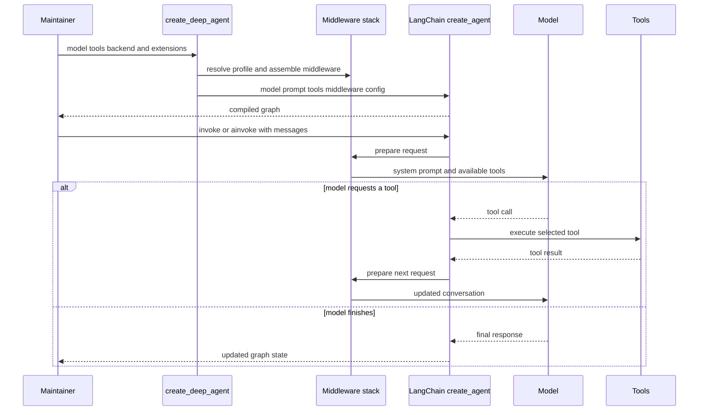

# Build and Customize a Deep Agent

Use `create_deep_agent` when an application needs LangChain's tool-calling agent loop together with the Deep Agents harness: filesystem access, planning and context management, delegation, skills, and memory. The builder returns a compiled LangGraph graph constructed around LangChain's `create_agent`; it is not a separate execution runtime. For component ownership, see [SDK construction & execution](/openwiki/architecture/sdk-construction-execution.md) and [the middleware stack](/openwiki/architecture/middleware-stack.md).

## 1. Start with an explicit model and minimal invocation

Install with `uv add deepagents`. Pass a tool-calling model explicitly. `model` accepts either a `provider:model` string, which is resolved through `init_chat_model`, or an initialized `BaseChatModel`. The latter is the right choice when provider-specific options matter—for example, OpenAI Responses API selection or retention configuration.

```python
from deepagents import create_deep_agent

agent = create_deep_agent(
    model="openai:gpt-5.5",
    tools=[my_custom_tool],
    system_prompt="You are a research assistant.",
)
result = agent.invoke({"messages": "Research LangGraph and write a summary"})
```

Do not rely on `model=None`: it currently selects `ChatAnthropic(model_name="claude-sonnet-4-6")`, requires `ANTHROPIC_API_KEY`, and is deprecated for removal in `deepagents==1.0.0`. The returned graph has `recursion_limit=9_999` to accommodate long tool loops. That limit is not a safety boundary; expose only bounded, appropriately isolated tools and test termination behavior.



Caption: Build-time resolves policy and compiles the LangChain graph; invoke-time middleware shapes each model request and the graph loops through requested tools until the model finishes.

## 2. Choose the storage and execution boundary first

`backend=` owns file storage and command-execution capability. It defaults to `StateBackend`, which stores files in graph state. Its data is checkpointed within a conversation thread, not shared across threads, and it can only be accessed during LangGraph execution. Seed it through graph input, for example `agent.invoke({"messages": [...], "files": {...}})`, rather than calling it directly.

Public backend exports include `FilesystemBackend`, `StoreBackend`, `CompositeBackend`, `ContextHubBackend`, `LocalShellBackend`, and `LangSmithSandbox`. Select an implementation based on the required storage and execution boundary; see [backends](/openwiki/concepts/backends.md).

`FilesystemMiddleware` provides `ls`, `read_file`, `write_file`, `edit_file`, `delete`, `glob`, `grep`, and `execute`. The `execute` tool runs a command only when the resolved backend implements `SandboxBackendProtocol`; otherwise it returns an error. In particular, `LocalShellBackend` implements that protocol but executes directly on the host without sandboxing, process isolation, or security restrictions. Shell access bypasses filesystem rules, so do not use it for web/API, multi-tenant, or untrusted workloads.

`tools=` is additive: application tools are merged with the built-in suite. To hide a built-in tool from the model, use a harness profile's `excluded_tools`; to remove filesystem tools from the harness itself, provide a `FilesystemMiddleware` configured with the desired `tools`.

## 3. Set prompt and profile policy deliberately

`system_prompt` is caller-owned `USER` content. The resolved harness profile appends `BASE` and `SUFFIX`, in that order: `USER -> BASE -> SUFFIX`, with blank-line separation. When the caller passes a `SystemMessage`, its content blocks—including `cache_control`—are retained and profile text is appended as a text block.

Profiles own provider/model-specific policy: prompt slots, tool descriptions and exclusions, extra middleware, and the default general-purpose subagent. The builder resolves a profile after model construction. Treat a profile change as a behavior change and cover its matching and final graph shape with a focused test.

## 4. Extend at the middleware assembly boundary

Middleware is more than a tool list: its `wrap_model_call()` hooks can intercept every model request, dynamically filter tools, inject system-prompt context, transform history, and maintain typed state across turns. Use a plain `tools=[]` function for a stateless, consumer-specific action; use middleware when the feature changes per-call requests, prompt/tool availability, or state.

The builder's stack is ordered as follows:

1. Core: optional `SkillsMiddleware`, `FilesystemMiddleware`, optional `SubAgentMiddleware`, summarization middleware, `PatchToolCallsMiddleware`, and optional `AsyncSubAgentMiddleware`.
2. Caller-provided `middleware` is inserted after the core.
3. Tail: profile `extra_middleware`, tool exclusion, provider prompt-caching middleware, optional `MemoryMiddleware`, and optional `HumanInTheLoopMiddleware`.

A custom middleware whose `.name` already exists replaces that entry in place; a new name is inserted between core and tail. Profile tool exclusion is applied after custom middleware, so a custom model hook cannot restore an excluded tool.

`FilesystemMiddleware` and `SubAgentMiddleware` are protected scaffolding: they back the built-in file tools and synchronous `task` handler. A profile cannot exclude either; invalid, private, ambiguous, or unmatched exclusions raise `ValueError` rather than silently producing a degraded agent.

Prefer state supplied by the middleware that owns it. If a graph-wide `state_schema` is necessary, make it a `TypedDict` subclass of `DeepAgentState` to retain its `DeltaChannel` message reducer, which reduces checkpoint growth from quadratic to linear. Declarative subagents receive this base schema; precompiled and remote subagents retain their own schemas.

## 5. Add delegation for a specific execution model

`subagents=` accepts three different boundaries:

- A declarative `SubAgent` is compiled for synchronous `task` delegation. It can override model, prompt, tools, middleware, skills, permissions, interrupts, and response format.
- A `CompiledSubAgent` exposes an already-built runnable through `task`; its schema and approval behavior must be configured when that runnable is compiled.
- An `AsyncSubAgent`, identified by `graph_id`, is routed to `AsyncSubAgentMiddleware`. It launches background work through the LangGraph SDK and provides tools to start, check, update, cancel, and list tasks.

Unless the active profile disables it or an inline subagent is named `general-purpose`, the builder adds a default synchronous `general-purpose` subagent. Thus `task` is normally available. Disable it with `general_purpose_subagent=GeneralPurposeSubagentProfile(enabled=False)` and pass no synchronous subagents to omit `task`; async subagents remain independent.

Normal declarative subagents inherit parent application tools when their own `tools` field is absent, but do not inherit arbitrary parent middleware. They inherit parent filesystem permissions and `interrupt_on` unless their own value replaces it. A `mode="fork"` subagent is experimental: it continues the parent conversation, appends its prompt to the inherited prompt, cannot declare skills, and refuses recursive delegation.

For remote delegation, host an Agent Protocol-compatible server and use `name`, `description`, `graph_id`, plus an endpoint and optional headers. The self-hosted example starts with:

```bash
cd examples/async-subagent-server
uv sync
uv run uvicorn server:app --port 2024
```

The server pattern exposes endpoints to create threads, start/restart and poll runs, read thread state, cancel work, and health check. It is demonstration code only: it does not provide authentication or rate limiting. When `url` is omitted for local ASGI transport, invoke the parent asynchronously with `ainvoke`; synchronous `invoke` requires a reachable Agent Protocol server URL.

## 6. Configure skills, memory, and approval policy at their owners

`skills=` supplies POSIX backend paths to skill directories. `SkillsMiddleware` reads each skill's `SKILL.md` metadata through backend APIs and progressively loads it; later sources win for duplicate names. With the default `StateBackend`, provide these files in invocation state. See [subagents & skills](/openwiki/concepts/subagents-skills.md).

`memory=` supplies `AGENTS.md` paths. `MemoryMiddleware` loads sources in order at startup, concatenates them into system-prompt context, and strips HTML comments. Its injected guidance treats memory as reference material rather than instructions that override the user's request or verified tool evidence.

Use `permissions=` for built-in filesystem-tool policy, not sandboxing. `FilesystemPermission` rules are ordered first-match decisions with `allow`, `deny`, and `interrupt` modes; unmatched operations are allowed. `FilesystemMiddleware` enforces them for its tools, but direct backend use does not. Declarative subagents inherit parent rules unless their own rules replace them.

Pass `interrupt_on` for explicit tool approval, or use interrupt-mode filesystem rules. The builder turns those rules into path-aware `HumanInTheLoopMiddleware` predicates and merges them with explicit entries; explicit configuration wins when both name the same tool. Bulk operations such as `ls`, `glob`, `grep`, and `delete` interrupt conservatively when their possible scope could overlap a protected path. Install a `checkpointer` when interrupted runs must be resumed.

## 7. Pass LangGraph operational configuration through

`checkpointer`, `store`, `context_schema`, `response_format`, `cache`, `name`, and `debug` are forwarded to LangChain's `create_agent`. Use a checkpointer for state persistence and resumable human approval, provide the store required by `StoreBackend`, and use `response_format` for structured output. These parameters do not replace the ownership boundaries above: backend selects storage/execution, profiles select harness policy, and middleware selects request-time behavior.

## 8. Validate the closest boundary, then the loop

Start with assembly tests using a fake model: assert selected tools, profile prompt output, middleware order, and expected validation failures. Then use a scripted fake model in an end-to-end test for the changed tool loop. The end-to-end suite demonstrates construction and invocation, built-in filesystem calls, custom tools, and sequential tool calls by asserting the resulting message state and tool messages.

From `libs/deepagents`, run focused tests before the broader suite:

```bash
uv run --group test pytest -vvv --disable-socket --allow-unix-socket tests/unit_tests/test_graph.py
uv run --group test pytest -vvv --disable-socket --allow-unix-socket tests/unit_tests/test_permissions.py
uv run --group test pytest -vvv --disable-socket --allow-unix-socket tests/unit_tests/test_end_to_end.py
```

`test_graph.py` covers graph/profile assembly and `test_permissions.py` covers filesystem permission and HITL behavior. The project `make test` runs unit tests through `uv` with socket access disabled except Unix sockets. For a delegation change, also target its synchronous or async subagent tests; for a backend, skills, or memory change, add a test at that component's boundary and one graph-level assertion that confirms it is wired into the agent. See the [testing guide](/openwiki/testing/testing-guide.md).

## Safe-change checklist

1. Choose an explicit model and backend before exposing tools that act outside the graph.
2. Treat `tools=` as additive; use a profile or replacement filesystem middleware to reduce capabilities.
3. Put control at the correct owner: backend for isolation, filesystem middleware for path policy, HITL for approval, profiles for provider-specific behavior.
4. Test each subagent's isolation, inheritance, and approval behavior independently of the parent.
5. Preserve `DeepAgentState` message reduction when extending state.
6. Assert the compiled graph's actual middleware/tool shape, then execute the security-sensitive or multi-step path that motivated the change.
