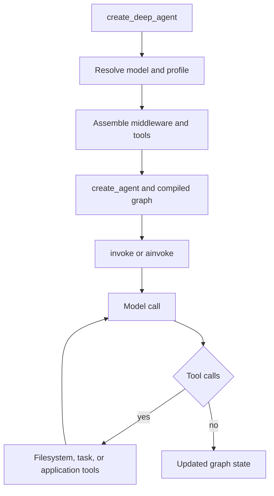

# Workflow: Build a Deep Agent

Use `create_deep_agent` when the standard LangChain tool-calling loop is appropriate but the application also needs the Deep Agents harness: filesystem operations, context management, delegation, and optional skills and memory. It returns a compiled LangGraph graph assembled around LangChain's `create_agent`; it is not a new runtime. For ownership detail, see [SDK construction & execution](/openwiki/architecture/sdk-construction-execution.md) and [middleware stack](/openwiki/architecture/middleware-stack.md).

## 1. Start with an explicit model and a minimal invocation

Install the package with `uv add deepagents`. Supply a tool-calling model explicitly: `model=None` currently falls back to an Anthropic model but is deprecated and scheduled for removal in `deepagents==1.0.0`. A model can be a `provider:model` string or an initialized `BaseChatModel`; initialize a model yourself when provider-specific options matter (for example, OpenAI Responses API retention options).

```python
from deepagents import create_deep_agent

agent = create_deep_agent(
    model="openai:gpt-5.5",
    tools=[my_custom_tool],
    system_prompt="You are a research assistant.",
)
result = agent.invoke({"messages": "Research LangGraph and write a summary"})
```

The result is updated graph state, including `messages`. The compiled graph has `recursion_limit=9_999`, suitable for long tool-calling runs; still give the model bounded tools and test its stopping behavior rather than treating that limit as a safety control.



Caption: Graph assembly precedes each invocation; the underlying `create_agent` graph loops through model and tool calls until no tool calls remain.

## 2. Decide the storage and execution boundary before exposing tools

`backend=` is the owner of filesystem data and command-execution capability. It defaults to `StateBackend`, so state-backed files are appropriate for isolated, graph-scoped work. Available implementations include `FilesystemBackend`, `StoreBackend`, `CompositeBackend`, `ContextHubBackend`, `LocalShellBackend`, and `LangSmithSandbox`; select one based on the storage and execution boundary, as described in [backends](/openwiki/concepts/backends.md).

The built-in `ls`, `read_file`, `write_file`, `edit_file`, `glob`, and `grep` tools are supplied by `FilesystemMiddleware`. `execute` only performs shell commands when the selected backend implements `SandboxBackendProtocol`; otherwise it reports an error. Do not infer sandboxing from the presence of `execute`: choose a sandbox-capable backend and constrain it at the infrastructure boundary.

`tools=` adds application tools; it does not remove built-ins. A harness profile can hide named tools from the model with `excluded_tools`; to remove filesystem tools from the harness entirely, supply a `FilesystemMiddleware` configured with the desired `tools`. This distinction matters because profiles apply a final tool-exclusion middleware after custom middleware, preventing a later model hook from restoring an excluded tool.

## 3. Set prompt and profile policy deliberately

`system_prompt` is the caller-owned `USER` portion. The active harness profile—resolved after model construction—contributes `BASE` and `SUFFIX`, yielding `USER -> BASE -> SUFFIX` separated by blank lines. With a `SystemMessage`, caller content blocks, including `cache_control`, are retained and profile text is appended as a new text block.

Profiles are the provider/model-specific policy owner: they can tune prompt slots, tool descriptions, visibility, extra middleware, and the default general-purpose subagent. Register profiles with `register_harness_profile`; `ProviderProfile` is separate and governs model construction. Treat these APIs as beta and make profile matching a focused test whenever adding a provider or model key.

## 4. Understand and extend the middleware assembly boundary

The graph builder owns stack assembly. Its main core is, conditionally, `SkillsMiddleware`, `FilesystemMiddleware`, `SubAgentMiddleware`, summarization, `PatchToolCallsMiddleware`, and `AsyncSubAgentMiddleware`. Caller middleware is inserted after that core and before the profile/prompt-cache/memory/HITL tail. Supplying middleware with an existing `.name` replaces that entry in place; a new name is inserted at the core-to-tail boundary.

Profiles can exclude matching middleware by class or name, but exclusion is validated. `FilesystemMiddleware` and `SubAgentMiddleware` are protected because they provide filesystem tools and synchronous task dispatch (and filesystem permission enforcement); attempts to exclude them fail with `ValueError`. Unknown, private, ambiguous, or unmatched exclusions also fail rather than silently building a different stack.

Prefer middleware state schemas for feature-local state. If a graph-wide `state_schema` is unavoidable, subclass `DeepAgentState`: its `messages` field uses `DeltaChannel` to avoid quadratic checkpoint growth. Declarative subagents receive that schema, while already-compiled and remote agents do not.

## 5. Add delegation only for a clear execution model

`subagents=` has three distinct boundaries:

- A declarative `SubAgent` is compiled for synchronous `task` delegation. By default it receives only the delegated task, and can override model, tools, middleware, skills, permissions, interrupts, and structured response format.
- A `CompiledSubAgent` supplies an already-built runnable through `task`; configure its state and approval policy when compiling that runnable.
- An `AsyncSubAgent` has `graph_id` and optional endpoint headers. `AsyncSubAgentMiddleware` launches it through the LangGraph SDK as a tracked background task and exposes launch, status, update, cancel, and list operations. A local ASGI transport without a URL requires `ainvoke`; synchronous `invoke` needs a reachable URL.

Unless the profile disables it or the caller provides one, the builder adds the synchronous `general-purpose` subagent. Therefore `task` is present by default. To intentionally omit it, disable that default through `GeneralPurposeSubagentProfile(enabled=False)` and pass no synchronous subagents; asynchronous subagents remain independent. A `mode="fork"` declarative subagent is experimental: it continues the parent conversation, appends its own prompt to the inherited prompt, cannot declare skills, and is prevented from recursively delegating.

## 6. Configure skills, memory, and permissions at their owners

`skills=` names POSIX backend paths to skill directories. `SkillsMiddleware` indexes `SKILL.md` metadata and loads a skill on demand; later sources override earlier same-named skills. With the default `StateBackend`, make the files available in invocation state. `memory=` names `AGENTS.md`-style files; `MemoryMiddleware` loads their ordered content at startup into the system prompt. Memory is reference data, not trusted instruction: the middleware explicitly directs the model to prefer the user and verified tool evidence when they conflict. See [subagents & skills](/openwiki/concepts/subagents-skills.md) and [tools & filesystem](/openwiki/concepts/tools-filesystem.md).

Use `permissions=` for filesystem-tool policy, not as a substitute for backend isolation. A `FilesystemPermission` rule covers read or write operations and has `allow`, `deny`, or `interrupt` mode. Rules are evaluated in declaration order and the first match wins; an unmatched call is allowed. Paths must be absolute and reject traversal patterns. Permissions are enforced by `FilesystemMiddleware` for built-in filesystem tools—not by direct use of the backend. A declarative subagent inherits parent rules unless it supplies its own list, which replaces them.

For human approval, either pass `interrupt_on` explicitly or use interrupt-mode permission rules. The builder derives path-aware `interrupt_on` predicates, merges them with explicit configuration (explicit entries win by tool name), and installs `HumanInTheLoopMiddleware` only when the resulting mapping is nonempty. Approval requires a checkpointer for resumable interruption. For bulk reads, predicates conservatively interrupt when the requested subtree could intersect a protected path; this includes a missing/current-directory path. See [permissions & HITL](/openwiki/concepts/permissions-hitl.md).

## 7. Add LangGraph operational configuration

`checkpointer`, `store`, `context_schema`, `response_format`, `cache`, `name`, and `debug` are forwarded to `create_agent`. In particular, use a checkpointer for resumable HITL and persisted graph state, and provide the store required by a `StoreBackend`. `response_format` controls structured output. These options do not replace the backend, profile, or middleware ownership decisions above.

## 8. Validate the configuration at the closest boundary

Start with graph-assembly tests using a fake model: assert the installed tools, profile-selected prompt, and intended middleware ordering. Add an end-to-end test only for the tool loop or backend behavior being changed. Run focused tests from `libs/deepagents`:

```bash
uv run --group test pytest -vvv --disable-socket --allow-unix-socket tests/unit_tests/test_graph.py
uv run --group test pytest -vvv --disable-socket --allow-unix-socket tests/unit_tests/test_permissions.py
```

For a change, target the owning test area: `test_graph.py` covers construction, profile resolution, prompt assembly, tool exclusion, and protected middleware; `test_permissions.py` covers ordered permission decisions, recursive delete protection, and HITL predicates. Add `test_subagents.py` or `test_async_subagents.py` for the corresponding delegation boundary, skills/memory middleware tests for prompt-supplied content, and backend tests for storage or shell semantics. Integration tests require credentials where documented in `tests/README.md`; do not make focused unit tests depend on them. See the [testing guide](/openwiki/testing/testing-guide.md).

## Practical safe-change checklist

1. Pick an explicit model and backend before enabling tools that can act externally.
2. Treat `tools=` as additive; use the right profile or filesystem middleware mechanism when reducing capability.
3. Put policy at its owner: backend for isolation, filesystem middleware for path rules, HITL for approval, profile for model-specific shape.
4. Verify each subagent's isolation, inheritance, and approval behavior separately from the parent.
5. Preserve `DeepAgentState` message reduction when extending state.
6. Assert the compiled graph’s actual tool and middleware shape, then test the security-sensitive path or tool call that motivated the change.
