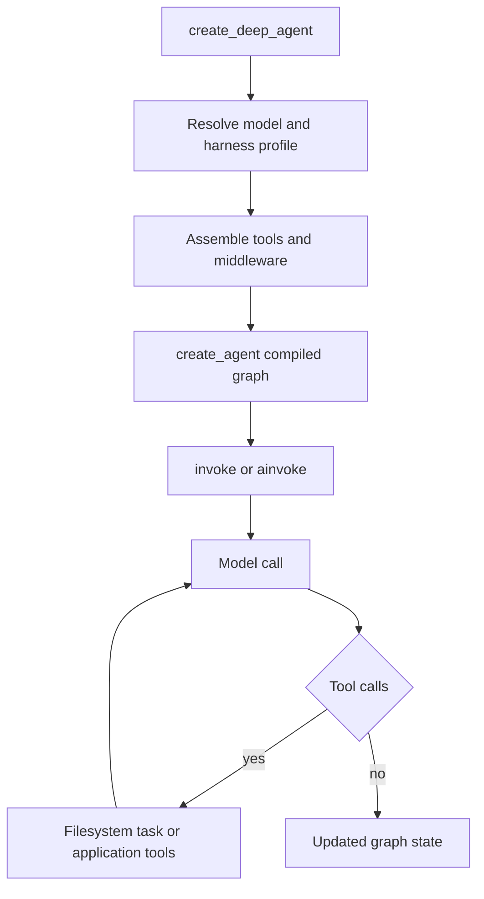

# Workflow: Build a Deep Agent

Use `create_deep_agent` when a standard LangChain tool-calling loop is appropriate but the application also needs the Deep Agents harness: filesystem operations, context management, delegation, and optional skills and memory. It returns a compiled LangGraph graph assembled around LangChain's `create_agent`; it is not a separate runtime. For ownership detail, see [SDK construction & execution](/openwiki/architecture/sdk-construction-execution.md).

## 1. Start with an explicit model and a minimal invocation

Install the package with `uv add deepagents`. Supply a tool-calling model explicitly: `model=None` currently falls back to `claude-sonnet-4-6`, requires `ANTHROPIC_API_KEY`, and is deprecated for removal in `deepagents==1.0.0`. A model can be a `provider:model` string or an initialized `BaseChatModel`; initialize it yourself when provider-specific options matter. For example, an initialized OpenAI model can opt out of the Responses API or disable its retention options.

```python
from deepagents import create_deep_agent

agent = create_deep_agent(
    model="openai:gpt-5.5",
    tools=[my_custom_tool],
    system_prompt="You are a research assistant.",
)
result = agent.invoke({"messages": "Research LangGraph and write a summary"})
```

The result is updated graph state, including `messages`. The compiled graph sets `recursion_limit=9_999`, which permits long tool-calling runs; it is not a safety control. Give the agent bounded tools and test its stopping behavior.



Caption: Construction assembles the LangChain graph once; invocation cycles between model and available tools until the model returns without tool calls.

## 2. Choose the storage and execution boundary before exposing tools

`backend=` owns filesystem data and command-execution capability. It defaults to `StateBackend`, whose files are ephemeral state: they persist within a conversation thread through LangGraph checkpointing but not across threads. Pre-populate its files in graph input, for example `agent.invoke({"messages": [...], "files": {...}})`, rather than calling the backend outside graph execution.

The public backend choices include `FilesystemBackend`, `StoreBackend`, `CompositeBackend`, `ContextHubBackend`, `LocalShellBackend`, and `LangSmithSandbox`. Choose the implementation based on the required storage and execution boundary; see [backends](/openwiki/concepts/backends.md).

`FilesystemMiddleware` supplies `ls`, `read_file`, `write_file`, `edit_file`, `delete`, `glob`, `grep`, and `execute`. `execute` only performs commands when the selected backend implements `SandboxBackendProtocol`; otherwise it returns an error. Do not infer isolation from the presence of `execute`: `LocalShellBackend`, despite implementing that protocol, runs unrestricted commands and filesystem access on the host. Keep it out of web, API, multi-tenant, and untrusted-workload environments; filesystem permission rules do not constrain shell access.

`tools=` adds application tools and never removes built-ins. A harness profile can hide named tools from the model with `excluded_tools`; to remove filesystem tools from the harness, supply a `FilesystemMiddleware` with the desired `tools`. Tool exclusion is applied after custom middleware, so an excluded tool cannot be restored by a later custom model hook.

## 3. Set prompt and profile policy deliberately

`system_prompt` is the caller-owned `USER` portion. The active harness profile—resolved after model construction—contributes `BASE` and `SUFFIX`, producing `USER -> BASE -> SUFFIX` with blank-line separation. With a `SystemMessage`, caller content blocks, including `cache_control`, are retained and profile text is appended as a new text block.

Profiles are the provider/model-specific policy owner: they can set prompt slots, tool descriptions and exclusions, extra middleware, and the default general-purpose subagent. Model strings are resolved through `init_chat_model` plus applicable provider-profile initialization behavior; a pre-initialized model passes through unchanged. Add or change profiles only with a focused profile-matching test.

## 4. Extend at the middleware assembly boundary

The builder owns stack assembly. The core consists conditionally of `SkillsMiddleware`, `FilesystemMiddleware`, `SubAgentMiddleware`, summarization middleware, `PatchToolCallsMiddleware`, and `AsyncSubAgentMiddleware`. Caller middleware is inserted after that core and before the profile/prompt-cache/memory/HITL tail. A custom middleware with an existing `.name` replaces that entry in place; a new name is inserted at the core-to-tail boundary.

Profiles can exclude middleware by exact class or exact public `.name`, but exclusions are validated. `FilesystemMiddleware` and `SubAgentMiddleware` are protected scaffolding: they back filesystem tools and synchronous task dispatch, respectively, so attempts to exclude them fail with `ValueError`. Private, ambiguous, or unmatched exclusions also fail rather than silently building a different stack.

Prefer middleware state schemas for feature-local state. If a graph-wide `state_schema` is unavoidable, subclass `DeepAgentState`: its `messages` field uses `DeltaChannel` to reduce checkpoint growth from quadratic to linear. Declarative subagents receive that schema; already compiled and remote subagents retain their own schema.

## 5. Add delegation only for a clear execution model

`subagents=` supports three distinct boundaries:

- A declarative `SubAgent` is compiled for synchronous `task` delegation. It is isolated by default and receives only the delegated task. It can override model, tools, middleware, skills, permissions, interrupts, and structured response format.
- A `CompiledSubAgent` supplies an already-built runnable through `task`; configure its state schema and approval policy when compiling that runnable.
- An `AsyncSubAgent` has a `graph_id` and optional endpoint headers. `AsyncSubAgentMiddleware` launches it through the LangGraph SDK as tracked background work and exposes operations to launch, check, update, cancel, and list tasks. A local ASGI transport without a URL requires an async parent entrypoint such as `ainvoke`; synchronous `invoke` requires a reachable Agent Protocol server.

Unless the profile disables it or the caller supplies one, the builder adds the synchronous `general-purpose` subagent. `task` is therefore present by default. To omit it, set `general_purpose_subagent=GeneralPurposeSubagentProfile(enabled=False)` on the active harness profile and pass no synchronous subagents; async subagents remain independent.

A `mode="fork"` declarative subagent is experimental. It continues the parent conversation, appends its prompt to the inherited prompt, cannot declare skills, and refuses recursive delegation. Ordinary declarative subagents inherit parent tools when their own `tools` field is absent, but they do not inherit arbitrary parent middleware; define their middleware explicitly.

## 6. Configure skills, memory, and permissions at their owners

`skills=` names POSIX paths to skill directories in the backend. `SkillsMiddleware` reads their `SKILL.md` metadata through backend APIs and loads skills progressively; later same-named sources override earlier ones. With the default `StateBackend`, include the files in invocation state. `memory=` names `AGENTS.md` files. `MemoryMiddleware` loads their ordered content at startup into the system prompt, stripping HTML comments; it tells the model to treat memory as reference data and prefer the user and verified tool evidence on conflict. See [subagents & skills](/openwiki/concepts/subagents-skills.md).

Use `permissions=` for built-in filesystem-tool policy, not backend isolation. A `FilesystemPermission` rule covers read or write operations and has `allow`, `deny`, or `interrupt` mode. Rules are evaluated in declaration order and the first match wins; an unmatched call is allowed. Paths must be absolute and reject traversal patterns. `FilesystemMiddleware` applies these rules at the tool layer, so direct backend use does not enforce them. Declarative subagents inherit parent rules unless their own list replaces them.

For human approval, pass `interrupt_on` directly or use interrupt-mode permission rules. The builder converts interrupt permissions into path-aware `HumanInTheLoopMiddleware` predicates, merges them with explicit configuration (explicit entries win by tool name), and installs HITL only when the merged mapping is nonempty. A checkpointer is required to resume interrupted work. For bulk tools—including `ls`, `glob`, `grep`, and `delete`—the predicate interrupts when their possible scope could intersect a protected path; an omitted or current-directory path is treated conservatively. See [permissions & HITL](/openwiki/concepts/permissions-hitl.md).

## 7. Add LangGraph operational configuration

`checkpointer`, `store`, `context_schema`, `response_format`, `cache`, `name`, and `debug` are forwarded to `create_agent`. Use a checkpointer for resumable HITL and persisted graph state. Provide the store required by a `StoreBackend`; `response_format` controls structured output. These options do not replace the backend, profile, or middleware ownership decisions above.

## 8. Validate at the closest boundary

Start with graph-assembly tests using a fake model: assert installed tools, profile-selected prompt, and middleware ordering. Then add an end-to-end test only for the tool loop or backend behavior being changed. Run focused tests from `libs/deepagents`:

```bash
uv run --group test pytest -vvv --disable-socket --allow-unix-socket tests/unit_tests/test_graph.py
uv run --group test pytest -vvv --disable-socket --allow-unix-socket tests/unit_tests/test_permissions.py
```

`test_graph.py` covers construction, profile resolution, prompt assembly, tool exclusion, protected middleware, and custom-middleware placement. `test_permissions.py` covers ordered permission decisions, recursive delete protection, and HITL predicates. Use `test_subagents.py` or `test_async_subagents.py` for delegation changes, skills/memory middleware tests for prompt-supplied content, and backend tests for storage or shell semantics. The project `make test` runs unit tests through `uv` with socket access disabled except Unix sockets. Integration tests use `ChatAnthropic` and require `ANTHROPIC_API_KEY`; `LANGSMITH_API_KEY` optionally enables tracing. See the [testing guide](/openwiki/testing/testing-guide.md).

## Practical safe-change checklist

1. Pick an explicit model and backend before enabling tools that can act externally.
2. Treat `tools=` as additive; use a profile or a custom filesystem middleware when reducing capability.
3. Put policy at its owner: backend for isolation, filesystem middleware for path rules, HITL for approval, and profiles for provider-specific shape.
4. Verify each subagent's isolation, inheritance, and approval behavior separately from the parent.
5. Preserve `DeepAgentState` message reduction when extending state.
6. Assert the compiled graph's actual tool and middleware shape, then test the security-sensitive path or tool call that motivated the change.
