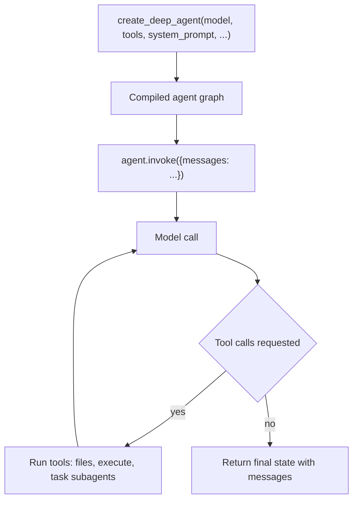

# Workflow: Build a Deep Agent with the SDK

This page walks through building a custom deep agent end to end: construct it with
`create_deep_agent(...)`, invoke it with `{"messages": ...}`, and let the agent
loop until the task is done. It stays task-focused — for the internals of how the
graph is assembled and executed, see
[SDK construction & execution](/openwiki/architecture/sdk-construction-execution.md).

For working, runnable patterns, start from [`/examples/`](repo://examples) and
[`libs/deepagents/README.md`](repo://libs/deepagents/README.md).

## What you are building

Deep Agents is an opinionated agent harness built on top of LangChain's
`create_agent` and LangGraph. `create_deep_agent` bundles planning, a pluggable
filesystem, subagent delegation, context summarization, skills, and memory into a
single compiled graph so you get a long-horizon agent out of the box, then
extend or replace any piece without forking.

## Quickstart: construct and invoke

The three arguments you almost always start with are `model`, `tools`, and
`system_prompt`, straight from the README quickstart:

```python
from deepagents import create_deep_agent

agent = create_deep_agent(
    model="openai:gpt-5.5",
    tools=[my_custom_tool],
    system_prompt="You are a research assistant.",
)
result = agent.invoke({"messages": "Research LangGraph and write a summary"})
```

- `model` accepts either a `provider:model` string (e.g. `"openai:gpt-5.5"`,
  resolved via `init_chat_model`) or a pre-initialized `BaseChatModel` instance.
- `tools` is **additive**: your tools are merged with the built-in tool suite
  (`ls`, `read_file`, `write_file`, `edit_file`, `glob`, `grep`, `execute`, and
  `task`). Passing tools never removes a built-in.
- `system_prompt` is your caller-authored instruction block. It is placed first,
  then any active harness profile's `BASE` and `SUFFIX` are appended
  (`USER -> BASE -> SUFFIX`).

`create_deep_agent` returns a compiled LangGraph graph, so you invoke it with the
standard LangGraph inputs — a dict whose `messages` key holds the conversation.
The return value is the updated agent state (including the full `messages` list).

## Construct → invoke → loop



Caption: A deep agent is constructed once, then invoked; inside a single invoke
the model and tools loop until the model stops requesting tool calls.

The tool-calling loop is the standard `create_agent` agent loop that
`create_deep_agent` compiles into. To keep long-horizon runs from stalling, the
compiled graph is configured with a high `recursion_limit` (`9_999`) so the
loop can take many steps before hitting the LangGraph recursion guard.

## Extension points

`create_deep_agent` exposes each part of the harness as a keyword argument. Reach
for the one that matches how much you need to customize.

### Custom tools (`tools=`)

Pass any LangChain `BaseTool`, plain callable, or tool dict. These are merged
with the built-in suite. To *stop* offering a built-in tool you register a
`HarnessProfile` with `excluded_tools` (or supply your own `FilesystemMiddleware`
with an explicit `tools=[...]`) — the `tools=` argument alone cannot remove a
built-in.

### Middleware (`middleware=`)

Custom middleware is inserted after the base stack (skills, filesystem, subagents,
summarization, patch-tool-calls) but before the tail stack (profile middleware,
prompt caching, memory, human-in-the-loop). A custom middleware whose `.name`
matches an existing entry replaces it in place; otherwise it splices in after the
core stack. See the [middleware catalog](/openwiki/concepts/middleware-catalog.md)
for the built-in middleware and their responsibilities.

### Subagents (`subagents=`)

Delegate work to agents with isolated context windows via the `task` tool. Three
forms are supported:

- `SubAgent` — a declarative synchronous spec (`name`, `description`,
  `system_prompt`, plus optional `tools`, `model`, `middleware`, `skills`,
  `permissions`, `interrupt_on`, `response_format`).
- `CompiledSubAgent` — a pre-built runnable exposed through `task`.
- `AsyncSubAgent` — a remote/background subagent (identified by `graph_id`),
  routed into `AsyncSubAgentMiddleware` and run as a non-blocking task.

If you do not supply a subagent named `general-purpose`, a default one is added
automatically (unless the active harness profile disables it). The
[Deep Research example](repo://examples/deep_research/agent.py#L39-L59) shows a
declarative research subagent with its own tools. See
[subagents & skills](/openwiki/concepts/subagents-skills.md) for detail.

### Backends (`backend=`)

The filesystem and shell tools run against a pluggable backend. The default is
`StateBackend` (files live in graph state); the `execute` tool only runs shell
commands when the backend implements `SandboxBackendProtocol`, otherwise it
returns an error. See [backends](/openwiki/concepts/backends.md).

### Skills (`skills=`) and memory (`memory=`)

`skills=` takes a list of skill source paths loaded on demand into the system
prompt through `SkillsMiddleware`; `memory=` takes `AGENTS.md`-style file paths
loaded at startup into the system prompt through `MemoryMiddleware`. With the
default `StateBackend`, provide skill files at invoke time via `files={...}`. See
[subagents & skills](/openwiki/concepts/subagents-skills.md).

### Profiles

Harness and provider profiles adjust prompt assembly, tool-description overrides,
excluded tools, and extra middleware based on the model in use. Profiles are
resolved automatically from the model but can be registered
(`register_harness_profile`, `register_provider_profile`). Profiles cannot strip
the protected scaffolding middleware (`FilesystemMiddleware`, `SubAgentMiddleware`),
which back core file tools and the `task` tool respectively; attempting to
exclude them raises `ValueError`.

## Runtime configuration

Several arguments are passed through to `create_agent`/LangGraph rather than
changing the agent's behavior: `checkpointer` and `store` (persistence and
cross-session memory), `context_schema`, `state_schema`, `response_format`
(structured output), `cache`, `name`, and `debug`. For human-in-the-loop,
`interrupt_on` (and `permissions` rules with `mode="interrupt"`) auto-install
`HumanInTheLoopMiddleware` so tool calls pause for approval.

`state_schema`, when supplied, must be a `TypedDict` subclass of `DeepAgentState`
so the built-in `DeltaChannel` reducer on `messages` is preserved; prefer adding
state via middleware unless you specifically need a custom base schema.

## Where to go next

- [`/examples/`](repo://examples/README.md) — research, coding, content, and
  deployable-service agents built on this workflow.
- [`libs/deepagents/README.md`](repo://libs/deepagents/README.md) — the library
  quickstart and feature overview.
- [SDK construction & execution](/openwiki/architecture/sdk-construction-execution.md)
  — how the middleware stack is assembled and how the graph runs.
