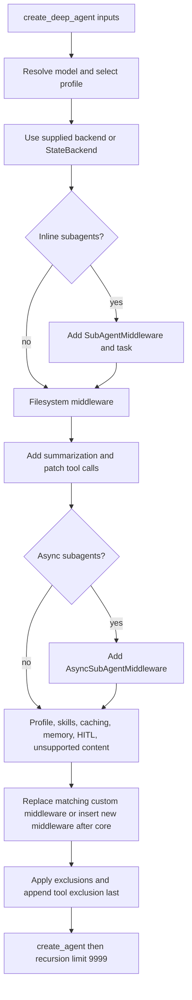

# Build or Modify a Deep Agent

`create_deep_agent` is the public construction boundary for the Deep Agents harness on LangChain `create_agent` and LangGraph. It resolves the model and harness profile, builds the backend-dependent middleware graph, and returns a compiled graph. Treat a change as an assembly change—not merely an addition to `tools=`—because profiles, middleware, subagents, and skills determine what the model ultimately sees and what can execute.

See [middleware stack](/openwiki/architecture/middleware-stack.md), [backends](/openwiki/concepts/backends.md), [subagents and skills](/openwiki/concepts/subagents-skills.md), and [permissions and HITL](/openwiki/concepts/permissions-hitl.md) for their component-level contracts.

## 1. Start with explicit construction inputs

Use a provider-qualified model string or an initialized `BaseChatModel`; strings are resolved through `init_chat_model` after provider-profile initialization. Pass an initialized backend instance. If omitted, the builder creates `StateBackend()`: its files are graph state, persist only within a checkpointed conversation thread, and may only be accessed while LangGraph is executing. Seed it through invocation state, for example `agent.invoke({"messages": [...], "files": {...}})`, rather than calling it directly.

`model=None` currently falls back to `ChatAnthropic(model_name="claude-sonnet-4-6")`, but that fallback is deprecated and scheduled for removal in `deepagents==1.0.0`; construct a model explicitly.

```python
from deepagents import create_deep_agent
from deepagents.backends import StateBackend

agent = create_deep_agent(
    model="openai:gpt-5.4",
    backend=StateBackend(),
    tools=[my_application_tool],
    system_prompt="You are a careful research assistant.",
)
result = agent.invoke({"messages": [{"role": "user", "content": "Investigate this task."}]})
```

`tools=` is additive: it supplies application tools alongside built-ins. It does not remove filesystem tools or `task`. Use a harness profile's `excluded_tools` to suppress a model-visible name, or replace the built-in `FilesystemMiddleware` by name to change its actual tool set. A profile-level exclusion is applied last, after custom middleware, so later middleware cannot restore an excluded tool.

## 2. Follow the construction branches


```mermaid
flowchart TD
    Input["create_deep_agent inputs"] --> Model["Resolve model and select profile"]
    Model --> Backend["Use supplied backend or StateBackend"]
    Backend --> Subs{"Inline subagents?"}
    Subs -->|yes| Task["Add SubAgentMiddleware and task"]
    Subs -->|no| Core["Filesystem middleware"]
    Task --> Core
    Core --> Summary["Add summarization and patch tool calls"]
    Summary --> Async{"Async subagents?"}
    Async -->|yes| AsyncMW["Add AsyncSubAgentMiddleware"]
    Async -->|no| Tail
    AsyncMW --> Tail["Profile, skills, caching, memory, HITL, unsupported content"]
    Tail --> Custom["Replace matching custom middleware or insert new middleware after core"]
    Custom --> Exclude["Apply exclusions and append tool exclusion last"]
    Exclude --> Compile["create_agent then recursion limit 9999"]
```

Caption: the builder conditionally assembles core delegation middleware, then applies profile-controlled tail behavior and final tool filtering before compiling the graph.

The main stack starts with `FilesystemMiddleware`; it adds `SubAgentMiddleware` only when synchronous subagents exist, then summarization and `PatchToolCallsMiddleware`, followed by asynchronous-subagent middleware when configured. The profile's extra middleware follows that core. `SkillsMiddleware` is then added when `skills=` is supplied, before provider prompt-caching middleware; memory, auto-derived HITL, and unsupported-content handling follow. Custom middleware whose `.name` matches an existing assembled entry replaces it in place. A new entry is inserted after the core stack, ahead of profile, skills, caching, memory, and HITL tail middleware. Finally profile exclusions are checked and applied; `FilesystemMiddleware` and `SubAgentMiddleware` are protected and cannot be excluded.

The selected harness profile also controls prompt pieces, description overrides, extra/excluded middleware, tool exclusions, and default general-purpose-subagent behavior. The authored system prompt is caller `USER`, then profile `BASE`, then profile `SUFFIX`; a caller `SystemMessage` retains its content blocks and receives profile text as an additional block. Inspect the chosen profile and final stack whenever changing model-provider configuration.

## 3. Deliberately assemble delegation and state

`subagents=` separates specs by shape:

- A declarative `SubAgent` is compiled with a rebuilt middleware stack and is reached through `task`.
- A `CompiledSubAgent` is already runnable and is also exposed through `task`.
- An `AsyncSubAgent` has `graph_id`, is routed to `AsyncSubAgentMiddleware`, and exposes background-task operations independently of `task`.

Unless a synchronous spec named `general-purpose` was supplied, the active profile automatically adds one. Disable it in `GeneralPurposeSubagentProfile` and supply no synchronous subagents to remove the `task` tool. Declarative subagents inherit the parent tools when their own `tools` field is absent, parent permissions when their own rules are absent, and parent `interrupt_on` when their own configuration is absent. Their own values replace those inherited values. Compiled and remote subagents do not inherit parent HITL configuration; configure their runnable or remote graph directly.

Prefer middleware state schemas. When graph-wide state is unavoidable, make the schema a `TypedDict` subclass of `DeepAgentState`; this retains the `messages` `DeltaChannel` reducer. The builder combines it with middleware schemas, calculates private state keys, and makes them private to the `task` boundary. `checkpointer`, `store`, `context_schema`, `response_format`, `cache`, `name`, and `debug` pass through to `create_agent`; a checkpointer is required for durable interruption and resume.

## 4. Add skills as a progressive-disclosure surface

Pass `skills=["/skills/base/", "/skills/project/"]` to install `SkillsMiddleware` against the same backend. A source contains skill directories with `SKILL.md`; metadata is loaded through backend operations, not direct filesystem access. Sources load in order and a later duplicate skill name wins. Metadata is cached once per thread in `skills_metadata`; set that state field to `None` via input or `update_state` to reload changed source content.

The system prompt initially lists skill metadata, not full instructions. The agent reads a selected `SKILL.md` with `read_file` when it needs the workflow. A skill may declare space-separated `metadata.include_tools`. Provide the corresponding tools by constructing a replacement `SkillsMiddleware(..., tools=[...])` with the same `sources`, or provide a resolver for dynamic tools:

```python
from deepagents import create_deep_agent
from deepagents.middleware.skills import SkillsMiddleware

skills = SkillsMiddleware(
    backend=backend,
    sources=["/skills/project/"],
    tools=[create_customer_request],
)
agent = create_deep_agent(
    model=model,
    backend=backend,
    skills=["/skills/project/"],
    middleware=[skills],  # replaces the default SkillsMiddleware by name
)
```

Skill tools are intentionally not registered in the normal tool node. After a successful `read_file` of the declaring `SKILL.md`, the middleware binds and records only its named tools for the next model call; a call before the read, or in the same turn as the read, is rejected as an invalid tool. The disclosure lasts only while its skill-read evidence remains in the conversation: summarization that drops that read withdraws the tool. The disclosure record is private state and is refreshed on every model call, so a stale checkpoint cannot authorize a tool a rebuilt agent did not show. An async resolver requires `ainvoke`; a synchronous call raises `TypeError` rather than leaving an awaitable unresolved.

A declarative subagent receives skills only when its own `skills` field says so (except that a fork mirrors parent prompt-producing skill middleware). Skill tool definitions are likewise scoped to the middleware instance: do not assume a parent or general-purpose-subagent skill tool appears in an isolated worker.

## 5. Keep backend capability and approval policy separate

Filesystem tools use the selected backend. `execute` is available only in practice when it implements `SandboxBackendProtocol`; otherwise it returns an error. A state-backed filesystem contributes the `files` state channel, including when a `CompositeBackend` contains a `StateBackend` route. Backend selection is therefore both a persistence and tool-capability decision.

Filesystem permission rules are ordered first-match `allow`, `deny`, or `interrupt` rules and apply at the built-in filesystem-tool boundary, not to direct backend use. Interrupt rules become path-aware HITL predicates; explicit `interrupt_on` entries override generated entries for the same tool. Passing either source installs `HumanInTheLoopMiddleware`. Use a checkpointer to resume an approval pause. Permissions are not isolation: in particular, a host-shell backend requires an actual sandbox to contain commands.

## 6. Verify the final assembled surface

For a change to builder logic, profile behavior, inheritance, or middleware order, begin with `tests/unit_tests/test_graph.py`. Assert the compiled graph's tool node and capture the middleware passed to `create_agent`; do not infer behavior merely from constructor arguments. Cover both branches you altered—for example default general-purpose delegation enabled and disabled, matching-name replacement and new middleware insertion, or profile exclusion after custom middleware.

For skills or dynamic tool-disclosure changes, run `tests/unit_tests/middleware/test_skill_tools.py`. Its focused cases cover disclosure only after a successful skill read, same-turn and pre-read rejection, withdrawal after compaction, stale checkpoint records, resolver and construction validation, HITL interaction, and subagent scope. Pair it with the graph suite when changing `create_deep_agent`, because the builder decides skills placement and replacement behavior.

```bash
cd libs/deepagents
uv run --group test pytest -vvv tests/unit_tests/test_graph.py
uv run --group test pytest -vvv tests/unit_tests/middleware/test_skill_tools.py
```

If changing a backend or filesystem policy, additionally run the nearest filesystem and permissions suites described in the [testing guide](/openwiki/testing/testing-guide.md). Before merging, exercise a fake-model loop that checks the tool list before and after every option-dependent transition, especially a skill read, summarization, an interrupt/resume, and delegation.

## Safe-change checklist

1. Use an explicit model and backend, and document the backend's persistence and execution capability.
2. Map each public option to its owner: profile, core middleware, tail middleware, declarative subagent, or compiled/remote subagent.
3. Inspect the final middleware order and model-bound tool list; `tools=` alone is not the final surface.
4. Preserve `DeepAgentState` reduction and private-state boundaries when adding state.
5. For skills, test read-gated disclosure, compaction withdrawal, and rebuilt-checkpoint behavior.
6. Treat filesystem permissions, HITL approval, and backend sandboxing as distinct controls.
