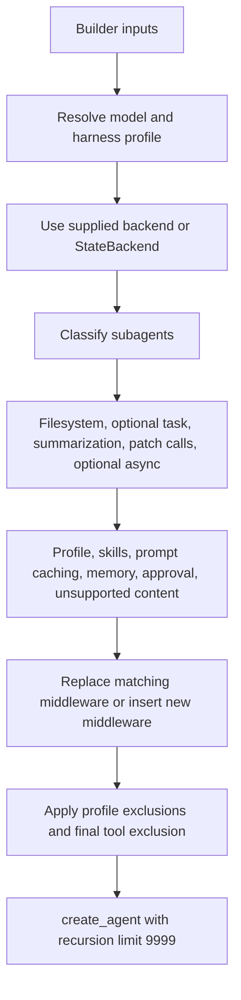

# Build and Customize a Deep Agent

`create_deep_agent` is the public assembly boundary for the Deep Agents harness. It resolves a model and harness profile, constructs middleware around LangChain `create_agent`, and returns a compiled LangGraph graph. It is deliberately a batteries-included layer: filesystem access, delegation, context summarization, skills, and human approval are composed as middleware, so a change to one option can change the model-visible and executable tool surface.

See [SDK construction and execution](/openwiki/architecture/sdk-construction-execution.md), [backends](/openwiki/concepts/backends.md), [subagents and skills](/openwiki/concepts/subagents-skills.md), and [permissions and HITL](/openwiki/concepts/permissions-hitl.md) for component contracts.

## 1. Start with explicit model and backend choices

Pass either a `provider:model` string or an initialized `BaseChatModel`. A string is resolved with `init_chat_model`; a prebuilt instance is useful when provider-specific settings must be retained. In particular, use an initialized OpenAI model to choose Chat Completions rather than Responses API, or to set Responses API retention options. Do not rely on `model=None`: it currently constructs `ChatAnthropic(model_name="claude-sonnet-4-6")`, but that fallback is deprecated and is scheduled for removal in `deepagents==1.0.0`.

Pass an initialized backend instance. Omitting it selects `StateBackend()`, whose files live in graph state: they persist in a checkpointed conversation thread but not across threads and the backend can only be used from LangGraph execution. Seed files through the graph input rather than by calling the backend outside a run.

```python
from deepagents import create_deep_agent
from deepagents.backends import StateBackend

agent = create_deep_agent(
    model="openai:gpt-6-astra",
    backend=StateBackend(),
    tools=[my_application_tool],
    system_prompt="You are a careful research assistant.",
)
result = agent.invoke(
    {"messages": [{"role": "user", "content": "Investigate this task."}], "files": {}}
)
```

`tools=` is additive; it does not remove built-in filesystem tools or `task`. A profile can hide a tool name with `excluded_tools`, while replacing `FilesystemMiddleware` with one configured with `tools=[...]` changes the filesystem suite itself. The selected harness profile also contributes prompt parts, description overrides, extra/excluded middleware, tool exclusions, and default general-purpose-subagent configuration. The assembled authored prompt is `USER -> BASE -> SUFFIX`; when the caller supplies a `SystemMessage`, its content blocks (including cache-control blocks) remain intact and profile text is appended as another block.

## 2. Understand the assembly order before extending it


```mermaid
flowchart TD
    Input["Builder inputs"] --> Resolve["Resolve model and harness profile"]
    Resolve --> Backend["Use supplied backend or StateBackend"]
    Backend --> Agents["Classify subagents"]
    Agents --> Core["Filesystem, optional task, summarization, patch calls, optional async"]
    Core --> Tail["Profile, skills, prompt caching, memory, approval, unsupported content"]
    Tail --> Custom["Replace matching middleware or insert new middleware"]
    Custom --> Filter["Apply profile exclusions and final tool exclusion"]
    Filter --> Compile["create_agent with recursion limit 9999"]
```

Caption: `create_deep_agent` builds the core tool providers first, layers policy and prompt-producing middleware, then performs final filtering before compilation.

The main core is `FilesystemMiddleware`, followed by `SubAgentMiddleware` only if synchronous subagents exist, summarization, `PatchToolCallsMiddleware`, and `AsyncSubAgentMiddleware` if remote/background specs exist. The tail is profile extra middleware, optional `SkillsMiddleware`, provider prompt-caching middleware, optional memory, auto-derived HITL, and `UnsupportedContentMiddleware`. Profile tool exclusion is appended last, so a custom tool-injecting middleware cannot restore an excluded name.

Custom middleware with the same `.name` as an assembled entry replaces it in place. New middleware is spliced after the core and before the profile/skills/caching/memory/HITL tail. `FilesystemMiddleware` and `SubAgentMiddleware` are protected scaffolding: a profile cannot exclude either, and an unmatched, private-name, or ambiguous exclusion is an error rather than a silently degraded graph. The builder then calls `create_agent` and configures `recursion_limit` to 9,999 for long-horizon tool loops.

An important consequence of the placement is that ordinary user middleware executes before skills. It cannot see freshly loaded `skills_metadata` in `before_agent` or `before_model`, and cannot modify the skills prompt section in `wrap_model_call`. A custom middleware named `SkillsMiddleware` still takes that slot.

## 3. Configure delegation and preserve state boundaries

`subagents=` accepts three different execution models:

- A declarative `SubAgent` is rebuilt by the harness and invoked through `task`.
- A `CompiledSubAgent` is an already-built runnable, also exposed through `task`.
- An `AsyncSubAgent`, identified by `graph_id`, is put in `AsyncSubAgentMiddleware`; it runs as a background task and supplies launch, status, update, cancel, and list operations rather than `task`.

Unless the caller supplies a synchronous `general-purpose` subagent, the profile adds a default one. Disable it with `GeneralPurposeSubagentProfile(enabled=False)` and supply no synchronous subagents to omit `task`; async subagents do not change that rule. Declarative subagents inherit parent tools when their `tools` key is absent, and inherit permissions and `interrupt_on` unless they explicitly provide replacement values. Compiled and remote agents are independently configured runnables/graphs, so they do not inherit parent HITL or custom state schema.

A declarative subagent normally receives only its delegated description. `mode="fork"` is experimental: it continues the parent’s effective conversation, rebuilds the inherited prompt-producing middleware, and appends its own `system_prompt` as an addendum. A fork may not declare separate `skills`; it inherits the parent configuration and rejects recursive `task` delegation at runtime. Use an isolated worker for a deliberately smaller context; use a fork only when the worker must reason over the parent conversation.

Prefer a middleware `state_schema` for new state. If graph-wide state is necessary, use a `TypedDict` subclass of `DeepAgentState`, preserving its `messages` `DeltaChannel` reducer. The builder merges state schemas, identifies private middleware fields, and gives the task boundary those private keys so they are not passed to ordinary subagents or returned to the parent. `checkpointer`, `store`, `context_schema`, `response_format`, `cache`, `name`, and `debug` pass through to `create_agent`; use a checkpointer when an interrupted run must be resumed.

## 4. Add skills as progressive disclosure

Pass `skills=` with POSIX backend paths to install `SkillsMiddleware`, or pass a custom middleware of the same name to change its sources, prompt template, or skill tools. Sources may be paths or `(path, label)` pairs. The middleware lists each source through the selected backend, loads metadata from child `SKILL.md` files, and uses later sources to override same-named earlier skills. Metadata is cached per thread in `skills_metadata`; set it to `None` in graph input or with `update_state` to request a reload. Source failures are retained as state errors, logged, and rendered as untrusted diagnostics in the default skills prompt.

The initial prompt exposes metadata and a `read_file` path, not the complete skill instructions. The agent reads the desired `SKILL.md` through filesystem tooling. To force a skill body into the next model call—such as when the user explicitly names a workflow—set `pinned_skills`; readable named skills are appended as `HumanMessage` snapshots and the pending list is cleared.

A skill can name tools in `metadata.include_tools`. Supply them to a replacement `SkillsMiddleware`; they must not be added as ordinary agent tools if disclosure is intended.

```python
from deepagents import create_deep_agent
from deepagents.middleware.skills import SkillsMiddleware

skill_middleware = SkillsMiddleware(
    backend=backend,
    sources=[("/skills/project/", "Project")],
    tools=[create_customer_request],
)
agent = create_deep_agent(
    model=model,
    backend=backend,
    skills=["/skills/project/"],
    middleware=[skill_middleware],  # replaces the default by name
)
```

Skill tools are not registered in the normal tool node. A successful `read_file` result for the declaring `SKILL.md`, or a pinned skill snapshot, is the evidence that permits disclosure on a later model call. A pre-read call and a call in the same turn as the read remain invalid. On each model call the middleware finds visible read evidence, resolves named tools, shows/binds only the disclosed tools, and writes a private record of exactly the gated names shown. Compaction that removes the evidence withdraws the tool; missing or malformed checkpoint records grant no authority. Resolver results must remain stable within a thread for prompt caching; asynchronous resolvers require an async graph entry point such as `ainvoke`.

Skills are scoped to each middleware instance. An isolated declarative subagent gets skill sources only from its own `skills` or matching middleware configuration. A fork mirrors parent prompt-producing middleware, including skills, but starts with its own disclosure record.

## 5. Treat capability, permission, and approval as separate controls

Filesystem operations run through the selected backend. `execute` is usable only when that backend implements `SandboxBackendProtocol`; otherwise its tool returns an error. A state-backed backend adds the `files` state channel, including when a `CompositeBackend` routes any branch to `StateBackend`. Backend selection is therefore both a persistence and shell-capability choice.

Filesystem permission rules are ordered, first-match `allow`, `deny`, or `interrupt` rules. `FilesystemMiddleware` enforces them for built-in filesystem tools, not direct calls to the backend. Declarative subagents inherit the parent rule list unless their own `permissions` replaces it. `interrupt` rules are translated into path-aware `HumanInTheLoopMiddleware` predicates, and direct `interrupt_on` entries override generated entries of the same name. For broad operations such as `ls`, `glob`, and `grep`, the predicate conservatively interrupts if the requested subtree could overlap protected paths; a pathless bulk operation interrupts whenever an applicable interrupt rule exists. A checkpointer is needed to durably pause and resume approval.

Do not treat permissions or HITL as sandboxing. The project’s security model is that the agent can do what its tools allow: enforce real containment at the tool/backend boundary, especially for any backend that can run shell commands.

## 6. Verify the final graph, not just constructor arguments

For builder, profile, order, or inheritance changes, begin with `tests/unit_tests/test_graph.py`. Its focused cases inspect the assembled middleware and compiled tool node, covering default delegation, prompt assembly, provider caching placement, exclusions, skills replacement/placement, and fork behavior. Test both sides of the branch you change—for example default general-purpose enabled/disabled, a matching-name replacement versus a new middleware insertion, or an exclusion after custom middleware.

For skill-tool changes, run `tests/unit_tests/middleware/test_skill_tools.py` and `tests/unit_tests/middleware/test_skill_tool_resolver.py`. They cover successful-read and pinned disclosure, pre-read/same-turn rejection, compaction withdrawal, stale disclosure records, subagent/fork scoping, approval interaction, and resolver validation. Pair these suites with graph assembly tests because `create_deep_agent` decides the middleware placement that makes those properties hold.

```bash
cd libs/deepagents
uv run --group test pytest -vvv tests/unit_tests/test_graph.py
uv run --group test pytest -vvv tests/unit_tests/middleware/test_skill_tools.py
uv run --group test pytest -vvv tests/unit_tests/middleware/test_skill_tool_resolver.py
```

## Safe-change checklist

1. Use an explicit model and backend; document model-provider settings, backend persistence, and shell capability.
2. Inspect the selected profile and final middleware order. `tools=` is not the final model-visible surface.
3. Keep `FilesystemMiddleware` and `SubAgentMiddleware` intact, preserve `DeepAgentState` reduction, and use middleware-private state where possible.
4. Choose isolated versus forked subagents deliberately; configure compiled and remote workers independently.
5. For skills, test metadata reload, read/pin-gated disclosure, compaction withdrawal, resolver stability, and rebuilt-checkpoint behavior.
6. Treat filesystem permissions, HITL approval, and backend sandboxing as distinct safeguards.
