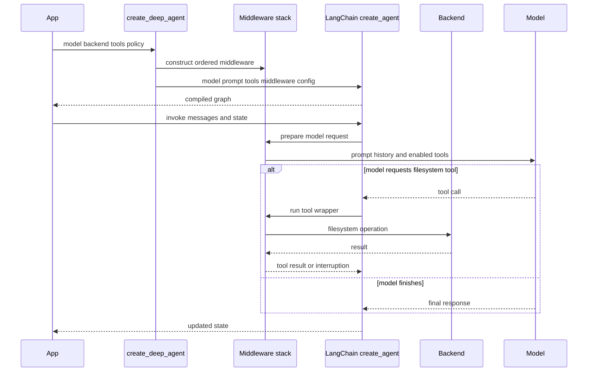

# Build and Modify a Deep Agent

Use `create_deep_agent` to build the opinionated Deep Agents harness on LangChain's `create_agent` and LangGraph. It returns a compiled graph with filesystem, context-management, planning/summarization, and optional delegation middleware; applications construct it and then call `invoke` or `ainvoke`. See [SDK construction & execution](/openwiki/architecture/sdk-construction-execution.md) for the surrounding ownership model.

## 1. Make the model and storage boundary explicit

Pass a tool-calling model explicitly. `model` accepts a `provider:model` string, resolved through `init_chat_model`, or an initialized `BaseChatModel`. Do not rely on `model=None`: its `ChatAnthropic(model_name="claude-sonnet-4-6")` fallback is deprecated and scheduled for removal in `deepagents==1.0.0`.

Choose one initialized backend instance before exposing file tools. `backend=` is shared by filesystem middleware, skills, memory, summarization, and declarative subagents. It defaults to `StateBackend()`, whose files live in graph state and are checkpointed within a conversation thread; it cannot be used outside graph execution. Seed files in invocation input rather than calling it directly.

```python
from deepagents import create_deep_agent
from deepagents.backends import FilesystemBackend

backend = FilesystemBackend(root_dir="/srv/agent-workspace", virtual_mode=True)
agent = create_deep_agent(
    model="openai:gpt-6-astra",
    backend=backend,
    tools=[my_custom_tool],
    system_prompt="You are a research assistant.",
)
result = agent.invoke({"messages": "Research LangGraph and write a summary"})
```

`FilesystemBackend` grants direct filesystem access, so select its root and deployment environment deliberately. For cross-thread persistence, use `StoreBackend` with an application-specific namespace and pass the associated `store` to the graph; use `CompositeBackend` when paths need different storage owners. Backend factories are no longer accepted: pass `StateBackend()`, `FilesystemBackend(...)`, `CompositeBackend(...)`, or another initialized `BackendProtocol` instance.

`LocalShellBackend` additionally implements `SandboxBackendProtocol`, making `execute` available, but it executes commands directly on the host. Its virtual filesystem root and path policy do not restrict shell commands. Do not use it for untrusted, shared, web/API, or multi-tenant workloads; use a genuinely isolated sandbox implementation for execution. On a backend without `SandboxBackendProtocol`, `execute` returns an error instead of executing.


```mermaid
sequenceDiagram
    participant App
    participant Builder as create_deep_agent
    participant Stack as Middleware stack
    participant Graph as LangChain create_agent
    participant Backend
    participant Model
    App->>Builder: model backend tools policy
    Builder->>Stack: construct ordered middleware
    Builder->>Graph: model prompt tools middleware config
    Graph-->>App: compiled graph
    App->>Graph: invoke messages and state
    Graph->>Stack: prepare model request
    Stack->>Model: prompt history and enabled tools
    alt model requests filesystem tool
        Model-->>Graph: tool call
        Graph->>Stack: run tool wrapper
        Stack->>Backend: filesystem operation
        Backend-->>Stack: result
        Stack-->>Graph: tool result or interruption
    else model finishes
        Model-->>Graph: final response
    end
    Graph-->>App: updated state
```

Caption: Construction selects concrete dependencies; during a run the compiled graph routes filesystem calls through middleware to the selected backend.

## 2. Compose the filesystem surface, not just `tools=`

`tools=` adds application tools; it does not remove built-ins. `FilesystemMiddleware` supplies `ls`, `read_file`, `write_file`, `edit_file`, `delete`, `glob`, `grep`, and, when supported, `execute`. The synchronous `task` tool is supplied only when synchronous subagents exist (normally the auto-added general-purpose subagent). To reduce the filesystem surface, replace the middleware in `middleware=` with the exact tool allowlist; `read_file` must remain present. Unsupported `execute` and `delete` capabilities are filtered by backend capability.

```python
from deepagents import create_deep_agent
from deepagents.backends import FilesystemBackend
from deepagents.middleware.filesystem import FilesystemMiddleware

backend = FilesystemBackend(root_dir="/srv/agent-workspace", virtual_mode=True)
files = FilesystemMiddleware(
    backend=backend,
    tools=["read_file", "glob", "grep"],
    grep_max_count=200,
)
agent = create_deep_agent(
    model="openai:gpt-6-astra",
    backend=backend,
    middleware=[files],  # replaces the base middleware with the same name
)
```

Use the same backend instance in the replacement. A custom middleware with the same `.name` replaces its built-in entry in place; a new middleware is inserted after the core stack and before the tail. The normal core is optional skills, filesystem, optional synchronous subagents, summarization, patch-tool-calls, and optional asynchronous subagents. The tail includes profile middleware, tool exclusion, provider prompt caching, optional memory and HITL, then unsupported-content handling. Protected filesystem and synchronous-subagent scaffolding cannot be excluded by a harness profile.

Large textual tool and human-message results have separate eviction controls (`tool_token_limit_before_evict` and `human_message_token_limit_before_evict`); they write a result to the backend and leave a preview/reference. Keep the default grep cap or set a deliberate per-call/default limit to bound context and memory use.

## 3. Optionally offload binary `read_file` content

Set `offload_binary_content=True` on the `FilesystemMiddleware` only when the backend's artifacts path is durable outside checkpointed state—typically a sandbox or filesystem-backed route. It applies only to `read_file` binary results and inline human-message media, not arbitrary custom-tool results.

```python
from deepagents import create_deep_agent
from deepagents.backends import FilesystemBackend
from deepagents.middleware.filesystem import FilesystemMiddleware

backend = FilesystemBackend(root_dir="/srv/agent-workspace", virtual_mode=True)
agent = create_deep_agent(
    model="openai:gpt-6-astra",
    backend=backend,
    middleware=[
        FilesystemMiddleware(backend=backend, offload_binary_content=True),
    ],
)
```

The middleware uploads each base64 payload under `blobs/<sha256>` beneath the backend artifacts root and replaces checkpointed message content with a `deepagents_blob` digest reference. Before a model request it rehydrates references from an untracked per-run payload cache or the backend. Downloads are accepted only if their SHA-256 matches the reference. A missing, malformed, tampered, or unavailable blob becomes a text notice; an upload exception leaves the original payload inline, preserving model visibility rather than failing the tool result.

This is best-effort context/checkpoint reduction, not data protection. It is automatically disabled with a warning when the `blobs/` route resolves to `StateBackend`, because that would still checkpoint the binary. Human media submitted after the last model response is replaced on the next model call, so its original input write remains in checkpoint history.

## 4. Set prompts, delegation, and state at their owners

The final authored prompt is caller `USER` followed by the active harness profile `BASE` and `SUFFIX`. A `SystemMessage` preserves its existing content blocks, including cache-control blocks. Profiles also supply model-specific middleware, tool-description overrides, exclusions, and general-purpose-subagent behavior, so assert the selected profile's final tool and middleware shape when changing model/provider configuration.

`subagents=` accepts declarative `SubAgent`, precompiled `CompiledSubAgent`, and remote `AsyncSubAgent` forms. Declarative and compiled forms are called through `task`; remote specs identified by `graph_id` use async-subagent middleware and return tracked background task identity. Declarative subagents inherit application tools and parent permissions/interrupt policy unless their specification replaces them. Disable the profile's general-purpose subagent and provide no synchronous subagents to remove `task`.

Prefer middleware-owned state. If a graph-wide `state_schema` is necessary, subclass `DeepAgentState` so the `messages` `DeltaChannel` reducer is retained. `checkpointer`, `store`, `context_schema`, `response_format`, `cache`, `name`, and `debug` are forwarded to `create_agent`; in particular, use a checkpointer when an interrupted run must be resumed. The compiled graph uses `recursion_limit=9_999`, which permits long tool loops but is not a termination or security control.

## 5. Apply filesystem policy and approval separately

`FilesystemPermission` rules are first-match rules over read/write operations and paths: `allow`, `deny`, or `interrupt`; unmatched calls are allowed. They are enforced at built-in filesystem tool boundaries, not on direct backend calls. Declarative subagents inherit parent rules unless they define replacement rules.

Pass `interrupt_on` for named tool approvals, or use interrupt-mode filesystem permissions. The builder derives path-aware HITL predicates from interrupt rules, merges them with explicit configuration, and lets explicit entries win for the same tool. Bulk operations interrupt conservatively when their scope could overlap a protected path. Passing either source installs `HumanInTheLoopMiddleware`; a checkpointer is required to persist and resume approval interrupts.

Do not combine unscoped filesystem permissions with a backend that provides command execution: middleware rejects this configuration because execute-tool permissions are not implemented. More fundamentally, filesystem policy is not a sandbox and cannot constrain `LocalShellBackend` shell access.

## 6. Validate the nearest seam, then the assembled loop

Run focused tests from `libs/deepagents` after a filesystem or assembly change:

```bash
uv run --group test pytest -vvv --disable-socket --allow-unix-socket tests/unit_tests/middleware/test_filesystem_middleware_init.py
uv run --group test pytest -vvv --disable-socket --allow-unix-socket tests/unit_tests/middleware/test_blob_offload.py
uv run --group test pytest -vvv --disable-socket --allow-unix-socket tests/unit_tests/test_graph.py
uv run --group test pytest -vvv --disable-socket --allow-unix-socket tests/unit_tests/test_permissions.py
```

The initialization suite verifies state-channel contribution, nested composite detection, backend-instance validation, and tool description overrides. The blob suite verifies that only `read_file` content is offloaded, command message updates are handled, tampered or malformed references degrade safely, and upload failure keeps media inline. `test_graph.py` exercises profile and stack assembly; `test_permissions.py` covers filesystem policy and HITL behavior. Use the scripted end-to-end suite for a changed multi-step tool loop. `make test` runs the unit suite through `uv` with socket access disabled except Unix sockets. See the [testing guide](/openwiki/testing/testing-guide.md).

## Safe-change checklist

1. Instantiate and share a concrete backend; document its persistence and execution boundary.
2. Replace `FilesystemMiddleware` to narrow file tools; do not assume `tools=` removes built-ins.
3. Enable binary offload only when `blobs/` routes outside `StateBackend`, and test missing/tampered/upload-failure behavior.
4. Treat filesystem permissions, HITL, and sandbox isolation as distinct controls.
5. Preserve `DeepAgentState` message reduction when extending graph state.
6. Assert middleware/tool composition and execute the affected tool loop with a fake model.
