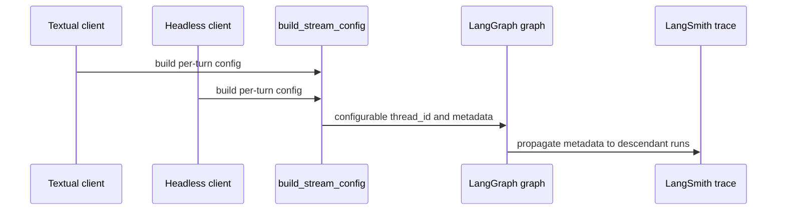
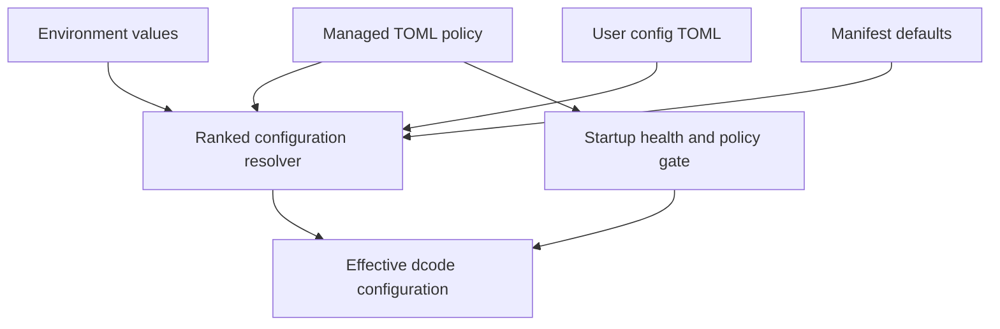
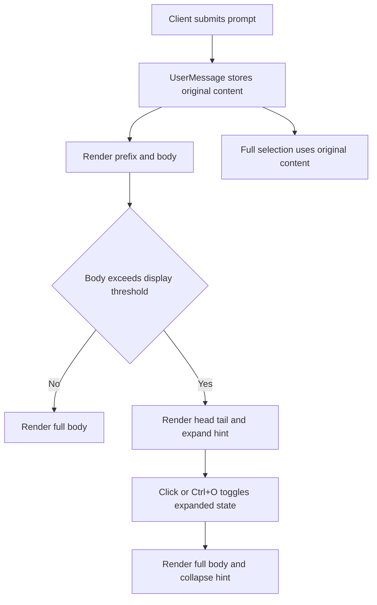

# Deep Agents Code: runtime, approvals, and MCP trust

`libs/code` packages the prebuilt terminal coding agent (`dcode` / `deepagents-code`). It is the coding-specific consumer of the SDK described in [Runtime and package architecture](../architecture/overview.md), not a standalone agent runtime.

## Process and graph flow

Deep Agents Code intentionally separates UI from graph execution:

```text
CLI parsing (`main.py`)
  -> Textual client/app (`app.py`, UI widgets)
  -> `langgraph dev` server subprocess
  -> cached `server_graph.make_graph()`
  -> `create_cli_agent()` middleware/tool/subagent assembly
  -> core `create_deep_agent()` / LangGraph execution
```

- `libs/code/deepagents_code/main.py` validates CLI/configuration, prevents autonomous flags in ACP or headless modes, constructs server arguments, and starts the Textual app.
- `server_graph.py` reads `DEEPAGENTS_CODE_SERVER_*` config, resolves models off the event loop, loads MCP/plugins, optionally builds a persistent sandbox, and caches the graph for the server process lifetime behind a lock.
- `agent.py` configures the SDK with model selection, goal/resume state, ask-user, memory/skills/plugins, local context, shell/interpreter support, compaction, rubric grading, approval middleware, and main/general/async subagents.
- Local execution uses `LocalShellBackend` rooted at the working directory; remote execution delegates filesystem and shell operations to the selected sandbox.

`libs/code/ARCHITECTURE.md` and `DEVELOPMENT.md` are the first primary docs to read when changing this path. Changes to the server-side graph construction should also account for the core assembly rules in [Runtime and package architecture](../architecture/overview.md).

## Trace metadata contract

Consult this section when changing LangSmith trace filtering, dcode version attribution, stream configuration, or editable-install detection. `config.py::build_stream_config()` creates one LangGraph config per turn and stamps its `metadata` before either client streams the graph. The Textual path calls it from `tui/textual_adapter.py::execute_task_textual`; headless execution passes the same config through `client/non_interactive.py::_stream_agent`. Consequently, `metadata` is trace-wide: LangGraph propagates it to root, model, tool, and subagent runs, as described by [Runtime and package architecture](../architecture/overview.md).



This shared path is why a trace-filter change must work for both interactive and non-interactive execution rather than being implemented in only one client.

The `coding-agent-v1` identity/version keys and `thread_id` are always present; known turn, repository, Git, working-directory, user, and sandbox fields are added when available. `approval_policy`, `ls_subagent_id`, and `ls_subagent_type` are deliberately excluded: their contracts apply only to selected run types, whereas this config would leak them to every descendant run. Keep any new metadata on the same side of that boundary.

`lc_versions["deepagents-code"]` remains the release-correlated version marker. On an editable install it receives the PEP 440 `+editable` local segment. The implementation also writes `metadata.editable` on **every** config as a boolean derived from the same cached PEP 610 lookup: `false` for ordinary installs and `true` for editable ones. Consumers should filter that boolean instead of parsing a version suffix; do not make it optional, otherwise normal installs cannot be distinguished from missing instrumentation. `dcode_client_deepagents_version` is a separate diagnostic about the SDK alongside the client and can differ from a remote graph's runtime SDK version.

Other diagnostic keys are intentionally conditional: `dcode_experimental` appears only for experimental mode, `dcode_auto_approve` only for YOLO mode, and `dcode_term_program` only for a nonblank `TERM_PROGRAM`. They are safe trace-wide labels, unlike run-type-scoped contract keys.

For a metadata-only change, start with the two explicit behavior tests in `libs/code/tests/unit_tests/tui/test_textual_adapter.py::TestBuildStreamConfig`: `test_versions_contains_cli_version` proves the ordinary-install `editable is False` case and `test_versions_marks_editable_cli_version` proves `True` remains consistent with the suffix. Run the quiet focused check:

```bash
cd libs/code && uv run --group test pytest -q --disable-socket --allow-unix-socket tests/unit_tests/tui/test_textual_adapter.py -k 'versions_contains_cli_version or versions_marks_editable_cli_version'
```

Broaden to `test_coding_agent_metadata.py` when changing the `coding-agent-v1` required keys or propagation contract, and to the Textual/headless stream suites when moving the call sites. A change that introduces a new run-type-specific field needs a source-backed per-run metadata seam; it must not merely add the field to `build_stream_config()`.

## Configuration and managed policy

Consult this section when adding a dcode configuration option, changing precedence, or enforcing deployment policy. `config_manifest.py` declares the typed option surface; `configuration/providers.py` coerces each source; and `configuration/resolver.py::resolve_ranked()` resolves them. The normal precedence is managed policy (rank 200), a reserved but currently unwired CLI seam (300), environment (400), user `~/.deepagents/config.toml` (500), then manifest defaults (1000). Lower numeric rank wins.



This flow shows that the managed source participates both in normal resolution and in the launch-time enforcement gate.

`managed_config.toml` is an administrator-owned OS file: `/etc/dcode/managed_config.toml` on Linux, `/Library/Application Support/dcode/managed_config.toml` on macOS, and the registry-derived ProgramData location on Windows. The Windows production lookup intentionally ignores a caller-controlled `ProgramData` environment variable. `configuration/service.py::require_healthy_managed_config()` gates startup: corrupt, unreadable, indeterminate, or unenforceable managed policy raises an error instead of becoming an empty policy. A refresh retains the last enforceable snapshot rather than caching a broken replacement, and MCP disabled-server checks fail closed when policy cannot be read.

For replacement options, a `Found` value from a durable managed source masks lower-precedence **environment** values; a lower-precedence durable user value cannot reverse an environment value that already wins. Union and deep-merge options deliberately retain valid contributions, including deny-list restrictions. Do not add a resolver bypass or treat a failed managed load as absent policy: that can turn an administrator restriction into a user-controlled configuration.

When extending this seam, register the option in `config_manifest.py`, choose its typed coercion and merge strategy, route it through the ranked providers, and make the user config writer leave the managed path untouched. Validate precedence and failure behavior before UI polish:

```bash
cd libs/code && uv run --group test pytest -q --disable-socket --allow-unix-socket tests/unit_tests/test_configuration.py tests/unit_tests/test_configuration_resolver.py -k 'managed_provider_failure_is_fail_closed or corrupt_managed_config_does_not_empty_the_mcp_deny_set or durable_found_masks_only_lower_priority_ephemeral_tiers'
```

The named tests cover a corrupt policy startup gate, MCP-deny fail-closed behavior, and directional durable masking. Add `test_configuration_resolution.py` or the specific consumer suite when changing a concrete option. `DEEPAGENTS_CODE_SHOW_USAGE_STATS` is a narrow teardown-output option: falsy values suppress only the session usage table for both TUI and `-x`/`--execute`, not all headless output.

## Ask-user wire contract

`ask_user` is interactive middleware and also feeds the Auto policy described below. `_ask_user_types.py` is the shared wire-format module used by the tool, TUI adapter, and `auto_mode`, avoiding a dependency from those consumers onto one another. `QuestionType` supports `text`, `multiple_choice`, and `multi_select`; choice types require non-empty choices.

A multi-select answer remains one `str` in the positional `answers: list[str]` wire shape, but `encode_multi_select_answer()` serializes selected values as a JSON array. This preserves commas, quotes, and newlines in a choice and makes an unselected question `[]`. Consumers must use `ask_user_answer_is_empty()` rather than `strip()`: `[]` is truthy but is empty for both required-answer validation and Auto consent evidence; malformed multi-select JSON also fails closed. Never restore comma-splitting as a fallback.

Use the focused contract test when changing question types, encoding/decoding, transcript display, or authorization evidence:

```bash
cd libs/code && uv run --group test pytest -q --disable-socket --allow-unix-socket tests/unit_tests/test_ask_user_types.py -k 'MultiSelectAnswerEncoding or AskUserAnswerIsEmpty'
```

Broaden to `test_ask_user_middleware.py`, `tui/test_textual_adapter.py`, and `test_auto_mode.py` only if the change crosses the tool, client interrupt, or Auto authorization boundary.

## Transcript presentation and selection

Consult this section for interactive dcode transcript changes, not for agent execution semantics. `UserMessage` in `libs/code/deepagents_code/tui/widgets/messages.py` is the sent-prompt widget mounted by `app.py`; it represents client-side input after submission and does not change what the server graph receives. `QueuedUserMessage` is a dimmed, temporary pre-send representation and deliberately retains its separate border/opacity treatment.



This flow is local to the Textual client: submitted text is retained for copy/selection even when the transcript render is collapsed.

### Rendering invariants and extension seam

- Sent prompts use a primary-tinted surface with one-cell top/bottom padding, no left padding, one-cell right padding, and one row of external separation. The visual boundary makes user input scannable without adding padding to high-frequency assistant/tool rows.
- The prompt/mode prefix is exactly two cells (`> `, `$ `, or `/ `). `_UserMessageContent` shifts wrapped lines by that gutter, so soft-wrap and explicit continuation text begins under the body, not under the glyph. Preserve this when changing prefix text, padding, or custom rendering.
- Long bodies use head-and-tail collapse with a clickable `@click` hint; `Ctrl+O` and click toggle `_expanded`. `get_selection()` must return the original full text for select-all/end selections, while partial selections stay aligned to the displayed render. Mode detection can strip `!`, `!!`, or `/` only when enabled; literal `-m`/`--message` input with a leading path slash remains plain text.
- `set_cancelled()` only dims an interrupted prompt. It is a client transcript state and must not be mistaken for a server cancellation mechanism.

The focused behavioral suite is `libs/code/tests/unit_tests/tui/widgets/test_messages.py::TestUserMessageAppearance`: it asserts the 15%-alpha background, four padding edges, and the continuation gutter for ordinary, shell, and slash prompts. Run the quiet narrow check from `libs/code`:

```bash
uv run --group test pytest -q --disable-socket --allow-unix-socket tests/unit_tests/tui/widgets/test_messages.py -k UserMessageAppearance
```

Broaden to the surrounding message-widget tests when changing collapse, selection, pointer handling, mode parsing, or queued-message behavior. Do not run server, approval, or integration tests for a CSS/layout-only change unless the edit also crosses the client/server submission boundary.

## Approval modes are safety policy, not containment

The README says that starting in a directory trusts its artifacts before approval. Remote sandboxes are the recommended boundary for untrusted repositories. Human approval complements that boundary but does not turn local execution into a sandbox.

| Mode | Behavior | Important constraint |
| --- | --- | --- |
| `manual` | Interrupts gated operations for user approval. | Default/fail-closed mode. |
| `auto` | Experimental deterministic policy plus classifier review may approve eligible operations. | Limited to local interactive, unsandboxed use with `DEEPAGENTS_CODE_EXPERIMENTAL`; otherwise it downgrades to manual. |
| `yolo` | Bypasses HITL. | Requires a versioned local acknowledgement stored with restrictive permissions. |

Approval state is a hashed per-thread record in LangGraph Store, read and validated by the server against the active thread. Missing, malformed, or unreadable state falls back to Manual. This server/client synchronization exists so a user can change modes during an active conversation; failure to synchronize a return to Manual must not leave an action running under a stale permissive policy.

The gated inventory includes writes/edits/deletes, execute, web search/fetch, subagent/task operations, optional compaction, and non-read-only MCP tools. Keep that inventory synchronized with the middleware’s interrupt configuration when adding a tool.

### Auto-mode authority boundary

The recent classifier-backed Auto feature is deliberately narrow:

- Fast-path writes must stay inside the trusted root and exclude sensitive paths such as CI/hooks, shell scripts, and dependency/config locations.
- Fast-path shell approval permits a small read-only Git set or narrow configured commands; shell control operators and broad/wildcard commands are rejected.
- Classifier input may be authorized only by **literal, pre-expansion user text attached by the client**. File content, tool output, and assistant prose cannot expand authority. A same-turn `ask_user` response is included only after server validation; its empty/malformed multi-select representation is withheld according to the [ask-user wire contract](#ask-user-wire-contract).
- The implementation redacts/sanitizes persisted reasons and validates tool-call identities/batches exactly.
- `readOnlyHint` only bypasses gating when it is literal, coherent boolean metadata with no destructive hint. Ambiguous metadata fails closed.

Auto is neither an OS boundary nor a guarantee that delegated work is classifier-reviewed. Parent Auto review must not be assumed to cover all subagent internals, and PTC/interpreter host-bridge calls have their own policy boundary. Security-sensitive changes here need both a code review focused on authority propagation and explicit top-level/delegated-path tests.

## MCP sources and project trust

MCP configuration is resolved low-to-high from user `~/.deepagents/.mcp.json`, project `.deepagents/.mcp.json`, project `.mcp.json`, then explicit configuration. Plugin configurations are also composed server-side. Supported transports are stdio, HTTP, and SSE; config validation covers server shape, headers/auth, and mutually exclusive tool filters.

Project-declared MCP configuration is a trust boundary: it can spawn a local command, cause SSRF, or exfiltrate interpolated headers. Thus project stdio **and remote** servers are gated. Whole-config `--trust-project-mcp` is possible, but scoped user-owned approvals/environment allowlists can authorize individual servers; explicit denial wins. `${VAR}` values are interpolated only at activation, and the loader isolates individual server errors while redacting resolved values when interpolation was used.

Runtime discovery uses throwaway sessions; tool wrappers use a lazy process-wide session manager with retry/invalidation for transient/dead/reauth sessions. Loading is bounded-concurrent while output ordering remains deterministic.

### Cached MCP tool failure boundary

`_build_cached_mcp_tool()` in `libs/code/deepagents_code/mcp_tools.py` turns each discovered tool into a LangChain `StructuredTool`. Its coroutine obtains a cached session, retries a transient session failure once after invalidation, and raises a `ToolException` for failures the model must see. `_handle_cached_mcp_tool_error()` is the sole `WARNING`/traceback logging boundary for those recoverable `ToolException`s and returns the tool-local error text. Do not add a second warning in the coroutine: one failed tool call must yield one failure warning, not duplicate diagnostics.

Cleanup warnings are separate: invalidating a failed retry session or closing a session can warn independently because they describe a resource-cleanup problem rather than a duplicate tool failure. Preserve that distinction when changing retries or error handling. Re-raise cancellation, keyboard interrupt, system exit, and existing `ToolException` values unchanged; the wrapper must not turn control flow or actionable MCP errors into a generic retry result.

## Tests and safe modification sequence

Run from `libs/code`:

```bash
uv sync --all-groups
make check                 # package full local suite
make test                  # unit/no-network
make integration_test      # network-enabled tests
```

The pytest defaults enforce a 30-second timeout and strict markers/configuration. Relevant anchors:

- `tests/unit_tests/test_approval_mode.py`: store failures/malformed state fail closed; YOLO acknowledgement behavior.
- `tests/unit_tests/test_auto_mode.py`: provenance, annotation coherence, path/Git policies, classifier failures, replay/escalation, denials, and headless MCP guards.
- `tests/unit_tests/test_server_graph.py`: graph cache, startup error handling, MCP discovery, off-loop construction, and no-MCP/read-only conditions.
- `tests/unit_tests/test_mcp_tools.py::TestCachedSessionProxy::test_repeated_transient_error_surfaces_tool_message`: a second transient failure becomes a model-visible error after one retry and logs exactly one tool-failure warning with traceback.
- `tests/unit_tests/test_mcp_tools.py::TestCachedSessionProxy::test_generic_oserror_is_not_retried`: a non-transient `OSError` is model-visible without session retry and has the same single-warning contract.
- `tests/integration_tests/test_auto_approve_remote.py`: actual approved/rejected remote writes, including subagent behavior.

For the cached MCP error seam, use the quiet focused check before broader package checks:

```bash
cd libs/code && uv run --group test pytest -q --disable-socket --allow-unix-socket tests/unit_tests/test_mcp_tools.py -k 'repeated_transient_error_surfaces_tool_message or generic_oserror_is_not_retried'
```

Before changing dcode: identify whether the behavior is client UI, persisted approval state, graph construction, middleware, backend/sandbox, or MCP session lifecycle; make the change at that boundary; then test both failure-to-manual and success paths. For repository-wide CI/release context, see [Evaluation and release](evaluation-and-release.md) and [Operations and testing](../engineering/operations-and-testing.md).
