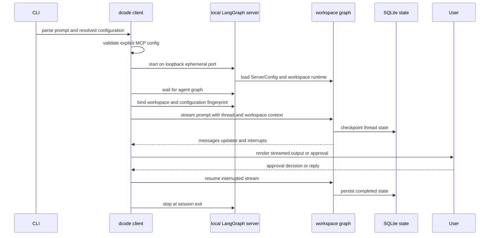

# Workflow: Run & Extend a dcode Session

`deepagents-code` (`dcode`) has three different launch shapes: a Textual TUI, a one-task headless client, and an ACP server. TUI and headless are clients of a temporary local LangGraph server. ACP is an in-process Agent Client Protocol service over standard input/output; it does not use that loopback connection.

See [code-agent architecture](../architecture/code-agent.md), [runtime behavior](../architecture/runtime-behavior.md), [configuration layering](../concepts/config-layering.md), [context management](../concepts/context-management.md), [GitHub Action](../integrations/github-action.md), and [MCP](../integrations/mcp.md) for adjacent details.

## Launch safely and select the route

```bash
curl -LsSf https://langch.in/dcode | bash
dcode
```

OpenAI, Anthropic, and Gemini support is included by default. Provider extras can be selected at install time:

```bash
DEEPAGENTS_CODE_EXTRAS="nvidia,ollama" curl -LsSf https://langch.in/dcode | bash
```

```bash
# Continuing interactive conversation
dcode

# One bounded task for automation
dcode -n "run the focused tests" --max-turns 8 --timeout 600

# ACP protocol service over stdin/stdout
dcode --acp
```

The working directory is a trust boundary, not merely a default path. dcode reads project artifacts before an approval panel can appear; approvals only gate model-requested tool calls. Do not run an untrusted checkout on the host. Use a remote sandbox when its execution must be isolated, and review project hooks, MCP configuration, skills, and Python extensions before granting their respective trust options.

No `--sandbox` means local execution. A bare `--sandbox` selects `[sandboxes].default`; a named provider selects that provider. `--sandbox-id`, `--sandbox-snapshot-name`, and `--sandbox-setup` attach to or provision supported remote environments. Put a bare `--sandbox` last before no positional argument so argparse cannot consume a following subcommand as its provider value.

## Dispatch, policy, and input normalization

The CLI parses arguments before heavyweight startup. `config`, `doctor`, `auth path`, and help remain usable when managed configuration is invalid; other managed-policy-gated operations fail closed with exit 78 if policy cannot be enforced. `threads list`/`ls` and `threads delete` are direct SQLite operations and do not start an agent server.

Piped stdin is capped at 10 MiB. It is prepended to an existing `-n` task, becomes an interactive initial prompt when paired with `-m`, seeds a startup skill when applicable, or becomes a new headless task. `--stdin` requires non-terminal stdin. Headless-only output, budget, and rubric controls reject an interactive launch with exit 2; `--goal` is interactive-only and conflicts with prompt/skill and rubric inputs. `--no-mcp` and `--mcp-config` are mutually exclusive.

## Normal TUI and headless session flow



*Normal TUI/headless flow: the parent binds a workspace before each remote stream, while the server selects the matching workspace runtime and persists the thread.*

### Client startup and workspace binding

`server_session` captures the project context, validates an explicit `--mcp-config` in the parent, serializes a `ServerConfig` into the server environment, scaffolds a temporary LangGraph development workspace, and starts the server on `127.0.0.1` with port `0`. It waits for the `agent` graph, constructs a `RemoteAgent`, and binds the selected workspace plus a configuration fingerprint. On failed or cancelled startup it reaps the process; context-manager exit also stops it and emits any preserved debug-log notice.

The graph factory is not a single graph permanently tied to whichever process cwd happened at startup. For an execution request, `make_graph` requires both a thread ID and workspace context, obtains the thread's persisted workspace binding, and chooses or builds a runtime for that binding. The server verifies the binding's workspace payload and fingerprint against its current `ServerConfig`; a mismatch is a workspace conflict rather than a silent cross-configuration execution. Workspace runtimes are cached in a bounded LRU (32 entries). A server-side sandbox is process-wide, so a second workspace cannot claim it after the first does.

When building a workspace runtime, the server snapshots that workspace environment and credentials off the event loop, then resolves the project context, model, built-in tools, and MCP tools. It creates the sandbox backend when configured and passes the resolved resources to `create_cli_agent`. The returned composite backend and its offload operation are server-owned and shared by the graph and offload route. This ordering matters when changing environment handling: do not revert to resolving `Path.cwd()` or dotenv files directly in the server event loop, and do not build a new backend only for `/offload`.

### Streaming, tools, and approvals

The TUI adapter streams `messages`, `updates`, and `custom` events with `subgraphs=True`; `RemoteAgent` transports the workspace context, converts server message and interrupt payloads into client types, and leaves durability to the server. Updates can contain HITL interrupts. The client renders model output and tool activity, collects an approval or an `ask_user` answer, then resumes the graph. Thus changes to event rendering belong in the adapter/app, while tool availability, interrupt policy, and backend behavior belong in `create_cli_agent` and the server graph factory.

Interactive approval persists Manual, classifier-backed Auto, or YOLO mode. Invalid stored values fall back to Manual; Shift+Tab skips unavailable modes, and YOLO requires acknowledgement of the current warning-policy version. Auto is unavailable for sandbox-backed sessions. Approvals do not alter the earlier project trust decision.

In headless mode every process creates a new UUID7 thread. Without `--shell-allow-list`, shell access is disabled; a restrictive list enables shell middleware, while `all` allows unrestricted shell use. Other tools are auto-approved unless permission hooks must receive gated calls. `--auto-approve` and `--yolo` only warn in headless mode and do not change this model. A turn or wall-clock timeout budget expires with 124; Ctrl-C returns 130.

### Resume, persistence, and offload

TUI `-r` resolves the most recent eligible thread, and `-r <ID>` resolves the named thread before startup. On a stored-cwd mismatch it can offer a workspace switch; unknown IDs receive similar-ID suggestions, and lookup failure, a miss, or a declined resume starts a fresh thread. Headless deliberately never resumes.

Checkpoints live in the global SQLite database at `DEFAULT_STATE_DIR/sessions.db`. UUID7 thread IDs sort naturally by creation time. Thread listing maintains a covering index so the usual metadata query avoids checkpoint blobs; failure to create it retains correct, slower full-scan behavior. Deleting a thread also attempts to delete its offloaded conversation-history file.

`/offload` is a remote server operation, not a client-side filesystem action. It compacts older messages through the runtime's offload operation and writes the archive through the same composite backend the graph uses. That allows a resumed thread on a fresh server process to read the persisted archive through its own `read_file` tool. Preserve this server ownership and the thread's persisted workspace binding when changing compaction or resume.

## ACP is a separate lifecycle

`dcode --acp` skips Textual checks, imports ACP dependencies, and serves the supplied ACP server in process. It resolves the model and project context, loads MCP tools, opens and sets up the SQLite checkpointer, and supplies a per-ACP-session graph builder to `run_acp_agent`. The builder uses the ACP context's model and cwd. MCP load failures return 1 before serving; a serving exception is reported as an ACP server failure and also returns 1. The MCP session manager is cleaned up in `finally`.

ACP supports Auto or acknowledged YOLO according to resolved approval policy, but it does not call `server_session`, start `langgraph dev`, or create a `RemoteAgent`. Treat it as an editor-host integration, not a replacement for `dcode -n` shell automation.

## Extension and configuration boundaries

`--mcp-config` supplies Claude Desktop-format JSON at highest precedence; `--no-mcp` disables all MCP loading. Explicit config is preflight-validated before TUI/headless subprocess startup. Discovered user/project configuration is loaded on the server and can surface as an MCP error instead; project MCP servers require trust.

Hooks run user-privilege commands with JSON lifecycle input. Project hooks require workspace trust; matching handlers run concurrently and reduce project → user → plugin. Exit code 2 is an event-specific blocking result. In headless CI, project hooks require `--trust-project-hooks` because no prompt is available.

Python extensions are experimental. Project extension execution needs `DEEPAGENTS_CODE_EXPERIMENTAL=1` plus interactive trust or `--trust-project-extensions` for unattended operation. Extension setup is transactional, but extension tools are not automatically in the human-approval map; extension authors must enforce sensitive-operation policy themselves.

## Change map and regression focus

| Change | Primary boundary | Focused verification |
| --- | --- | --- |
| CLI syntax, exit codes, policy gate, stdin routing | `deepagents_code/main.py` | CLI/unit tests for args and dispatch |
| Server process, explicit MCP preflight, workspace binding, cleanup | `client/launch/server_manager.py` | startup/cancellation tests and a TUI/headless smoke test |
| Workspace runtime selection, environment, MCP, sandbox, graph construction | `server_graph.py` | workspace/fingerprint and server-factory tests |
| Agent backend, middleware, tool gates, compaction | `agent.py` | `tests/unit_tests/test_end_to_end.py` async fake-model graph tests |
| TUI streaming, interrupt display/resume, slash commands | `tui/textual_adapter.py`, `app.py` | Textual tests and a manual approval-resume check |
| Threads, checkpoint metadata, cleanup | `sessions.py` | `test_main.py`, `test_main_args.py`, and `test_sessions.py` |
| Resumed offload across server restart | server runtime plus offload path | `tests/integration_tests/test_compact_resume.py` |

The end-to-end unit suite deliberately drives the agent asynchronously because production entrypoints stream rather than invoke synchronously; it covers basic tool traversal and automatic summarization/offloaded history with a fake model. The compaction-resume integration test creates a real persisted thread on one temporary server, restarts the server, resumes it in a production-style `DeepAgentsApp` with no client backend, invokes `/offload`, and verifies the archive remains readable through a later server's agent backend. These are the critical regression tests for preserving server-owned persistence rather than accidentally reintroducing client-owned state.
