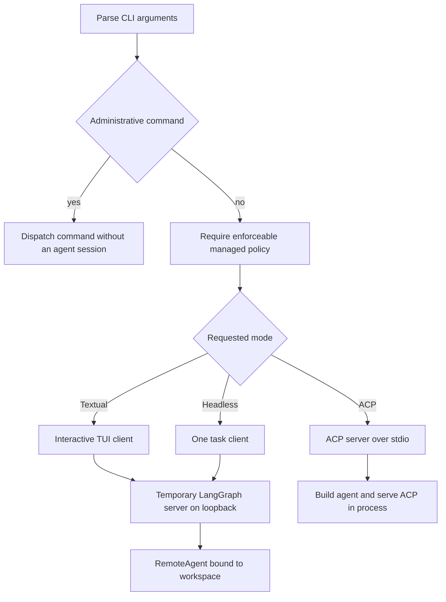

# Workflow: Run & Extend a dcode Session

`deepagents-code` (`dcode`) is a terminal coding agent with three materially different launch shapes: a Textual TUI, a one-task headless client, and an ACP server. The first two are **clients of a temporary local LangGraph runtime**; ACP instead speaks the Agent Client Protocol on standard input/output and builds its agent in-process. Do not mistake ACP's stdio transport for the normal loopback client/server connection.

See [code-agent architecture](../architecture/code-agent.md), [runtime behavior](../architecture/runtime-behavior.md), [configuration layering](../concepts/config-layering.md), [context management](../concepts/context-management.md), [ACP](../integrations/acp.md), and [MCP](../integrations/mcp.md) for adjacent details.

## Install and choose a mode

```bash
curl -LsSf https://langch.in/dcode | bash
dcode
```

OpenAI, Anthropic, and Gemini support is included by default. Provider extras can be selected at install time, for example:

```bash
DEEPAGENTS_CODE_EXTRAS="nvidia,ollama" curl -LsSf https://langch.in/dcode | bash
```

Use the TUI for a continuing, approval-driven conversation; `-n` for one automation task; and `--acp` only when an ACP-capable host will own the protocol conversation.

```bash
# Interactive TUI
dcode

# One bounded CI-style task
dcode -n "run the focused tests" --max-turns 8 --timeout 600

# ACP server: protocol traffic is stdin/stdout, not a TUI
dcode --acp
```



*The normal TUI/headless route has a loopback LangGraph server and remote client; ACP is a distinct stdio protocol route.*

## Establish the trust boundary first

The launch directory is trusted input. dcode reads project artifacts before tool-approval UI appears, so approving or rejecting later tool calls does not make an untrusted checkout safe. Do not run an untrusted checkout on the host; use a remote sandbox when execution must be isolated. This is especially important for project hooks, project MCP configuration, skills, and Python extensions, which may influence or execute during a session.

`--sandbox` is opt-in: no sandbox means local execution. A bare `--sandbox` resolves `[sandboxes].default`; an explicit provider selects that backend. `--sandbox-id`, `--sandbox-snapshot-name`, and `--sandbox-setup` respectively attach to or provision supported remote environments. Keep a bare optional `--sandbox` last before no positional value: argparse can otherwise consume a following subcommand as its provider value.

## Understand dispatch and validation

The CLI deliberately keeps `config`, `doctor`, `auth path`, and help usable when managed configuration is broken. Other managed-policy-gated commands and sessions fail closed with exit code 78 if present policy cannot be enforced. `threads list`/`ls` and `threads delete` dispatch without starting an agent server; use them for inspection and cleanup independently of a session launch.

Piped text normally becomes the headless task. It is prepended to `-n` or `-m`; with `--skill` and no explicit `--stdin`, it seeds the interactive skill invocation. Explicit `--stdin` means headless input and rejects a terminal stdin. The input limit is 10 MiB.

Mode-only controls are rejected with exit 2 rather than silently ignored: `--quiet`, `--no-stream`, `--max-turns`, `--timeout`, and rubric controls require `-n` or piped input. `--goal` is interactive-only, must not be blank, and conflicts with prompt/skill and rubric inputs. `--no-mcp` and `--mcp-config` are mutually exclusive.

## Run an interactive or headless client

### TUI and resume

`dcode` launches Textual. `-m/--message` auto-submits the initial prompt, `-s/--skill` starts a skill, and `--startup-cmd` runs before the first prompt; a non-zero startup command warns rather than aborting the session.

Use `-r` for the recent eligible thread or `-r <ID>` for a named one. The TUI resolves that intent before server startup, can offer to switch to the thread's stored cwd, suggests similar unknown IDs, and falls back to a new thread if lookup fails, misses, or is abandoned. Headless deliberately does not resume: it creates a new UUID7 thread for every process.

Threads are stored in the global SQLite state database at `DEFAULT_STATE_DIR/sessions.db`. UUID7 IDs sort by creation time. Listing reads checkpoint metadata and attempts to maintain a covering index so the common query does not scan large checkpoint blobs; inability to create that index keeps correct results but may make large stores slow. Deleting a thread also removes its offloaded conversation-history file when possible.

### Headless automation

`dcode -n "<task>"` executes one task and exits. Use `-q/--quiet` when stdout must contain only response text, and `--no-stream` to buffer the response instead of streaming it. A startup skill must be discoverable, authorized, readable, and nonempty; otherwise the command returns 1.

Headless approval behavior is intentionally not interactive approval automation:

- Without `--shell-allow-list`, shell access is disabled and other tools are auto-approved.
- `recommended` or a comma-separated list enables shell execution but restricts it to that allow-list.
- `all` permits any shell command and auto-approves tools.
- Permission hooks take precedence over those shortcuts so their gated calls can still reach the hooks.
- `-y/--auto-approve` and `--yolo` only emit a warning in headless mode; they do not change it.

Combine `--max-turns` and `--timeout` in CI. Exhaustion of either budget returns 124; Ctrl-C returns 130. A timeout is a wall-clock cancellation around the headless coroutine, whereas the turn cap bounds agentic turns.

### What the normal local runtime does

For TUI and headless mode, `server_session` resolves a `ServerConfig`, serializes it for the child, scaffolds a temporary LangGraph development workspace, and starts the server on `127.0.0.1` with port `0` (an OS-selected ephemeral port). It waits for the `agent` graph, creates a `RemoteAgent`, and binds that client to the selected project workspace with a configuration fingerprint. The server-side `make_graph` reads the same configuration schema from its environment, resolves the model and workspace environment, builds built-in/MCP tools, and compiles the graph.

That lifecycle has two important operational consequences:

1. An explicit `--mcp-config` is preflight-validated in the parent before a subprocess starts, giving a direct path-specific error. Discovered user/project configuration is handled more leniently and can remain visible as an MCP error instead of necessarily killing TUI startup.
2. Startup failure or cancellation stops the child; normal context-manager teardown stops it too and emits any preserved debug-log notice. If the TUI reports a server failure, inspect that preserved log, the supplied MCP file, model credentials/configuration, and sandbox-provider dependencies before retrying.

## Run ACP without the loopback server

`dcode --acp` skips the Textual dependency check and imports ACP dependencies. If they are absent it prints installation guidance and exits 1. ACP creates its model, loads tools and MCP configuration, opens the SQLite checkpointer, builds an agent per ACP session context, and passes an ACP server to `run_agent`. Its request/response stream is standard input/output; it does **not** call `server_session`, start `langgraph dev`, or create a `RemoteAgent`.

ACP is therefore suitable for an editor or other ACP client, not for shell piping intended as a one-shot task. MCP configuration failures in this path return 1 before protocol serving; an exception while serving is reported as an ACP server failure, and the MCP session manager is cleaned up in `finally`.

## Select approvals deliberately

Interactive approval has three persisted modes: Manual, classifier-backed Auto, and unrestricted YOLO. Invalid persisted values resolve to Manual. Shift+Tab cycles through available modes; Auto is unavailable for remote-sandbox sessions and YOLO can be omitted from the cycle by `startup.yolo_switcher`. Entering YOLO requires acknowledgement of the current warning-policy version.

`-y/--auto-approve` requests Auto in the local TUI or ACP, while `--yolo` requests unrestricted gated actions after acknowledgement; the flags are mutually exclusive. In ACP, a YOLO acknowledgement must already have been recorded through the interactive TUI. A managed startup policy can revoke raw flags, so diagnose the resolved policy rather than assuming a flag won. `--auto-classifier-model` is only meaningful where Auto is available; a weak classifier weakens the review boundary.

Approvals govern model-requested tool calls. They do not undo the earlier project-content trust decision.

## Add MCP, hooks, skills, and extensions

**MCP.** `--mcp-config` supplies Claude Desktop-format JSON and has highest precedence over discovered configuration. `--no-mcp` disables all MCP loading. Project MCP servers require trust; use `--trust-project-mcp` only after reviewing them. For server debugging, distinguish an explicit config error (fatal at preflight for TUI/headless) from a discovered configuration error surfaced through MCP management.

**Skills.** `-s/--skill NAME` invokes a startup skill. The generated slash-command catalog is the authoritative command list; useful operational commands include `/threads`, `/mcp`, `/extensions`, `/reload`, `/restart`, `/context`, `/offload`, `/manual`, `/auto`, and `/yolo`. `/skill-creator` creates or refines skills, while `/remember` saves useful context.

**Hooks.** Hooks are user-privilege commands fed JSON lifecycle payloads on stdin. User hooks load when present; project hooks require workspace trust; enabled-plugin hooks load with the plugin. Matching handlers execute concurrently, then results reduce in project → user → plugin precedence. Exit code 2 is a blocking result whose effect depends on the event; other non-zero exits and timeouts are diagnostics. In headless/CI mode, project hooks require `--trust-project-hooks` because no trust prompt is available.

**Python extensions.** Extensions are experimental and `-e/--extension` plus project-extension trust require `DEEPAGENTS_CODE_EXPERIMENTAL=1`. Project extensions execute arbitrary Python and require an interactive trust decision or `--trust-project-extensions` for an unattended run. Their setup is transactional: a failed extension rolls back its partial registrations while later extensions can load. Extension tools are not automatically covered by dcode's human-approval map, so extension authors must enforce sensitive-operation policy themselves.

## Regression focus and safe changes

When changing launch, dispatch, or storage behavior, preserve these contracts: administrative thread commands do not launch an agent; managed-policy failures remain fail-closed; headless budget exit codes remain stable; and temporary loopback servers are always reaped. Relevant focused tests cover thread-list cwd normalization and dispatch, persisted cwd behavior, and deletion of offloaded history in `tests/unit_tests/test_main.py`, `tests/unit_tests/test_main_args.py`, and `tests/unit_tests/test_sessions.py`.
