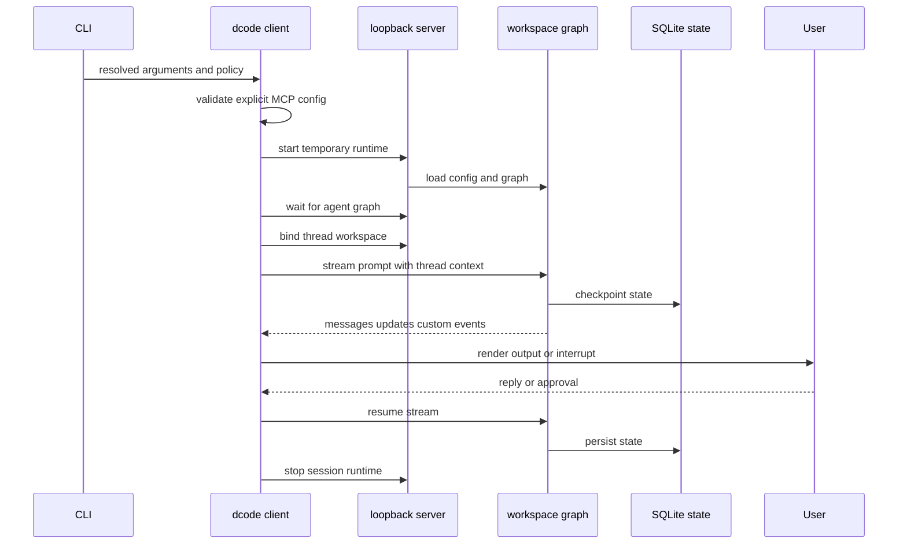
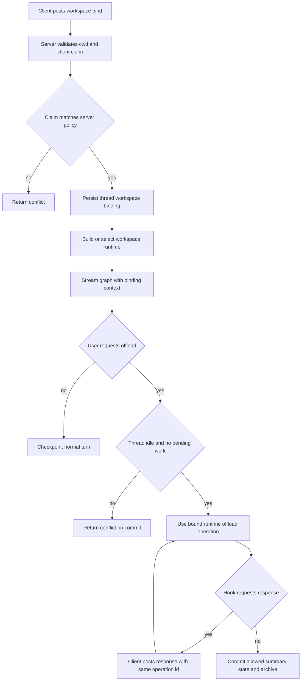

# Run and Operate a dcode Session

`deepagents-code` (`dcode`) has three launch shapes: the normal interactive Textual TUI, a one-task headless client, and an ACP server. The TUI and headless modes are clients of a temporary local LangGraph server. ACP is a separate in-process stdio integration, rather than a variant of the normal-session path.

See [code-agent architecture](../architecture/code-agent.md), [runtime behavior](../architecture/runtime-behavior.md), [configuration layering](../concepts/config-layering.md), [context management](../concepts/context-management.md), [MCP](../integrations/mcp.md), [costs and sessions](../operations/cost-and-sessions.md), and [security](../operations/security.md).

## Choose a mode and establish trust

```bash
curl -LsSf https://langch.in/dcode | bash
dcode

# One bounded CI or scripting task
dcode -n "run the focused tests" --max-turns 8 --timeout 600

# Separate ACP service over stdin/stdout
dcode --acp
```

OpenAI, Anthropic, and Gemini are included in the installer; provider extras can be selected with `DEEPAGENTS_CODE_EXTRAS`. The working directory is a trust boundary: project artifacts are read before an approval panel exists. Approvals gate model-requested tools, not startup reads. Do not run an untrusted checkout on the host; use a remote sandbox when host isolation is required.

No `--sandbox` means local execution. A bare `--sandbox` resolves the configured default; a provider name selects it. `--sandbox-id`, `--sandbox-snapshot-name`, and `--sandbox-setup` select or provision the remote environment. A managed `[sandboxes].default` names the backend for a sandboxed launch; it does not force an otherwise local launch into a sandbox.

## Dispatch and normalize input before startup

The CLI parses arguments and applies managed policy before an agent launch. If managed configuration cannot be enforced, normal operations fail closed with exit 78. Help and the diagnostic `config`, `doctor`, and `auth path` routes remain available; `threads list`/`ls` and `threads delete` operate on SQLite without starting an agent.

Piped stdin is capped at 10 MiB. Its precedence is an existing headless task, an interactive initial prompt, an auto-detected startup-skill prompt, then a new headless task; explicit `--stdin` requires non-terminal stdin. Headless-only output, turn, timeout, and rubric controls require a task. A headless shell is disabled unless a shell allow-list is supplied. Turn and wall-clock timeout expiry use exit 124.

For scripts, `--quiet` leaves only response text on stdout; status, tool notifications, decisions, and errors go to stderr. `--no-stream` buffers the final response. Neither control is available for an ordinary interactive launch.

## Normal TUI and headless session



*The normal-session sequence: the parent client owns startup and presentation, while the server owns execution and durability.*

### Startup, server process, and binding

`server_session` builds a resolved `ServerConfig`, validates an explicit MCP file before spawning, serializes configuration through `DEEPAGENTS_CODE_SERVER_*`, and scaffolds a temporary `langgraph dev` workspace with a SQLite checkpointer. The process normally binds `127.0.0.1` on an ephemeral port, waits for the `agent` graph, then creates a `RemoteAgent` and binds the launch workspace. Failed or cancelled startup stops the process; context-manager teardown stops a handed-off process and reports preserved server logs after terminal restoration.

A bind is a durable association of a thread with canonical workspace identity, a resource key, configuration fingerprint, and server-resolved workspace policy. The client can claim only session policy and must match the server's fingerprint; it cannot supply project policy. The route persists the binding before it mirrors thread metadata. It also builds the workspace runtime before metadata registration, returning a conflict or a service-unavailable response instead of creating a usable thread under an unavailable or changed workspace. Subsequent streams must carry the persisted descriptor exactly. The server re-resolves workspace policy on execution and rejects project-policy or configuration drift rather than silently running under changed trust or configuration.

The graph factory requires a thread ID and workspace context for request execution, loads that thread's binding, and selects its workspace runtime. Runtimes use an LRU bounded at 32 entries. MCP discovery, sandbox construction, and `atexit` setup must happen only once per runtime; because a sandbox backend is process-wide, a second workspace is rejected after the sandbox is claimed.

While constructing a runtime, the server snapshots workspace environment and credentials off the event loop, resolves model, built-in tools, MCP tools, and optional sandbox, then passes those resources to `create_cli_agent`. The composite backend and its offload operation are shared by graph execution and the custom offload route. Keep these responsibilities server-side when changing environment handling, compaction, or resume.

### Streaming, tools, and approvals

`RemoteAgent` requires a thread ID, adds the thread's workspace context to every stream, and converts server messages and HITL interrupts into client values. The TUI requests `messages`, `updates`, and `custom` streams with subgraphs, renders output and tool activity, collects an approval or `ask_user` response, and resumes the graph. Rendering changes belong in the TUI/app boundary; tools, interrupt policy, and backends belong in graph construction and `create_cli_agent`.

Interactive approval has Manual, Auto, and YOLO modes. Invalid persisted values fail closed to Manual; Shift+Tab omits unavailable modes; YOLO needs acknowledgement of the current policy version. Auto is unavailable for sandbox-backed sessions. In headless mode every process creates a new UUID7 thread. Without a shell allow-list shell access is disabled; a restrictive list enables shell middleware and `all` permits unrestricted shell use. Permission hooks can force gated calls through the client.

## Resume and state

Checkpoints live in global SQLite state. UUID7 thread IDs are time-sortable, and thread listing uses a covering index to avoid checkpoint blobs while retaining a correct full-scan fallback if index creation fails. Deleting a thread also attempts to remove offloaded history.

TUI `-r` selects the recent eligible thread and `-r <ID>` selects a named thread. A configured absolute or rolling age cutoff blocks stale resumes; the user can choose a fresh thread or exit. A stored-cwd mismatch offers a switch, unknown IDs produce similar-ID suggestions, and database failures or a declined resume fall back to a new thread. Headless always creates a new thread.

## Workspace and `/offload` branching



*Workspace binding makes the server authoritative for a thread's execution policy; offload operates only on a quiescent bound thread.*

`/offload` is a server operation, not a client filesystem action. It reads and hydrates the checkpoint, requires a registered thread in `idle` or `error` status and with no pending graph work, checks its workspace binding, and uses the matching runtime's offload operation. The route rejects concurrent, interrupted, unregistered, changed, or pending-work threads with 409 before committing. An empty thread returns an unchanged `empty` result. It permits only the state channels declared by `OffloadStateUpdate`, refusing message writes that could overwrite concurrent content.

Offload hook interrupts are resumable HTTP rounds, not a suspended server coroutine: the client repeats the same operation ID with accumulated hook responses, and the server re-executes while replaying answered calls. After compaction, it verifies that the checkpoint did not advance; if it did, no summary is committed. Archive linkage is settled carefully: a failed state write is read back to distinguish an applied link, a rollback-safe failure, and an indeterminate result. Model selection for offload is restored from checkpoint and server configuration, not accepted from request context, preventing a loopback client from selecting the credentialed summarizer endpoint.

This design keeps compaction and archive I/O on the backend that the agent actually uses. A resumed thread on a fresh server can therefore read its persisted archive through its own backend.

## Configuration, MCP, extensions, and hooks

`--mcp-config` has highest precedence and is preflight-validated for normal sessions; `--no-mcp` disables MCP loading and cannot be combined with `--mcp-config`. Project MCP servers require trust, including remote servers because their URLs and interpolated headers can affect network access and environment disclosure. Discovery preserves user versus project provenance; if a user-profile path collides with a project config, the server is treated as project-scoped rather than silently inheriting user trust.

MCP connection ownership is server-side: one FastMCP router fronts configured backends, while its session manager retains connections until cleanup. Cleanup is bounded so an unresponsive stdio server cannot indefinitely stall shutdown. MCP server status distinguishes loaded, unauthenticated, reconnect-pending, errored, and user-disabled entries, allowing the TUI to show a problem without handing an errored server's tools to the agent.

Hooks run user-privilege commands with JSON lifecycle payloads; project hooks require workspace trust, matching handlers run concurrently and reduce project → user → plugin, and exit code 2 is event-specific blocking. Experimental project Python extensions require trust and are not automatically placed in dcode's human-approval map. Treat project MCP, hooks, and extensions as executable or network-capable project input, not as harmless workspace configuration.

## Headless CI operation

The repository Action runs `dcode` non-interactively. Set an explicit `shell_allow_list`, `max_turns`, and `task_timeout` for bounded automation; `task_timeout` maps to `dcode --timeout` in seconds, whereas the Action-level `timeout` input is minutes. Pin the Action to a reviewed commit SHA rather than `main`. Supply provider credentials through the CI platform's secret mechanism, never in prompts, repository config, or checked-in MCP files.

The Action's `response` output combines raw stdout and stderr and is not filtered for secrets. Do not automatically echo it into tickets, logs, or downstream services without applying your own review and redaction policy.

## ACP is separate

`dcode --acp` does not call `server_session`, start a loopback `langgraph dev` process, or construct a `RemoteAgent`. It imports ACP dependencies, resolves model and project context, loads MCP tools, opens SQLite checkpointing, builds agents for ACP session contexts, and calls `run_acp_agent`; MCP cleanup is in `finally`. Dependency or MCP-load errors return 1 before serving, and serving exceptions are reported as ACP server failures with exit 1. Treat it as an editor-host protocol integration, not as headless automation.

## Troubleshooting and regression focus

| Symptom or change | Check or boundary | Focused verification |
| --- | --- | --- |
| Exit 78 before a run | Managed configuration health; use `config`, `doctor`, or `auth path` | CLI dispatch and policy tests |
| Explicit MCP config prevents startup | Correct the named file or use `--no-mcp`; do not bypass project trust casually | server-manager MCP preflight tests |
| Workspace bind or stream conflicts | Check cwd, thread binding, policy, configuration fingerprint, and sandbox ownership | binding and conflict tests |
| Headless tool refusal or exit 124 | Check `--shell-allow-list`, command segments, `--max-turns`, and `--timeout` | `test_non_interactive.py` |
| Offload returns 409 | Wait for no active or pending graph work; retain the same operation ID for hook replies | offload route tests |
| Offload returns 503 or 500 | Inspect the server log; 503 means runtime build failed, 500 can mean an indeterminate archive link | offload persistence tests |
| Server scaffolding, environment serialization, or cleanup change | `client/launch/server_manager.py` | `test_server_manager.py` plus a smoke test |
| Stream conversion or interrupt resume changes | `remote_client.py` and TUI adapter | stream and approval-resume tests |

The compaction-resume integration test creates persistent state on one temporary server, runs `/offload` through a fresh production-style app with no client-owned backend, and verifies a later server can read the archive. The pending-work recovery test establishes a graph paused before a tool node, abandons it through `RemoteAgent`, and verifies the tool never executes while an error `ToolMessage` records cancellation. These tests protect the core invariants: server-owned persistence and no execution of abandoned pending work.
