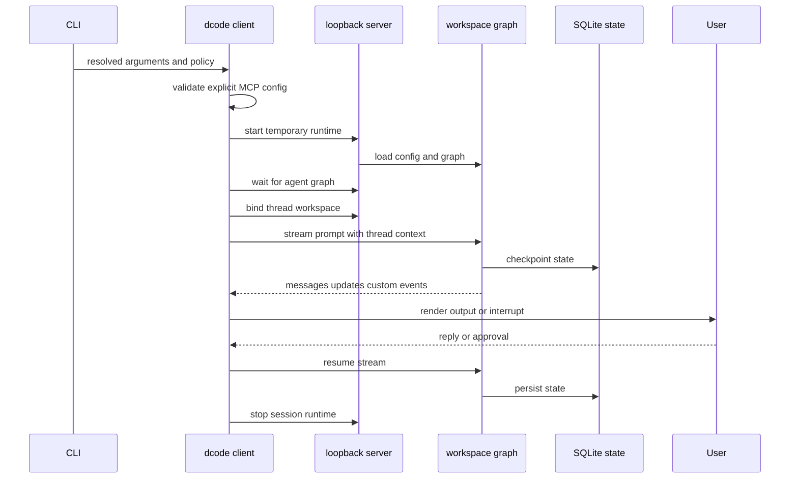
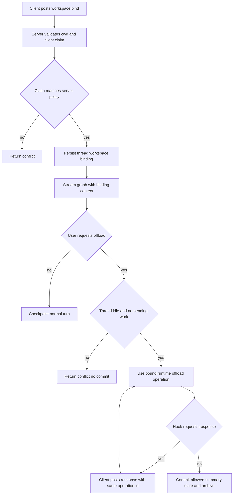

# Run a dcode Session

`deepagents-code` (`dcode`) has three launch shapes: the normal interactive Textual TUI, a one-task headless client, and an ACP server. The TUI and headless modes are clients of a temporary local LangGraph server. ACP is an explicitly separate in-process stdio integration and is not on the normal-session path.

See [code-agent architecture](../architecture/code-agent.md), [runtime behavior](../architecture/runtime-behavior.md), [context management](../concepts/context-management.md), [state persistence](../concepts/state-persistence.md), [MCP](../integrations/mcp.md), and [security](../operations/security.md).

## Choose a mode and establish trust

```bash
curl -LsSf https://langch.in/dcode | bash
dcode

# One bounded CI or scripting task
dcode -n "run the focused tests" --max-turns 8 --timeout 600

# Separate ACP service over stdin/stdout
dcode --acp
```

OpenAI, Anthropic, and Gemini are included in the installer; provider extras can be selected with `DEEPAGENTS_CODE_EXTRAS`. The working directory is a trust boundary: project artifacts are read before an approval panel exists. Approvals gate model-requested tools, not startup reads. Do not use an untrusted checkout on the host; use a remote sandbox when host isolation is required.

No `--sandbox` means local execution. A bare `--sandbox` resolves the configured default; a provider name selects it. `--sandbox-id`, `--sandbox-snapshot-name`, and `--sandbox-setup` select or provision the remote environment.

## Dispatch and normalize input before startup

The CLI parses arguments and applies managed policy before an agent launch. If managed configuration cannot be enforced, normal operations fail closed with exit 78. Help and the diagnostic `config`, `doctor`, and `auth path` routes remain available; `threads list`/`ls` and `threads delete` operate on SQLite without starting an agent.

Piped stdin is capped at 10 MiB. Its precedence is an existing headless task, an interactive initial prompt, an auto-detected startup-skill prompt, then a new headless task; explicit `--stdin` requires non-terminal stdin. Headless-only output, turn, timeout, and rubric controls require a task. A headless shell is disabled unless a shell allow-list is supplied. Turn and wall-clock timeout expiry use exit 124.

## Normal TUI and headless session



*The normal-session sequence: startup is parent-owned, while execution and durability are server-owned.*

### Startup, server process, and binding

`server_session` captures the project context, preflight-validates an explicit MCP file before spawning, resolves and serializes `ServerConfig`, and scaffolds a temporary `langgraph dev` workspace with a SQLite checkpointer. The process normally binds `127.0.0.1` on an ephemeral port, waits for the `agent` graph, then creates a `RemoteAgent` and sets its launch workspace plus a configuration fingerprint. Failed or cancelled startup stops the process; context-manager teardown stops a handed-off process and emits any preserved server-log notice after terminal restoration.

A bind is an atomic durable association of a thread with canonical workspace identity, a resource key, configuration fingerprint, and server-resolved workspace policy. The route rejects unknown request fields, client claims of project policy, and a claim or fingerprint that differs from the server policy. It writes the binding before it mirrors LangGraph thread metadata. A metadata failure consequently reports 503 after a successful bind rather than claiming the bind was rolled back. Subsequent streams must carry the persisted descriptor exactly.

The graph factory requires a thread ID and workspace context for request execution, verifies that context against the thread's binding, then re-resolves configuration to reject project-policy or fingerprint drift. It selects a cached or newly built runtime. Workspace runtimes use an LRU bounded at 32 entries. MCP discovery, sandbox construction, and `atexit` setup must happen only once per runtime; because a sandbox backend is process-wide, a second workspace is rejected after the sandbox is claimed.

While constructing a runtime, the server snapshots workspace environment and credentials off the event loop, resolves model, built-in tools, MCP tools, and an optional sandbox, then passes those resources to `create_cli_agent`. The composite backend and its offload operation are shared by graph execution and the custom offload route. Keep these responsibilities server-side when changing environment handling, compaction, or resume.

### Streaming, tools, and approvals

`RemoteAgent` requires a thread ID, adds the thread's workspace context to every stream, and converts server messages and HITL interrupts into client values. The TUI requests `messages`, `updates`, and `custom` streams with subgraphs, renders output/tool activity, collects an approval or `ask_user` response, and resumes the graph. Rendering changes belong in the TUI/app boundary; tools, interrupt policy, and backends belong in graph construction and `create_cli_agent`.

Interactive approval has Manual, Auto, and YOLO modes. Invalid persisted values fail closed to Manual; Shift+Tab omits unavailable modes; YOLO needs acknowledgement of the current policy version. Auto is unavailable for sandbox-backed sessions. In headless mode every process creates a new UUID7 thread. Without a shell allow-list shell access is disabled; a restrictive list enables shell middleware and `all` permits unrestricted shell use. Permission hooks can force gated calls through the client.

### Resume and state

Checkpoints live in global SQLite state. UUID7 thread IDs are time-sortable, and thread listing uses a covering index to avoid checkpoint blobs while retaining a correct full-scan fallback if index creation fails. Deleting a thread also attempts to remove offloaded history.

TUI `-r` selects the recent eligible thread and `-r <ID>` selects a named thread. A configured absolute or rolling age cutoff blocks stale resumes; the user can choose a fresh thread or exit. A stored-cwd mismatch offers a switch, unknown IDs produce similar-ID suggestions, and database failures or a declined resume fall back to a new thread. Headless always creates a new thread.

## Workspace and `/offload` branching



*Workspace binding makes the server authoritative for a thread's execution policy; offload operates only on a quiescent bound thread.*

`/offload` is a server operation, not a client filesystem action. It reads and hydrates the checkpoint, requires a registered thread whose status is `idle` or `error`, and separately rejects pending graph work, interrupts, and active runs. It checks the durable workspace binding, uses the matching runtime's offload operation, and compares the checkpoint again before commit. A changing thread returns 409 with no offload state committed.

The route permits only the state channels declared by `OffloadStateUpdate`, refusing message writes that could overwrite conversation content. It maps malformed payloads to 422, a runtime-build failure to 503, and an unconfirmable state write to 500. For a failed state write it reads the checkpoint back: an unchanged checkpoint rolls back drained cost records, whereas an advanced or unreadable result retains them to avoid double charging. Archive linkage is similarly checked and rolled back when absence is confirmed.

Offload hook interrupts are resumable HTTP rounds, not a suspended server coroutine: the client repeats the same operation ID with accumulated hook responses, and the server re-executes while replaying answered calls. The operation derives the model and model parameters from the checkpoint or server configuration, rather than accepting a client-selected summarizer endpoint. This prevents another process that can reach the loopback server from redirecting credentialed summary traffic.

This design keeps compaction and archive I/O on the backend that the agent actually uses. `/offload` advances summarization state without replacing raw checkpoint messages; a fresh server can read the persisted archive through its own backend.

## Configuration, extension, and hook boundaries

`--mcp-config` has highest precedence and is preflight-validated for normal sessions; `--no-mcp` disables MCP loading. Project MCP servers require trust. Hooks run user-privilege commands with JSON lifecycle payloads; project hooks require workspace trust, matching handlers run concurrently and reduce project → user → plugin, and exit code 2 is event-specific blocking. Experimental project Python extensions require trust and are not automatically placed in dcode's human-approval map.

## ACP is separate

`dcode --acp` does not call `server_session`, start a loopback `langgraph dev` process, or construct a `RemoteAgent`. It imports ACP dependencies, resolves a model and project context, loads MCP tools, opens SQLite checkpointing, builds agents for ACP session contexts, and calls `run_acp_agent`; MCP cleanup is in `finally`. Dependency or MCP-load errors return 1 before serving, and serving exceptions are reported as ACP server failures with exit 1. Treat it as an editor-host protocol integration, not as headless automation.

## Regression focus

| Change | Primary boundary | Focused verification |
| --- | --- | --- |
| CLI syntax, policy, stdin, exit codes | `main.py` | CLI argument and dispatch tests |
| Server scaffolding, env serialization, binding, cleanup | `client/launch/server_manager.py` | `test_server_manager.py` plus smoke test |
| Workspace validation, runtime selection, drift | `workspace.py`, `server_graph.py`, `offload_api.py` | binding and conflict tests |
| Stream conversion and interrupt resume | `remote_client.py`, TUI adapter | stream and approval-resume tests |
| Offload persistence, restart, and races | custom offload route and backend | `test_compact_resume.py`, `test_offload_server_side.py` |
| Abandoning interrupted graph work | remote client recovery path | `test_pending_work_recovery.py` |

The compaction-resume integration test creates persistent state on one temporary server, runs `/offload` through a fresh production-style app with no client-owned backend, and verifies later server agents can read the archive. The server-side offload test additionally verifies the raw message identities survive compaction and the archive is readable through the agent, not merely from a client directory. The pending-work recovery test establishes a graph paused before a tool node, abandons it through `RemoteAgent`, and verifies the tool never executes while an error `ToolMessage` records cancellation. These tests protect the core invariants: server-owned persistence, non-destructive offload, and no execution of abandoned pending work.
