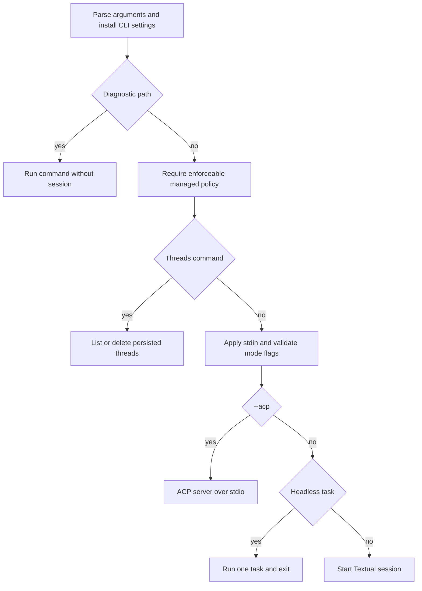
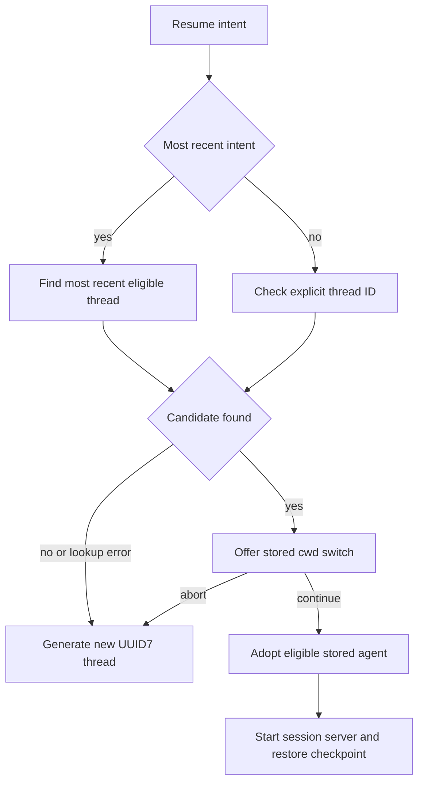

# Workflow: Run & Extend a dcode Session

`deepagents-code` (`dcode`) is a terminal coding agent. One CLI dispatches administrative commands or starts an interactive Textual session, one bounded headless task, or an Agent Client Protocol (ACP) server. Session clients use a local LangGraph server process and durable graph checkpoints; the selected mode and trust decisions determine the available tools and extensions.

For subsystem detail, see [code-agent architecture](../architecture/code-agent.md), [config layering](../concepts/config-layering.md), [permissions & HITL](../concepts/permissions-hitl.md), [state persistence](../concepts/state-persistence.md), [ACP](../integrations/acp.md), [MCP](../integrations/mcp.md), and [cost & sessions](../operations/cost-and-sessions.md).

## Install and establish the trust boundary

```bash
curl -LsSf https://langch.in/dcode | bash
dcode
```

OpenAI, Anthropic, and Gemini support is bundled. Add optional providers at installation, for example `DEEPAGENTS_CODE_EXTRAS="nvidia,ollama" curl -LsSf https://langch.in/dcode | bash`.

The directory from which dcode is launched is a trust boundary. dcode reads project artifacts before its tool-approval UI appears, so approvals do **not** protect against an untrusted repository's instructions or configuration. Do not run an untrusted repository locally; select a remote sandbox when isolation from the host is required. Treat project hooks, MCP configuration, skills, and Python extensions as separately executable or influential project content and review them before granting their trust flags.

## Dispatch: administration is not an agent launch

The CLI parses options, retains lightweight diagnostic paths, then requires usable managed policy before dispatching normal commands or a session. `config`, `doctor`, and `auth path` remain available to diagnose an unusable policy file; other gated operations exit 78 if present managed policy cannot be read or enforced. `threads` operations are dispatched before the session branches: `dcode threads list` (alias `ls`) queries stored metadata and `dcode threads delete <ID>` removes a thread without starting an agent. Listing supports agent, branch, cwd, sort, limit, verbosity, and relative-display options; an explicitly supplied nonexistent cwd warns but is still used to query metadata.

Mode-specific validation happens before launch. `--no-mcp` and `--mcp-config` are mutually exclusive. `--max-turns`, `--timeout`, `--rubric`, `--rubric-model`, `--rubric-max-iterations`, `--quiet`, and `--no-stream` require `-n` or a piped task; usage failures exit 2. `--goal` is interactive-only, cannot be blank, and conflicts with rubric and initial prompt/skill inputs.



This shows the CLI boundary: administrative thread work completes before any agent-client launch.

## Choose a session shape

- **Interactive TUI:** `dcode` opens the Textual UI. `-m/--message` auto-submits an initial prompt; `-s/--skill` invokes a startup skill; and `--startup-cmd` runs a shell command before the first prompt. A non-zero startup command warns but does not abort.
- **Headless task:** `dcode -n "<task>"` (or a piped task) runs `run_non_interactive` once and exits. `-q/--quiet` sends diagnostics to stderr so stdout has only agent response text; `--no-stream` buffers that response. The headless runner creates a new UUID7 thread and has no resume or thread-ID input. Startup skills and commands are supported; an undiscoverable, unreadable, disallowed, or empty skill returns exit 1.
- **ACP:** `--acp` serves ACP over stdio rather than mounting the TUI. Missing ACP dependencies produce an explanatory exit 1. ACP accepts its local approval configuration.

Both interactive and headless clients launch an ephemeral local LangGraph server through `server_session`. The manager serializes the resolved `ServerConfig` into server environment variables, scaffolds a temporary workspace with a checkpointer, starts `langgraph dev`, waits for graph readiness, and returns a `RemoteAgent`. If startup fails or is cancelled before handoff, it stops the process; `server_session` provides teardown to callers after successful startup.

### Bound headless automation

Headless execution is not interactive approval automation. Without `--shell-allow-list`, shell execution is disabled and non-shell tools are auto-approved. `recommended` or an explicit list enables shell access restricted by that allow-list; `all` enables any shell command and auto-approves all tools. If permission hooks exist, they override shortcuts so gated calls can reach those hooks. Explicit `-y/--auto-approve` and `--yolo` are warned as ineffective in headless mode.

Use `--max-turns N` for a turn cap and `--timeout SECONDS` for wall-clock cancellation; both budget expiries return 124. The CLI wraps the entire headless coroutine in `asyncio.wait_for`, reports a timeout to stderr, and maps Ctrl-C during that wait to 130. Headless itself maps shell/HITL iteration exhaustion to 124, hook-requested stop to 0, expected errors to 1, and interruption to 130. For CI, combine a deliberately narrow shell list, a turn limit, and a timeout rather than relying on model behavior.

## Approvals in interactive and ACP sessions

Interactive approval policy is `manual`, classifier-backed `auto`, or unrestricted `yolo`. Invalid stored values fail closed to Manual. Shift+Tab normally cycles Manual → Auto → YOLO → Manual; it omits Auto when ineligible, such as with a remote sandbox, and omits YOLO when `startup.yolo_switcher` is disabled. A TUI launch requesting Auto while sandboxed falls back to Manual.

- `-y/--auto-approve` selects Auto in the local TUI or ACP. Its classifier model can be supplied by `--auto-classifier-model`; otherwise it resolves from `DEEPAGENTS_CODE_AUTO_CLASSIFIER_MODEL`, `[models].auto_classifier`, then the main agent model. A weaker classifier weakens this review boundary. In the TUI, a classifier override is unavailable with a sandbox or headless run; in ACP it requires resolved Auto mode.
- `--yolo` removes gated-action review only after the versioned local acknowledgement. In ACP, the acknowledgement must already have been made in the interactive TUI. The persistent YOLO status indicator remains even when its recurring toast is suppressed.
- The two flags are mutually exclusive. Managed `startup.mode` participates in resolving ACP approval behavior, so raw flags are not authoritative when policy revokes them.

These are tool-execution policies, not a defense against project content read during launch.

## Persist, inspect, and resume threads

Sessions use LangGraph's `AsyncSqliteSaver` against the global `DEFAULT_STATE_DIR/sessions.db`. The sessions module owns its connection and drains it after an interrupted connection. Thread IDs are UUID7 strings, which sort naturally by creation time. `list_threads` reads compact checkpoint metadata—timestamps, agent, branch, and cwd—not full state blobs. Its `idx_dcode_threads_list` covering index keeps the common grouping query index-only; failure to create that index is non-fatal but can make listing slow on large databases.

`-r` means the most recent eligible thread and `-r <ID>` names a specific thread. The TUI resolves this intent asynchronously before server startup. It finds the recent or explicit candidate, offers a stored-working-directory switch if cwd differs, and creates a fresh thread on no match, lookup failure, or user abort. Unknown explicit IDs also receive prefix-match suggestions. A confirmed resume may adopt the stored agent: bare `-r` does so even over an explicitly pinned agent, while explicit `-r <ID>` only does so if the launch did not pin a non-default agent. A one-off resume does not change the persisted default agent.



This shows TUI resume resolution. Headless calls always generate a new thread rather than entering this flow.

Resume-state channels allow rehydration without replaying or re-tokenizing history. They include context-token count; effective model spec and parameters; cache-related model timestamps; accepted goal/rubric state; rubric-model choice; and pending goal proposals. Model-turn channels are written in the graph checkpoint with the successful model response, so resuming a particular checkpoint restores their values at that checkpoint rather than a thread-wide aggregate. TUI-owned accepted goal/rubric values use client-side `aupdate_state`; graph-owned proposals and agent status changes are written in the graph.

## Extend a session safely

**Skills and commands.** Skills provide reusable instructions and slash commands. Invoke one at startup with `-s/--skill`; `/skill-creator` creates or refines skills and `/remember` saves useful context. The generated catalog currently lists 45 public slash commands and two hidden debug commands, including session control, context/cost, model and approval selection, plus MCP, plugins, and extension management.

**Hooks.** Hooks are trusted local shell commands that receive JSON on stdin at lifecycle events. User hooks always load, project hooks load only after workspace trust, and enabled plugin hooks load with their plugin. Every matching handler runs concurrently; results are then reduced project → user → plugin, so a first stopping result determines the decision but does not prevent plugin handler side effects.

Interactive dcode prompts before loading untrusted `.deepagents/hooks.json`; always-allow persists canonical-workspace trust in `~/.deepagents/.state/hooks_trust.json`. Denial skips project hooks and continues with user hooks, while cancellation aborts startup. Headless/CI never prompts and requires `--trust-project-hooks`. Client events include session start/end, prompt submission, permission requests, and notifications; server events cover pre/post tool work, compaction, stop, and subagent lifecycle. Server event registrations are fixed when the session starts, so newly enabled plugin hooks need `/reload`. Exit code 2 creates an event-specific block; other non-zero exits are diagnostics. JSON stdout can set decisions, additional context, notices, and continuation control; timeout termination is diagnostic rather than a successful decision.

**MCP, extensions, and sandboxes.** `--mcp-config` accepts Claude Desktop-format server JSON and is highest precedence over discovered configurations; `--no-mcp` disables all MCP loading. An explicit config is preflight-validated before a server subprocess starts, while discovered user/project configuration failures remain lenient and visible in `/mcp`. Project stdio and remote MCP servers require trust unless `--trust-project-mcp` bypasses the interactive prompt. Python project extensions require the experimental feature and explicit project trust; `-e/--extension` loads a named file or directory for one run.

`--sandbox [TYPE]` selects remote code execution. No argument resolves `[sandboxes].default`; its normal default is `none` (local only). Built-ins include `agentcore`, `daytona`, `langsmith`, `modal`, `runloop`, and `vercel`; `--sandbox-id`, `--sandbox-snapshot-name`, and `--sandbox-setup` attach to or provision an environment. dcode verifies selected sandbox dependencies before starting the server. A configured default names the backend only when the launch requests `--sandbox`; it does not force an otherwise local launch.

## Operational policy and regression checks

Managed policy is checked before normal commands and session launches. If a present managed file is unreadable, invalid, or contains unenforceable policy, dcode fails closed with exit 78 rather than running under partially enforced policy. Keep `config`, `doctor`, and `auth path` available in operating procedures because they are deliberate diagnostic exceptions. See [config layering](../concepts/config-layering.md) for deployment and precedence.

When changing this workflow, protect behavior at its boundaries:

- `tests/unit_tests/test_main_args.py` verifies headless turn-limit forwarding, invalid limits, and forwarding of related launch configuration.
- `tests/unit_tests/test_main.py` verifies cwd normalization and `threads list --cwd` argument semantics.
- `tests/unit_tests/test_sessions.py` asserts that thread listing creates and uses its covering index rather than scanning blob-bearing checkpoint rows.

These focused tests complement integration coverage. Preserve exit codes, stderr diagnostics, managed-policy gating, and the no-agent-launch contract of administrative subcommands when altering dispatch or session startup.
