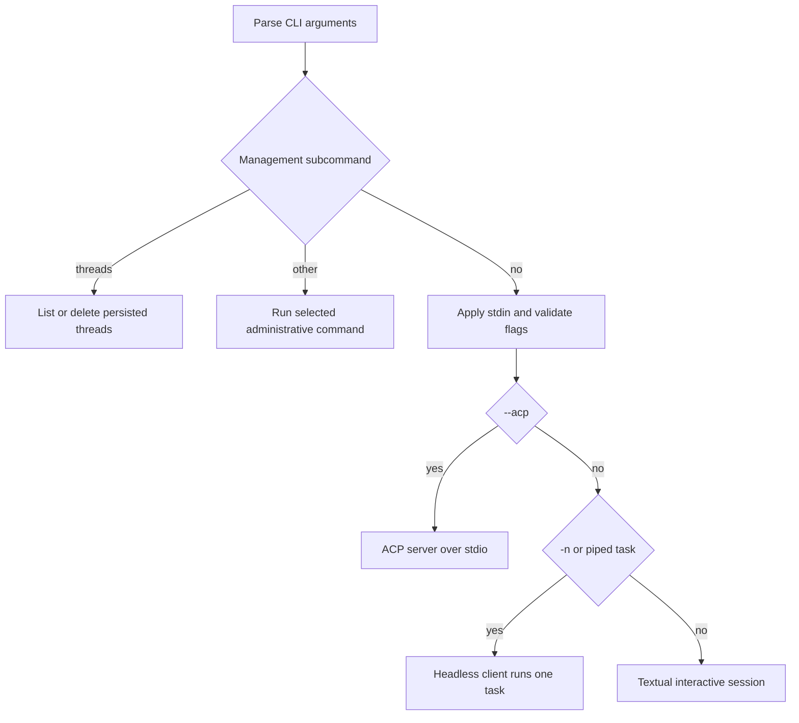
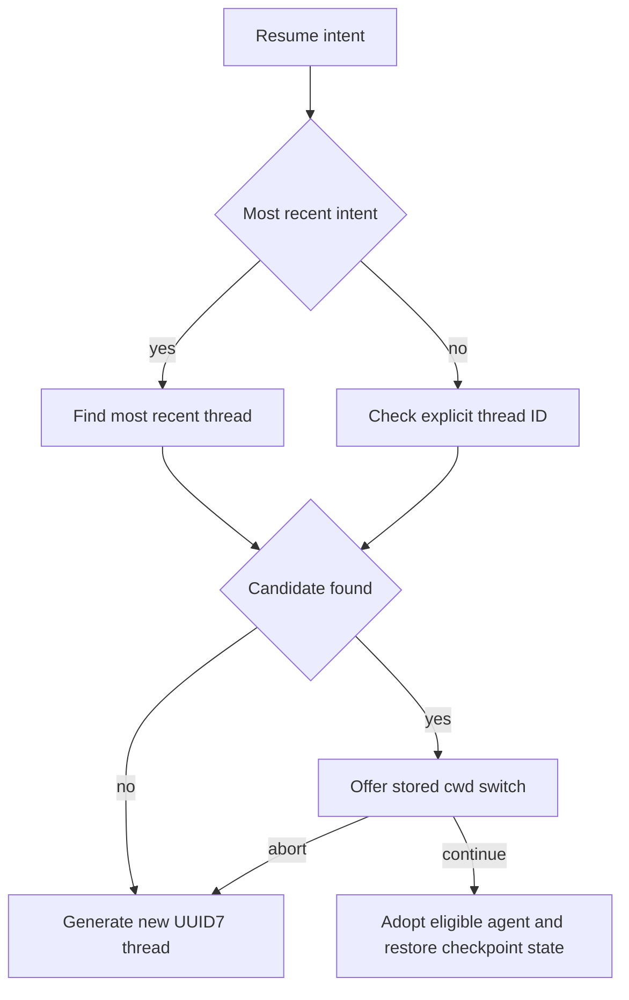

# Workflow: Run & Extend a dcode Session

`deepagents-code` (`dcode`) is a terminal coding agent built on the Deep Agents SDK. The same top-level CLI first dispatches management subcommands, then chooses one of three session clients: the default Textual TUI, the headless client, or an Agent Client Protocol (ACP) server. Threads and graph checkpoints are durable; approval and extension choices determine what the agent can do within a run.

For subsystem detail, see [code-agent architecture](../architecture/code-agent.md), [config layering](../concepts/config-layering.md), [permissions & HITL](../concepts/permissions-hitl.md), [state persistence](../concepts/state-persistence.md), [ACP](../integrations/acp.md), [MCP](../integrations/mcp.md), and [cost & sessions](../operations/cost-and-sessions.md).

## Install and establish the trust boundary

```bash
curl -LsSf https://langch.in/dcode | bash
dcode
```

OpenAI, Anthropic, and Gemini support is bundled. Add optional providers during installation, for example `DEEPAGENTS_CODE_EXTRAS="nvidia,ollama" curl -LsSf https://langch.in/dcode | bash`.

Launching in a directory is itself a trust decision: dcode reads project artifacts before its tool-approval UI appears. Do not run an untrusted repository locally; select a remote sandbox to isolate execution instead.

## Dispatch: administration is not an agent launch

Top-level subcommands are handled before session launch. In particular, `dcode threads list` (or `ls`) queries stored thread metadata and `dcode threads delete <ID>` removes a thread; neither starts an agent. Listing accepts `--agent`, `--branch`, `--cwd`, `--sort`, `--limit`, `--verbose`, and `--relative`; deletion has `--dry-run`. A supplied nonexistent `--cwd` emits a warning but is still used to query stored metadata.

After non-session commands are dispatched, stdin is applied and the CLI validates incompatible or mode-specific flags before creating a client. For example, `--no-mcp` and `--mcp-config` are mutually exclusive; `--max-turns`, `--timeout`, rubric options, `--quiet`, and `--no-stream` require `-n` or piped stdin and otherwise exit 2. `--goal` is interactive-only, cannot be blank, and conflicts with rubric options and startup prompt/skill options. These checks make mode selection explicit rather than silently dropping a safety or output setting.



This shows the CLI branch boundary: thread administration finishes before session-client selection.

## Choose a session shape

- **Interactive TUI:** `dcode` opens the Textual UI. `-m/--message` auto-submits its initial prompt. `-s/--skill` invokes a skill at startup, and `--startup-cmd` runs a shell command before the first task; a non-zero startup-command exit warns but does not abort.
- **Headless task:** `dcode -n "<task>"` and a plain piped task run `run_non_interactive`, stream or buffer one task's result, and exit. `-q/--quiet` routes diagnostics to stderr so stdout contains only response text; `--no-stream` buffers response text. The headless client uses an autonomous prompt and creates a new UUID7 thread every time; it does not accept a resume ID. It can also apply `--skill` and `--startup-cmd`; an unavailable, unreadable, empty, or out-of-bounds skill fails the task with exit code 1.
- **ACP:** `--acp` serves ACP on stdio rather than mounting the Textual UI. ACP dependencies missing at runtime cause an explanatory exit 1. It accepts ACP-local approval configuration, unlike headless execution.

Headless shell behavior is deliberately different from interactive approvals: without `--shell-allow-list`, the shell tool is disabled while non-shell tools are auto-approved. `recommended` or an explicit list enables only allowed shell commands; `all` permits every command and auto-approves all tools. Therefore treat `-n` as an automation interface and set its tool bounds deliberately.

Use `--max-turns N` to cap agentic turns and `--timeout SECONDS` to impose wall-clock cancellation. Either exhausted budget yields 124. The CLI wraps the headless coroutine in `asyncio.wait_for`, reports timeout on stderr, and maps Ctrl-C to 130.

## Approvals in interactive and ACP sessions

Interactive approval policy is `manual`, classifier-backed `auto`, or unrestricted `yolo`. Invalid persisted values fail closed to Manual. Shift+Tab normally cycles Manual → Auto → YOLO → Manual; it omits Auto when ineligible, such as with a remote sandbox, and omits YOLO when `startup.yolo_switcher` is disabled. A launch requested with Auto in a sandbox falls back to Manual.

- `-y/--auto-approve` starts Auto. Its classifier resolves from `--auto-classifier-model`, then `DEEPAGENTS_CODE_AUTO_CLASSIFIER_MODEL`, then `[models].auto_classifier`, then the main model. A weaker classifier weakens the review boundary. The classifier-model flag is rejected outside local interactive TUI use.
- `--yolo` skips gated-action review only after its versioned local acknowledgement. Its persistent status indicator remains even if its recurring toast is suppressed.
- `-y` and `--yolo` are mutually exclusive. In a headless launch either is warned as ineffective and ignored; shell access remains governed by `--shell-allow-list`.

## Persist, inspect, and resume threads

Sessions use LangGraph's `AsyncSqliteSaver` against the global `DEFAULT_STATE_DIR/sessions.db`. The sessions module owns the connection lifecycle so it can drain it after an interrupted connection. IDs are UUID7, which sorts naturally by creation time.

`list_threads` reads compact checkpoint metadata—timestamps, agent, branch, and working directory—not state blobs. Its `idx_dcode_threads_list` covering index makes the common grouping query index-only; an index-creation failure is non-fatal, preserving correct but potentially slower listing.

`-r` resolves the most recent thread, while `-r <ID>` targets one ID. During TUI startup, `_resolve_resume_thread` looks up the candidate asynchronously, offers a working-directory switch for a differing stored cwd, adopts the prior agent under the documented default-agent rules, and can restore its persisted model if the user did not explicitly select one. A missing thread offers prefix matches; a lookup error, no recent thread, or an aborted cwd switch creates a new thread instead.



This shows TUI resume resolution; headless runs always take the new-thread path.

Resume-state channels let the client rehydrate context-token count, effective model spec and parameters, goal/rubric state, and related lifecycle values without replaying history. Model-turn values are written inside the graph checkpoint with the model response, so a chosen checkpoint restores values at that point, not a thread-wide aggregate.

## Extend a session safely

**Skills and commands.** Skills provide reusable instructions and slash commands. Invoke one with `-s/--skill`, create or refine one using `/skill-creator`, and use `/remember` to save useful context. The generated command catalog documents 42 public slash commands plus two hidden debug commands, including session control, context/cost, model and approval selection, and MCP/plugin/tool management.

**Hooks.** Hooks are trusted local shell commands receiving JSON on stdin at lifecycle events. User hooks always load; project hooks require workspace trust; enabled plugin hooks load from the plugin. Matching handlers run concurrently but results are reduced project → user → plugin, so precedence determines the first stopping result, not whether later plugin side effects run. Project-hook trust is prompted in interactive sessions and may be persisted per canonical workspace; denial continues with user hooks, cancellation aborts startup, and headless/CI requires `--trust-project-hooks` to opt in.

Client events include `SessionStart`, `UserPromptSubmit`, `SessionEnd`, `PermissionRequest`, and `Notification`; server events include pre/post tool, compaction, stop, and subagent lifecycle events. Server hook registrations are fixed at session start, so newly enabled plugin hooks require `/reload`. Exit code 2 has event-specific blocking semantics; other non-zero exits are diagnostics. Structured JSON stdout can provide a permission decision, context, notices, and continuation controls. Hook timeouts are terminated and reported as diagnostics rather than approvals.

**MCP and sandboxes.** `--mcp-config` accepts Claude Desktop-format server JSON and has highest precedence over discovered configuration; `--no-mcp` disables all MCP loading. Project stdio and remote servers require approval unless `--trust-project-mcp` is supplied. Select a remote execution backend with `--sandbox [TYPE]`; no value uses `[sandboxes].default`, while the default is local-only `none`. Built-ins include `agentcore`, `daytona`, `langsmith`, `modal`, `runloop`, and `vercel`; `--sandbox-id`, `--sandbox-snapshot-name`, and `--sandbox-setup` target or provision a particular environment. The CLI verifies selected sandbox dependencies before spawning the agent server.

## Operational policy

A read-only administrator-managed `managed_config.toml` overrides environment and user configuration and can enforce selected launch controls. Malformed or unreadable managed policy fails closed, allowing only help and diagnostic paths such as `config`, `doctor`, and `auth path`; dcode never writes that file. See [config layering](../concepts/config-layering.md) for exact precedence and deployment requirements.

## Focused regression checks

When changing this workflow, use focused tests to protect the branch boundaries rather than only testing parser help:

- `tests/unit_tests/test_main_args.py` verifies headless-only timeout rejection, acceptance with piped stdin, forwarding to `asyncio.wait_for`, and exit 124 on expiry.
- `tests/unit_tests/test_main.py` verifies `threads list --cwd` parsing and cwd normalization behavior.
- `tests/unit_tests/test_sessions.py` asserts that thread listing creates and uses the covering index instead of scanning blob-bearing checkpoint rows.

These tests complement integration coverage: preserve exit codes, stderr diagnostics, and the no-agent-launch behavior of administrative subcommands when extending dispatch.
