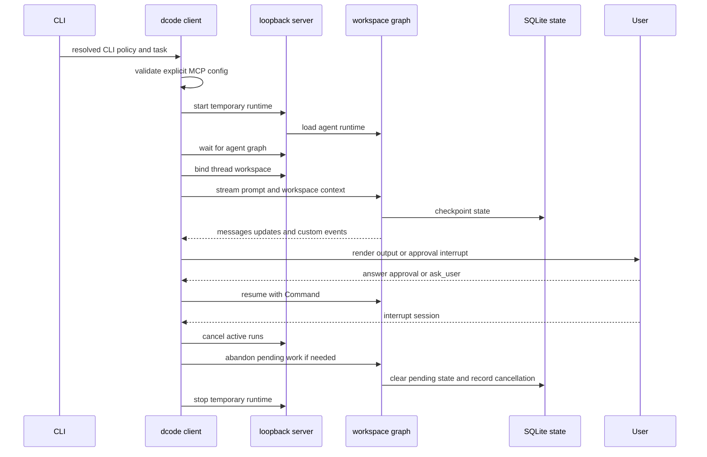

# Run and Debug a dcode Session

`dcode` (`deepagents-code`) has three distinct launch shapes: the normal interactive Textual TUI, a one-task headless run, and an ACP server over standard I/O. Interactive and headless modes are clients of a temporary local LangGraph server; ACP builds and serves its agent in-process instead. See [code-agent architecture](../architecture/code-agent.md), [runtime behavior](../architecture/runtime-behavior.md), [configuration layering](../concepts/config-layering.md), [MCP](../integrations/mcp.md), and [cost and sessions](../operations/cost-and-sessions.md).

## Choose a launch mode and execution boundary

```bash
curl -LsSf https://langch.in/dcode | bash
dcode

# One bounded CI or scripting task
dcode -n "run the focused tests" --max-turns 8 --timeout 600

# Editor-host protocol service over stdin/stdout
dcode --acp
```

The installer includes OpenAI, Anthropic, and Gemini support; use `DEEPAGENTS_CODE_EXTRAS` for additional providers. The launch directory is a security boundary: project artifacts are read before an approval panel can appear. Approval gates model-requested tool calls, not startup reads, so do not run an untrusted checkout on the host. Use a remote sandbox when execution must be isolated. With no `--sandbox`, execution is local; bare `--sandbox` selects the configured default, while `--sandbox-id`, `--sandbox-snapshot-name`, and `--sandbox-setup` select or provision the remote environment.

## Dispatch, input, and headless controls

After parsing, normal operations require enforceable managed configuration and exit 78 when it cannot be applied. Help plus the `config`, `doctor`, and `auth path` diagnostic routes remain available. `--acp` bypasses the Textual dependency check, but it still follows the normal policy gate before its ACP branch.

Piped input is limited to 10 MiB. Its routing precedence is an existing `-n` task, an interactive `-m` prompt, an auto-detected `--skill` prompt, then a new headless task. `--stdin` requires non-terminal stdin. `--quiet`, `--no-stream`, `--max-turns`, `--timeout`, and rubric controls need headless input; turn and timeout exhaustion use exit 124. In quiet headless runs, diagnostics go to stderr while response text remains on stdout.

Headless is autonomous rather than an unattended TUI: each process creates one fresh UUID7 thread, does not honor interactive approval flags, and disables shell access unless `--shell-allow-list` is configured. With no allow-list, non-shell tools are auto-approved and `execute` is rejected; a restrictive list admits only allowed shell commands, while `all` permits unrestricted shell execution. Permission hooks can override the shortcuts so gated calls reach the client hook handler.

## Normal TUI and headless lifecycle



*The normal path starts a temporary server, binds a durable workspace to the thread, streams and resumes graph work, and cancels/reconciles unfinished work during recovery.*

`server_session` preflights an explicit `--mcp-config`, derives a `ServerConfig`, serializes it for the subprocess, scaffolds a temporary server workspace, and starts `langgraph dev`. The default listener is `127.0.0.1` on port `0`, so the OS chooses an ephemeral port. After the `agent` graph is ready, the parent creates `RemoteAgent`, supplies the launch cwd with a session-policy claim and fingerprint, and hands the process to the context manager. Failed or cancelled startup is stopped before it can be orphaned; context-manager teardown stops the server and reports preserved logs when debugging is enabled.

`RemoteAgent` requires `configurable.thread_id`. It obtains a server-validated workspace descriptor for each thread and attaches that descriptor to every stream context. It delegates SSE and stream negotiation to `RemoteGraph`, converts serialised messages and HITL interrupts into client values, and leaves state snapshots serialised. The TUI asks for `messages`, `updates`, and `custom` streams, renders tool and model activity, then resumes after a user response.

### Binding is the server-side trust checkpoint

The workspace route resolves canonical workspace identity and policy on the server. A client may claim session policy only: project-policy fields are rejected, and the supplied session claim and fingerprint must equal the server result. The durable binding is persisted before LangGraph thread metadata is mirrored. A conflict, malformed request, or runtime construction error is returned explicitly rather than silently binding a changed workspace.

On execution, the graph requires both thread ID and workspace context, verifies that context exactly against the persisted binding, then re-resolves project policy and configuration fingerprint. Drift is a conflict, not an implicit policy update. Workspace runtimes are cached by resource key with an LRU bound of 32. This cache is correctness-critical because MCP discovery, sandbox creation, and `atexit` registration must occur once per runtime; a process-wide sandbox can be claimed by only one workspace.

The server snapshots the workspace environment and credentials before building its runtime, then resolves the model, built-in and MCP tools, optional sandbox, extensions, and `create_cli_agent`. Its composite backend and derived offload operation are shared by graph execution and the custom HTTP operation. Keep backend-affecting changes on this server-owned path rather than attempting to recreate them in the client.

### Approval and extension boundaries

Interactive threads use Manual, Auto, or YOLO approval. Invalid persisted values fail closed to Manual. Shift+Tab skips Auto when it is ineligible, such as when a remote sandbox is used, and skips YOLO when the switcher is disabled. Entering YOLO requires acknowledgement of the current policy version.

`--mcp-config` has highest precedence over discovered MCP configuration, while `--no-mcp` disables all MCP loading and is mutually exclusive with that flag. Project MCP configuration requires explicit trust. Project hooks and experimental project Python extensions are also trust boundaries: headless hooks require `--trust-project-hooks`, project extensions require `--trust-project-extensions` and `DEEPAGENTS_CODE_EXPERIMENTAL=1`.

## State, resume, interruption, and offload

Session checkpoints are stored in global SQLite state. UUID7 thread IDs sort naturally by creation time. `threads list` creates a covering index so its normal query avoids reading large checkpoint blobs, but retains a correct slower scan if index creation fails.

For an interactive `-r`, bare resume resolves the most recent eligible thread and an explicit ID resolves that thread. An absolute `threads.resume_after` cutoff or rolling `threads.max_resume_age` cutoff blocks old or unverifiable state. Missing IDs receive similar-ID suggestions; lookup failures fall back to a new thread. When a selected thread recorded another cwd, the TUI offers a workspace switch; declining starts a new thread.

Interruption is not merely a local UI event. `RemoteAgent.aabandon_pending_work` cancels active server runs, identifies unanswered tool calls in the trailing turn, writes error `ToolMessage` results as the `tools` node, then advances state to `__end__`. A 409 state-write race triggers cancellation and one retry. It verifies that no queued node, task, or interrupt remains, preventing a later resume from executing abandoned work.

`/offload` is likewise server-owned. It serializes access per thread, accepts only an idle or error-status thread with no queued work, hydrates the checkpoint, verifies the durable workspace binding, and uses the corresponding server runtime. It rechecks that the checkpoint did not advance before commit. Its state-update allowlist is derived from `OffloadStateUpdate`, explicitly preventing a compaction operation from writing `messages`; conflict and malformed cases do not commit state.

An offload hook interrupt does not hold a coroutine open. The client repeats the request with the same operation ID and accumulated hook responses; the server re-executes the operation and replays answered invocations. If the client cancels an offload wait, it calls the operation cancellation route and waits for a terminal `cancelled` or `finished` acknowledgement. A 500 can mean an indeterminate archive-link write, so surface its server detail rather than reporting a definite rollback.

## ACP is a separate integration

`dcode --acp` does not use `server_session`, the loopback server, or `RemoteAgent`. It resolves a model and project context, loads MCP tools, opens and initializes the SQLite checkpointer, and supplies an agent-builder for ACP session contexts to `run_acp_agent`. Model or MCP loading failures return 1 before serving; serving exceptions are reported as ACP server failures with exit 1. ACP approval mode is resolved separately: YOLO needs a prior acknowledgement, and Auto is the only ACP mode that uses the classifier model.

## Diagnose startup and runtime failures

For local development, bootstrap and run from `libs/code`:

```bash
make bootstrap
uv run deepagents-code
```

Set `DEEPAGENTS_CODE_DEBUG=1` to enable both diagnostic channels. A launch failure banner generally means the subprocess log contains the root traceback; on exit the preserved path is printed, and logs normally live at `$TMPDIR/deepagents_server_log_*.txt`. For a running-session UI, model, or command problem, inspect the per-thread client log at `/tmp/deepagents_debug/<thread-id>.log`, or set `DEEPAGENTS_CODE_DEBUG_DIRECTORY=<path>`. Debug log directories and files are tightened to owner-only access and reject symlinks; if that cannot be secured, use the in-app `Ctrl+\` Debug Console. MCP stdio stderr is intentionally discarded even in debug mode, while structured MCP log notifications reach the application logger.

Use targeted tests while changing these boundaries:

```bash
make test TEST_FILE=tests/unit_tests/test_non_interactive.py
make check
```

The headless unit suite checks shell allow-list decisions, quiet/output behavior, forwarding server-launch options, and the rule that permission hooks prevent the normal headless YOLO shortcut. Pair stream/recovery changes with remote-client and pending-work tests, workspace/offload changes with route conflict and persistence tests, and server lifecycle changes with server-manager tests. Use `make integration_test` only when the integration boundary requires network access.
