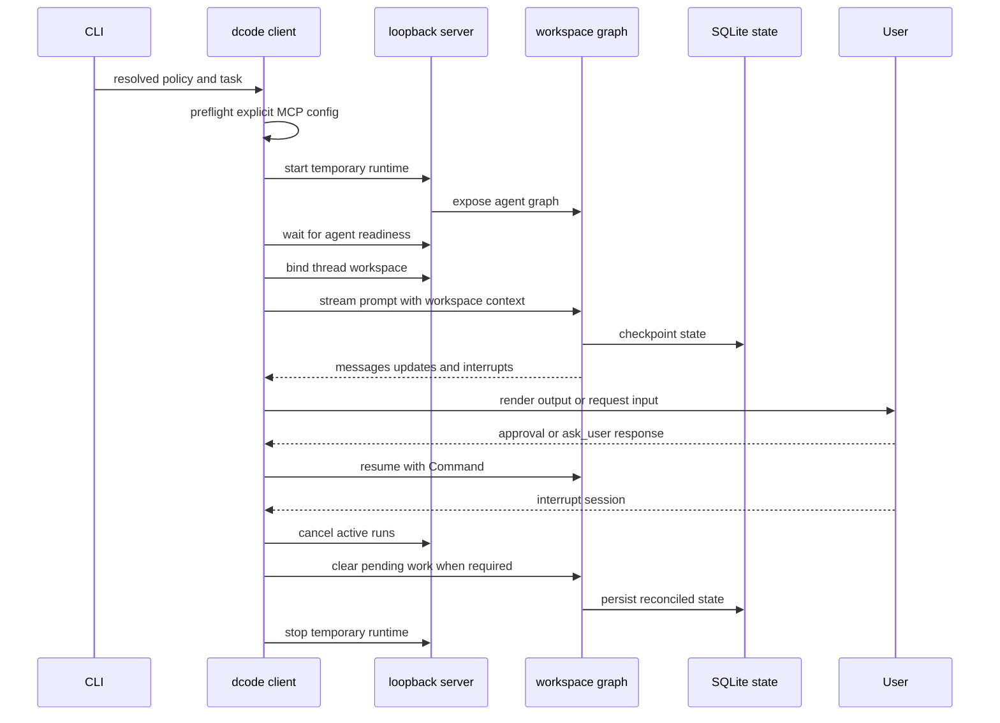

# Run and Debug a dcode Session

`dcode` has three launch shapes: the normal command starts the interactive Textual TUI, `-n` runs one headless task, and `--acp` serves the Agent Client Protocol over standard input/output. Interactive and headless clients use a temporary local LangGraph server; ACP is a separate in-process path. For configuration precedence, runtime policy, and persisted state, see [configuration layering](../concepts/config-layering.md), [runtime behavior](../architecture/runtime-behavior.md), and [state persistence](../concepts/state-persistence.md).

## Choose the execution boundary

```bash
curl -LsSf https://langch.in/dcode | bash
dcode

# One bounded CI or scripting task
dcode -n "run the focused tests" --max-turns 8 --timeout 600

# Editor-host protocol service over stdin/stdout
dcode --acp
```

The installer includes OpenAI, Anthropic, and Gemini support; set `DEEPAGENTS_CODE_EXTRAS` for other providers. Treat the launch directory as trusted input: dcode reads project artifacts before an approval panel can appear. Approval controls model-requested tool calls, not startup reads. Do not run an untrusted checkout on the host; choose a remote sandbox for isolation.

An omitted `--sandbox` means local execution. A bare `--sandbox` resolves `[sandboxes].default`; `--sandbox-id`, `--sandbox-snapshot-name`, and `--sandbox-setup` select or provision the remote environment. A configured default does not silently contain a launch that omitted `--sandbox`.

## Dispatch and headless operation

Normal operations fail closed with exit 78 if managed configuration cannot be enforced. The `config`, `doctor`, `auth path`, and help routes remain usable to diagnose that condition.

Headless-only output, turn, timeout, and rubric controls require `-n` or piped stdin. Exhausting a turn or timeout budget exits 124. With `-q`, operational messages go to stderr and response text stays on stdout; `--no-stream` buffers the response instead. Each headless invocation creates a fresh UUID7 thread rather than resuming an interactive one.

Headless mode is autonomous, not an unattended TUI. Without `--shell-allow-list`, shell execution is disabled while non-shell tools are auto-approved. A restrictive allow-list gates shell commands; `all` permits unrestricted shell execution. Project permission hooks override these shortcuts so a gated call reaches the client hook handler. Explicit interactive approval flags are ignored in headless mode with a warning.

## Interactive and headless lifecycle



*Interactive and headless sessions start a temporary server, bind a workspace before streaming, and reconcile unfinished work before teardown.*

`server_session` validates explicit MCP configuration, resolves and serializes `ServerConfig`, creates a temporary server directory, and starts `langgraph dev`. By default it listens on `127.0.0.1` with port `0`, so the OS chooses an ephemeral port. Once the `agent` graph is ready, the client creates a `RemoteAgent`, workspace-binds it with the launch cwd and policy fingerprint, and streams through it. Startup failure or cancellation and normal context-manager exit both clean up the subprocess.

`RemoteAgent` requires `configurable.thread_id`. Before every stream it obtains a server-validated workspace descriptor for that thread and supplies it as runtime context. The remote client converts server messages and HITL interrupts into client values; the TUI uses them to render activity and resumes graph work after user input.

### Workspace binding is the trust checkpoint

The workspace-bind route resolves canonical workspace policy on the server. A client can present only its session-policy claim: project-policy fields and mismatched claims are rejected. The durable binding is persisted before thread metadata is registered, and a changed workspace produces validation or conflict responses instead of being silently accepted.

At execution, the graph requires a thread ID and workspace context and compares it with the durable binding. Workspace access, project policy, tool, sandbox, or approval-policy drift is rejected. Runtime-only identity changes such as model or prompt changes rebuild the runtime rather than discard the binding and checkpoint.

Workspace runtimes are cached with an LRU limit of 32. The server builds each from frozen workspace environment and credentials, built-in and MCP tools, an optional sandbox, extensions, `create_cli_agent`, and a backend-derived offload operation. A sandbox backend is process-wide: after one workspace claims it, another workspace is refused.

### Approvals and project extensions

Interactive approval modes are Manual, Auto, and YOLO. Invalid persisted values become Manual; Shift+Tab skips unavailable modes, and YOLO requires acknowledgement of the current policy version.

`--mcp-config` has highest precedence over discovered MCP configuration, while `--no-mcp` disables MCP and cannot be combined with it. Project MCP, hooks, and Python extensions are separate execution boundaries. Headless project hooks need `--trust-project-hooks`; project extensions need `--trust-project-extensions` and `DEEPAGENTS_CODE_EXPERIMENTAL=1`.

## Retrying a streamed model response

The model retry middleware wraps the model node, not the complete agent turn, so a transient model connection failure is retried without rerunning completed tool calls. It re-raises terminal failures rather than manufacturing an `AIMessage`, preventing provider failure from masquerading as a model response. The retry budget is read from the model for each request, allowing a runtime model switch to carry provider-specific retry settings.

Retryable failures include designated transport errors, 408, 409, 429, and 5xx responses, known provider transient errors, and matching failures inside exception groups or causal chains. Authentication, invalid-request, permission, and context-overflow errors are not retried. Backoff begins at 0.2 seconds, doubles with modest jitter, caps at 10 seconds, and honors a usable `Retry-After` up to 60 seconds; interactive retry sleep is cumulatively capped at 60 seconds. A `GraphBubbleUp` remains graph control flow and is never treated as a model error.

A retry emits correlated `model_attempt` lifecycle events plus a `model_retry` event on the custom stream. Clients validate those untrusted event fields. If output may have escaped before the failure, the TUI finalizes the partial reply with an incomplete-response marker; headless streaming prints a visible boundary before replaying. In `--no-stream` mode the failed attempt is removed from the buffered response instead. Both clients also discard tentative transcript/tool presentation and settle any interrupted tool-hook bookkeeping, so a replay does not look like completion of the failed attempt. Retry status remains visible during a potentially long `Retry-After` pause.

## Resume, interruption, and offload

Checkpoint state is global SQLite state. UUID7 thread IDs naturally sort by creation time, while a covering SQLite index allows thread listings to avoid reading checkpoint blobs.

The TUI resolves bare `-r` to the most recent eligible thread and `-r <id>` to a named thread. It applies the stricter absolute `threads.resume_after` or rolling `threads.max_resume_age` cutoff; an absent or malformed update time is unsafe and blocks resume. Missing IDs receive similar-ID suggestions, while database failures fall back to a new thread. If stored cwd differs, the user can switch workspace or abort into a fresh session. Checkpoint-private resume facts—including effective model parameters, context-token count, and goal/rubric state—avoid replaying or re-tokenizing history.

An interrupt needs remote reconciliation, not merely a local UI update. Pending-work recovery cancels active runs, writes error `ToolMessage` results for unanswered trailing tool calls, advances checkpointed work through `__end__`, and verifies that no graph work remains.

`/offload` is server-owned. It accepts only an idle, registered, quiescent thread, validates the durable workspace binding, and restricts updates to declared offload state channels so it cannot overwrite `messages`. A hook interrupt is resumed by reissuing the same operation ID with accumulated hook responses: the server re-executes and replays answered hooks rather than retaining a suspended coroutine.

## ACP is separate

`dcode --acp` does not start `server_session` or use `RemoteAgent`. It builds a model, loads MCP tools, opens the SQLite checkpointer, constructs agents for ACP session contexts, and serves the supplied ACP server through `run_acp_agent`; MCP cleanup runs in `finally`. Diagnose ACP model and MCP setup independently of temporary loopback-server startup.

## Diagnose failures and verify changes

For local development, run from `libs/code`:

```bash
make bootstrap
export DEEPAGENTS_CODE_DEBUG=1
uv run deepagents-code
```

`DEEPAGENTS_CODE_DEBUG=1` preserves the temporary server log and enables a per-thread client DEBUG log. A startup banner usually means the server log contains the traceback; look under `$TMPDIR/deepagents_server_log_*.txt`. For a running UI, model, or command issue, inspect `/tmp/deepagents_debug/<thread-id>.log`, or set `DEEPAGENTS_CODE_DEBUG_DIRECTORY=<path>`. The directory and files are owner-only where possible and symlinks are refused; use the in-app `Ctrl+\` Debug Console if secure file logging cannot be established. Raw stdio MCP stderr is discarded even in debug mode, though structured MCP log notifications reach the application logger.

Use focused tests for the boundary changed:

```bash
make test TEST_FILE=tests/unit_tests/test_non_interactive.py
make test TEST_FILE=tests/unit_tests/test_model_retry.py
make test TEST_FILE=tests/unit_tests/test_app.py
make test TEST_FILE=tests/unit_tests/test_input_parsing.py
make check
```

The headless suite checks shell allow-list and permission-hook behavior. Model-retry tests cover retryability, `Retry-After` and delay-budget behavior, interrupt propagation, and streamed-output correlation. App tests cover startup and resume sequencing. Input parsing tests ensure durable `@@(thread:...)` references are not treated as file mentions and malformed or overlong pasted paths fall back safely instead of crashing the TUI. Pair client-streaming, workspace binding, offload, or pending-work changes with `tests/unit_tests/test_remote_client.py`; pair workspace/runtime changes with workspace and server-graph tests. Use `make integration_test` only when the integration boundary needs network access.
