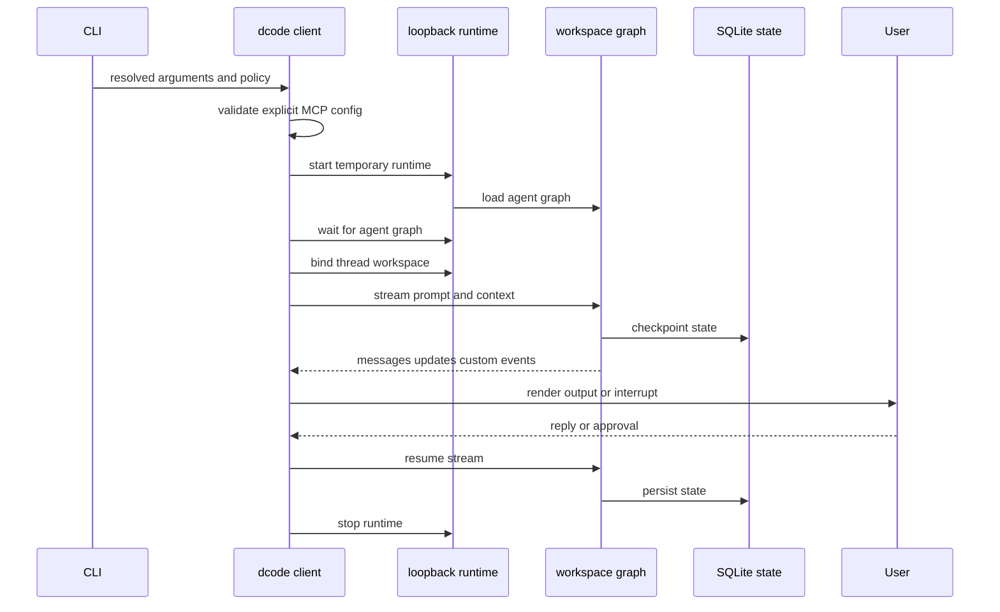
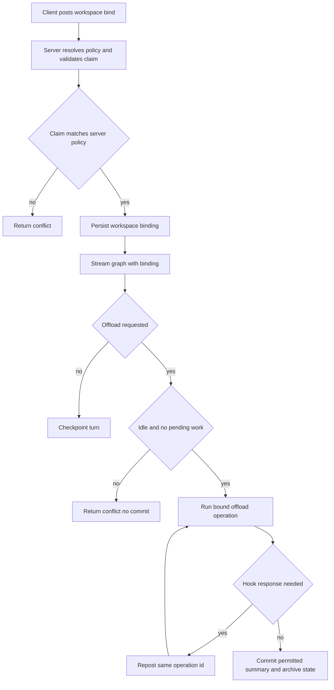

# Run and Debug a dcode Session

`deepagents-code` (`dcode`) has three deliberately different launch paths: an interactive Textual TUI, one-task headless execution, and an ACP stdio server. TUI and headless are clients of a temporary local LangGraph runtime. ACP builds and serves its agent in-process, so do not diagnose it as a failed loopback-client session.

See [code-agent architecture](../architecture/code-agent.md), [runtime behavior](../architecture/runtime-behavior.md), [configuration layering](../concepts/config-layering.md), [context management](../concepts/context-management.md), [MCP](../integrations/mcp.md), and [security](../operations/security.md).

## Start with the right mode and trust boundary

```bash
curl -LsSf https://langch.in/dcode | bash
dcode

# One bounded CI or scripting task
dcode -n "run the focused tests" --max-turns 8 --timeout 600

# Editor-host protocol over stdin/stdout
dcode --acp
```

The installer includes OpenAI, Anthropic, and Gemini; use `DEEPAGENTS_CODE_EXTRAS` for other provider extras. The current working directory is a trust boundary: project artifacts are read before the approval UI is available. Approval controls model-requested tool calls, not startup reads. Do not run an untrusted checkout on the host; select a remote sandbox for execution isolation.

An omitted `--sandbox` remains local. A bare `--sandbox` selects the configured default; sandbox ID, snapshot, and setup options select or provision the remote environment. A managed default names the backend for a sandboxed launch; it does not force an otherwise local launch into a sandbox.

## Dispatch before an agent exists

CLI parsing and managed-policy enforcement precede session launch. When managed configuration cannot be enforced, normal operations fail closed with exit 78. Help plus `config`, `doctor`, and `auth path` remain available for diagnosis. `threads list`/`ls` and `threads delete` operate on persisted state without launching an agent.

Piped text is capped at 10 MiB. It is applied in this order: an existing headless task, an interactive `-m` prompt, an auto-detected startup skill prompt, then a new headless task. Explicit `--stdin` requires non-terminal stdin. Headless output, turn, timeout, and rubric controls require a headless task; turn or timeout budget expiry is exit 124. Headless ignores approval-mode flags, and shell access is disabled unless a shell allow-list is supplied.

## Normal session lifecycle



*The parent client owns startup and teardown; the server owns graph execution, workspace policy, and durable state.*

### Startup and remote client

`server_session` resolves server configuration, preflights an explicit MCP file before spawning, serializes the result through `DEEPAGENTS_CODE_SERVER_*`, and scaffolds a temporary `langgraph dev` workspace backed by SQLite. It listens on `127.0.0.1` and an ephemeral port by default, waits for the `agent` graph, creates a `RemoteAgent`, and assigns its launch workspace plus configuration fingerprint. Failed or cancelled startup reaps the process; context-manager teardown stops a handed-off process.

`RemoteAgent` requires `configurable.thread_id`. On every stream it adds the durable workspace descriptor to context, delegates transport/SSE handling to the remote graph, and converts message payloads and HITL interrupts into client values. The TUI requests `messages`, `updates`, and `custom` streams with subgraphs, renders tool activity, collects `ask_user` or approval input, then streams a resume. Message conversion failures are dropped with a warning rather than silently masquerading as valid messages.

### Workspace binding is server-authoritative

The workspace route resolves canonical identity and project policy on the server. It rejects unknown request keys, project-policy claims from clients, and mismatched session claims; it persists the thread binding before mirroring thread metadata. Request validation failures return 422, conflicts return 409, and a request-scoped runtime build failure returns 503. A metadata-mirroring failure can therefore leave a durable binding but returns 503 rather than claiming a completely successful bind.

Execution requires both a thread ID and workspace context. The graph checks that context against the thread's durable binding, re-resolves policy and fingerprint to reject drift, then chooses a workspace runtime. Workspace runtimes are LRU-cached at 32 entries. Runtime caching is an invariant, not merely optimization: it prevents repeat MCP discovery, sandbox sessions, and `atexit` handlers. Because a sandbox backend is process-wide, a sandboxed server rejects another workspace after the first workspace claims it.

Runtime construction snapshots the workspace environment and credentials, then resolves the model, built-ins, MCP tools, optional sandbox, and `create_cli_agent`. The composite backend and its offload operation are shared by graph execution and the custom operation route. Keep environment, backend, and compaction changes server-side; a client must not substitute these resources.

### Approvals, extensions, and MCP

Interactive approval has Manual, Auto, and YOLO modes. Invalid persisted values revert to Manual, unavailable modes are omitted while cycling with Shift+Tab, and YOLO requires a versioned acknowledgement. Auto approval is enabled only for interactive non-sandbox runtimes. In headless runs, `--auto-approve` and `--yolo` have no effect.

An explicit MCP configuration takes highest precedence, `--no-mcp` disables MCP loading, and the two flags are mutually exclusive. Project MCP servers require trust. Hook handlers run commands at the user's privilege with JSON lifecycle payloads; trusted project hooks participate alongside user and plugin hooks, matching handlers run concurrently, and exit code 2 blocks only the event where it is meaningful. Experimental project Python extensions require trust and their tools are not automatically added to the human-approval map.

## Resume and persistent state

Checkpoints reside in global SQLite state. New threads use naturally time-sortable UUID7 IDs. `threads list` builds a covering index so it can read metadata without scanning checkpoint blobs; inability to create the index retains a slower, correct scan.

In the TUI, bare `-r` chooses the recent eligible thread and `-r <ID>` chooses a named thread. Configured absolute or rolling cutoffs block old threads; a stored-CWD mismatch offers a switch, missing IDs suggest similar IDs, and a miss or database failure falls back to a new thread. Headless always creates a new thread, so it is not a resume mechanism.

## Server-owned offload



*The bind fixes a thread's authority and resources; `/offload` works only against that quiescent, server-validated thread.*

`/offload` hydrates checkpoint state itself and accepts only idle or error-status threads that have no `next`, `tasks`, or `interrupts`. It validates the durable workspace binding and uses the bound runtime's offload operation. Its per-thread lock, active-operation tracking, and recheck of checkpoint ID before commit prevent an offload result from being committed after the conversation advanced.

Only channels declared by `OffloadStateUpdate` may be written; message writes are rejected so a custom operation cannot overwrite conversation content. The route distinguishes malformed input (422), thread conflicts and no commit (409), unavailable runtime (503), and indeterminate or unexpected server failure (500). Archive linking reserves summary state first, rolls the append back when a link definitively did not land, and reports indeterminacy when it cannot confirm the link.

A hook interrupt is an HTTP round-trip, not a suspended coroutine. The client reposts the same operation ID with accumulated hook responses; the server starts the operation again and replays answered hooks. If a custom graph server does not register the dcode route, the client reports an actionable unsupported-server error rather than a bare 404.

This placement ensures compaction and archive I/O use the backend the agent actually uses. A thread resumed through a new server can consequently read its prior offloaded archive through that server's runtime.

## ACP is a separate service path

`dcode --acp` does not use `server_session`, a temporary loopback server, or `RemoteAgent`. It imports ACP dependencies, resolves a model and project context, loads MCP tools, opens the SQLite checkpointer, creates agents for ACP session contexts, and serves the supplied ACP server with `run_acp_agent`. MCP sessions are cleaned up in `finally`. Dependency-import and MCP-loading failures exit 1 before serving; an exception while serving is reported as an ACP server failure and also exits 1.

## Focused diagnosis

For checkout development, bootstrap with `make bootstrap`, launch with `uv run deepagents-code`, use `make test` for unit tests, `make integration_test` when network-capable integration coverage is needed, and `make check` before a full change.

Enable both process logs when diagnosing a normal TUI session:

```bash
cd libs/code
export DEEPAGENTS_CODE_DEBUG=1
uv run deepagents-code
```

| Symptom | First evidence | Next action |
| --- | --- | --- |
| One-line launch failure | Server subprocess log | After terminal restoration, open `$TMPDIR/deepagents_server_log_*.txt` and find `Failed to initialize server graph`; inspect the traceback below it. |
| App starts but UI, tool, model, or slash-command behavior is wrong | Client thread log | Tail `/tmp/deepagents_debug/<thread-id>.log`, or use `DEEPAGENTS_CODE_DEBUG_DIRECTORY=<path>`. |
| Bind/execution conflict | Server logs and persisted workspace binding | Compare cwd, client workspace descriptor, server policy, and fingerprint; do not weaken drift rejection to make it run. |
| `/offload` conflict or no result | Thread state and server log | Check active/pending graph work and checkpoint changes; retry only after the thread is quiescent. |
| MCP failure | Explicit config or server log | Explicit malformed config fails before spawn; discovered project/user configurations are reported leniently in the MCP UI. |

Debug mode preserves the server log path on exit and creates client per-thread logs only when enabled. The client log directory and files are owner-restricted and reject symlinks; failure to secure them disables the file handler. Stdio MCP stderr captured at DEBUG can contain credentials, so do not share such logs. The in-app Debug Console (`Ctrl+\` or hidden `/debug`) offers an always-on in-memory log tail and a runtime snapshot even without debug mode.

## Regression focus

| Change area | Focused verification |
| --- | --- |
| CLI policy, stdin, mode validation, exit behavior | CLI argument and dispatch tests |
| Server scaffolding, configuration serialization, bind, cleanup | `tests/unit_tests/test_server_manager.py` |
| Remote stream conversion, interrupt resume, offload protocol | `tests/unit_tests/test_remote_client.py` and `tests/unit_tests/test_offload_api.py` |
| Workspace validation, runtime caching, and drift | workspace and server-graph tests |
| Archive persistence across server restart | `tests/integration_tests/test_compact_resume.py` |
| Recovery of abandoned graph work | `tests/integration_tests/test_pending_work_recovery.py` |

The compaction-resume integration test persists a thread through one temporary server, invokes `/offload` from a fresh production-style app without a client-owned backend, then verifies later server agents can read the archive. The pending-work recovery test leaves a graph paused before a tool node and verifies cancellation clears pending work, avoids tool execution, and records an error `ToolMessage`.
