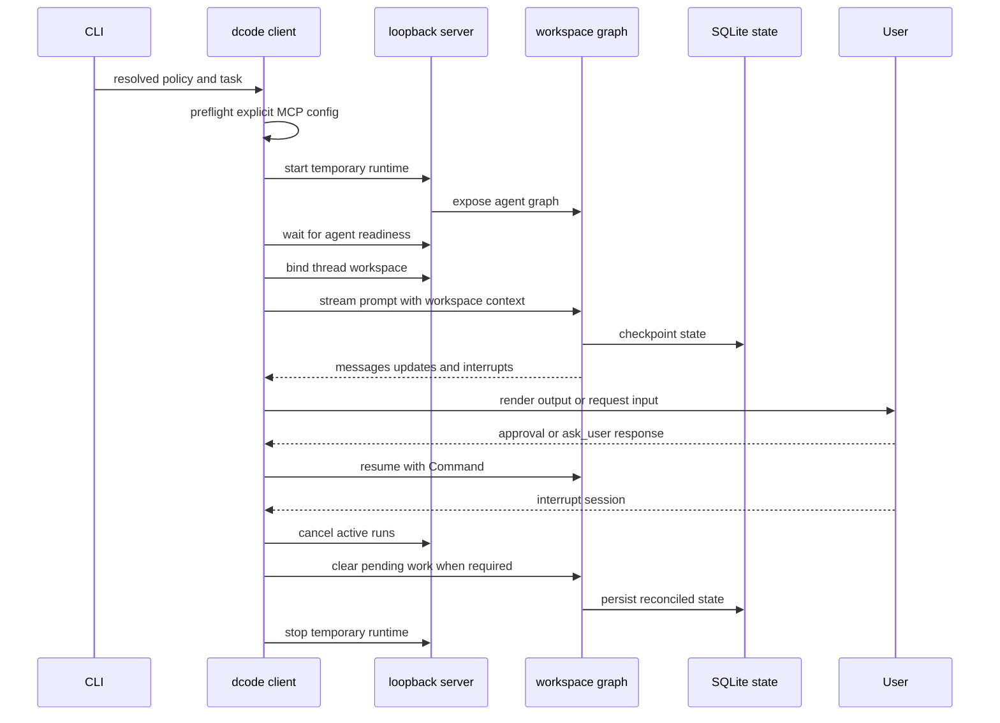

# Run and Debug a dcode Session

`dcode` has three launch shapes. The normal command starts the interactive Textual TUI; `-n` runs one headless task; and `--acp` serves the Agent Client Protocol on standard input and output. The first two are clients of a temporary local LangGraph server. ACP is a separate in-process integration. For configuration precedence and context policy, see [configuration layering](../concepts/config-layering.md), [runtime behavior](../architecture/runtime-behavior.md), [context management](../concepts/context-management.md), and [state persistence](../concepts/state-persistence.md).

## Choose the execution boundary

```bash
curl -LsSf https://langch.in/dcode | bash
dcode

# One bounded CI or scripting task
dcode -n "run the focused tests" --max-turns 8 --timeout 600

# Editor-host protocol service over stdin/stdout
dcode --acp
```

The installer includes OpenAI, Anthropic, and Gemini support; use `DEEPAGENTS_CODE_EXTRAS` for other providers. Treat the launch directory as trusted input: dcode reads project artifacts before an approval panel can appear. Approval controls model-requested tool calls, not those startup reads. Do not run an untrusted checkout on the host; use a remote sandbox for isolation.

An omitted `--sandbox` means local execution. A bare `--sandbox` resolves `[sandboxes].default`; `--sandbox-id`, `--sandbox-snapshot-name`, and `--sandbox-setup` select or provision the remote environment. A configured default names the backend only after the operator opted in—it does not silently contain a launch that omitted `--sandbox`.

## Dispatch and headless operation

Normal operations fail closed with exit 78 if managed configuration cannot be enforced. The `config`, `doctor`, `auth path`, and help routes remain available to diagnose that condition. `--acp` skips the Textual dependency check, but it remains subject to the normal managed-policy gate.

Headless controls such as output mode, turn limits, timeouts, and rubrics require a headless task. Exhausting the turn or timeout budget exits 124. In quiet mode, operational output goes to stderr and response text remains on stdout. Each headless invocation creates a new UUID7 thread; it does not resume an interactive thread.

Headless mode is autonomous, not an unattended TUI. Without `--shell-allow-list`, shell execution is disabled while non-shell tools are auto-approved. A restrictive allow-list enables only allowed shell commands; `all` permits unrestricted shell execution. Permission hooks override these shortcuts so the call reaches the client hook handler.

## Interactive and headless lifecycle



*Interactive and headless sessions start a temporary server, bind a workspace before streaming, and reconcile unfinished work before teardown.*

`server_session` first validates an explicit MCP configuration, resolves and serializes `ServerConfig`, scaffolds a temporary server directory, and starts `langgraph dev`. It binds by default to `127.0.0.1` with port `0`, letting the OS select an ephemeral port. After the `agent` graph is ready, it creates a `RemoteAgent` and configures it with the launch cwd, a session-policy claim, and its fingerprint. Failed or cancelled startup is stopped; context-manager teardown also stops the subprocess.

`RemoteAgent` requires `configurable.thread_id`. Before a stream it obtains a server-validated workspace descriptor for that thread and puts it in the runtime context on every stream. `RemoteGraph` performs SSE and stream-mode negotiation; the dcode client converts serialized messages and interrupts to client values. The TUI uses the resulting messages, updates, and custom events to render activity and resumes graph work after the user responds.

### Workspace binding is the trust checkpoint

The workspace route canonicalizes the requested workspace and resolves policy on the server. A client can submit only the session-policy claim; project-policy fields are rejected, and the claim plus fingerprint must match server policy. The server persists the durable binding before it mirrors thread metadata, and returns validation or conflict responses rather than accepting a changed workspace silently.

At execution, the graph requires both a thread ID and workspace context. It checks that context against the durable binding, then resolves current workspace policy. Trust, tool, sandbox, approval, or project-policy drift is rejected. By contrast, a model, prompt, or other runtime-only change preserves the binding and checkpoints but rebuilds the runtime under a new runtime fingerprint.

Workspace runtimes use an LRU cache limited to 32 entries. The cache is a lifecycle boundary, not merely a speed optimization: the server builds a runtime from a frozen workspace environment and credential snapshot, then constructs the model, built-in and MCP tools, optional sandbox, extensions, `create_cli_agent`, and the backend-derived offload operation. A sandbox is process-wide, so once one workspace claims it, another workspace is refused. Keep backend-affecting changes in this server-owned construction path.

### Approvals and project extensions

Interactive approval modes are Manual, Auto, and YOLO. Invalid persisted values fall back to Manual. Shift+Tab omits modes that are unavailable—for example Auto with a remote sandbox—and entering YOLO requires acknowledging the current policy version.

`--mcp-config` overrides discovered MCP configuration; `--no-mcp` disables MCP and cannot be combined with that flag. Project MCP, hooks, and Python extensions are separate trust boundaries. In particular, headless project hooks need `--trust-project-hooks`; project extensions need `--trust-project-extensions` and `DEEPAGENTS_CODE_EXPERIMENTAL=1`.

## Resume state, interruption, and offload

Checkpoint state is stored in global SQLite. UUID7 thread IDs sort naturally by creation time, and thread listing uses a covering index where possible so it does not need to load checkpoint blobs.

The TUI resolves bare `-r` to the most recent eligible thread and `-r <id>` to that specific thread. It applies the stricter of the absolute `threads.resume_after` and rolling `threads.max_resume_age` cutoffs, treating an unverifiable update timestamp as unsafe. Missing IDs get similar-ID suggestions; lookup errors start a new thread. On a differing stored cwd, it offers a workspace switch or an abort that starts a fresh session. Resume restores checkpoint-private facts such as the effective model and parameters, context-token count, and goal or rubric state without replaying history.

An interrupt requires remote reconciliation, not just a local UI update. `RemoteAgent.aabandon_pending_work` cancels active runs, writes error `ToolMessage` results for unanswered trailing tool calls, advances the graph through `__end__`, and verifies no pending work remains. State-write conflicts trigger cancellation and one retry, preventing a later resume from executing abandoned work.

`/offload` is server-owned. It locks the thread, accepts only an idle registered thread without queued graph work, validates its durable workspace binding, and executes against the matching server runtime. It refuses a commit if the checkpoint advanced. Its update allow-list excludes `messages`, so an offload cannot overwrite conversation messages. A hook interrupt is resumed by sending the same operation ID plus accumulated hook responses: the server reruns the operation and replays answered hooks instead of retaining a suspended coroutine. Treat 409 and 422 as no-commit outcomes; a 500 may be an indeterminate archive-link write, so display its detail rather than claiming rollback.

## ACP is separate

`dcode --acp` does not start `server_session` or use `RemoteAgent`. It constructs a model, loads MCP tools, opens the SQLite checkpointer, builds agents for ACP session contexts, and serves the supplied ACP server through `run_acp_agent`; MCP cleanup runs in `finally`. Diagnose ACP model or MCP setup independently from loopback-server startup.

## Diagnose failures

For local development, run from `libs/code`:

```bash
make bootstrap
uv run deepagents-code
```

Set `DEEPAGENTS_CODE_DEBUG=1` before launching. It preserves the temporary server log and enables a per-thread client DEBUG log. A launch banner usually means the subprocess log contains the actual traceback; preserved server logs normally match `$TMPDIR/deepagents_server_log_*.txt`. For a running UI, model, or command problem, inspect `/tmp/deepagents_debug/<thread-id>.log`, or set `DEEPAGENTS_CODE_DEBUG_DIRECTORY=<path>`.

The debug directory and files are tightened to owner-only access and symlinks are refused. If secure file logging cannot be established, use the in-app `Ctrl+\` Debug Console. Raw stdio MCP stderr is discarded even in debug mode, while structured MCP log notifications are sent to the application logger.

Use focused tests for the boundary being changed:

```bash
make test TEST_FILE=tests/unit_tests/test_non_interactive.py
make check
```

The headless tests cover shell allow-list decisions and permission-hook bypass behavior. Pair client streaming, workspace binding, offload, or pending-work changes with `tests/unit_tests/test_remote_client.py`; pair workspace/runtime changes with workspace and server-graph tests. Use `make integration_test` only when the integration boundary needs network access.
