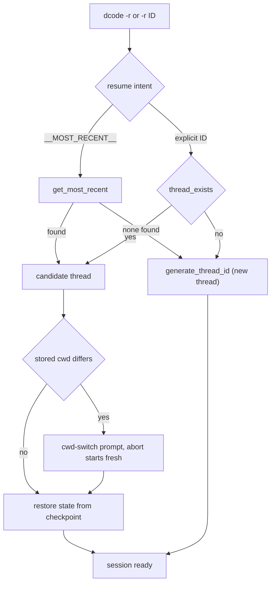

# Workflow: Run & Extend a dcode Session

`deepagents-code` (`dcode`) is a pre-built terminal coding agent built on the Deep
Agents SDK. It runs as a rich interactive TUI or non-interactively for scripting
and CI, persists every conversation as a resumable thread, gates model-requested
tool calls behind human-in-the-loop approval, and is extended through skills,
subagents, lifecycle hooks, MCP servers, and remote sandboxes. This page is an
operator's guide to running a session and the task-level extension surface.

For observed friction, hotspots, and startup timing seen at runtime, read
[runtime-behavior](../runtime-behavior.md). Deeper subsystem detail lives in the
[code-agent architecture](../architecture/code-agent.md),
[config layering](../concepts/config-layering.md),
[permissions & HITL](../concepts/permissions-hitl.md),
[MCP integration](../integrations/mcp.md), and
[cost & sessions](../operations/cost-and-sessions.md) pages.

## Install and launch

Install with the bundled installer and run the `dcode` command:

```bash
curl -LsSf https://langch.in/dcode | bash
dcode
```

OpenAI, Anthropic, and Gemini provider support is included by default; extra
providers are opted in at install time with `DEEPAGENTS_CODE_EXTRAS`, for example
`DEEPAGENTS_CODE_EXTRAS="nvidia,ollama"`.

By default `dcode` trusts the directory you launch it in and reads project
artifacts before any approval prompt. Do not launch it in an untrusted repository
without a remote sandbox; the security model expects an isolated backend for
untrusted code.

## Interactive vs headless

A launch resolves to one of a few run shapes, decided from the CLI flags and
whether stdin is piped:

- **Interactive TUI** — the default. Launches the Textual UI with streaming
  responses. `-m/--message` auto-submits a first prompt, `-s/--skill` invokes a
  skill at startup, and `--startup-cmd` runs a shell command before the first
  prompt.
- **Headless / non-interactive** — `-n/--non-interactive "<task>"` runs one task
  and exits via `run_non_interactive`. Piped stdin also lands here. In headless
  mode the shell tool is disabled unless `-S/--shell-allow-list` is set. `-q`/`--quiet`
  emits only the agent's response for piping, and `--no-stream` buffers the full
  response instead of streaming.
- **ACP server** — `--acp` runs an Agent Client Protocol server over stdio
  instead of launching the UI.

Several flags are headless-only guardrails and require `-n` (or piped stdin):
`--max-turns` (turn-count cap), `--timeout` (wall-clock cap, exit code 124 on
expiry), `--rubric` / `--rubric-model` / `--rubric-max-iterations`, and the
`-q`/`--no-stream` output modifiers.

## Approval modes

Interactive sessions run under one of three approval policies, selected by
`ApprovalMode` (`manual`, `auto`, `yolo`) and cycled in-session with Shift+Tab:

- **Manual** (`/manual`) — every gated tool call is reviewed before it runs. This
  is the fail-closed default; `coerce_approval_mode` normalizes any invalid stored
  value back to Manual.
- **Auto** (`/auto`, or launch with `-y/--auto-approve`) — a classifier model
  reviews actions and auto-approves the safe ones. The classifier model comes from
  `--auto-classifier-model`, then `DEEPAGENTS_CODE_AUTO_CLASSIFIER_MODEL`, then
  `[models].auto_classifier`, then the main agent model; a weaker classifier
  weakens the review.
- **YOLO** (`/yolo`, or launch with `--yolo`) — runs gated actions without review
  after a one-time local risk acknowledgement, and keeps a persistent status-bar
  indicator while active.

The Shift+Tab cycle is Manual → Auto → YOLO → Manual, but Auto is dropped when it
is not eligible (for example under a remote sandbox) and YOLO is dropped when
`startup.yolo_switcher` is disabled. `-y` and `--yolo` are mutually exclusive and
are ignored with a warning in headless mode. See
[permissions & HITL](../concepts/permissions-hitl.md) for the full model.

## Sessions, threads, and resume

Every conversation is a **thread** persisted through LangGraph's SQLite
checkpointer. Thread state lives in a single global database at
`DEFAULT_STATE_DIR / "sessions.db"`, opened as an `AsyncSqliteSaver` through
`get_checkpointer`. New thread IDs are time-ordered UUID7 strings from
`generate_thread_id`, so IDs sort naturally by creation time.

Thread listing reads only the small per-checkpoint `metadata` (latest
`updated_at`, `agent_name`, `git_branch`, `cwd`); a covering index
(`idx_dcode_threads_list`) keeps `list_threads` an index-only scan so it stays
fast even when the checkpoint blobs are large.

Resume is driven by `-r/--resume`:

- `dcode -r` resumes the most recent thread (`get_most_recent`).
- `dcode -r <ID>` resumes a specific thread if `thread_exists`; otherwise it
  notifies, suggests prefix-matched thread IDs (`find_similar_threads`), and
  starts a fresh thread.



Resume intent resolution in `DeepAgentsApp._resolve_resume_thread`, falling back to a fresh thread on any miss or DB error.

On resume, `dcode` rehydrates the session without replaying or re-tokenizing
history. `resume_state.py` declares the checkpointed private channels the CLI
reads back from `state_values`: context-token count, the effective model spec and
params (so `dcode -r` restores the model the thread was actually using), and the
goal/rubric lifecycle state. Model-turn channels are written from inside the graph
so they ride the same checkpoint as the model response; because they are versioned
channel state, resuming a specific checkpoint yields values as of that checkpoint,
not a thread-level aggregate.

Headless runs do not resume: `run_non_interactive` takes no thread-id or resume
argument, so every `-n` invocation starts a fresh thread with no checkpointed
goal.

Threads are managed from the CLI without launching the agent via the `threads`
subcommand: `dcode threads list` (alias `ls`, with `--agent`, `--branch`, `--cwd`,
`--sort`, `--limit`, `--verbose`, `--relative`) and `dcode threads delete <ID>`
(with `--dry-run`). See [cost & sessions](../operations/cost-and-sessions.md) for
cost and session accounting.

## In-session command surface

Interactive sessions expose a slash-command surface catalogued in
[`COMMANDS.md`](../../libs/code/COMMANDS.md), generated from the command registry.
It covers 42 public commands (plus 2 hidden debug commands), including session
control (`/clear`, `/force-clear`, `/threads`, `/reload`, `/restart`, `/quit`),
context and cost (`/context`, `/context-doctor`, `/offload` aka `/compact`,
`/cost`, `/tokens`), approval switching (`/manual`, `/auto`, `/yolo`), model and
agent selection (`/model`, `/agents`, `/effort`), and extension management
(`/mcp`, `/skill-creator`, `/plugins`, `/install`, `/remember`, `/tools`).

## Lifecycle hooks

Hooks are user-configured shell commands that run at agent lifecycle events, as
documented in [`HOOKS.md`](../../libs/code/HOOKS.md). Each matching handler
receives a JSON event payload on stdin and can influence the session through its
exit code and stdout. Hook commands run on your machine with your privileges, so
every `hooks.json` entry is trusted code.

Hooks load from three scopes with a fixed precedence: user
(`~/.deepagents/hooks.json`, always), project
(`{project_root}/.deepagents/hooks.json`, only after workspace trust), and plugin
(`hooks/hooks.json` inside an enabled plugin). Every matching handler for an event
runs concurrently and results are reduced project → user → plugin; the first
handler that stops processing decides the event, but a plugin handler still runs
even when a project or user handler stops the event.

Events split by owner: client events (`SessionStart`, `UserPromptSubmit`,
`SessionEnd`, `PermissionRequest`, `Notification`) and server events
(`PreToolUse`, `PostToolUse`, `PostToolUseFailure`, `PreCompact`, `Stop`,
`SubagentStart`, `SubagentStop`). Because the server-owned event set is fixed when
a session starts, newly enabled plugin hooks take effect only after `/reload`.

Handler exit code `2` is a synthetic block whose meaning depends on the event
(deny on `PreToolUse` / `PermissionRequest`, block processing on
`UserPromptSubmit` / `PreCompact`, feedback on the post-tool events); other
non-zero exits are diagnostics only. JSON stdout can set `permissionDecision`,
`additionalContext`, `systemMessage`, and continuation control.

### Workspace trust

Project-scoped hooks can execute arbitrary repository commands, so they load only
after workspace trust. Interactive `dcode` prompts for approval when
`.deepagents/hooks.json` is present in an untrusted workspace; choosing
always-allow persists trust in `~/.deepagents/.state/hooks_trust.json`, denying
runs with user hooks only, and cancelling aborts startup. Headless / CI runs never
prompt — pass `--trust-project-hooks` to opt a run into repository hooks.

## Extending a session

- **Skills** — reusable capabilities and slash commands. Invoke one at startup
  with `-s/--skill`, author or refine them with `/skill-creator`, and persist
  useful context with `/remember`.
- **Subagents** — delegated agents that run as sub-tasks; their lifecycle is
  observable through the `SubagentStart` / `SubagentStop` hook events.
- **MCP servers** — external tool servers configured via `--mcp-config` (Claude
  Desktop format, merged on top of auto-discovered configs) or managed at runtime
  with `/mcp`. `--no-mcp` disables all MCP loading. Project-level stdio and remote
  MCP servers require approval; `--trust-project-mcp` skips that prompt for
  headless runs. See [MCP integration](../integrations/mcp.md).
- **Sandboxes** — `--sandbox [TYPE]` runs code execution in an isolated remote
  environment (built-ins include `agentcore`, `daytona`, `langsmith`, `modal`,
  `runloop`, `vercel`). `--sandbox` with no value uses `[sandboxes].default`.
  `--sandbox-id`, `--sandbox-snapshot-name`, and `--sandbox-setup` attach to or
  provision a specific environment. Under a sandbox the local JS interpreter is
  disabled and Auto approval is not eligible.

## Configuration and operations

`dcode` merges configuration across layers; administrators can enforce settings
with a read-only `managed_config.toml` that overrides environment variables and
`~/.deepagents/config.toml`, and can also override selected launch flags
(model, interpreter toggle, shell allow list, recursion limit, startup mode, and
more). Enforced keys fail closed: an unreadable or invalid managed file blocks
every command except the diagnostic ones (`--help`, `--version`, `config`,
`doctor`, `auth path`). See [config layering](../concepts/config-layering.md) for
the precedence rules and enforcement semantics.
